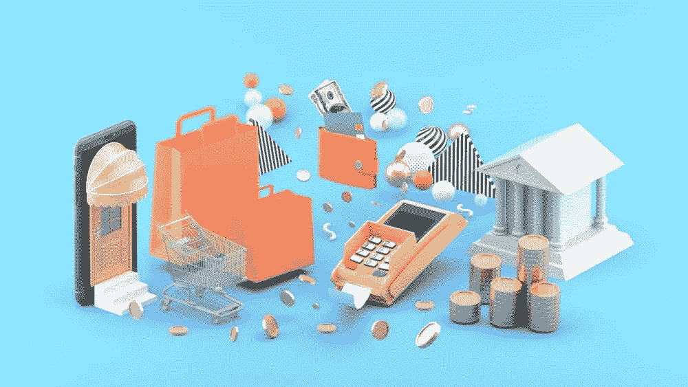

# 电子商务网站的 3D 成像是零售业的未来

> 原文：<https://medium.datadriveninvestor.com/3d-imaging-for-ecommerce-websites-is-the-future-of-retail-20677a61f7?source=collection_archive---------7----------------------->

客户的需求和要求在不断变化。如果你想给用户提供他们想要的东西，你需要紧跟最新的趋势，使用最新的技术，其中之一就是 3D 成像。今天，我们将告诉你 3D 技术是如何在电子商务中使用的，并告诉你你需要知道什么来获得竞争优势。

# 什么是 3D 产品成像？

3D 产品图像是产品的图形 3D 表示，消费者也可以与之交互。此外，如果购物者想更近距离地查看产品的某个部分，他们可以放大、旋转它，并看到它在运动。这种产品图像是电子商务网站上展示商品的传统方式的巨大飞跃，使客户能够做出更明智的购买决定。它的工作方式是将 AR/VR 3D 模型嵌入到网站页面和移动应用程序中，这使得客户可以获得这样一种交互式和沉浸式的体验。

 [## 大数据影响电子商务的 4 个关键领域|数据驱动的投资者

### 毫无疑问，大数据可能是电子商务的下一个重大变革者。通过最终给在线零售商一个…

www.datadriveninvestor.com](https://www.datadriveninvestor.com/2019/12/21/4-critical-areas-where-big-data-impacts-ecommerce/) 

# 3D 成像是如何工作的？

通常，公司通过以下方式创建 3D 图像:

*   3D 扫描—扫描仪将光线投射到物体上，并创建 3D 点云，这是物品形状和外观的数字表示。这是一种有利的方法，因为它可以捕捉产品的所有细节。
*   摄影测量——使用数码相机从不同角度拍摄物体的照片。然后将所有这些图像拼接在一起，创建产品的综合视图。
*   3D 设计——设计师利用所有关于物品的可用信息，如图像、尺寸和其他数据来创建逼真的模型。如果您的产品数量很少，这是一个很好的方法，但是随着商店的增长，您会遇到可伸缩性问题。

现在我们知道了 3D 图像是如何创建的，让我们来看看它的好处。

# 顾客和零售商会从 3D 产品中获得什么？

[3D 建模解决方案](https://skywell.software/3d-modeling-scanning-services/)为零售商和他们的客户带来了很多好处。购物者对他们所购买的产品有了更多的了解，而且他们可以在家方便地购物。有些物品，比如化妆品、家具和许多其他物品，人们不愿意在网上购买，因为它们是私人物品，如果不亲自拿在手中，很难理解它们是否符合你的需求。通过 AR 技术实现的 3D 产品渲染消除了这一障碍，让客户可以放心地购买他们想要的任何产品。

就零售商而言，这种电子商务技术使他们能够接触到更广泛的受众，并提高转化率。面向零售的 3D [技术解决方案](https://skywell.software/retail-software-development/)已经带来了 20%-40%的收入和转化率增长。这是有意义的，因为客户可以购买他们需要的产品，而不会有任何后悔，这导致了更多的转换和销售。

# 零售 3D 模型将会继续存在

最近的电子商务趋势调查显示，人们喜爱 3D 电子商务，这是一个长期的趋势。事实上，相比视频播放，95%的消费者更喜欢交互式 3D。如果你的产品面向千禧一代、X 代或 Z 代，你应该尽早开始实施这项技术，因为这些多代群体将在未来 5-6 年内开始要求产品的 3D 图像。总的来说，这些群体正在寻找更多定制化的体验，这项技术可以让你开始与客户建立更好的关系，从而提高产品忠诚度。

# 为什么您应该现在就开始实施 3D 图像？

我们生活在一个视觉世界，一张图片胜过千言万语。3D 成像让您将这种可视化提升到另一个层次，并向您的客户展示产品的每一个可能的细节。顾客的体验也丰富了，他们更有可能购买产品。3D 成像也是利用全渠道营销和混合商务的一个好方法。如果您有物理位置，您可以将其与您的电子商务商店相结合，并利用 AR/VR 技术为您的产品提供一个全新的维度。

我们已经从上面的一些数据中看到，3D 电子商务正在成为一种新的和持久的趋势，特别是因为人们对前往实体场所犹豫不决。3D 成像允许您为客户提供店内体验，允许他们在 AR/VR 中试穿产品，并更好地了解他们正在购买的产品。这对于消费者和零售商都是有益的，因为它们可以为顾客提供独特的体验。

*原载于*[*https://sky well . software*](https://skywell.software/blog/3d-imaging-for-ecommerce-websites-is-the-future-of-retail/)*。*

**访问专家视图—** [**订阅 DDI 英特尔**](https://datadriveninvestor.com/ddi-intel)