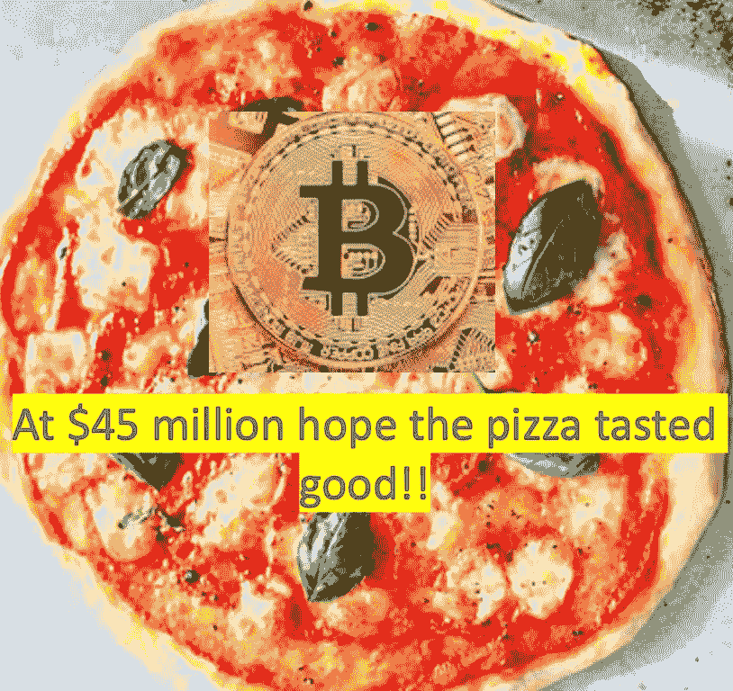
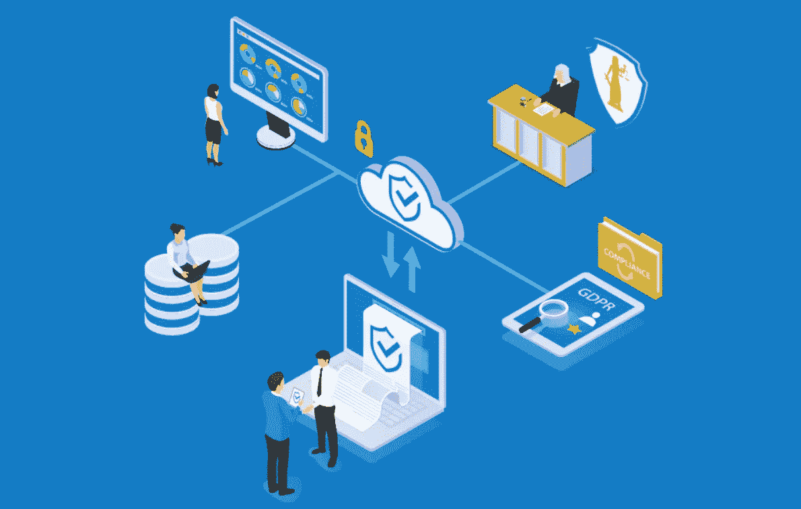

# 6 月 3 日数字字节

> 原文：<https://medium.datadriveninvestor.com/3rd-june-digital-bytes-ed349021de79?source=collection_archive---------16----------------------->

区块链和数字资产领域的一些发展分析

【2020 年 6 月 3 日数字字节

**视频字节**

鉴于对视频和音频内容的需求不断增加，这些视频每个工作日都会在 LinkedIn 上发布。根据读者的反馈，每周一些更受欢迎的视频，与视频收到的浏览量相关联，被包括在内。

[关于价值 4500 万美元披萨的 2 分钟视频](https://youtu.be/VqXRo2kQO48)！

来源:TeamBlockchain

5 月 22 日的确是一个重要的日子，因为在 2010 年，一个住在美国佛罗里达州的名叫 Laszlo Hanyecz 的男子成为了第一个被认为使用加密货币比特币(BTC)进行交易的人。第一笔使用加密货币的交易实际上是用 10，000 BTC(当时价值 41 美元)买了两个披萨。以今天的价格计算，同样是 10，000 BTC，这些比萨饼的价值为每个 4500 万美元！2010 年夏天，Hanyecz 花了 100，000 BTC 为他的午餐买了更多的比萨饼，按 BTC 的最高价格，这将价值惊人的 20 亿美元！

[Baanx](https://baanxapp.com/) 和[比特币基地](https://www.coinbase.com/card)是目前两家公司的例子，这两家公司都拥有与加密货币(包括 BTC)相关的 Visa 借记卡，从而使 BTC 有可能在全球 200 个国家的[4200 万个地方消费，即接受 Visa 卡的地方。](https://www.mybanktracker.com/credit-cards/faq/which-credit-cards-most-accepted-worldwide-272908)

 [## 5 个可以拯救环境的潜在区块链用例|数据驱动的投资者

### 区块链技术已经成为创新和颠覆的代名词。而医疗保健等几个行业…

www.datadriveninvestor.com](https://www.datadriveninvestor.com/2020/03/06/5-potential-blockchain-use-cases-that-can-save-the-environment/) 

最近，慕尼黑再保险公司的一家子公司透露，美国 36%的中小企业接受比特币。然而，不仅仅是中小企业接受 BTC，更大的组织包括维基百科、微软、Expedia 和 AT & T。通过使用 [spendit](https://spendabit.co/) (一个搜索引擎)发现不同的产品和服务也是可能的，这些产品和服务可以使用 BTC 从各种各样的供应商那里购买。10 年来，比特币取得了长足的进步，现在人们对它的了解和日常使用都要多得多。事实上，现在典型的[每天有 20 万笔交易](https://blockchain.info/charts)，这表明 BTC 和其他加密货币更加主流。有趣的是，酷玩乐队的低音吉他手盖伊·贝里曼最近投资了 BTC 交易平台 Zumo。

虽然网络朋克梦想密码被普遍接受，这可能使银行变得多余，但这是极不可能的。然而，cryptos 采用的技术，区块链将改变人们做生意的方式，再过十年，谁知道用来购买披萨的 BTC 的价值会是多少！

**区块链**

**区块链技术开启可再生能源市场**

几年来，区块链技术已经承诺帮助促进可再生能源的更大使用，因为它能够跟踪绿色可持续能源的生产。这将被证明是至关重要的，无论是对于当地社区的对等电力交易(即向邻居出售太阳能电池板或风力涡轮机产生的剩余电力)，还是允许[公司在特定日期前实现碳中和](https://www.vox.com/the-goods/2020/3/5/21155020/companies-carbon-neutral-climate-positive)，这方面的例子包括 2040 年前的亚马逊、2030 年前的微软或 2030 年前的希思罗机场(不包括着陆飞机的排放)。越来越多的电力消费者正在寻找绿色能源供应商，在英国，六大电力供应商都有绿色能源关税。

有许多公司一直在以各种形式开发区块链驱动的平台，以实现碳证书的跟踪，对等 2 对等能源交易，将多余的电力转移到电动汽车电池上进行充电等等。以下是一些当前的举措:

[Nori](https://nori.com/) 是一家利用区块链技术发行追踪和跟踪碳的证书的公司。它开发了一个平台，使农民能够获得报酬，实际上是“锁定”他们农田中的碳，从而帮助抵消全球变暖。

[沃达丰](https://www.energydigital.com/renewable-energy/vodafone-business-brings-iot-and-blockchain-energy-sector#:~:text=Vodafone%20Business%20has%20partnered%20with,to%20renewable%20and%20distributed%20energy&text=This%20will%20increase%20security%20across,heat%20pumps%20and%20solar%20panels.)宣布与 Energy Web 合作，该公司正试图通过使用区块链、人工智能和物联网技术来实现电网的脱碳，以使热泵、太阳能电池板和风力涡轮机(即可再生且通常是分布式的能源生产)能够融入电网。简单来说，Vodaphone 和 Energy Web 的平台非常类似于移动电话以其个人身份运行的方式。因此，可以识别每个可再生能源生产者，从而使电网能够指示每个电力供应商是否需要向电网供应能量、停止生产能量或者将电力存储在电池中。

[Equigy](https://equigy.com/) 正在使用电动汽车[汽车电池](https://www.ledgerinsights.com/blockchain-energy-platform-electricity-grid-tennet-swissgrid-terna/)储存多余的能量，使用区块链技术帮助“平滑”电网的能源供应。目的是鼓励投资更多的可再生能源，从而保护环境。

总部位于苏格兰北部奥克尼的 electronic 公司在历史上从其多风的海岸生产的电力比消耗的多。通过使用区块链技术，多余的能量被跟踪，然后转移到电池中储存，并为电动汽车电池充电。

澳大利亚的 Power Ledger 与珀斯的一家房地产开发商合作，这是 Power Ledger 为西澳大利亚用户推出太阳能交易平台的目标的一部分。

可再生能源的成本持续下降

来源:国际可再生能源协会

令人鼓舞的是，可再生能源已经进入了成本下降、部署增加和技术进步加快的良性循环。自 2009 年底以来，太阳能发电的成本下降了约 80 %( T2 ),而风力涡轮机的价格下降了 40 %( T4)。，这一切都得益于规模经济和效率的提高。显然，随着全球对气候变化的日益关注和对更可持续的绿色能源的需求，组织现在已经从讨论可能会发生什么转变为在能源领域实施真正的解决方案，从而帮助促进可再生能源供应商的更广泛使用。区块链驱动的平台在可再生能源解决方案的日益普及中发挥着至关重要的作用，因为它们可以跟踪和追踪能源生产商和用户的供应。

**农业**

**如何追踪你的食物来自哪里**

追踪和追溯你盘子里食物来源的能力对农民商店，最重要的是对消费者有一些诱人的吸引力。这在一定程度上解释了为什么现在有这么多组织参与使用区块链驱动的平台。区块链允许食品的来源，因此零售商和购物者可以清楚地了解农产品的种植/捕捞方式、地点和时间，随后的储存条件，甚至潜在的环境影响及其生产的可持续性。

许多参与提高食品供应链透明度的公司正在使用人工智能(AI)、区块链和物联网(IoT)等技术的组合。通过这些技术收集和存储的信息通常可以在移动设备上访问，包括使用快速响应(QR)码的手机。这使得各方(通常沿着复杂的供应链，在某些情况下可以跨越全球)能够跟踪和追踪货物的旅程——它们是如何运输的，它们来自哪里，它们储存的温度条件，甚至它们被捕获的拖网渔船或它们生长的田地的细节。

大约五年前，即 2015 年 11 月[，一家名为“出处”的公司发布了一份白皮书](https://www.provenance.org/whitepaper)(商业主张)，称，“*出处使每一件实体产品都带有一个证明真实性的数字‘护照’(这个产品是它所声称的吗？)和产地(这个产品来自哪里？)，为所有实物产品背后的旅程创造可审计的记录*。”出处继续引用[马克·安德森的话，他在 1993 年发明了第一个互联网浏览器，马赛克](https://www.wired.com/2012/04/ff-andreessen/)，当谈到它时，他说，“*区块链技术改变了一切。实际的结果是……第一次，一个互联网用户可以向另一个互联网用户转让独一无二的数字财产，从而保证转让的安全，每个人都知道转让已经发生，没有人可以质疑转让的合法性。这一突破的后果很难被夸大。*

还有许多其他不同组织使用区块链平台跟踪和追踪各种食品的例子，包括:

阿尔伯特·海恩(Albert Heijn)——荷兰超市现在能够让顾客追踪他们的橙子是在哪里种植的。它计划到 2025 年能够提供所有产品的来源；

[agri ledger](https://static1.squarespace.com/static/5a142e2b9f07f5b18a237f95/t/5d230d6ae96bd200011eb14c/1562578283980/RBF+EoM+2018+Case+Study+-+Agriledger+%26+Agunity.pdf)——根据牛津大学 Said 商学院的一份报告，这家公司与世界银行合作，帮助农民增加了 2 到 3 倍的收入(该公司在海地种植芒果和鳄梨)；

大黄蜂金枪鱼——正在使用运行在 SAP 云平台上的 Multichain 来跟踪黄鳍金枪鱼，从它被捕获到它出现在商店货架上的那一刻；

[加州巨型浆果农场](https://www.thepacker.com/article/california-giant-blockchain-use-boosts-freshness-food-safety) —美国最大的浆果农场之一正在使用区块链 IBM 食品信托公司的浆果供应链，以便让客户获得其浆果的原产地细节和产品跟踪；

[农家鸡舍](https://www.foodprocessing-technology.com/news/farmers-hen-house-eggs-uses-blockchain-to-trace-eggs-origin/)——每个鸡蛋上都印有二维码，这使得消费者能够知道鸡蛋是从哪个鸡场生产的；

星巴克正在与微软合作，为星巴克的产品提供数字可追溯性，并支持其可持续发展战略。

与此同时，IBM 委托撰写了一份报告，对来自 28 个国家的近 19，000 名不同年龄段的消费者进行了调查，以了解个人购买决策是如何演变的。研究发现:

如果对品牌失去信任，今天所有消费者中有三分之一会停止购买他们首选的产品；

三分之一的消费者已经在 2019 年停止购买他们历史上最喜欢的品牌；

消费者优先选择那些可持续、透明且符合消费者核心价值的品牌和产品；

消费者愿意为做得好的品牌支付更多，甚至改变他们的购买习惯；

企业价值现在超过了产品成本和便利性；所有年龄和收入的消费者为符合他们个人信仰的产品支付更高的溢价；

平均而言，70%的“目的驱动型购物者”会为可持续购买多支付 35%的额外费用，如回收或环保商品；

其中 57%的人甚至愿意改变购买习惯，以帮助减少负面环境影响；

如今，79%的消费者表示，品牌提供有保证的真实性非常重要。在这一群体中，71 %的人愿意为提供完全透明和可追溯性的公司支付额外的费用，高出 37%。

IBM 建议，零售商要获得更大的市场，就必须通过透明度和可追溯性赢得消费者的信任……提供方便、快捷的详细信息，这些信息以前是不必要的，如产品是如何制造的、成分的质量、是否是可持续的或符合道德的来源，以及在什么条件下获得。但公平地说，IBM 已经花费了数百万美元来开发和销售其区块链技术技能！对于任何信息技术和数据库的使用，信息和报告的准确性只能取决于输入的质量，即“垃圾输入，垃圾输出”

不仅仅是消费者的需求和购买习惯令人鼓舞，或者有些人可能会认为，迫使新技术用于食品供应链，但立法也在推动采用。T4 世界卫生组织估计每年有 42 万人死于食物污染。在美国,[食品安全和现代化法案](https://www.fda.gov/Food/GuidanceRegulation/FSMA/)引入了对食品进口的控制。同时，欧盟的[贸易控制和专家系统](https://europa.eu/european-union/topics/food-safety_en)旨在提供食品可追溯性和风险管理，以便在整个食品供应链中跟踪和监控交易的植物或动物产品。

因此，使用区块链驱动平台的公司需要确保有可靠和可审计的程序，以确保首先输入正确的，如果可能的话，经过验证的信息。显然，被采摘、挖掘和捕获的食品更容易提供来源。然而，依赖于多个供应商的加工食品，混合，混合和其他“混乱”的步骤，虽然不是不可能，但很难在区块链上准确记录。

**数字资产**

**企业数字货币上路了吗？**

人们常常忘记，从 1837 年到 1862 年，美国钞票的发行通常不受监管，这导致了超过 7000 种不同的钞票，其中许多很容易被伪造者复制。这种混乱的事态导致人们对美国纸币失去信心。第一张 1 美元纸币于 1862 年发行，同时发行的还有林肯头像的 2 美元、5 美元、10 美元、20 美元和 50 美元——100 美元、500 美元和 1000 美元纸币。随后是 1863 年的国家银行法案，导致了一系列国家银行的建立。

来源:爱 Money.com E

值得注意的是，随着我们看到新的数字货币作为世界第二大经济体“成为主流”，金融和支付世界现在似乎正处于拐点。值得注意的是，中国(拥有超过 14 亿人口的 T2)刚刚推出了自己的数字货币。与此同时，越来越多的人呼吁建立美国数字美元，事实上，今年国会启动了“数字美元项目”

审查了面对新冠肺炎疫情应该采取的不同行动。T4 也认为数字美元是刺激美国经济的一部分。

然而，随着美国、法国和德国等国政府继续印钞并向陷入困境的经济注入数十亿美元，人们还需要多久才会开始质疑国家财政的稳健性？迄今为止，这些经济体已经向其经济注入了相当于其国内生产总值 10%的资金，以应对新冠肺炎的影响，并帮助减轻数百万公民的痛苦，他们实际上被“锁”在家中，无法工作或赚钱。事实上，加州的《洛杉矶时报》报道说，全国 20%的美国人将无力支付 6 月份的房租！

一些政府面临的另一个挑战是，它们被指控可能非法操作，因为它们印刷现金回购债券，从而压低利率。较低的利率是一把双刃剑:对那些有债务的人(包括通常拥有最多债务的政府)来说，这是一种受欢迎的缓解，但对那些有储蓄的公民来说，这是灾难性的，因为从历史上看，他们一直依赖银行存款来补充退休收入。

德国宪法法院呼吁[欧洲中央银行(ECB)证明其行为](https://www.ft.com/content/a1beda5e-5c2d-429e-a095-27728ed2d72b)的合法性，因为它声称量化宽松(即印刷现金和购买银行债券)是非法的。在企业界，尤其是在全球科技巨头中，这种不断变化的状态也“活跃而活跃”。代表美国 500 家最大资本公司的标准普尔 500 指数越来越被少数技术巨头所主导，因为微软、苹果、亚马逊和谷歌现在单独占整个标准普尔 500 指数的 20%+。

同样，关于脸书及其 Libra 发起的倡议也有相当多的讨论，去年 6 月宣布希望为其每月 26 亿用户提供一种数字货币。脸书的首席执行官马克·扎克伯格最近表示， [90%以上的收入](https://www.businessofapps.com/data/facebook-statistics/)来自广告，如果这些广告使用 Libra 付费，对脸书来说会更快、更有效、更[有利可图。毫无疑问，最近推出的'](https://cryptoslate.com/facebooks-mark-zuckerberg-explains-how-digital-currency-libra-could-increase-the-firms-profits/)[脸书商店'](https://www.blackenterprise.com/facebook-launches-a-new-virtual-marketplace-to-help-small-businesses/#:~:text=The%20tech%20giant%20recently%20unveiled,through%20Facebook%20and%20Instagram%20pages.)(针对小企业)也将成为 Libra 货币的用户。脸书声称每月已经有超过 1 . 6 亿商家使用脸书的应用。扎克伯格对此补充道，“*我们看到许多从未上线的小企业第一次上线了……对许多企业来说，这就是生存和破产的区别。*

值得注意的是，[有传言称](https://www.cnet.com/news/google-working-on-a-physical-debit-card-to-rival-apple-card-report-says/)谷歌正在开发一种借记卡来与苹果的卡竞争，而加拿大快速增长的在线电子零售商 Shopify 模仿[亚马逊币](https://www.businessinsider.com/what-are-amazon-coins?r=US&IR=T)还要多久？

资料来源:Amazon.com

然而，进入这一领域的不仅仅是美国公司。三星在 2019 年实现了超过 20 亿美元的利润，将扩大其在金融服务领域的涉足，并提供借记卡——一种由[Bancorp 银行](https://thebancorp.mybankingservices.com/)发行的万事达卡。该卡与苹果的相似，不会刻有账号、有效期或安全 CVC，但这些信息可以通过使用[三星的支付应用](https://www.verdict.co.uk/cards-international/news/samsung-sofi-to-launch-new-debit-card-for-managing-everyday-finances/)获得，该应用需要持有者的生物特征或 PIN 认证。

最终，这些企业会追随新的中国数字货币的脚步，在它们创造的基础设施上继续发展，再加上它们的现金山，最终不仅挑战金融服务业，还挑战国际货币吗？虽然有大量关于美元重要性下降的新闻报道，但我们是否会开始看到公司货币成为新的“规范”，并由此可能回到 19 世纪，那时有多种支付形式，就像美国一样？

**访客字节**

作者:理查德·卡德里-兰福德邮箱:[**Richard.kadri-langford@evident-proof.com**](mailto:Richard.kadri-langford@evident-proof.com)

**不断增加的数据证明负担将如何推动不可变证明即服务技术的采用**

来源:明显的证据

由于数据提供的大量机会，个人数据的处理已经发展成为商业的一个组成部分。企业组织现在控制着越来越多的客户信息，这是全球范围内越来越严格的数据法规背后的驱动力。在欧洲，欧盟委员会通过了《一般数据保护条例》( GDPR ),以加强公民权利和数据保护要求。GDPR 法规于 2018 年 5 月 25 日纳入欧洲法律，已经对许多组织产生了影响。

企业长期以来一直在隐私、数据处理和安全责任方面苦苦挣扎。由 [Ponemon Institute](https://www.ponemon.org/) 最近发布的一份报告强调了在来自 53 家基准组织的 237 名受访者中，GDPR 被明确认定为最难实现的合规性法规之一。[【1】](#_ftn1)

合规的高成本和失败的高成本

由于 GDPR 合规性被视为难以管理，因此很容易将其视为不可逾越的障碍，从而在很大程度上被忽视。然而，这是一种危险的策略，不遵从的代价是巨大的。

就在几周前，英国最大的航空公司易捷航空(EasyJet)宣布，黑客已经获得了 900 万名客户的旅行详细信息，这又一次成为新闻焦点。对公司来说，后果肯定是重大而持久的；英国航空公司在 2018 年被处以 1.83 亿英镑的罚款，这已经是一个先例[【2】](#_ftn2)。那次入侵涉及类似的客户数据丢失，此前一次网络攻击将流量从英航网站转移到一个欺诈网站，超过 50 万名客户的个人数据被窃取。被盗数据包括登录信息、支付卡、旅行预订详细信息以及姓名和地址信息

办公室(ICO)得出结论，该数据是由于该公司糟糕的安全安排而受损的。即使没有发现具体的违规或黑客行为，按照 GDPR 第 15 条的规定，处理数据主体访问请求(DSARs)也会产生额外的、有些隐蔽的成本。

根据最近发布的一项由隐私专家 [Guardum](https://guardum.com/) 委托的研究，英国企业“*每年在处理数据主体访问请求上花费 159 万英镑和 24 个人年。”*[【3】](#_ftn3)随着 dsar 的数量不断增加，数据保护官(dpo)正在寻找解决方案，并对大流行后不满、休假或被解雇的员工提出的 dsar 请求感到担忧。进一步的研究表明"*dpo 平均每月收到 27 份 DSARs，每份申请的费用为 4，884.53 英镑，处理时间为 66 个工作小时，约占其工作日的 30%。因此，毫不奇怪，投资实现 DSAR 流程自动化是 DPO 最大的愿望。75%的 dpo 承认在远程工作时很难满足数据合规性要求，而 60%的 dpo 担心他们没有足够的资源来应对重返工作岗位后不断增加的请求。”*[***【4】***](#_ftn4)

区块链提供了一个解决方案

随着每年产生的数据量呈指数级增长，据估计，到 2020 年，地球上每个人每秒将产生 170 万字节的数据，其中大部分是*非结构化*数据。

数据和相关法规的增加可能会推动采用更强大的技术解决方案，这不仅是为了应对保护数据的挑战，也是为了证明组织的运营符合法规。*“证明数据完整性从未如此重要，但一直难以实现”，*Evident Proof[的首席执行官 Adrian Clarke 说](http://www.evident-proof.com?sid=1004&utm_source=digital_bytes&utm_medium=organic&utm_campaign=general&utm_content=gdpr)，这是一个基于以太坊区块链的解决方案，提供不可变证明即服务(IPASS)。"*2016 年 11 月，我们开始着手制定一个解决方案，来解决所有公司、企业领导和个人都面临的一个问题。也就是数据的完整性。”*新的数据标准、法律和日益复杂的网络攻击使得证明数据完整性的需求变得越来越重要。现有的数据库是可破解的，可以追溯改变，许多人认为它们不是一个好的事实来源。

凭借其分布式数据结构，区块链为创建不可变分类账提供了潜在的平台。由于不合规的明显成本影响，现在超过了合规的成本，企业组织已经开始调解。

Clarke 传达了一个明确的信息:“*在数据证明和合规性解决方案上投入少量资金，可能会为组织节省 1000 英镑的法律费用，更不用说时间和压力了。"*

**网络研讨会 2020 年 6 月 2 日 15.30**

感谢您对我们网上研讨会的所有反馈，由于时间限制，我们将直接回答所有无法回答的问题。如果您未能出席，或者想再次收听，请使用此链接:

[https://event . on24 . com/WCC/r/2353314/b4a 55 D5 f 8974 db 6 f 56 c 45 a 5 ea 3c 6d 64 e](https://event.on24.com/wcc/r/2353314/B4A55D5F8974DB6F56C45A5EA3C6D64E)

演讲者在网上研讨会后接受了采访，我们将在下周的数字字节中提供这些采访的链接

如果你对数字字节的任何内容有意见，或者有你想涉及的话题，或者如果由于某种原因，上述任何链接不起作用，请联系我:[Jonny.Fry@TeamBlockchain.net](mailto:Jonny.Fry@TeamBlockchain.net)。

Digital Bytes 经过精心撰写，旨在引起人们对区块链和数字资产领域发展的关注，但建议读者在根据上述任何链接和信息采取任何行动之前，先听取专业建议。TeamBlockchain Ltd 对任何可能采取或可能不采取的行动、收到此版本数字字节的损失或收益不承担任何责任。

如果同事或朋友希望收到数字字节，请他们发电子邮件给[Jonny.Fry@TeamBlockchain.net](mailto:Jonny.Fry@TeamBlockchain.net)

在推特上关注我们

[www.TeamBlockchain.net](http://www.teamblockchain.net/)

[[1]](#_ftnref1) 遵守数据保护法规的真实成本——由 Ponemon Institute LLC 独立开展

[https://www.enforcementtracker.com/](https://www.enforcementtracker.com/)

[【3】](#_ftnref3)[https://betanews.com/2020/05/18/gdpr-data-access-costs/](https://betanews.com/2020/05/18/gdpr-data-access-costs/)

[【4】](#_ftnref4)[https://betanews.com/2020/05/18/gdpr-data-access-costs/](https://betanews.com/2020/05/18/gdpr-data-access-costs/)

国家统计局