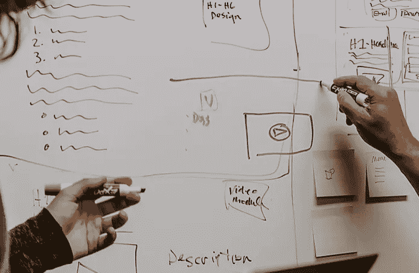

# 4 个惊人的模板，让产品战略成为资产，而不是负债

> 原文：<https://medium.datadriveninvestor.com/4-amazing-templates-to-make-product-strategy-an-asset-not-a-liability-585a5e6c03ec?source=collection_archive---------11----------------------->

我最近写了一本[产品营销初学者指南](https://www.persimmonmarketing.com/post/the-beginner-s-guide-to-product-marketing)来帮助初创公司和中小企业理解对该功能的迫切需求以及要避免的常见陷阱。一旦你有了合适的资源，下一步就是成功地进行战略规划、路线图开发、构思叙事/信息/定位，以及建立产品观点。

感谢我无私的朋友[克里斯·曼](https://www.linkedin.com/in/chrismannlinkedin/)，他是 Bizo(被 LinkedIn 收购)、Coremetrics(被 IBM 收购)的产品负责人，也是 BrightFunnel(被 Terminus 收购)的首席执行官，他分享了他的一些令人惊叹和可操作的模板来帮助你开始。

 [## 动荡迫使暴风雨中的平静|数据驱动的投资者

### 自然界中很少有东西是直线行进的，尤其是经济。当投资者和消费者希望平静时…

www.datadriveninvestor.com](https://www.datadriveninvestor.com/2019/03/25/volatility-compels-calm-amid-the-storm/) 

你可以在[硅谷创新者网站](https://www.valleyinnovators.com/templates)上找到这些产品相关的模板，或者我在下面附上了一个摘要和链接。请记住，这些模板已经过 Chris 的现场测试，并且在实践中有效。尽情享受吧！

# 战略规划矩阵

[视图模板](https://docs.google.com/spreadsheets/d/1FcYQ7Gx_eN5v9B0bvQyouOtbOOGkaxLIFjaBYIld_jQ/edit?usp=sharing)

使用此 google 表单模板改进规划流程，并使整个组织的利益相关方(包括高管、产品、营销、销售和运营)在关键战略和产品计划上保持一致。使用此模板可以:

*   对提高绩效的战略计划进行排序
*   分配清晰的所有权并获得更好的一致性
*   增强团队和所有者之间的责任
*   改善沟通并缩短时间表

# 信息蓝图

[视图模板](https://docs.google.com/document/d/1_iObI8U3itiRPN5fKCRkZCHjvoa9pg4AwLgqAvnJWN8/edit?usp=sharing)

利用此蓝图，通过此 google doc 模板在信息传递方面实现更好的协作和协调。使用此模板可以:

*   就您公司解决的问题、竞争优势、价值主张、目标受众和核心能力达成一致。
*   为你的公关样板和电梯间推介开发初始信息。
*   跟踪和分析竞争对手的信息。

# 解决方案规格

[视图模板](https://docs.google.com/document/d/1H6PyN7-Z99_W-9SEMITBpvRrZbfgvuJPb0ccqH1w4dk/edit?usp=sharing)

在此解决方案规范 google 文档中收集关键产品和管理层的意见。使用此模板可以:

*   思考产品战略，让高管与产品领导紧密结合
*   讨论路线图时间表、阶段划分以及对更好地利用资源的影响。
*   阐明风险和依赖性，以消除关键障碍

# 产品观点(POV)

[视图模板](https://docs.google.com/document/d/1kVs8eKuJdcL__dO0rXZ7AUpa3VKx_1jqNGr6CKyGLk4/edit?usp=sharing)

利用此 POV 框架来思考和协调战略性产品计划。使用此模板可以:

*   思考并阐明特定产品策略的基本挑战和机遇。
*   获取其他利益相关方的意见，以提高清晰度和一致性。
*   挑战对市场机会、产品路线图、风险和成功所需资源的假设。

再次特别感谢 Chris Mann 分享这些模板。请收听 Chris 与 [Valley Innovators 的播客，了解关于如何使用它们的更多见解，或者](https://soundcloud.com/valleyinnovators/how-to-reach-strategic-planning-utopia-corporate-product-strategy-ftw)[联系柿子营销](https://www.persimmonmarketing.com/contact)，帮助实施它们以改进您的产品营销和开发流程。