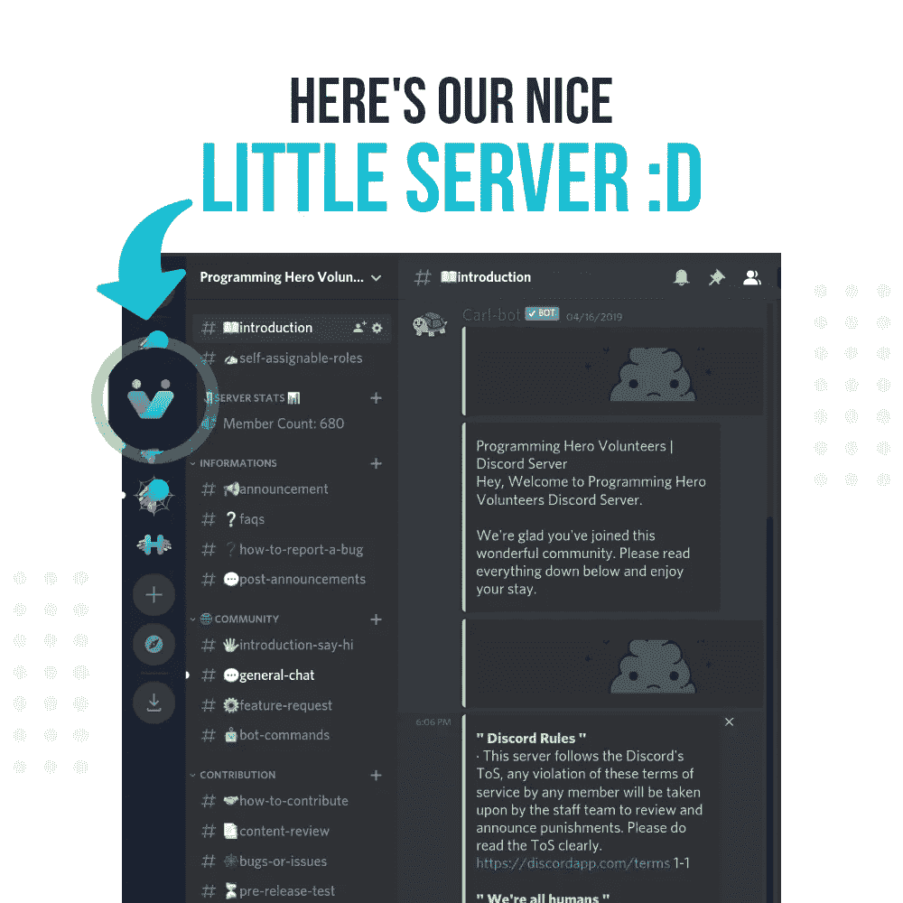
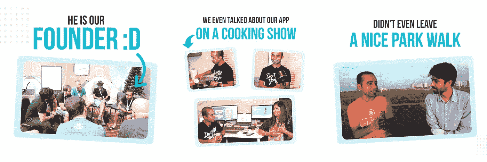
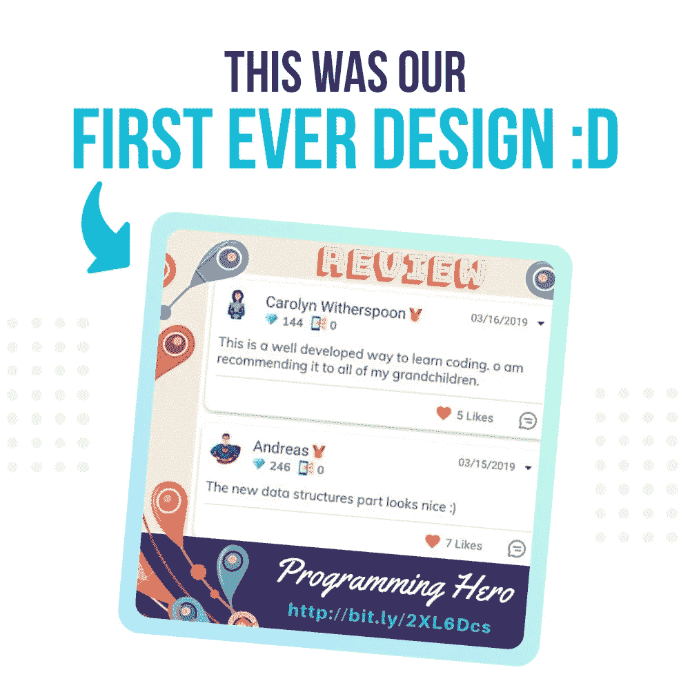
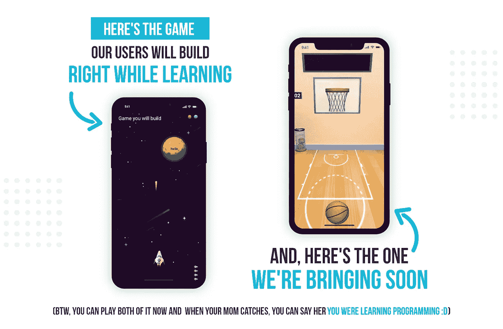

# 4 个有效的创新营销策略

> 原文：<https://medium.datadriveninvestor.com/4-creative-marketing-strategies-that-worked-498f7a94766f?source=collection_archive---------11----------------------->

## —持续工作，几乎不花钱

Photo by [James Pond](https://unsplash.com/@jamesponddotco?utm_source=medium&utm_medium=referral) on [Unsplash](https://unsplash.com?utm_source=medium&utm_medium=referral)

## **“我有一个梦想……”**

说完那句话，我们开始着手我们的梦想工程。

我们并没有梦想创造一些独特的东西或下一个大东西——然而，它是有价值的东西——我们继续让学习变得有趣……一些不常见但最有附加值的东西。

作为一个商业世界的婴儿，实际上是教育世界，我们没有任何联系，没有太多的钱，没有足够的知识，但有一肚子的梦想。

我们从创始人、他的朋友和巨大的希望开始。

创始人是产品经理(*集思广益让应用成功，寻找新功能)*和他的朋友产品开发人员*(无聊的生活)*。

 [## 商业无国界:如何走向全球？数据驱动的投资者

### 首先，你要形成你的主要目标。例如，寻找投资，固定你的市场…

www.datadriveninvestor.com](https://www.datadriveninvestor.com/2020/07/14/business-without-borders-how-to-go-global/) 

我们没有钱雇佣一些营销人员。

出于这个原因，我们必须想出一些具有创造性和成本效益的方法来接触更多的人，让我们的梦想成功。

我们尝试了很多事情，但这 4 件事都非常成功*(发生在我们最底层的最可怕的事情的一个大失败)*:

# **1。当人们做出贡献时，他们会提拔你**

激励就像魔术一样。它从不失败。它只是工作。

但是，我们的挑战是，因为我们的目标是提供价值，我们不能把不好的激励。

因此，我们提出了无害的激励措施⁠ — *“支持他们的学习怎么样？”，*我们以为。

现在，下一个挑战是为我们的交流找到一个好的平台*(遗憾的是，由于我们刚刚起步，我们无法直接在我们的应用上做到这一点)*

感谢上帝，我们发现了不和谐。它改变了游戏规则。交流从未如此便捷。

我们没有足够的服务器制造和维护知识*(现在我们知道这比在脸书上滚动更容易)*，所以我们不得不为一个沃尔玛的陌生人买晚餐，并完成它*(那时，我们对 YouTube 还不熟悉😢)*

最后，我们准备好了志愿者服务器。

对于我们的新贡献者，我们提供了 4 个选项来帮助我们:

1.  **Beta 测试***(app 并给出反馈)*
2.  **翻译** *(将 app 内容翻译成其他自然语言)*
3.  **复习我们的内容** *(遗憾的是我们不会说美国土著语)*
4.  **发现错误和问题** *(我们还没有任何测试人员)*

我们给他们一些奖励作为感谢:

*   我们应用程序的终身高级会员
*   在应用程序中获得赞赏徽章
*   对伟大事业的贡献
*   获得真实世界的经验
*   你可能最终会在这里找到你的另一半
*   在我们的服务器:D 上听音乐

通过这种方式，我们可以免费完成工作，人们喜欢这样做并感到快乐，我们喜欢让他们快乐。因此，志愿者不仅通过口口相传来推广我们的应用程序，而且每次他们做出贡献时，他们都在间接推广我们。怎么会？因为作为人类，我们倾向于看别人的生活，别人的工作，别人比我们自己更重要。

所以，当有人问志愿者:“你在做什么？”

一名志愿者说:*“我在翻译编程英雄的应用程序内容？”*

某人:*“哦，什么是编程英雄？”……*

你知道我的意思。我不会再往前走了。😁

Our Volunteers Server On Discord For Easier Communication

## **什么时候这对你不起作用？**

1.  当你变得自私，加上不好的激励。或者，更糟糕的是，没有激励(福利)。因为，除非人们找到成长、学习、探索、挣钱或炫耀的机会，否则他们不会帮忙。

2.你的提议应该是有价值的。应该比钱好。例子:获得现实生活的经验，因为他们为你花费了宝贵的时间。

3.永远不要强迫他们做任何事情。保持冷静，耐心，保持联系——发展健康的关系。

# **2。当你说话时，想法传播开来**

对于创始人来说，在房间的角落里集思广益新功能的想法并不足够。他应该做一些工作来获得更多的曝光率，从而获得更多的关注。

所以，我们开始向人们推销。我们向我们的有钱朋友推销我们，在他们的下一个 YouTube 视频中做嘉宾，在演讲中介绍我们的应用。作为回报，我们给了他们一些技巧，让他的心上人说“好”。

五个朋友中，有两个说是。*(现在约出来的力量来了。看到了吗？)*

慢慢地，我们的下载量开始增加。

We Didn’t Leave Any Chance We Got For Promoting Our App :D

> **个人品牌**
> 
> 这就是个人品牌如此重要的原因。作为公司的代言人和代言人，你肯定需要有一个个人品牌来帮助你更容易接触到更多的人，更好地联系。
> 
> 你的员工也一样。

## 什么时候这对你不起作用？

当你有资格。因为，在商业词典中，没有“朋友”、“T21”或“亲戚”这样的词

如果你想从某人那里得到什么，你需要给他们一些东西。这是互谅互让。这是双赢。

# **3。社交媒体是神奇的，一旦你进入**

我们想，为什么不接触社交媒体呢？

我们做到了。

我们对此一无所知*(作为开发者，我们不合群)。*因此，我们使用免费且受欢迎的网站 [*Canva*](https://www.canva.com/ff_sn/) ，制作*【好的】*海报，并通过所有社交媒体渠道向全世界发布同样的内容*(至少我们是这么认为的)*…

慢慢地，我们的下载量和购买率有了一些提高。

Our 1st Ever Poster For Social Media That We Created Using Canva

## **什么时候这对你不起作用？**

1.  当你发布不相关的，或者更糟的，利用内容。
    你的设计不一定是最好的，你不需要聘请最好的设计师。但是你确实需要给桌子带来价值，帮助解决你的内容的问题。
2.  当你试图抄袭别人的时候。品牌意味着独一无二。如果没有独特性，你很快就会被淘汰。

# **4。我们都爱故事，即使是成年人**

当我们了解到讲故事的力量后，我们惊呆了。

所以，我们想，*“我们怎么能在我们的应用程序中包含一个故事呢？”*

经过长时间的思考，我们得到了:

*“故事意为一系列的动作。而电影有一系列的动作。嗯，我们可以在我们的应用程序中创建一部电影吗？*

*“我们当然可以”*，我们想，“但不是现在。”

> ***秘密*** *(请不要透露给我们的竞争对手):
> 我们很快会推出一个功能，我们会将用户学习过程中的一系列行为结合起来，为他们制作一部电影，他们可以在社交媒体上分享。这会很有趣的。*

然而，是什么让一个故事变得伟大？

*“肯定是它产生的感觉？，"*谷歌回答。

游戏会发生什么？

游戏也创造感觉。无论是尝试新游戏的兴奋，战胜朋友的快乐，错过目标的悲伤…任何事情…都不重要。重要的是，它创造了感觉，而感觉有助于更好地联系。

因此，这更容易，我们立即在应用程序中应用了这一技术。

同时，我们建立了我们的模型:

1.  边学边做游戏
2.  以有趣的方式学习编程

We Teach Programming In A Fun Way While Building A Game

## 什么时候这对你不起作用？

赛斯·戈丁在他的书《T36》中说得好:“所有的营销人员都是骗子。”但是，他也建议不要对你的顾客撒谎。

因此，永远不要编造一个想象或虚构的故事。做真实的自己，展现自己独特的声音，说出真实的、真实的故事，人们一定会听的。遵守你对这个故事的承诺。

在我们的案例中，我们的故事就是我们的模型，也就是说，*以一种有趣的方式学习编程，并在这样做的同时构建一个游戏*。我们信守承诺，每一天都朝着那个故事行动、计划和努力。

生活不是电影，我们不会永远成功。

在我们找到金子之前，我们失败的比我们赢得的多。一场 26 英里的马拉松不足以阅读我们的失败清单。

# 这是我们最害怕的失败:

在应用程序发布后的第一周，我们走访了我们社区的每一户人家，请他们下载我们的应用程序。这也是通过搜索应用程序，而不是给他们直接链接。(我们了解到，搜索关键词并从该搜索中下载应用程序有助于提高该应用程序在该特定关键词中的排名。)我们在第 80 个位置。我们问他们我们会自己做，但他们不想让我们碰他们的手机，他们越来越不愿意自己做。

## 最可怕的事情

我们被其中两个人踢了屁股，一个人狠狠地揍了我们，打断了我们的鼻子。🙊

# 最后一点:

要坚持不懈，要有好奇心，要有创造力。成功将属于你。

我们几乎黑掉了营销，因为我们在几乎没有营销预算的情况下熬过了过去两年。我们做到了，你也可以。

**访问专家视图—** [**订阅 DDI 英特尔**](https://datadriveninvestor.com/ddi-intel)