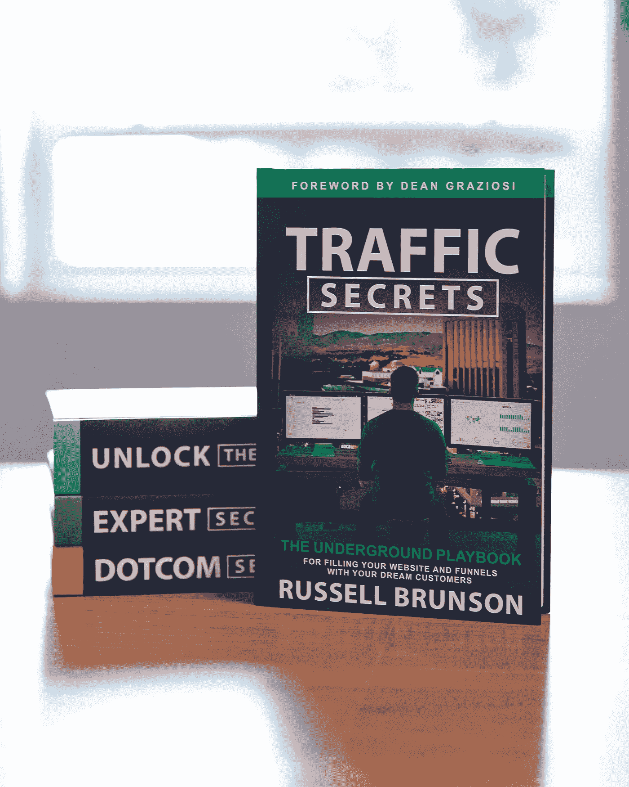

# 4 种增加网站流量的创造性方法

> 原文：<https://medium.datadriveninvestor.com/4-creative-ways-to-drive-website-traffic-643149c4d710?source=collection_archive---------13----------------------->

## 给你的商业网站增加流量的专家建议

Source: Family Features

稳定的网站流量是成功的在线业务的重要组成部分。虽然付费广告和搜索引擎优化是有价值的策略，但还有一些鲜为人知但同样有效的方法来吸引潜在客户到你的网站或渠道。

成功的企业家可以成为渴望在线创业的企业主的强大资源。例如，企业家拉塞尔·布伦森在大学期间创办了他的第一家网络公司。如今，他是 ClickFunnels 的联合创始人，这是一家成功的软件公司，帮助企业家快速有效地将信息传递到数字市场。

[Traffic Secrets: The Underground Playbook for Filling Your Websites and Funnels with Your Dream Customers](https://www.amazon.com/gp/product/1401957900/ref=as_li_tl?ie=UTF8&camp=1789&creative=9325&creativeASIN=1401957900&linkCode=as2&tag=ideapublishin-20&linkId=5991a77f54325a7b4c7d1b596fcdf2bd)

布伦森也是一系列书籍的作者，包括“[交通秘密:用你的梦想客户填充你的网站和渠道的地下剧本](https://www.amazon.com/gp/product/1401957900/ref=as_li_tl?ie=UTF8&camp=1789&creative=9325&creativeASIN=1401957900&linkCode=as2&tag=ideapublishin-20&linkId=5991a77f54325a7b4c7d1b596fcdf2bd)”，其中充满了使用经典和基础直接营销技术的技巧，以帮助未来的客户发现企业家的产品或服务，并推动需求。

根据布伦森的建议给你的商业网站增加流量，该建议改编自他的畅销三部曲的第三部[交通秘密](https://www.amazon.com/gp/product/1401957900/ref=as_li_tl?ie=UTF8&camp=1789&creative=9325&creativeASIN=1401957900&linkCode=as2&tag=ideapublishin-20&linkId=5991a77f54325a7b4c7d1b596fcdf2bd)。

# **确定你的目标受众**

在他的书中，布伦森提供了一个缩小你对潜在客户和他们信任的影响者的关注的行动计划。精确定位一个他称之为“你的梦想 100”的群体，说明你的理想受众喜欢在哪里收集信息，无论是视频频道、播客、博客还是其他平台。一旦你有了这些地方的清单，就去接触幕后的人，推销合作机会，这样你就可以把你的产品展示给你的目标受众。

# **理解列表的重要性**

建立客户名单意味着你可以随时联系他们或向他们推销产品。布伦森将电子邮件列表等同于一个广告平台，可以免费使用，挤满了理想的客户。引导网站访问者进入引人注目的销售渠道，在那里你可以收集他们的信息并将他们添加到你的列表中，这样你就可以吸引未来的访问。

# **推出源源不断的新广告**

当人们一遍又一遍地看到同一个图像时，他们会忽略它。你不需要完美的广告；你只需要定期发布不同的广告，联系不同的人，让你的品牌保持独特和有趣。

# **掌握社交媒体**

通过社交媒体推动流量极具挑战性。要取得成功，你需要了解平台的目标，制定与目标一致的策略，并了解平台希望如何向用户推广内容。

“如果你在网上销售任何东西，或者试图在网上创造商机，不管你在哪个行业，这 20 个交通秘密可以帮助吸引更多的眼球，”布伦森说。“我想帮你把你的网站和渠道填满你的梦想客户，所以我打算免费给你我的新书。就去 grabtrafficsecrets.com[看看](https://trafficsecrets.com/ts-free-book?cf_affiliate_id=513516&affiliate_id=513516&aff_sub=matrelease&utm_source=matrelease&utm_medium=print&utm_campaign=booklaunch&utm_term=MultiVu&utm_content=may2020)

Photo by [Carlos Muza](https://unsplash.com/@kmuza?utm_source=medium&utm_medium=referral) on [Unsplash](https://unsplash.com?utm_source=medium&utm_medium=referral)

# **在社交媒体上增加流量的 5 种方法**

这些来自[交通秘密](https://www.amazon.com/gp/product/1401957900/ref=as_li_tl?ie=UTF8&camp=1789&creative=9325&creativeASIN=1401957900&linkCode=as2&tag=ideapublishin-20&linkId=5991a77f54325a7b4c7d1b596fcdf2bd)的策略可以帮助使用这些主要平台来推动交通:

**1。谷歌:搜索你想要排名的关键词。扫描结果，寻找有广告、横幅、产品链接或订阅框的网站。联系这些网页的所有者，询问广告选项，以购买你的方式和建立你的列表。**

**2。YouTube:** 创建一个 15 秒的介绍，用一个吸引人的挂钩，然后是一个简短的 4 秒钟的品牌信息，然后告诉你的观众为什么他或她应该听。在接下来的 7-12 分钟内，与个人评论建立联系，分享有价值的内容。以行动号召结束。

**3。脸书:**把你的封面照片想象成你的广告牌，把简介部分想象成你的名片，你可以在上面放置链接。发帖时，分享可以开启对话的故事，记得在评论中吸引读者。

**4。Instagram:** 决定你是想激励、教育还是娱乐，然后创建一个标题。三个有效选项:讲故事、问问题或列清单。

**5。播客:**除了在每个节目结束时进行播客循环并发出行动号召，你还可以通过其他方式利用影响者。在他们的播客上购买广告，并安排客串，让你邀请他们的听众查看你自己的播客。(家族特征)