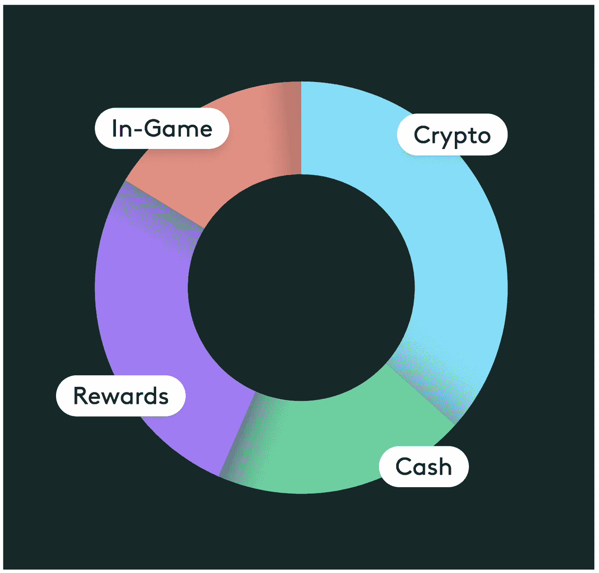
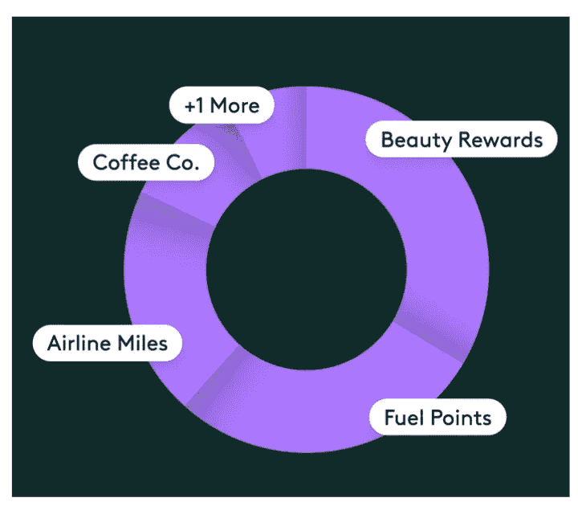
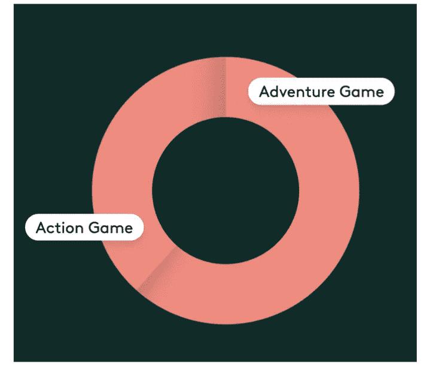
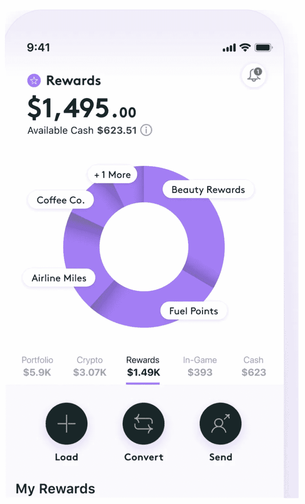

# 一个钱包中有 4 种不同的数字资产类别 Bakkt 应用程序

> 原文：<https://medium.datadriveninvestor.com/4-different-digital-asset-categories-in-one-wallet-the-bakkt-app-720a1ca320ea?source=collection_archive---------6----------------------->

大多数金融科技成年人要么专注于零售，要么服务于机构客户。今天，我想重点介绍一下专注于服务机构和商业需求以及零售需求的金融科技。这些金融科技旨在创造独特的生态系统。

Square 就是一个例子，它为商家提供的核心产品是围绕销售点支付的 square 硬件和不断增长的软件套件构建的。这是一款面向终端消费者的现金应用。

比特币基地是另一个例子，它拥有用于交易加密货币的机构套件和标志性的零售比特币基地应用。

这两个例子都是相当有经验的公司。Square 于 11 年前推出，并已上市(自 2015 年起)，比特币基地已有 8 年历史，即将上市，尽管它并不需要上市(5.47 亿美元融资和 80 亿美元估值)。

另一个我想强调的是更年轻和即将到来的。 [Bakkt](https://www.bakkt.com/) 成立于 2018 年，隶属于洲际交易所(ICE)。它已经筹集了 4.82 亿美元(2020 年 3 月 B 轮融资为 3 亿美元)，估值刚刚超过 10 亿美元。

Bakkt 从事交易所业务，专注于加密货币和数字资产。其机构产品包括加密货币的托管和衍生品(目前为期货和期权)。目前的菜单包括以现金和实物结算的比特币期货。

其消费者产品是 Bakkt 应用程序，包括买卖加密货币和支付的功能，以及礼品卡和忠诚度积分的钱包功能。与其他加密钱包——交换应用相比，这就是区别的开始。

Bakkt 的机构部分正在增长，但在整个加密期货活动中仍占很小的份额(不到 2%)，主要仍是场外交易(在 Okex、币安和 Huobi 等交易所)。今年春天，零售应用程序与星巴克应用程序(作为替代支付方式)一起进行了测试。随着最近对 [Bridge2 solutions](http://www.bridge2solutions.com/blog/) 的收购，ICE 完成了对 Bakkt App 的支持，电子商务领域的巨大推动力显而易见。ICE 和 Bakkt 斥资近 3 亿美元收购了 Bridge2 solutions，这是一家在美国久负盛名的 Saas 忠诚度计划提供商。

让我澄清一下，Bridge2 解决方案与区块链和忠诚度积分无关。事实上，它是在幕后推动 Bakkt 应用程序的奖励和忠诚度积分，并不意味着它将积分存储在账本上或支持用户之间的 p2p 交易。

 [## 数字证券的全球渠道|数据驱动的投资者

### 令牌化证券在 2018 年是一场灾难。投资者不想要它们，监管者不喜欢它们，发行者使用…

www.datadriveninvestor.com](https://www.datadriveninvestor.com/2020/10/16/a-global-channel-for-digital-securities/) 

Bakkt 应用程序使最终用户能够首先获得他们所持资产的简化和可视化概述，包括现金、加密货币、奖励和忠诚度积分以及游戏内资产。

Source [https://www.bakkt.com/](https://www.bakkt.com/)

第二个能力是花费奖励和忠诚度积分(前提是 Bakkt 可以发展一个商家网络)，这样它们就不会被浪费掉(美国的市场估计约为 1600 亿美元)。对于这一功能，Bakkt 充当将积分兑换成现金的角色，向用户收取少量费用。最终用户不介意支付少量费用，只要他们能避免浪费已获得的奖励。然而，Bakkt 需要搭载商家，并说服他们加入 Bakkt 应用程序。

第三个功能是通过短信发送礼品卡，就像我们现在发送付款一样(在我居住的瑞士，我们使用 [Twint](https://www.twint.ch/en/) )。也可以查看余额和消费礼品卡。

对于那些认为 ICE 是一项投资的人来说，这不仅是因为它是一项定位重要的收费业务，也是因为它是一项创新，有几个事实让它看起来像一个不错的候选人。

📌ICE 已经在 185 只 ETF 中持有，SPY 是目前最大的 ETF 持有者。ETF.com[报道](https://www.etf.com/stock/ICE)ICE 敞口最大的前五大 ETF 是

(美国券商 ishares)[CWS](https://www.etf.com/CWS)(顾问主动管理 ETF)[ARKF](https://www.etf.com/ARKF)(ark invest fin tech ETF)[BLOK](https://www.etf.com/BLOK)(区块链 ETF)[KOIN](https://www.etf.com/KOIN)(创新次世代)。

这五只 ETF 中有三只更侧重于创新。

ARKF 持有 ICE 3.5%的股份，仅次于 Adyen，排名第九。

BLOK 在 ICE 中持有 3.0%的股份，仅次于 AMD，排名第八。

KOIN 的前十大持股中不包括冰毒。这是他们的第 16 次持股，占他们“投资组合”的 2.82%。

**网**:[https://efipylarinou.com/](https://efipylarinou.com/)

我的 **YouTube 频道**上的每周对话和行业见解:

 [## Efi 皮拉里努

### 金融科技公司的 www.efipylarinou.com 顾问，专注于资本市场、财富和资产管理…

www.youtube.com](https://www.youtube.com/efipm) 

## 获得专家观点— [订阅 DDI 英特尔](https://datadriveninvestor.com/ddi-intel)