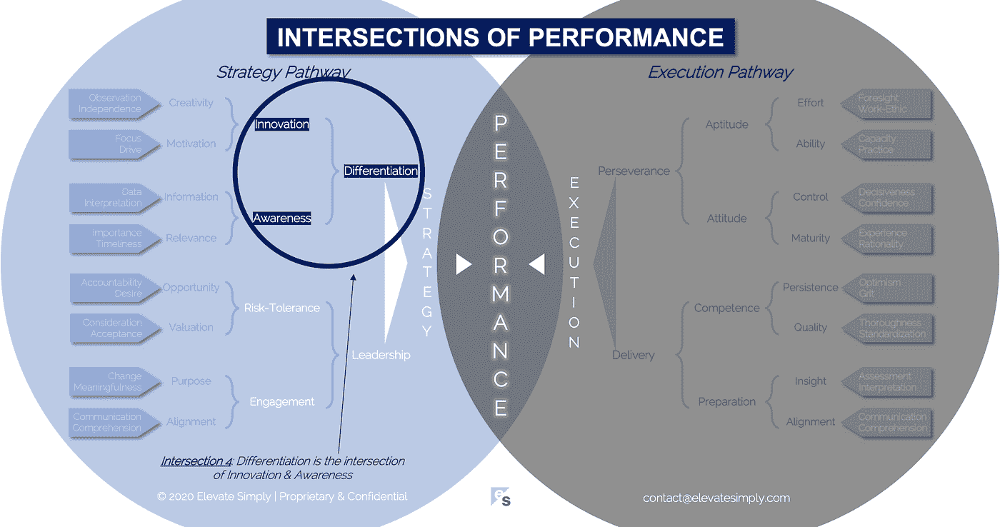

# 差异化:创新与意识的交汇点

> 原文：<https://medium.datadriveninvestor.com/4-differentiation-the-intersection-of-innovation-awareness-a21d053ecf12?source=collection_archive---------9----------------------->

Image by 123rf.com

大自然掌握了分化(即指纹…雪花…斑马条纹…)。企业在生存之战中也在不断努力。在商界，有一个“要么分化，要么死亡”的现实。如果一家公司摇摇欲坠或停滞不前，会有无数其他公司准备接替它的位置。即使表现不错，竞争对手也总是在挑战市场份额。

差异化不仅仅适用于公司销售的产品。它适用于业务的所有方面，包括…产品、服务、定价、人才、位置、关系、可及性、价值、商业模式、沟通、客户认知、财务实力、领导团队、交付团队等。以我的经验来看，传统的差异化分析只是表层的，主要集中在产品、服务、定价和价值上。是的，这些对于任何想要保持持续经营的企业来说都是至关重要的，但是是什么让一些公司比其他公司更擅长差异化呢？

一家公司能够“简单地”区分其销售的产品，是其 DNA 中更深层次的区分能力的结果。

**什么是分化交集？**

差异化是创新和意识的交叉点*(见下图交叉点 4)*。成功的差异化之所以发生，是因为一个组织内部存在一种深思熟虑的、有意为之的心态。

*创新*

创新是现状的对立面，正如懒惰是差异化的对立面。创新驱动企业家创造。这也是老牌公司投入大量资金进行研发的原因。创新是全球经济变革的生命线。

创新者总是问为什么和如何。

*   为什么我们要这样做？
*   我们为什么不试试这个？
*   这是怎么做到的？
*   我们如何改变这种方式？

创新适用于企业的各个方面，而不仅仅是产品和服务。它的目标是以某种形式或方式改进(例如过程)。它的结果是使某物变得更好、更大/更小、更快、更便宜、更强大/有用/高效，等等。

我见过害怕创新的企业。管理层的态度是“我们害怕变化”(引用我最喜欢的电影之一)。害怕改变的管理层不是真正的领导，只是一群即将被竞争压垮的管理者。没有创新就没有差异化。

交叉点 4:差异化=创新+意识

Image by [Brett Simpson](https://medium.com/u/191cf90a65d7?source=post_page-----a21d053ecf12--------------------------------)

*认知*

觉知是分化路口的另一边。为了区分对公司、产品、服务或流程的当前状态的认识，需要。意识来自于对存在什么、为什么存在以及如何适应当前公司或行业生态系统的深刻理解。它源于一种观察的心态和能力，这听起来可能是基本的和普遍的，但它不是。差异化背景下的意识需要有目的的聚焦。它是通过研究、学习、提问、试错以及计算采取一项行动的风险和回报(即机会成本)的能力发展起来的。

意识到可能性是需要的，即使有些事情以前从未被做过。成功的竞争优势利用现有的东西，并创造方法来改进它，无论是增量式的还是通过整体销售变革，甚至到了新旧之间几乎没有可比性的程度。有时是更好的捕鼠器，有时是全新的捕鼠器。

意识最重要的一个方面是企业自我意识。这种意识回答了如下问题:

*   我们今天在做什么可以做得更好？
*   我们有资源去创造改变吗？
*   变革发生时对业务有什么影响？
*   一旦我们做出改变，预期的结果是什么？

有自知之明的领导者的公司更倾向于有企业自知之明，这使得敏捷性和能力能够更有效地实现差异化飞跃。

**领导者能做什么？**

想要与众不同的领导者必须思想开放。他们认识到创新和意识能够发生的需要和创造的环境。扼杀进步的最快方法是扼杀组织中的这些元素。

优秀的领导者有自知之明，身边都是才华横溢、打破常规的思考者，他们有能力描绘出一个更美好、与众不同的未来。

**总结&下一个**

差异化是公司保持竞争力和长期经营的原因。另外，有创新意识和自我意识的公司更有趣。

下一次，我们将检查性能的第五个交叉点，即**参与交叉点**。

在这一系列文章中，我们探索了性能的交叉点，共有 30 个。绩效交叉点*框架基于 Elevate Simply 董事总经理 Brett Simpson 20 多年来作为企业家、顾问和投资者在大型和小型组织中的领导经验和见解。*

**绩效-文章链接的交集**

1.[绩效:战略的交集&执行](https://medium.com/the-innovation/1-performance-the-intersection-of-strategy-execution-2bf06329f8d4)

2.[战略:领导层的交集&分化](https://medium.com/the-innovation/2-strategy-the-intersection-of-leadership-differentiation-a568b17731ab)

3.[领导力:敬业度的交集&风险承受能力](https://medium.com/the-innovation/3-leadership-the-intersection-of-engagement-risk-tolerance-f8c887e6c1d3)

4.[差异化:创新的交叉点&意识](https://medium.com/@brettjsimpson/4-differentiation-the-intersection-of-innovation-awareness-a21d053ecf12)

5.[接合:目的的交集&对准](https://medium.com/@brettjsimpson/5-engagement-the-intersection-of-purpose-alignment-953747437c26)

6.[风险承受能力:机会的交叉点&估值](https://medium.com/@brettjsimpson/6-risk-tolerance-the-intersection-of-opportunity-valuation-29cf4d9a0ac)

7.[认知:信息的交集&关联性](https://medium.com/@brettjsimpson/7-awareness-the-intersection-of-information-relevance-f0fd5322bcb7)

8.[创新:创造力的交汇点&动机](https://medium.com/@brettjsimpson/8-innovation-the-intersection-of-creativity-motivation-7c1a12e0d5e2)

9.[目的:变化的交集&意义](https://medium.com/@brettjsimpson/9-purpose-the-intersection-of-change-meaningfulness-9f12b0153e1)

10.[估价:对价的交集&验收](https://medium.com/@brettjsimpson/valuation-the-intersection-of-consideration-acceptance-eebe7b15e763)

11.[机遇:欲望的交汇&问责](https://medium.com/the-innovation/opportunity-the-intersection-of-desire-accountability-7e81adb1e195)

12.[相关性:重要性的交集&及时性](https://medium.com/@brettjsimpson/relevance-the-intersection-of-importance-timeliness-56cc748eb066)

13.[信息:数据的交集&解读](https://medium.com/@brettjsimpson/information-the-intersection-of-data-interpretation-62acc94ba8bf)

14.[动机:焦点的交集&驱动](https://medium.com/@brettjsimpson/14-motivation-the-intersection-of-focus-drive-d9ebd3ca9951)

15.[创造力:观察的交集&独立性](https://medium.com/@brettjsimpson/15-creativity-the-intersection-of-observation-independence-57f7294acb2b)

16.执行:毅力和交付的交叉点*(即将推出！)*

17.交付:准备与能力的交叉点*(即将推出！)*

18.毅力:天资与态度的交汇*(即将推出！)*

19.准备:洞察与对齐的交集*(即将推出！)*

20.能力:坚持与质量的交集*(即将推出！)*

21.态度:控制与成熟的交集*(即将推出！)*

22.资质:努力与能力的交集*(即将推出！)*

23.洞察力:评估与解释的交集*(即将推出！)*

24.质量:彻底性和标准化的交汇点*(即将推出！)*

25.坚持:乐观与勇气的交汇*(即将推出！)*

26.成熟:经验与理性的交集*(即将推出！)*

27.控制:果断与自信的交集*(即将推出！)*

28.能力:能力与实践的交集*(即将推出！)*

29.努力:远见和职业道德的交集*(即将推出！)*

30.对齐:传播与综合的交汇点*(即将推出！)*