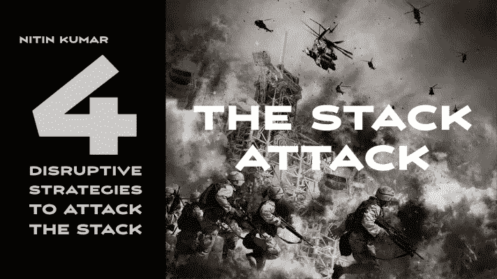

# 攻击堆栈的 4 种破坏性策略

> 原文：<https://medium.datadriveninvestor.com/4-disruptive-strategies-to-attack-the-stack-343eb39c52b7?source=collection_archive---------25----------------------->

Image created by author using Pixabay

了解“堆栈攻击”的破坏媒介

> 主要技术每隔 2-3 年就会发生变化，新平台建立在前代功能的基础上。这些转变是由新技术或新软件栈推动的。软件堆栈也称为“技术堆栈”，它提供了一个完整的平台来运行应用程序以处理复杂的计算环境。

# 介绍

在云、移动、物联网、人工智能、大数据等之前的时代。技术堆栈过去是特定于供应商的，如微软等。如今，这些堆栈中的技术呈爆炸式增长，每年都有新的工具成为主流，例如 Kubernetes、Docker Toolbox、Polly、Prometheus 等。几年前还不存在。许多功能和技术，如数据湖、NoPSD 等。也变得成熟，并衍生出更多的工具和技术，在现有的技术体系之外增加了严重的复杂性。

技术领域处于动态平衡状态。随着新技术和工具的出现，生态系统采用它们来创造新的平衡并适应复杂性。我们现在正处于一个技术趋势不断变化的时代，适应这种变化变得更加困难。

# 核心驱动因素

推动这些长期转变的趋势有很多，我们可以在下面选择几个进行研究:

# 脱离单一供应商战略

一个加速的趋势是，即使是企业级组织也正在脱离他们的单一供应商技术体系。新技术成为主流的速度创造了一种更难保持的势头。除了这些变化的数量和速度之外，其中一些技术具有破坏性，会导致现有产品过时，从而更难忽视新出现的产品。

# 构造控制转移

我们正在经历相当于商业构造的转变，这种转变主要是由技术驱动的，并且正在影响我们开展商业的基本方式。这些转变也可能相互冲突，使得今天的商业战略比过去几年或几十年更难概念化和执行。其中一些转变如下:

产品到云与云到边缘。

集中(SDN/NFV)与分散(如区块链)。

将语音货币化的玩家现在正在将数据货币化(例如，电信公司)，而将数据货币化的玩家现在正在将语音货币化(例如，谷歌、亚马逊)。

实体经济到全渠道零售经济，或者说“实体经济”

闭源到开源(安卓)。

人类对机器(AI)。

现实到虚拟(AR/VR)。

建立传统企业与货币化生态系统。

在这个新的前沿领域很少有绝对的规则，公司需要一种数据驱动的方法来应对这种复杂性、不确定性和模糊性，这种情况在过去几年变得越来越严重，而且不太可能减少。软件的出现定义了一切，互联设备，云等等。支持技术力量和控制的快速转移，并开启使用案例和业务模式，如果没有相应的管理，则会中断业务。

Photo by [Maxim Hopman](https://unsplash.com/@nampoh?utm_source=medium&utm_medium=referral) on [Unsplash](https://unsplash.com?utm_source=medium&utm_medium=referral)

# 标准化转变

在过去十年中，标准化是以效率为导向的组织的游戏。今天，标准化是钙化的途径，例如，开源的扩散意味着在基础代码之上的多种工具，移动开发意味着处理多个操作系统供应商和无数设备，大数据的出现导致了与多个数据库管理系统的交互。在数字企业中，战略复杂性、供应商复杂性、风险和机遇是现实。

# 结构和文化变化

技术栈日益增加的复杂性使得基于技术层的团队组织效率低下。各种各样的技术需要适应性和协作团队工作，而不是功能失调的筒仓。云、DevOps 等的出现。随着团队变得越来越复杂，协作变得至关重要，团队需要具备多种技能，了解技术层、产品设计、产品管理和运营，因此创建自动配置基础架构的文化并快速交付新产品。过去的组织结构越来越难以扩展，组织结构正在发生变化。

 [## 旋转你的创业？4 种正确的方法|数据驱动的投资者

### 1)储备现金——在早期阶段，尤其是种子期，你有可能会一直转到找到…

www.datadriveninvestor.com](https://www.datadriveninvestor.com/2020/12/13/pivoting-your-startup-4-ways-to-do-it-right/) 

# 以软件为中心的交付能力，一个困难的范例

如果它建立在良好的工程基础上，就更容易处理复杂性，例如，今天的飞机比 20 世纪 50 年代的更复杂，但也更稳定、更安全。工程至关重要，由于缺乏世界级的软件工程或软件交付能力，许多组织无法实现其数字战略。软件是重塑竞争、客户行为、产品和服务以实现差异化和规模化的能力。尽管它的重要性和关键任务的作用，它仍然没有得到所需的关注从 C-suites 或董事会。

上述这些变化和复杂性以及现任者无力适应这些变化，使他们变得脆弱。他们还必须计划、管理和减轻来自破坏性竞争对手的威胁，这些竞争对手会攻击堆栈和市场，这与针对客户和市场的传统竞争不同。堆栈攻击可能是毁灭性的，会使多年的工程投资化为乌有，并且需要更长的时间来响应或恢复。

Photo by [Balaji Malliswamy](https://unsplash.com/@blahji?utm_source=medium&utm_medium=referral) on [Unsplash](https://unsplash.com?utm_source=medium&utm_medium=referral)

# 常见的攻击媒介

破坏者通常采用多种技术和破坏手段，其中一些侧重于堆栈。我们将在下面讨论一些精选的例子。

# 将下一代产品商品化

当你正在输掉一场技术战时，一个有效的策略是将下一代技术商品化以取得领先。例如，谷歌在最初的云浪潮中输给了亚马逊，但他们通过 Kubernetes(一种包装在小容器中的软件，没有操作系统或微操作系统)的商品化战略强势来袭。Kubernetes 允许协调、升级和扩展多个微服务，从而创建软件定义的基础架构。当它被大规模采用时，它将有望在 Google Cloud 上运行得更好，并显示出对现有堆栈的攻击。

# 面向规模的进攻

将一项技术的核心组件组合成一个连贯的捆绑包，可以创建一个技术平台，通过规模优势推动大规模发展。谷歌、亚马逊、微软、脸书都成功地做到了这一点。谷歌已经变得类似于网络本身，提供搜索、付费发现、视频分发、广告货币化工具、分析和差异化用户体验。通过新的差异化技术不断增加和加强平台为这一规模创造了不可逾越的障碍。优势如此深远，以至于大多数新进入者已经放弃了尝试考虑进入该领域。

# 武器化部件

通过优化新技术堆栈或平台将特定组件武器化是创建强大攻击媒介的另一种方式。随着智能手机的普及，出现了诸如实时位置跟踪、无处不在的摄像头、随处可见的广告、移动本地应用等机会。为了适应脸书的规模，Snap 对相机进行了优化，提供了更生动的内容、消失的消息、故事格式、镜头和滤镜，为创建和共享内容的能力增加了多样性和趣味性。脸书不得不采取反击策略，向他们的开发者社区开放摄像头来保护自己。优化组件现在是一个众所周知和众所周知的策略，不断结合核心技术并围绕它编织第三方开发人员生态系统，例如，Snap 正在利用 spectacles、overlays 等硬件组件进军增强现实。

> 将部件武器化是一种非常有效的攻击手段。如果执行得好，它可以迅速形成规模，并从现有企业手中夺走市场份额。

# 公司的倒置

在通过平台和乌鸦产生业务规模的时代，商家通过倒挂向在位者发起反击。例如，开发人员社区已经能够从公司外部创造价值——公司越来越擅长理解和管理这种价值创造。这不是外包，而是众包，公司甚至让第三方控制他们自己都不太了解的规范。将重点从内部专家快速转移到外部人群，从下属的命令转移到社区参与，这可以通过成倍提高质量和上市速度来加速价值交付。

企业建立和利用网络效应创造指数增长，允许他们通过新的商业模式创造在传统企业的狭窄范围之外运作。例如，优步和 Airbnb 的价值比现有的宝马和万豪要高得多，它们在公司外部的时间、成本上创造了大部分价值。全球市值前五的公司都是平台公司。发起平台式反转攻击让现有公司措手不及。

# 结论

技术变革只会变得更加复杂和加速，在今天的环境中蓬勃发展将需要可靠的软件定义的功能、高速运行、正确的结构和文化，以及不断观察市场和堆栈的能力。业务主管和董事会需要更加关注软件堆栈、其功能以及软件驱动的变化对长期业务可行性和可扩展性的影响。

***下载 pdf，点击*** [***此处***](https://www2.slideshare.net/nitkumar2/the-stack-attack-four-disruptive-strategies)

**访问专家视图—** [**订阅 DDI 英特尔**](https://datadriveninvestor.com/ddi-intel)