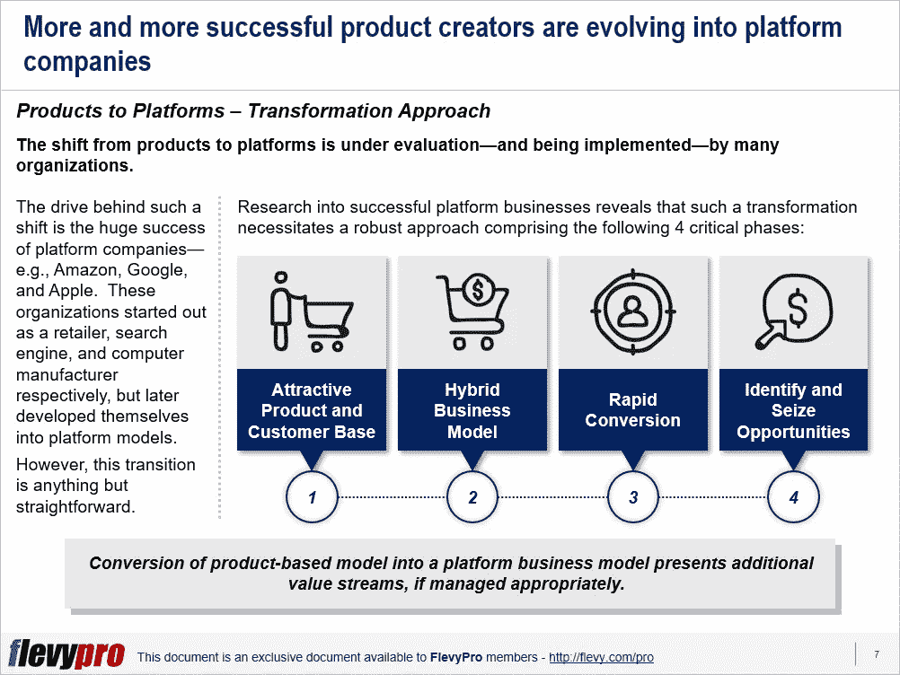

# 从基于产品的业务向平台业务模式转型的 4 个必要条件

> 原文：<https://medium.datadriveninvestor.com/4-imperatives-of-transforming-from-a-product-based-business-to-platform-business-model-707024f89cb6?source=collection_archive---------7----------------------->

[从基于产品的模式向平台模式转型](https://flevy.com/browse/flevypro/products-to-platforms-transformation-5191)是许多高管的抱负。越来越多的产品公司正在转向平台模式。这种转变背后的驱动力是平台公司的巨大成功，例如亚马逊、谷歌和苹果。这些组织最初分别是零售商、搜索引擎和 iPod 制造商，但后来转变为平台模式。

然而，将这一变革愿景变为现实绝非易事。对成功平台业务的研究表明，这需要一种稳健的方法，包括以下 4 个关键阶段:

1.  **有吸引力的产品和客户群**
2.  **混合商业模式**
3.  **快速转换**
4.  **识别并抓住机会**

现在，让我们更深入地研究这个方法的前两个阶段。

# 有吸引力的产品和客户群

平台模式并不是挽救下滑产品的良方。它需要一个有吸引力的产品，提供重要的客户基础和价值，以帮助提高客户忠诚度和抵制竞争对手的产品。临界质量的客户还允许平台公司为第三方创造价值，并吸引第三方，这对平台的蓬勃发展至关重要。

中国大型互联网公司奇虎 360 科技于 2006 年开始运营，销售杀毒软件 360 安全卫士。为了建立广泛的用户基础，并收集客户对改进产品的反馈，该公司开始免费赠送产品。该公司维护了一份恶意软件清单，以及一份对用户来说安全的程序“白名单”。大量的客户让奇虎得以:

*   快速识别扫描计算机上的病毒
*   提高防病毒能力
*   介绍新产品
*   吸引新顾客
*   创建新平台
*   吸引第三方软件公司，让奇虎成为接触客户的渠道。

# 混合商业模式

一个组织必须接受基于产品或基于平台的商业模式的想法与现实相差甚远。尽管基于产品和基于平台的业务模式都需要一个框架来分配专用资源和管理运营，但是，从基于产品的模式到基于平台的模式的[业务转型](https://flevy.com/browse/stream/transformation)利用混合方法得到了简化。基于产品的商业模式要求组织拥有满足客户需求的差异化产品，以创造价值。然而，基于平台的商业模式通过将用户链接到第三方并收取平台使用费来创造价值。平台模型的重点是:

*   激发大众市场的接受度
*   增加互动次数，而不是满足特定的客户需求
*   连接用户和第三方以创造竞争优势，而不是仅仅依赖产品差异(产品模型)。

例如，苹果在推出第一代 iPhone 后的一年内，就将自己从产品模式转换为平台模式。最初，苹果对任何黑客企图做出防御反应，并阻止 iPhone 上的第三方应用程序，但后来决定创建一个开放平台，并推出了应用程序商店。混合模式和平台思维为苹果创造了额外的收入来源和可观的收入。

# 快速转换

要让一个产品和商业模式盈利，将产品用户转化为平台用户至关重要。为了实现这一点，一个组织需要以这样一种方式开发它的平台，它应该为客户提供足够的附加价值来采用它并成为它的用户。要做到这一点，三个关键因素至关重要:

*   提供足够的价值
*   推出与品牌一致的互联产品
*   允许第三方执行升级

如果这个平台不能为客户提供足够的价值，他们就不会像接受一个伟大的产品那样接受它。同样，增加与品牌一致的新产品与新平台的采用有很强的相关性。新产品从公司形象中获得牵引力，进一步强化品牌。同样，允许第三方进行升级、改进产品供应和开发平台进一步有助于快速转换、增加收入和增长。

有兴趣了解更多关于[产品到平台转型](https://flevy.com/browse/flevypro/products-to-platforms-transformation-5191)的各个阶段吗？你可以在 [Flevy 文档市场](https://flevy.com/browse)的这里[下载一个关于**产品向平台转型**的可编辑幻灯片。](https://flevy.com/browse/flevypro/products-to-platforms-transformation-5191)

## 你在这个框架中找到价值了吗？

您可以从 [FlevyPro 库](https://flevy.com/pro/library)下载关于这个和数百个类似业务框架的深入介绍。 [FlevyPro](https://flevy.com/pro) 受到 1000 名管理顾问和企业高管的信任和使用。有些人不得不说:

> “我的 FlevyPro 订阅为我提供了当今市场上最受欢迎的框架和平台。它们不仅增加了我现有的咨询和辅导产品和服务，还让我跟上了最新的趋势，为我的实践激发了新产品和服务，并以其他解决方案的一小部分时间和金钱教育了我。我强烈推荐 FlevyPro 给任何认真对待成功的顾问。”

–比尔·布兰森，战略商业建筑师事务所创始人

> “作为一家利基战略咨询公司，Flevy 和 FlevyPro 框架和文件是一个持续的参考，有助于我们为客户构建我们的调查结果和建议，并提高他们的清晰度、力度和视觉效果。对我们来说，这是增加我们影响力和价值的宝贵资源。”

–Cynertia Consulting 的咨询区域经理 David Coloma

> “作为一个小企业主，FlevyPro 提供的资源材料已被证明是非常宝贵的。根据我们的项目事件和客户要求按需搜索材料的能力对我来说很棒，并证明对我的客户非常有益。重要的是，能够针对特定目的轻松编辑和定制材料有助于我们进行演示、知识共享和工具包开发，这是整个计划宣传材料的一部分。虽然 FlevyPro 包含任何咨询、项目或交付公司都必须拥有的资源材料，但它是小公司或独立顾问工具箱中必不可少的一部分。”

–变革战略(英国)董事总经理迈克尔·达夫

> “作为一名独立的成长顾问，FlevyPro 对我来说是一个很好的资源，可以访问大量的演示知识库来支持我与客户的合作。就投资回报而言，我从下载的第一个演示文稿中获得的价值是我订阅费用的好几倍！这些资料的质量让我能够打出超出自己体重的水平，这就像是用很小一部分开销就能获得四大咨询公司的资源一样。”

–Roderick Cameron，SGFE 有限公司的创始合伙人

> “我每个月都会浏览几次 FlevyPro，寻找与我面临的工作挑战相关的演示文稿(我是一名顾问)。当主题需要时，我会进一步探索，并从 Flevy 市场购买。在所有场合，我都阅读它们，分析它们。我采纳与我的工作最相关和最适用的想法；当然，所有这些都转化为我和我的客户的利益。"

量子 SFE 公司首席执行官奥马尔·埃尔南·蒙特斯·帕拉

在 [**管理和企业咨询**](https://app.ddichat.com/category/management-and-corporate-consulting) **:** 中安排一个 DDIChat 会话

 [## 专家-管理和企业咨询- DDIChat

### DDIChat 允许个人和企业直接与主题专家交流。它使咨询变得快速…

app.ddichat.com](https://app.ddichat.com/category/management-and-corporate-consulting) 

在这里申请成为 DDIChat 专家[。
与 DDI 合作:](https://app.ddichat.com/expertsignup)[https://datadriveninvestor.com/collaborate](https://datadriveninvestor.com/collaborate)
点击此处订阅 DDIntel [。](https://ddintel.datadriveninvestor.com/)