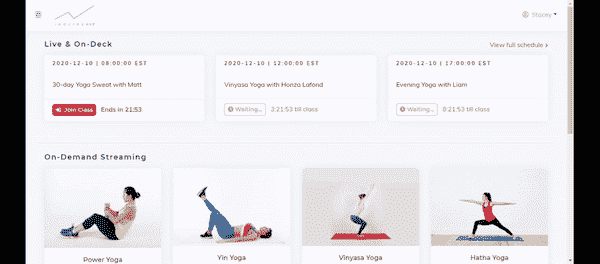
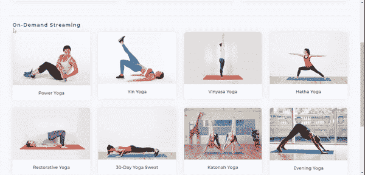
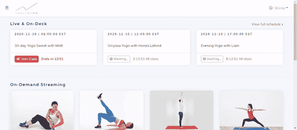

# 如何发展你的健身事业？

> 原文：<https://medium.datadriveninvestor.com/4-insights-on-how-to-grow-your-fitness-business-b22d0f0a059d?source=collection_archive---------14----------------------->

## 实现不可思议的结果的技巧。

新冠肺炎，一个全球性的疫情，正在革新健身行业。在此期间，健身房老板们正在经历全新的挑战。适应这种变化将帮助您的企业度过封锁期，并在大流行后的世界中获得竞争优势。

# **投资虚拟平台——未来的竞争优势**

虚拟的意思是真实事物的数字复制品。谷歌对“虚拟”一词的定义是:虚拟并不存在，而是由软件制造出来的，看上去是虚拟的。

通过互联网开展全部或大部分业务的企业被称为虚拟企业。没有可供客户参观的物理位置。然而，虚拟企业可能有也可能没有其他形式的实体存在——比如办公室或仓库。

*为什么拥有一个虚拟平台对你的健身事业很重要？*

拥有虚拟平台有很多好处。开另一家健身房或健身工作室需要一大笔钱。所以，这种拓展业务的方式，未必每个健身企业主都能做到。

另一方面，收购和运营一个虚拟平台的*成本*要比安排和运营你健身房的另一个场所低得多。

全球疫情让健身房和健身房的老板处境艰难。由于全国范围的封锁将人们限制在家中，健身房收到了取消请求，销售额下降，以及套餐回购。

由于要支付租金和工资，又没有收入可言，许多健身房都关门了。许多健身教练和辅助人员被降薪或停薪休假。

健身企业在 2020 年生存的唯一方式是投资虚拟平台。软件公司的员工一直在不知疲倦地工作，以帮助各种企业度过疫情给健身行业带来的不寻常的挑战。

## 介绍 [Inqline Fit](https://fit.inqline.com/)

为了给健身行业的企业赋能， [Inqline](https://ai.inqline.com/machine-learning-for-marketing-customer-segmentation/) 推出了其 [Inqline Fit](https://fit.inqline.com/) 平台。该平台允许您以实时流锻炼会议和点播锻炼视频的形式提供服务。

纽约的一家著名健身房在疫情的第一阶段发现自己陷入了困境，但一旦他们将其品牌转换到一个虚拟平台，他们就大大受益于 [Inqline Fit](https://fit.inqline.com/) 。事实证明，数字化是他们在 2020 年的生存策略。

# **虚拟平台会一直存在下去吗？**

在疫情时期，对健身器材的需求激增。美国人正在创建家庭健身房来保持健康和缓解压力。封锁激励人们改善他们的家庭健身房，投资家庭健身设备。

一项涉及 2000 名美国人的调查显示，由于冠状病毒疫情，去健身房已经变得过时。一旦疫情结束，59%的美国人不打算更新他们的健身房会员资格。63%的受访者认为他们在过去的几个月里变得更健康了。

以前在互联网上找不到的健身企业现在可以利用它们的数字存在在网上推销自己。

# **自动化流程——通过无差错操作提高员工和客户满意度**

根据字典的解释，自动化是一种使设备、过程或系统自动运行的技术。它是一种允许以最少的人工输入来执行过程或程序的技术。

*为什么您应该自动化您的业务流程？*

自动化某些操作可提高生产率、可靠性、可用性、改善性能并降低运营成本。

通过引入智能工作流和消除冗余任务，业务自动化对于帮助公司事半功倍至关重要。它还增加了日常运营中发生的事情的可见性，从而腾出更多时间来关注关键的业务问题。

世界各地的许多健身企业和健身教练已经开始在 Zoom、Instagram、脸书等平台上进行直播锻炼。

为了在 Zoom 上实时播放锻炼课程，健身企业的健身教练通常会在每次举办课程时生成一个唯一的链接。点击此链接将会引导您进入实时流会话。它会通过电子邮件发送给所有参加会议的成员。

请注意，整个过程很容易出错，并且由重复的任务组成，这可能会让健身教练和会员都感到沮丧。

为每个会话发送一封新的 Zoom 链接邮件会让会员的收件箱里塞满 Zoom 链接邮件，当一个实时会话结束时，每封邮件都变得毫无用处。

为了将所有的风险和问题拒之门外， [**Inqline Fit**](https://fit.inqline.com/) 自动化了这整个过程。一旦会员在虚拟平台上登录他们的帐户，他们就会看到一个界面，显示所有实时会话的详细信息，如下图所示。

上面的 gif 是从 [Inqline Fit](https://fit.inqline.com/) 中截取的片段。将显示每个实时会话的详细信息。到了实时健身课程的时间，“等待中”状态会变为“加入课程”，点击此按钮将引导您进入实时课程。

[Inqline Fit](https://fit.inqline.com/) 使用 YouTube 点播视频。会员一登录就可以看到界面，界面上有详细信息和一个选项，点击后可以看到 YouTube 视频。缩放允许您记录每个会话并保存它，以便错过实时会话的任何人都可以访问它的记录。

[Inqline Fit](https://fit.inqline.com/) 消除了整个过程中的人工输入需求。现场直播会自动保存在服务器上，然后作为点播视频上传到 YouTube 上，所有成员都可以观看。

[Inqline Fit](https://fit.inqline.com/) 使用 stripe 收集付款，并自动收集付款和保存记录。它允许会员用信用卡支付。会员所要做的只是在虚拟平台上输入他们的信用卡详细信息，以进行首次支付，这些详细信息将被保存下来，供后续支付周期使用。

# **采用人工智能——吸引、吸引和留住会员**

人工智能是一个计算机科学领域，专注于创造看起来像拥有人类智能的机器。这些机器的智能是“人工”的，因为人类创造了它，它不是自然存在的。

人工智能的一个子集是机器学习(ML)。ML 算法是计算机可实现的指令，它将数据集作为输入，并在以前未发现的数据集中找出模式。这些模式或者为用户提供洞察力，或者帮助对未来数据进行预测。

Inqline 的 [**数据科学自动驾驶**](https://ai.inqline.com/products/) 配备了 [Inqline Fit](https://fit.inqline.com/) ，并为您提供实时预测和可操作的见解，以最佳地优化您客户的旅程。这是一个由三种产品(名称:吸引、参与、保留)组成的包，对于任何企业的蓬勃发展和将损失保持在最低程度都是必不可少的。

数据科学自动驾驶将在以下方面帮助您的健身业务:

## **客户细分**

客户细分模型有助于您有效地分配营销资源并最大限度地增加交叉销售和追加销售机会。 [**吸引**](https://ai.inqline.com/products/) 帮助您花费更少，找到具有最高客户终身价值(LTV)的客户，同时降低您的客户获取成本(CAC)。

## **客户终身价值**

客户终身价值(LTV)是了解客户的主要指标。你衡量 LTV，以更好地评估多少投资适合保留您的现有客户。通过 [**参与**](https://ai.inqline.com/products/) ，你可以利用 LTV 来预测你的客户的价值。

## **流失预测**

客户 [**流失**](https://ai.inqline.com/products/) 是特定时期内取消订阅您的服务的客户数量。你可以对客户采取积极主动的态度，并利用保留和结果来了解、预测和最大限度地减少客户损失，从而结束他们与你的关系。

# 与会员保持联系——让他们相信他们需要你

在智能手机的世界里，用手机与会员保持联系是非常必要的。人们总是带着他们的智能手机。

通过在疫情期间与你的顾客保持联系，你可以让你的顾客确信他们需要你来实现他们的健身目标。当您的成员在您的数字平台上注册时，他们会向您提供他们的电子邮件地址。

您可以使用这些电子邮件地址向他们发送任何重要通知、提醒或有关健身的信息内容。你也可以向他们提供折扣，以表明你欣赏他们对你的生意的忠诚。

# **结论——眼见为实**

对任何企业主来说，决策都不是一件容易的事情。一瞥新产品的体验会让你有信心为自己选择它。

你想要 Inqline Fit 的产品演示吗？ ***您可以在这里安排一个 20 分钟的演示*** [***。***](https://fit.inqline.com/)