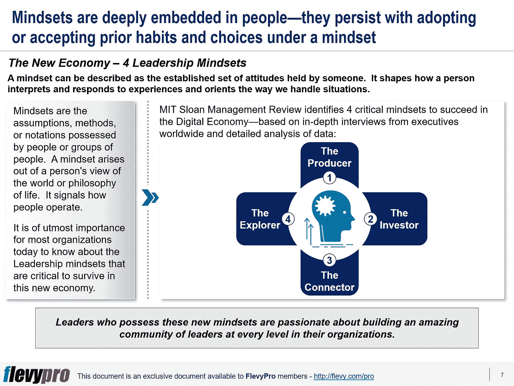

# 在新经济中取得成功的四种关键领导心态

> 原文：<https://medium.datadriveninvestor.com/4-leadership-mindsets-critical-to-succeed-in-the-new-economy-ad28c586a56d?source=collection_archive---------5----------------------->

技术、互联网、增长和全球化改变了我们工作、娱乐和生活的方式。他们甚至改变了经济学的基本定律。我们生活在一个与 20 世纪 80 年代以制造业为基础的旧经济截然不同的经济中。现在，越来越少的人受雇于制造业，他们对很快被机器取代的前景感到焦虑。

“新经济”是经济学家在 20 世纪 90 年代开始使用的一个术语，用来描述自那以来一直是经济增长驱动力的新的、高科技、高增长的行业。新经济也被称为数字经济、知识经济、数据经济或电子商务经济。包括谷歌、脸书和苹果在内的顶级科技企业利用新经济的优势超越了全球传统企业。

[领导力发展](https://flevy.com/browse/stream/leadership)在这个数字经济时代，对大多数组织来说都是一项重大挑战。今天，越来越多的组织正在重新审视他们是什么以及领导力对他们的意义。这不再是关于一个人，甚至是那些居住在顶端的人。

[麻省理工学院斯隆管理评论](https://sloanreview.mit.edu/)对来自全球 120 个地区的 4000 名高管进行了一项研究，以了解在这个不断变化的世界中，什么是伟大的领导者。该研究显示了惊人的结果，大多数高管认为，他们的领导人缺乏必要的思维模式，无法做出在数字经济中发挥领导作用所必需的战略变革。企业层面的变革是大多数领导者害怕着手进行的。

心态是某人所持有的一套既定的态度，它决定了一个人如何解释和应对经历。心态产生于一个人对世界或人生哲学的看法。为了了解[数字经济领导心态](https://flevy.com/browse/flevypro/new-economy-leadership-mindsets-4043)(即在新经济中生存至关重要的领导心态)，麻省理工学院斯隆管理评论的全球研究根据对全球高管的深入采访和对数据的详细分析，确定了 4 种关键心态:

1.  **制作人**
2.  **投资方**
3.  **连接器**
4.  **探索者**

让我们来定义这前两种领导心态。

# 制片人

具有生产者心态的领导者会仔细评估他们的每个客户接触点。这些领导者表现出创造客户价值的热情。生产商专注于分析、数字技术、实施、结果和客户满意度。他们专注于通过分析快速提升创造力。由此产生的创新有助于他们应对不断变化的客户偏好，并增强客户体验。生产者努力创造所有的顾客旅程愉快。

# 投资者

具有投资者心态的领导者让人们欣赏他们的工作所服务的更高目标。他们不断努力在团队中灌输动力和团队精神，以实现整体组织目标。具有投资者心态的领导者关心他们周围的社区。他们关心员工的福祉和不断进步，并致力于为客户提高价值。

培养这些类型的心态对于建立正确的组织文化至关重要，这样组织才能在数字经济中取得成功。

有兴趣了解更多在新经济中取胜所需的领导心态吗？你可以在[Flevy documents market place](https://flevy.com/browse)上这里下载[一个关于**在数字经济中取得成功的关键领导心态的可编辑幻灯片。**](https://flevy.com/browse/flevypro/new-economy-leadership-mindsets-4043)

## 你在这个框架中找到价值了吗？

您可以从 [FlevyPro 库](https://flevy.com/pro/library)下载关于这个和数百个类似业务框架的深入介绍。 [FlevyPro](https://flevy.com/pro) 受到 1000 名管理顾问和企业高管的信任和使用。有些人不得不说:

> “我的 FlevyPro 订阅为我提供了当今市场上最受欢迎的框架和平台。它们不仅增加了我现有的咨询和辅导产品和服务，还让我跟上了最新的趋势，为我的实践激发了新产品和服务，并以其他解决方案的一小部分时间和金钱教育了我。我强烈推荐 FlevyPro 给任何认真对待成功的顾问。”

–战略商业建筑师事务所创始人比尔·布兰森

> “作为一家利基战略咨询公司，Flevy 和 FlevyPro 框架和文件是一个持续的参考，有助于我们为客户构建我们的调查结果和建议，并提高他们的清晰度、力度和视觉效果。对我们来说，这是增加我们影响力和价值的宝贵资源。”

–Cynertia Consulting 的咨询区域经理 David Coloma

> “作为一个小企业主，FlevyPro 提供的资源材料已被证明是非常宝贵的。根据我们的项目事件和客户要求按需搜索材料的能力对我来说很棒，并证明对我的客户非常有益。重要的是，能够针对特定目的轻松编辑和定制材料有助于我们进行演示、知识共享和工具包开发，这是整个计划宣传材料的一部分。虽然 FlevyPro 包含任何咨询、项目或交付公司都必须拥有的资源材料，但它是小公司或独立顾问工具箱中必不可少的一部分。”

–变革战略(英国)董事总经理迈克尔·达夫

> “作为一名独立的成长顾问，FlevyPro 对我来说是一个很好的资源，可以访问大量的演示知识库来支持我与客户的合作。就投资回报而言，我从下载的第一个演示文稿中获得的价值是我订阅费用的好几倍！这些资料的质量让我能够打出超出自己体重的水平，这就像是用很小一部分开销就能获得四大咨询公司的资源一样。”

–Roderick Cameron，SGFE 有限公司的创始合伙人

> “我每个月都会浏览几次 FlevyPro，寻找与我面临的工作挑战相关的演示文稿(我是一名顾问)。当主题需要时，我会进一步探索，并从 Flevy 市场购买。在所有场合，我都阅读它们，分析它们。我采纳与我的工作最相关和最适用的想法；当然，所有这些都转化为我和我的客户的利益。"

量子 SFE 公司首席执行官奥马尔·埃尔南·蒙特斯·帕拉

在 [**领导力、辅导和个人成长**](https://app.ddichat.com/category/leadership-coaching-and-personal-growth) **:** 中安排一次对话

 [## 专家-领导力、教练和个人成长- DDIChat

### DDIChat 允许个人和企业直接与主题专家交流。它使咨询变得快速…

app.ddichat.com](https://app.ddichat.com/category/leadership-coaching-and-personal-growth) 

在这里申请成为 DDIChat 专家[。
与 DDI 合作:](https://app.ddichat.com/expertsignup)[https://datadriveninvestor.com/collaborate](https://datadriveninvestor.com/collaborate)
点击此处订阅 DDIntel [。](https://ddintel.datadriveninvestor.com/)