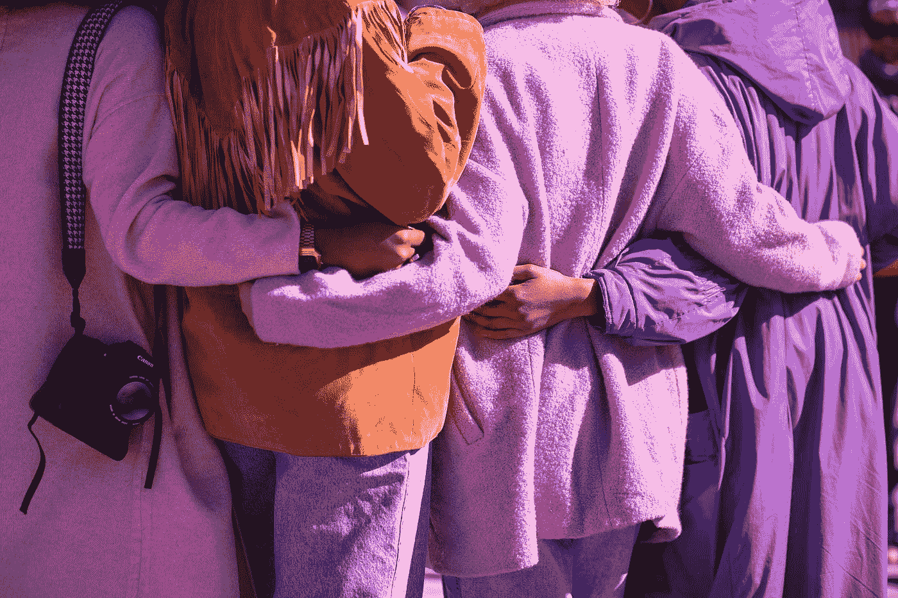

# 我从和其他 15 个人一起生活中学到的 4 个教训

> 原文：<https://medium.datadriveninvestor.com/4-lessons-i-learned-from-living-with-15-other-people-3791a478302e?source=collection_archive---------24----------------------->

## 大学一年级前的那个夏天，我知道我想要尽可能多的室友。

Photo by [Vonecia Carswell](https://unsplash.com/@voneciacarswell?utm_source=medium&utm_medium=referral) on [Unsplash](https://unsplash.com?utm_source=medium&utm_medium=referral)

高中最后一年，我知道过渡到大学会很艰难。对我来说，更具挑战性的是，我从一所非常小的学校毕业，并进入了美国最大的学校之一。

我的毕业班大约有 30 名学生。

我大学班有几千个。

猜猜我的高中同事中有多少人选择申请我的大学？

*零。*

我知道我需要交朋友和斋戒，以避免孤独的大一恐怖故事或陷入更令人窒息的内向倾向。

我需要处于一种必须不断与其他人交谈的环境中。

我选择了简单的出路(至少我是这么认为的):拥挤的宿舍。

幸运的是，这所大学为我提供了完美的选择:四个学生住一个房间，十六个学生住一个套间。

至少可以说，在 T2 生活是一种体验。我从中学到的经验是无价的。

我所选择的生活环境既有积极的一面，也有消极的一面，但在这里我不会详述消极的一面。

 [## 从新冠肺炎学到的 8 个教训，但它们不会持久|数据驱动的投资者

### 由于新冠肺炎，生活在 2020 年 3 月初几乎一夜之间发生了巨大的变化，越来越多的人认为…

www.datadriveninvestor.com](https://www.datadriveninvestor.com/2020/05/20/the-8-lessons-learned-from-covid-19-but-they-wont-last/) 

# 以下是我从和其他 15 个人一起生活中学到的四条经验。

## 1.安静和隐私是如此珍贵。

你知道那句谚语吗，直到失去才意识到一件东西有多好？这绝对适用于这里。

从小到大，我不必担心没有一个安静的地方工作或休息，没有隐私。

当我搬进我的宿舍，这绝对改变了。

每个人都有不同的时间表。有时感觉我们在不同的时区。人们穿好衣服去参加聚会，而其他人则在房间里安顿下来。当其他人醒来时，人们正在打盹。

奇怪的是，宿舍既像公共场所，又像私人场所。像穿衣服这样平凡的任务变成了挑战。

我很快意识到我有自己的房间和空间是多么幸运，这样我就可以隐退到 T4，享受完全的隐私。

每个人都需要独处的时间来整理、思考和放松。给自己一点时间。珍惜你拥有的独处时间。

## 2.体验不适可能是有益的。

对于内向的人来说，可以有把握地认为和多个其他人一起生活并不理想。作为一个内向的人，我大胆地选择了和这么多人一起生活。我牺牲了我的空间和个人舒适——这是我非常重视的两样东西——让自己处于一种有时感觉像是永无止境的社交互动的境地。

有些人甚至称之为内向者最糟糕的噩梦。

我很不舒服。但是我经历了一种很好的不适，那种促进成长的不适。

克服不适会带来很多积极的品质。其中我最喜欢的是弹性。

我必须学会在一个不一定适合我的环境中工作和操作。结果，我在那种环境下完成任务变得更有效率。当处于一个更加内向友好的环境中时，我会比以前更加茁壮成长。

这是一个优势。我变得更加灵活——富有弹性。

我发现，当我们变得停滞不前或安逸时，我们会忽略一些更不利的属性。对我来说，这种属性让我和其他人失去了联系。

有时候，我们在自己的处境中变得如此舒适，以至于一些错误的或有害的行为和信念看起来似乎很好。

走出舒适区对我们来说是有利的，这样我们可以成长、繁荣和扩展我们的思维和技能。

## 3.每个人都在挣扎。

这似乎是显而易见的，对不对？

我知道这一点，但这一现实并没有击中我，直到我看到或听到我生活在艰难的时刻或艰难的日子里。因为他们太多了，看到这种情况并不罕见。

在某种程度上，这对我来说是一种安慰。如果我有困难的时候，很可能其他人也有。

看到他们能够克服困难，给了我动力去克服困难。

它训练我相信度过艰难的一天是正常的，没关系的。每个人都有。

## 4.妥协是一种艺术形式，一种需要掌握的重要艺术形式。

我认为回避妥协是人类的天性。人们不喜欢在中间相遇。如果人们碰巧在中间相遇，双方都有可能产生敌意。

人们可以踩在你的脚趾上，甚至不知道他们踩在你的脚趾上。掌握妥协的一部分是建立你的不可协商性，并能够有效地沟通你的界限。这几乎适用于任何事情。

分享一个生活空间意味着我不能对人无礼。不管怎样，我们不应该对人无礼，但是我们都有无礼的时候。

我听说过室友之间可怕的交流的恐怖故事。我敢肯定，这只会带来同样糟糕的经历。

[能够不带敌意地适当妥协很重要。在一天结束的时候，我的室友是我“回家”的人。](https://www.lifehack.org/articles/communication/7-ways-learning-compromise-improves-all-your-relationships.html)

我们之间的紧张关系就像有毒家庭一样，只是我的室友不是我的家人。一开始，他们是陌生人，我只通过短信和他们说过话。在我看来，这只会增加风险。我需要愿意妥协，能够沟通。

当我们的环境对我们来说不自然，或者我们处于不舒服的情况下，关注我们可以从中获得什么并从中学习，而不是担心我们认为我们可能会失去什么，这是有益的。

有时候，最好的教训来自最不正常、最不寻常或看起来最不受欢迎的情况。

*免责声明:本文作者不属于也不认可本文中超链接或提及的任何公司或网站。*

## 获得专家视图— [订阅 DDI 英特尔](https://datadriveninvestor.com/ddi-intel)