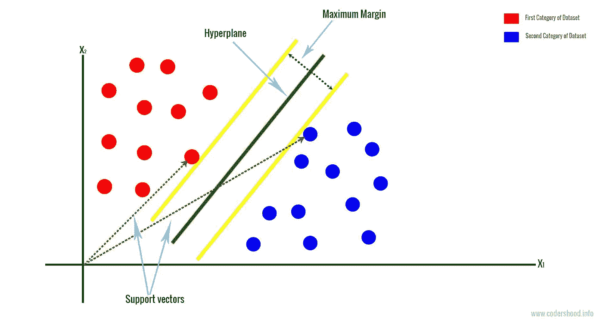
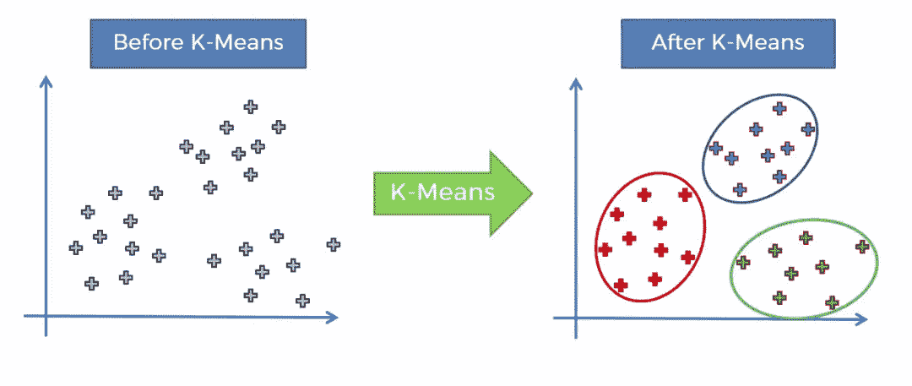

# 工具箱中必备的 4 ML 算法

> 原文：<https://medium.datadriveninvestor.com/4-ml-algorithms-you-must-have-in-your-toolbox-6d704fb927ce?source=collection_archive---------3----------------------->

Photo by [Fleur](https://unsplash.com/@yer_a_wizard?utm_source=medium&utm_medium=referral) on [Unsplash](https://unsplash.com?utm_source=medium&utm_medium=referral)

算法有许多应用。有了经验，你会发现屈指可数的算法就能解决你的大部分问题。这篇文章将是[的最后一篇](https://medium.com/@zouhaire.elakioui/a-carrier-changing-algorithms-to-make-you-a-better-data-analyst-a75ff49c5157)的后续，它增加了你工具箱中需要的另外 4 种有用的 CML(经典机器学习)算法。

以下 4 种算法是 CML 问题的*常用*算法。

# 支持向量机算法(SVM)

Support Vector Machine Algorithm (SVM)

SVM 在技术上是一个线性分类器，但有一种方法也允许它处理复杂的非线性数据。

对于其输入，SVM 仅对数字要素有效，但该算法的大多数实现都允许您将分类要素转换为数值。SVM 输出是一个类别预测。该算法试图通过最大化支持向量之间的间隔来创建类之间的最优超平面决策边界。

 [## 算法诱人的商业逻辑|数据驱动的投资者

### 某些机器行为总是让我感到惊讶。我对他们从自己的成就中学习的能力感到惊讶…

www.datadriveninvestor.com](https://www.datadriveninvestor.com/2019/03/22/the-seductive-business-logic-of-algorithms/) 

SVM 算法有几个优点:

*   在构建模型时，支持向量机需要设置的参数较少。
*   SVM 算法有很好的理论基础。
*   支持向量机在支持的数据类型上非常灵活。
*   与决策树相比，支持向量机需要更少的计算资源来获得精确的模型。
*   支持向量机对噪声数据不敏感。
*   对于二进制两类输出，SVM 是一个很好的算法。
*   通过使用核变换，可以用支持向量机完成非线性分类。
*   支持向量机可以很好地处理大量的特征和较少的训练数据。

# k-均值算法

K-Means Algorithm

聚类是探索性最大似然法的主要任务，在寻找聚类算法时，k-means 是通常的出发点。它适用于许多数据集。k-means 算法是迭代的。该算法试图将 N 个观察值划分成 K 个聚类。您必须从集群的数量开始。

k-means 算法的主要缺点是需要预先知道有多少个聚类。在所示的例子中，K=3。然后，该算法随机选择三个初始“平均值”,并通过将每个观察值分配到最近的平均值来创建初始聚类。每个聚类的质心成为新的平均值，并且重复该过程，直到实现收敛。

# DBSCAN 算法

DBSCAN Algorithm

DBSCAN 代表对有噪声的应用程序进行基于密度的空间聚类。

DBSCAN 算法采用了一种类似于人类直觉的方法来识别聚类和噪声。

为此，DBSCAN 需要两个重要参数:

MinPts:数据集中的维数。该值必须至少为 3。

e:ε是欧几里德距离。较小的值更好。如果 e 太小，很大一部分数据就不会聚类。如果 e 太大，集群将会合并。选择一个好的 e 值是 DBSCAN 成功的关键。

DBSCAN 是最常见的聚类算法之一，其优点包括

DBSCAN 不需要预先知道集群的数量。

DBSCAN 可以找到任何形状的簇。

DBSCAN 可以发现异常值。

DBSCAN 可以识别噪声。

DBSCAN 只需要两个参数。

数据集的排序无关紧要。

DBSCAN 的主要缺点包括

*   DBSCAN 的质量取决于 e 值。对于高维数据，可能很难找到一个好的 e 值，这就是所谓的维数灾难。如果数据和规模不太了解，很难选择 e。
*   DBSCAN 不能很好地聚类密度差异较大的数据集。

请注意，光学算法是 DBSCAN 的分层版本。HDBSCAN 算法是光学算法的更快版本

# 期望最大化算法

Expectation-Maximization (EM) Algorithm

当 k-means 不能达到理想的结果时，考虑 EM 算法。EM 通常能为真实世界的数据集提供出色的结果，尤其是当您感兴趣的区域很小时。

EM 是一种迭代算法，在模型依赖于未观察到的潜在变量时效果很好。该算法在两个步骤之间迭代:期望(E)和最大化(M)。在期望步骤(E)中，为可能性的期望创建一个函数。在最大化步骤(M)中，创建参数以最大化 E 步骤中的预期可能性。

结论:

无论是分类还是聚类，算法预测准确性都是衡量所选算法性能的关键。

你所要求的准确度是相对于你要解决的问题而言的。如果您正在构建一个 ML 模型来确定打高尔夫球的最佳日期，90%的置信度是可以接受的。如果你试图确定一张皮肤斑点的照片是否是癌性的，或者一块土地是否埋有地雷，90%是不可接受的。

起源于:[blog.selcote.com](http://blog.selcote.com/2020/02/07/4-ml-algorithms-you-must-have-in-your-toolbox/)