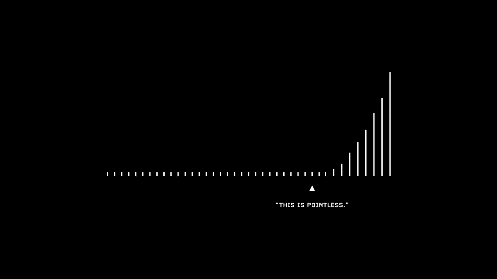

# 造就股票市场的四种最强大的情绪

> 原文：<https://medium.datadriveninvestor.com/4-most-powerful-emotions-that-drive-the-stock-market-and-how-to-overcome-them-6bcf30ded602?source=collection_archive---------14----------------------->

## 所有交易者都必须经历的旅程。

Photo by [Jordan Bauer](https://unsplash.com/@jordanbauer?utm_source=medium&utm_medium=referral) on [Unsplash](https://unsplash.com?utm_source=medium&utm_medium=referral)

无论你是新手还是有经验的市场参与者，都会有一些情绪。只要你是一个活生生的人，他们就会一直在那里扰乱你的头脑。

它们让我们成为人类，但也可能成为阻碍我们成为最佳投资者的障碍。正因为如此，一些投资者已经转向使用技术(算法)来对抗他们的人类直觉。但即使这样，他们仍然需要一个人在屏幕后面设计算法。

经验丰富的专业市场参与者非常清楚这些情绪会让一个人在市场中产生怎样的感受。然而，新投资者往往是被利用的人。不是因为他们情商低，而是因为他们没有意识到人类心理可以说是整个金融市场的燃料。

通常，认识到这些情绪本身会帮助你在动荡时期控制它们。

我们走吧。

# 1.害怕

谁喜欢失去自己辛苦赚来的钱？
谁喜欢[错了](https://medium.com/datadriveninvestor/the-most-important-lesson-nobody-talks-about-in-the-stock-markets-46a4d0df06e9)？
谁喜欢看到自己的投资组合被染红，不知道流血何时会停止？

你并不孤单。我们全心全意投入市场，因为我们相信它能给我们带来比以前更多的回报。当然，我们不希望我们花在学习和研究上的所有时间付诸东流。

但是，只有一件事。如果我们想要我们能得到的最好的条目，它总是最可怕的购买时间。当普通的乔和简卖掉他们所有的股票，一切都是血红的。当世界似乎要结束了，市场感觉没有复苏。这时你应该开始寻找进入市场的机会。

以 2020 年 3 月发生的新冠肺炎恐慌为例。这种恐慌迫使很多人离场，因为他们看到了亏损。他们认为市场将永远下跌，不想遭受更大的损失。

## 取而代之的是:

很难；我知道。但是你首先要知道你的最终目标是什么。如果你进入市场的目的是为你的退休建立一个足够大的投资组合，那么这里或那里的一点波动应该不会真正影响你的头寸。

这样想:如果你已经持有该资产的一些股票，现在是买入更多股票的机会，因为价格比以前便宜得多。可能发生的最糟糕的事情是什么？

但是对之前的建议要有所保留。优秀稳健的公司总是有机会回来，因为投资银行和对冲基金拥有巨额资金。所以如果公司消失了，你们不会是第一个有麻烦的人。

相反，如果你继续在一家糟糕的公司上双倍下注，我所希望的是你至少能保本。公司仍有可能破产，最终你会失去全部投资。

> 当别人贪婪的时候要恐惧。当别人恐惧时，你要贪婪。”—沃伦·巴菲特

# 2.FOMO(害怕错过)

你看到你的朋友杰克一小时前在那笔交易中赚了 500 美元。然后你打开你的 Instagram，看到你的另一个好友 Sam 在短短几分钟内赚了 1000 美元。于是你低声对自己说:“啊，该死。我知道那东西会涨价，我应该买的。该死的！好吧，我不会错过下一个机会的！”

接下来你知道的是你进入了一只劣质股票。它不仅没有峰值，而且还显示了一个又一个巨大的红色柱。现在你的账户上只剩下亏损了。

好吧，残酷的事实是，市场希望你有这种感觉，这样你就会给她一些你的钱。当你只顾自己的生意时，市场会让你觉得你错过了一些大事情。

事实上，进行质量较低但质量较高的交易实际上比进行不合格的交易要好。这些小损失不仅会一点一点地侵蚀你的账户，还会严重扰乱你的精神。

从长远来看不值得。

然后你会从一个策略跳到另一个策略，因为你认为那里有钱可赚。但最终发生的是，你会剥夺自己完全理解自己的战略并成为该领域最佳的机会。

## 取而代之的是:

同样，这将是一件困难的事情。你需要忽略外面的世界。Twitter 和 Instagram 是 [FOMO](https://www.logikfx.com/post/fomo-fear-of-missing-out) 机器。不管他们是你的朋友还是网上随便找的陌生人，赚钱发帖根本不关你的事。你需要关注的只是你自己和你的策略。

你第一次没有买入那只股票是有原因的。那是因为你非常清楚这不符合你的策略。换句话说，这只股票对你来说不够好。

坚持专注于一个策略。专注于优化和学习它的每一个方面。别人做什么都不重要，都只是世界上的噪音。如果需要的话，把它们都剪掉，以保护你自己。

Photo by [Andre Sebastian](https://unsplash.com/@andreonbrand?utm_source=medium&utm_medium=referral) on [Unsplash](https://unsplash.com?utm_source=medium&utm_medium=referral)

# 3.贪婪

我们到底想赚多少？
我们到底需要多少？我们会满足吗？

答案是否定的。总有我们想要达到的下一个层次。总会有更多的东西被创造出来。总有一些事情我们可以做得更好。

当你开始考虑如何让自己的规模翻倍或持有更长时间以获得丰厚的回报时，你就进入了一个危险的思维领域。当你开始思考你本可以赚多少钱时，你就应该放慢脚步。

记住:市场上没有一种策略是绝对安全的。

根据市场情况，这一策略会有起伏。根据市场的反应调整你的仓位大小是一种技巧；根据你想赚多少来调整你的仓位是贪婪。

如果你把仓位增加一倍，下一次如果没有成功，你将会有两倍的损失。然后你需要更长的时间来恢复。更糟糕的是，你可能会陷入报复性交易，损失更大的账户。

## 取而代之的是:

首先，接受这样一个事实:你永远不会在你最好的位置上投入足够的资金。你总是“可以”投入更多。好消息是这些都不是你的错。你只是按照你的策略告诉你的去做。

没有人真正知道市场下一步会做什么。我们只能用历史数据来尝试和预测。这是我们能力的极限。

明白每一个策略都会有赢有输。你的工作是确保你的交易以以下四种方式结束:

*   小赢
*   大获全胜
*   盈亏平衡
*   小损失

当你对它感到舒适时，就逐渐加大尺寸。不是当你想要更多的时候。大赢很有趣，但是大输会让你出局。永远不要让这种情况发生，钱最终会找到你。

# 4.不耐烦

对许多人来说，等待 10 年直到他们看到一点点复利实在是太长了。事实是，最初几年真的没那么重要，因为那是你为以后收获复利打下基础的时候。

如果你已经 50 多岁或 60 多岁，正在寻找一种退休后维持生活的方式，这是可以理解的。但如果你 20 多岁或 30 多岁，你有足够的时间继续投资，年复一年地创造收入。

每个月投资 1500 美元到一个至少给你带来 4% T2 利率的资产上，40 年后你的账户上会有超过 170 万美元。这个 170 万美元的账户每年产生 4%的收益，相当于每年 68，000 美元。这对世界上大多数人来说已经足够了。

> 税收可能会有所不同。

急躁会剥夺你惊人的长期利益。延迟满足的力量比你想象的要大。问问你自己:你是现在想要一个棉花糖还是等会儿再要两个？

## 取而代之的是:

你现在知道，头几年赚的钱毫无意义，所以为什么不在这段时间里尽可能多地学习呢？

试图获得系统或找到捷径在市场上是行不通的。母市最终会回来缠着你。这是另外一个话题，但是相信我，加快你学习曲线的唯一方法就是更加努力。

不要犯为了短期利益而牺牲长期利益的错误。长期的好处即将到来，你很可能会不知所措。但在那之前，你必须继续努力，保持连胜。

所以不要低估你今年投资市场赚的 100 美元。再投资。种下你的种子，让它成长。记得每天给它浇水就行了。

Image by [Visualize Value](https://twitter.com/visualizevalue/status/1337489940377169922)

# 最后的想法

我想现在已经很清楚了，我们都容易有这些情绪。专业人士和新手的区别在于，专业人士对这些情绪以及情绪如何影响他们有更好的理解。尽管事实上这些情绪可能是阻碍我们实现目标的原因，但也有因为它们而创造的机会。站在正确的一边。

当我们与这些怪物面对面时，我们不仅了解了市场，也了解了我们自己。我们开始认识到自己的优势、劣势，以及我们对不同情况的反应。这本身就是很少有人能学到的一课。因此，寻求了解你自己。你的环境和职位并不能决定你是谁。做司机。

*嘿，既然你来了，为什么不加入我的* [***邮件列表***](https://marcuschan.ck.page/76504d9d12)**来看看你收件箱里偶尔出现的酷故事或者考虑一下* [***成为会员***](http://xn--74h/) *来阅读我所有的故事！☺**

* [## 这么说一家大型风投基金正在投资你的初创公司？4 实际考虑|数据驱动的投资者

### 首先，恭喜你。融资总是需要努力的，一个大的风险投资基金当然是一个大的…

www.datadriveninvestor.com](https://www.datadriveninvestor.com/2020/08/09/so-a-big-vc-fund-is-investing-in-your-startup-4-practical-considerations/) 

访问专家视图— [**订阅 DDI 英特尔**](https://datadriveninvestor.com/ddi-intel)*