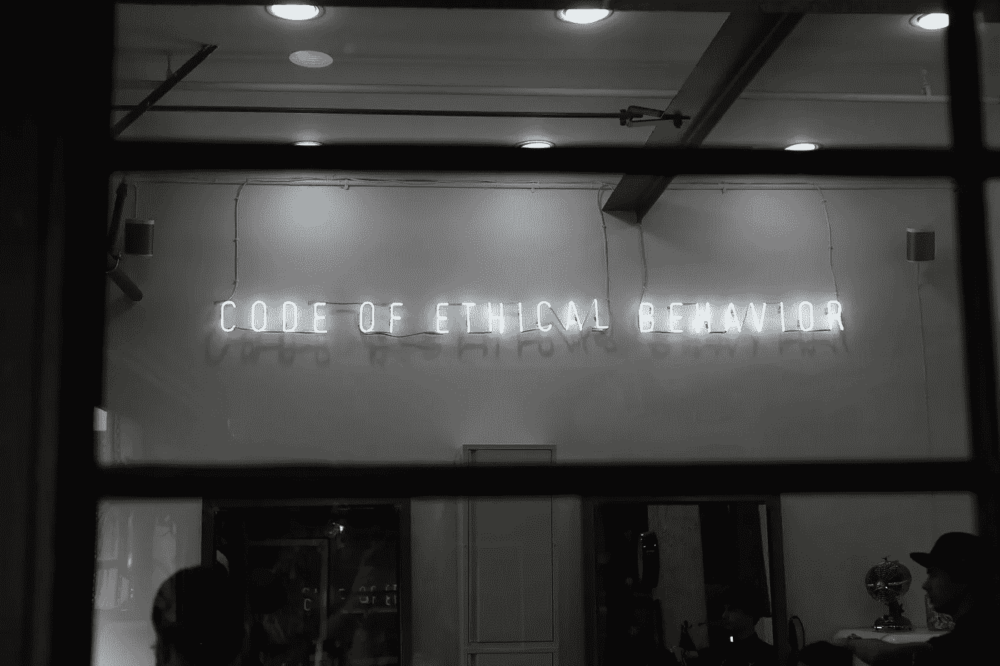
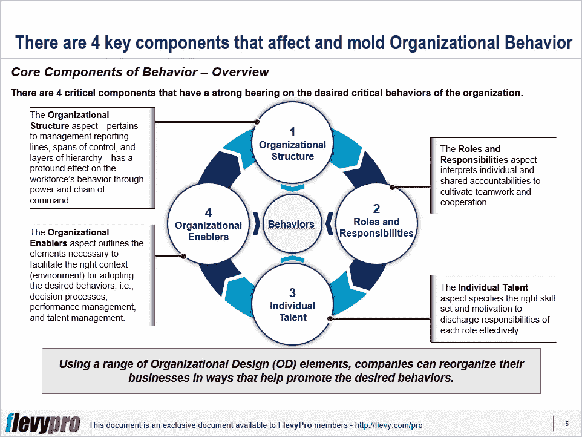

# 4 组织设计(OD)要素对在整个组织中灌输期望的行为至关重要

> 原文：<https://medium.datadriveninvestor.com/4-organizational-design-od-elements-essential-to-inculcate-the-desired-behaviors-across-the-5092e73d504f?source=collection_archive---------3----------------------->

在[业务转型](https://flevy.com/browse/stream/transformation)、成功的[战略执行](https://flevy.com/browse/stream/strategy-development)和[绩效改进](https://flevy.com/browse/stream/performance-management)中，灌输富有成效的员工行为至关重要。然而，让人们接受富有成效的行为需要整个组织的共同努力。

通过深入理解[组织行为](https://flevy.com/browse/flevypro/organizational-behavior-4132)的 4 个组成部分，转型、战略和绩效改进目标的实现可以成为现实。这些组成部分是塑造员工理想行为的强大杠杆:

1.  **组织结构**
2.  **角色和职责**
3.  **个人天赋**
4.  **组织推动因素**

这些组织设计杠杆在结合和协调时有效地工作。现在让我们详细讨论前两个杠杆。

# 组织结构

组织结构代表创建组织的控制范围、层级和资源数量的管理报告关系。组织结构是[组织设计](https://flevy.com/browse/stream/organizational-design)的基本驱动力，它对促进对提高企业整体绩效至关重要的行为也有很大的积极影响。这是由于职位基于对个人重要的因素(如工作、薪酬和职业发展)而对下属施加的权力。

组织结构表明企业的优先事项。一个组织通常是根据其最高优先级来构建的。例如，功能性组织结构被优先考虑功能卓越的企业所采用。在当今竞争激烈的市场中，大多数组织必须在给定的时间内处理几个优先级，这可能是相互冲突的。然而，这并不意味着在现有结构的基础上增加新的结构，从而增加不必要的复杂性。创建过于复杂的结构来管理多个优先级会导致繁文缛节和决策延迟。所有角色都是相互依存的，需要合作。这意味着照顾他人的需求——而不仅仅是关注个人的优先事项——并鼓励提高团队效率以实现集体目标的个人行为。

# 角色和责任

角色和职责处理分配给每个职位和个人的任务。组织设计在很大程度上依赖于重新定义更清晰、更有说服力的角色和职责，以避免重复工作或在团队成员中制造对手。在协作文化中，合作是一个组织的支柱，个人不仅应该意识到对他们的要求，还应该意识到他们的团队成员的责任、他们的角色行使的权力、所需的技能以及衡量成功的标准。

一种有效地概述角色和职责，同时最小化复杂性，鼓励合作和授权的系统方法是通过“角色宪章”技术。该技术要求根据 6 个关键因素明确识别所有角色:

*   描述共同和个人的责任
*   概述跟踪成功的指标
*   指定谁有权决定什么
*   指明对角色至关重要的能力
*   分配对角色有价值的领导特质
*   绘制完成个人和团队目标所需的能力。

有兴趣了解组织行为的这些[组成部分吗？你可以在](https://flevy.com/browse/flevypro/organizational-behavior-4132) [Flevy 文档市场](https://flevy.com/browse)的这里[下载一个关于**组织行为**的可编辑幻灯片。](https://flevy.com/browse/flevypro/organizational-behavior-4132)

## 你在这个框架中找到价值了吗？

您可以从 [FlevyPro 库](https://flevy.com/pro/library)下载关于这个和数百个类似业务框架的深入介绍。 [FlevyPro](https://flevy.com/pro) 得到了数千名管理顾问和企业高管的信任和使用。有些人不得不说:

> “我的 FlevyPro 订阅为我提供了当今市场上最受欢迎的框架和平台。它们不仅增加了我现有的咨询和辅导产品和服务，还让我跟上了最新的趋势，为我的实践激发了新产品和服务，并以其他解决方案的一小部分时间和金钱教育了我。我强烈推荐 FlevyPro 给任何认真对待成功的顾问。”

–比尔·布兰森，战略商业建筑师事务所创始人

> “作为一家利基战略咨询公司，Flevy 和 FlevyPro 框架和文件是一个持续的参考，有助于我们为客户构建我们的调查结果和建议，并提高他们的清晰度、力度和视觉效果。对我们来说，这是增加我们影响力和价值的宝贵资源。”

–Cynertia Consulting 的咨询区域经理 David Coloma

> “作为一个小企业主，FlevyPro 提供的资源材料已被证明是非常宝贵的。根据我们的项目事件和客户要求按需搜索材料的能力对我来说很棒，并证明对我的客户非常有益。重要的是，能够针对特定目的轻松编辑和定制材料有助于我们进行演示、知识共享和工具包开发，这是整个计划宣传材料的一部分。虽然 FlevyPro 包含任何咨询、项目或交付公司都必须拥有的资源材料，但它是小公司或独立顾问工具箱中必不可少的一部分。”

–变革战略(英国)董事总经理迈克尔·达夫

> “作为一名独立的成长顾问，FlevyPro 对我来说是一个很好的资源，可以访问大量的演示知识库来支持我与客户的合作。就投资回报而言，我从下载的第一个演示文稿中获得的价值是我订阅费用的好几倍！这些资料的质量让我能够打出超出自己体重的水平，这就像是用很小一部分开销就能获得四大咨询公司的资源一样。”

–Roderick Cameron，SGFE 有限公司的创始合伙人

> “我每个月都会浏览几次 FlevyPro，寻找与我面临的工作挑战相关的演示文稿(我是一名顾问)。当主题需要时，我会进一步探索，并从 Flevy 市场购买。在所有场合，我都阅读它们，分析它们。我采纳与我的工作最相关和最适用的想法；当然，所有这些都转化为我和我的客户的利益。"

量子 SFE 公司首席执行官奥马尔·埃尔南·蒙特斯·帕拉

在 [**管理和企业咨询**](https://app.ddichat.com/category/management-and-corporate-consulting) **:** 中安排一个 DDIChat 会话

 [## 专家-管理和企业咨询- DDIChat

### DDIChat 允许个人和企业直接与主题专家交流。它使咨询变得快速…

app.ddichat.com](https://app.ddichat.com/category/management-and-corporate-consulting) 

在这里申请成为 DDIChat 专家[。
与 DDI 合作:](https://app.ddichat.com/expertsignup)[https://datadriveninvestor.com/collaborate](https://datadriveninvestor.com/collaborate)
点击此处订阅 DDIntel [。](https://ddintel.datadriveninvestor.com/)