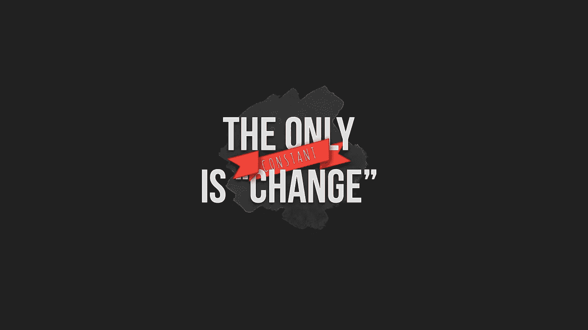

# 当你选择的股票不符合你的意愿时，问自己 4 个问题

> 原文：<https://medium.datadriveninvestor.com/4-questions-to-ask-yourself-when-your-stock-pick-doesnt-go-your-way-c4469f531f05?source=collection_archive---------25----------------------->

十亿美元的对冲基金经理告诉我他们是如何思考的

如果你像我一样，对一只不太像我预期的那样波动的股票非常着迷，其反向观点似乎永远不会获利，那你就有得吃了。

我最近采访了几位商学院校友，他们已经在对冲基金行业工作了几十年，现在管理着价值数十亿美元的投资组合。我问了他们每个人同样的问题:当你的最高信念让你失望时，你会怎么做？

事实证明，即使是拥有良好业绩记录的专业投资者也发现自己一直处于这种情况。我把他们的建议整合成一个包含四个问题的思考过程，所以你可以像专家一样处理它。

# 1.你的目标价真的是目标价吗？

你的目标价必须由广泛研究支持的严格模型产生，但模型很容易被操纵——任何有能力的分析师都可以从同一个模型中给你任何他们想要的目标价。难的是对自己保持真实。

如果你太喜欢一只股票了，以至于只能看到你想看到的，对不起。正如人人都引用的巴菲特曾经说过的一句名言，你可以对一只股票有感情，但它不会对你有任何感情。

# 2.什么是市场知道而你不知道的？

如果你选择的是所有可比公司中唯一表现不佳的一家，你还有信心知道你需要知道的一切吗？你认为你认为你认为的是什么？

不要担心市场看起来有多荒谬，让我们试着冷静地分析当前市场价格中反映了哪些假设，主观地审视你的分析和判断，并逆向工程市场的内部运作。

# 3.这段时间内在价值有变化吗？

一夜之间会发生很多事。你持有这只股票多久了？你 100%确定你的假设仍然反映当前的现实吗？

公司变化。夫妻店可能会开始特许经营。楼下的咖啡店很可能突然变成一家区块链公司(真实故事)。**当你第一次建仓时，股票仍然由同样的利润&增长驱动力**驱动吗？

行业变化。**这个行业还被主流投资者授予同样的估值倍数吗？**我们是否有一个新进入者抢走了所有人的蛋糕？沿着价值链有任何动态变化吗？

宏观经济变化。最新的 GDP 数据如何？**监管方面有什么变化吗？**哪些人口统计因素会发挥作用？

每个经历过 2020 年的人都明白世界变化的速度有多快。但并不是所有人都按照他们的理解行事。

# 4.在什么情况下你愿意减少损失

如果这只股票似乎从未如你所愿，那么它很可能超出了你的能力范围。

在你为自己辩护之前，让我们完全坦诚——我们都有自己的能力范围。随着时间的推移，它随着努力工作而扩大，随着傲慢和懒惰而缩小。

你很可能遇到了一只你不应该理解的股票。完全没问题。投资者明智地选择战斗。

现在你需要自己决定，**什么时候，以什么价格退出**。放手吧，无论发生什么，答应自己以后再也不沉迷于无用的回忆。