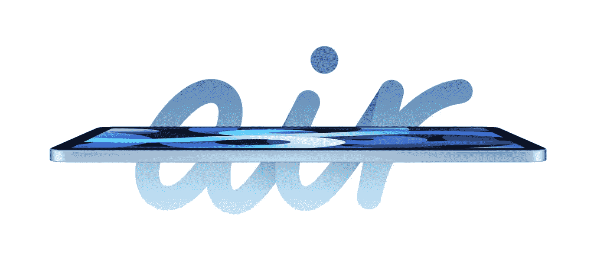
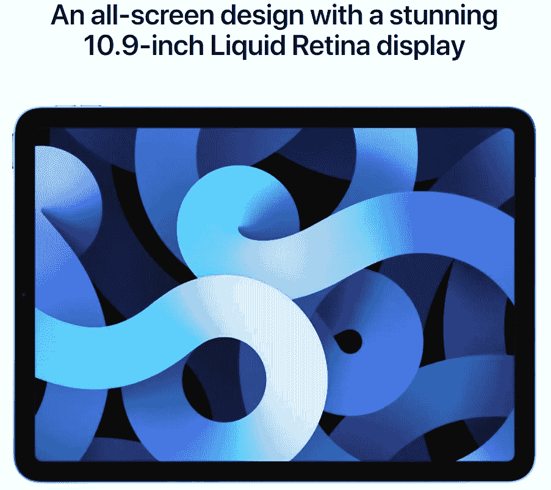
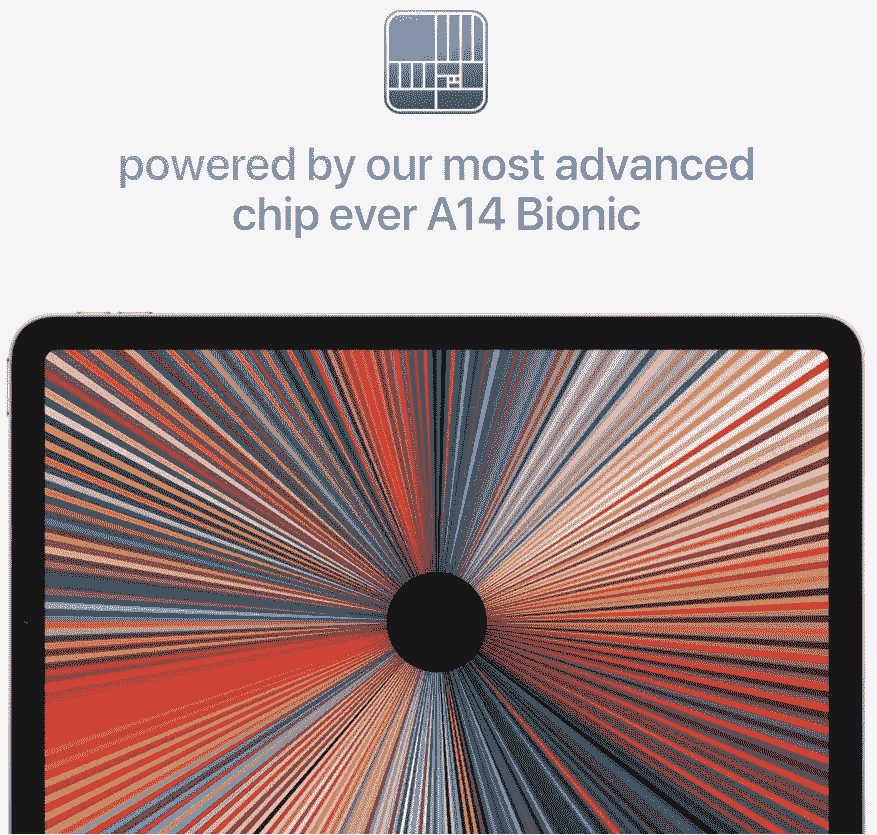
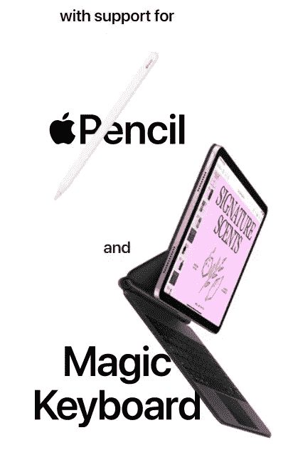

# 我会购买第四代 iPad Air 而不是第二代 11 英寸 iPad Pro 的 4 个理由

> 原文：<https://medium.datadriveninvestor.com/4-reasons-ill-be-buying-the-4th-gen-ipad-air-over-the-2nd-gen-11-inch-ipad-pro-e8a2d63de4af?source=collection_archive---------0----------------------->

image by [Apple](https://www.apple.com/my/ipad-air/)

## #3.它支持 iPad Pro 使用的所有配件

当苹果在 2020 年 9 月 15 日举办年度特别活动时，大多数人都在期待新 iPhone 系列的发布。相反，我们得到的是新的 Apple Watch Series 6、Watch SE、iPad 8 代和 iPad Air 4 代。

令人失望的是，许多人都期待 iPhone 12 阵容的宣布，以及可能的新 AirPods 3 和 AirPods Pro 第二代。

但我认为我们可能会在 10 月份看到。

至于我，我对新发布的 iPads 感到非常兴奋。鉴于我的 iPhone XR 仍然运行良好，我今年没有计划升级到 iPhone 12(可能只有 13 或 14，取决于我的 XR 如何老化)，我实际上计划给自己买一个新的 iPad。

一开始主要选择拿 iPad Pro 11 寸，因为全屏显示。个人感觉 iPad 上的 home 键设计相当过时。出于某种原因，我不知道为什么苹果不能像一些安卓手机一样在屏幕上做触控 ID。我不是那种每年都要更换设备的人，因此我想买一台能持续使用一段时间的设备，无论是性能还是外观。除了专业阵容，所有其他人都很过时。

T 嗯，新款 iPad Air 第四代发布了，这真的引起了我的兴趣。看起来像 iPad Pro，性能像 iPad Pro，但价格方面，不会像 iPad Pro 那样在我的口袋里烧一个洞。新款 Air 有太多令人喜欢的地方，以下是我选择新款 iPad Air 第四代而不是 iPad Pro 11 英寸第二代的 4 个原因。

# 1.全屏显示

新款 iPad Air 拥有 10.9 英寸的液态视网膜显示屏，仅比 11 英寸的 Pro 屏幕小 0.1 英寸。

image by [Apple](https://www.apple.com/my/ipad-air/)

是的，Pro 也有全屏设计，11 英寸略大，但老实说，这种差异非常小，你永远不会注意到它。凭借 264 ppi 的 2360x1640 分辨率(与 Pro 的 264 ppi 的 2388x1668 分辨率相比略低)，您的图像和文本将在这款新的 Liquid Retina 显示屏上显示清晰。

与上一代 Air 相比，这是一个巨大的升级，取消了 home 键，现在它与所有较新的产品保持一致，如 Pro 系列和更昂贵的 iPhones。

苹果现在需要做的就是让基本版 iPad 和 iPad Mini 也朝着同一个方向发展，并获得全屏设计。希望这将在明年发生，我终于可以升级我的 Mini 4 了。

 [## 新的健康技术如何让我们活过 100 岁？数据驱动的投资者

### 不久前，我们都在看一台黑色电视，不得不带着天线跑遍整个公寓，以确保…

www.datadriveninvestor.com](https://www.datadriveninvestor.com/2020/08/12/how-new-health-technology-makes-us-live-past-100-years/) 

# 2.它装有最新最棒的苹果芯片

说实话，我没想到苹果会做出这种举动。根据他们以前的举动，他们只在旗舰产品上使用了最新的芯片，所以充其量，我期待苹果 A13 芯片。

image by [Apple](https://www.apple.com/my/ipad-air/)

然而，他们宣布新的 Air 将由他们最新的芯片 A14 Bionic 驱动，我们可能也会在新的 iPhone 系列中看到。

上一代 Air 拥有 A12 Bionic，这在当时是对仅使用 A8X 芯片的第二代 Air 的巨大进步。

我认为苹果现在希望它的客户能够在感觉到需要进一步升级之前，能够享受他们的产品多一点时间。我的意思是，这款 A14 芯片将很容易让新款 Air 在未来几年内处理至少 3-4 代 iPad OS。

我知道，一旦我得到了这款新的 Air，我可能在 4-5 年内都不会升级或更换它。我之前的 iPad 用了差不多 6 年，那是老技术了。

因为我不会用我的 iPad 做任何繁重的设计工作，或者用苹果的话来说，Pro 的工作，我不认为现在有必要让 Pro 出现在空中。有了新的 A14 芯片，它将非常接近专业版的性能。那对我来说足够好了。

# 3.它支持 iPad Pro 使用的所有配件

这对我来说又是一个失败的例子。最新最棒的配件总是留给专业机型，比如 Apple Pencil 第二代，最新的带触控板的魔法键盘等等。

image by [Apple](https://www.apple.com/my/ipad-air/)

空气不再需要满足于“第二好”,它现在可以与最好的空气相抗衡。

随着神奇键盘和第二代 Apple Pencil 现在也受到 Air 的支持，它真的可以让你随时随地做最好的工作。

草草记下笔记或打下来，你可以使用苹果为你的 iPad 提供的最好的配件来完成。

老实说，除非你得到的新空气有专业型号没有的额外颜色(绿色和天蓝色)，否则人们将无法区分这两者。将您的新 air 与最新的配件搭配起来，您将看起来像是拥有了专业型号。

同样，苹果也需要将其兼容配件的范围扩大到其他硬件。如果他们这样做了，我打赌会有更多的人转向苹果生态系统。

# 4.我会把专业工作留给笔记本电脑

iPad Pro(现在，甚至是 Air)的卖点一直是，你的下一台笔记本电脑不是笔记本电脑。基本上，苹果公司说，有了 iPad Pro，你可以在 iPad 上做你通常在笔记本电脑上做的一切事情。

你基本上是在平板电脑上获得笔记本电脑的标准。尤其是如果你把你的 iPad 和 Apple Pencil 和 Magic Keyboard 配对，你可以两全其美。

然而，尽管如此，还是有一些事情你会更喜欢使用笔记本电脑，对于我个人来说，这些事情都是苹果试图为其 iPad Pro 销售的专业内容，如编辑、设计等。

我仍然喜欢在我的笔记本电脑上做任何设计或编辑工作。见鬼，即使是写这样的文章，我还是更喜欢在笔记本电脑上写，而不是在平板电脑上。我想这也是为什么我为我的 iPad Mini 买的罗技键盘盒一直积着灰尘而不是被使用的另一个原因。在笔记本电脑上做某些事情是无法在其他地方复制的——至少目前是这样。

我不需要 iPad Pro 来做我的“专业”工作，我会把它留给我的笔记本电脑。但新款 iPad Air 现在将非常接近 Pro——直到下一代 Pro 问世。

自从 2009 年我拿到第一部 iPhone 以来，我已经是苹果的用户十多年了。从那以后，我一直是它的生态系统的忠实粉丝，并接触过它的大多数其他产品，如 iPods、iPads、Watch、MacBooks、Mac Mini 和 Apple TV。我唯一还没有的是一台 iMac，可能很快就会有了。

叫我苹果迷吧，但我真的很喜欢它的产品，尽管它有点贵。

但随着 iPad Air 第四代的发布，我对苹果的热爱有所加强，它的所有令人惊叹的功能，对我来说都是 iPad 的首选，甚至高于 iPad Pro。

## 获得专家视图— [订阅 DDI 英特尔](https://datadriveninvestor.com/ddi-intel)