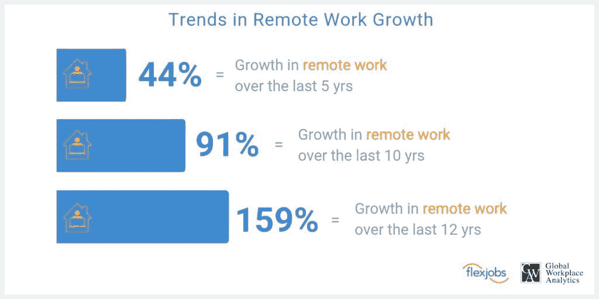

# 4 个有效的远程团队员工敬业度技巧

> 原文：<https://medium.datadriveninvestor.com/4-remote-team-employee-engagement-hacks-that-work-637571455f2d?source=collection_archive---------40----------------------->

根据小说《科罗娜·疫情》,甚至内部团队也在家办公。这是因为它不仅威胁到经济，也威胁到个人的健康。由于这种情况，雇主不得不做出一些艰难的决定。有必要帮助员工提高生产力和参与度。

来源- [**弹性工作**](https://www.flexjobs.com/)

**我们所说的员工敬业度是指什么？**

通常，员工认为远程员工参与仅限于员工对正式虚拟会议、电话和电子邮件的响应。但是，它并没有涵盖员工敬业度的全部概念。员工敬业度可以定义为雇主和员工之间的双向情感关系&承诺。此外，雇员和雇主的关系可能有所不同，取决于不同的商业环境。现在你可能会问为什么它是至关重要的？如果你的工作更多地依赖于团队合作，而不是保持和提高员工的参与度。此外，如果你是一家初创企业的所有者，提高员工敬业度比以往任何时候都更加重要。因为 idea 的成功取决于你的团队的团结。

 [## 员工敬业度:你信任谁？数据驱动的投资者

### 收集员工数据是一件值得信任的事情。当机密信息被证明不是…

www.datadriveninvestor.com](https://www.datadriveninvestor.com/2020/03/10/human-resources-needs-employee-trust-when-collecting-their-data/) 

**为什么** [**远程团队**](https://graffersid.com/5-best-tools-manage-remote-team-amid-corona-times/) **订婚被认为是举足轻重的？**

员工参与应该是每个组织的议程。但是当涉及到远程团队时，它变得比以往任何时候都更加重要。这是因为以下几点

1.  **他们感觉就像是你团队的一部分-** 作为一名远程团队开发人员，有利有弊。最大的缺点之一是他们觉得自己不是团队的一部分。当你专注于员工参与活动时，他们与团队其他成员的联系更加紧密。在这种情况下，它提高了他们的整体生产力。
2.  **他们工作得更多:**通常一个远程团队开发人员如果没有动力，可能不会付出 100%的努力。当你更加关注员工参与度时，就会提高盈利能力，减少旷工。远程开发人员是组织的资产。所以建议明智使用。另一方面，与情感相关的员工相比，情感疏远的员工可能会寻求其他机会。
    **亚里斯多德曾经说过，**我们是我们反复做的事情。优秀不是一种行为，而是一种习惯。

敬业的远程员工致力于其工作场所，积极主动地做得更好，充满热情。这样的员工可以接受任何工作挑战或新的改革。

**那么，让我们来了解和认识帮助雇主提高整体** [**远程员工参与度**](https://graffersid.com/5bestprojectmanagementtoolsremoteteamamidcorona/) **-** 的五种主要技巧

在这个疫情，最大的通信服务商是社交网络媒体，如 skype 或 zoom call。我们确保我们的每个成员都联系紧密，感觉像一个遥远的家庭，而不是一个团队。让我们给你举个例子。基于真实事件。有一天，客户对我们的一名员工的工作表示赞赏。我们确信我们珍惜这个小小的幸福和欢呼的壮举。这个小小的举动不仅让他开心，也让他的表现得到了提升。作为一个团队沉迷于新事物。

我们在周末开始了这个团队电子学习活动。并且，制定了一个规则，谁擅长一件事，谁就把他的智慧分享给他人。这不仅让他们在某个特定的主题中学到了新的东西，也让他们更多地了解了自己的团队成员。这使他们以不同的方式积极地结合在一起。它灌输了作为一个大团队一起工作的感觉。

我们知道这与你的办公室工作无关。但是，它在形成纽带和培养优秀人才方面发挥着巨大的作用。你有没有想过，为什么一个很有口径的员工不参与团队讨论和头脑风暴？别说你没注意到。当你雇佣人才时，你希望他们能传授价值，而不仅仅是完成工作。此外，如果员工在团队讨论中感到不自信或情感疏远，他就无法提出想法。为了帮助我们团队中的每一位员工进入他们的舒适区，我们在周末组织了一个小型的虚拟活动。在最后一个工作的星期五，我们组织了一个团队 Ludo。积极的结果是，即使在活动结束后，他们也在注销前完成了未完成的任务。虚拟的快乐时光或者仅仅是游戏之夜让每个远程开发者都成为了团队的一部分。我们有没有在 WhatsApp 小组中分享过面糊是如何在下班后不停下来的？我们感到自豪和幸福。

在办公室最棒的事情之一就是见到你的朋友，分享快乐，闲聊，甚至是与工作相关的焦虑。我们过去常常在吃午饭或喝茶的时候做上述的大部分事情。但是疫情发生了，距离产生了。你可以通过安排虚拟咖啡约会或午餐电话来解决这个问题。和你最喜欢的同事讨论你的一天，让他们知道你正在吃他们最喜欢的午餐。这将创造一种远离办公室的办公室感觉。

**最后，**上述活动可能会促进员工之间的关系。记住一个快乐的工作场所更有可能赢得市场。在过去的两年里，在家工作的员工占员工总数的 5%。但是，由于这次疫情，这一比例有所上升。随着远程工作者人数的增加，责任也随之而来。它可以管理远程团队和内部团队的每个成员，并将他们放在同一个页面上。前面提到的提示和建议对我们产生了奇迹。它可能对你有帮助，也可能没有帮助，但它可以帮助你在让你的员工快乐和参与方面向前迈出一步。如果你觉得上面的建议有用，请在评论区告诉我们。我们很乐意听你说完。毕竟，更好的办法是像一个快乐的大团队一样一起面对这个商业疫情。

*原载于 2020 年 9 月 30 日*[*【https://graffersid.com】*](https://graffersid.com/4-remote-team-employee-engagement-hacks-that-work/)*。*

## 访问专家视图— [订阅 DDI 英特尔](https://datadriveninvestor.com/ddi-intel)