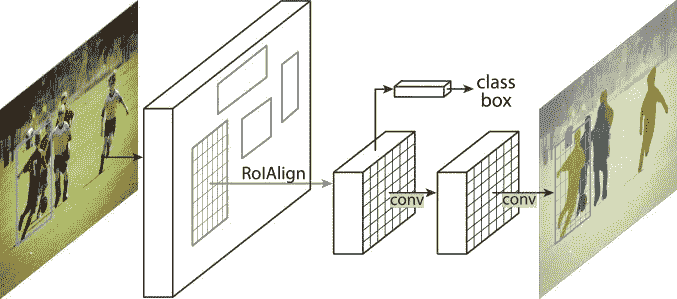
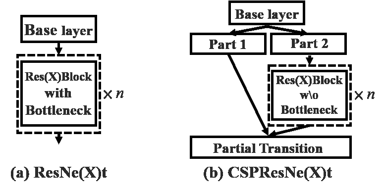

# 每个数据科学家都应该阅读的关于 CNN 的 4 篇研究论文

> 原文：<https://medium.datadriveninvestor.com/4-research-papers-on-cnn-every-data-scientist-should-read-d2a53383867c?source=collection_archive---------12----------------------->

## 近年来惊人的进步

Pic by [Franck V.](https://unsplash.com/@franckinjapan) from [Unsplash.com](https://unsplash.com/photos/U3sOwViXhkY)

# 屏蔽 R-CNN

作者:明凯·何、乔治娅·格基奥萨里、彼得·多拉尔、罗斯·吉斯克

The Mask R-CNN framework for instance segmentation

## 摘要

我们提出了一个概念上简单、灵活、通用的对象实例分割框架。我们的方法有效地检测图像中的对象，同时为每个实例生成高质量的分割掩模。该方法被称为掩模 R-CNN，通过与现有的用于边界框识别的分支并行地添加用于预测对象掩模的分支，扩展了更快的 R-CNN。Mask R-CNN 易于训练，并且仅增加了运行速度为 5 fps 的更快 R-CNN 的少量开销。此外，Mask R-CNN 易于推广到其他任务，例如，允许我们在相同的框架中估计人类姿态。我们展示了 COCO 挑战套件的所有三个方面的最佳结果，包括实例分割、包围盒对象检测和人物关键点检测。没有花里胡哨，Mask R-CNN 在每项任务上都优于所有现有的单一模型参赛作品，包括 COCO 2016 挑战赛的获胜者。我们希望我们简单有效的方法将作为一个坚实的基线，并有助于简化实例级识别的未来研究。

***论文可以在这里找到:***

【https://arxiv.org/pdf/1703.06870v3.pdf 

***代码可以在这里找到*** :

 [## Facebook 研究/检测

### Detectron 已被弃用。请参阅 detectron2，这是 PyTorch 中 detectron 的全新重写版本。侦探是脸书·艾…

github.com](https://github.com/facebookresearch/Detectron) 

# CNN-CASS: CNN 用于 MPR 图像中冠状动脉狭窄评分的分类

作者:玛丽娅·多布科，博丹·皮特里沙克，奥勒斯·多博舍维奇

## 摘要

为了减少患者等待诊断冠状动脉疾病的时间，使用冠状动脉计算机断层摄影血管造影扫描或提取的多平面重建(MPR)图像，自动方法被应用于识别其严重性，为医生提供关于每个病例优先级的第二意见。以往研究的主要缺点是缺乏能够保证其可靠性的大量数据。另一个限制是使用需要手动预处理的手工特征，例如中心线提取。我们通过应用基于 ShuffleNet V2 网络架构的不同的自动化方法，并在提议的 MPR 图像的收集数据集上测试它，该数据集比之前在该领域中使用的任何其他数据集都大，从而克服了这两个限制。我们还省略了中心线提取步骤，并分别使用 708 和 105 名患者的完整曲线 MPR 图像来训练和测试我们的模型。该模型预测三个等级中的一个:正常的“无狭窄”，检测到 1-50%的狭窄，“显著”的狭窄超过 50%。我们通过网络选择的最重要特征的可视化来展示模型的可解释性。对于狭窄评分分类，与以前的工作相比，该方法显示出改进的性能，在患者水平上实现了 80%的准确性。

 [## 一瞬间学会数据科学！？数据驱动的投资者

### 在我之前的职业生涯中，我是一名训练有素的古典钢琴家。还记得那些声称你可以…

www.datadriveninvestor.com](https://www.datadriveninvestor.com/2020/07/23/learn-data-science-in-a-flash/) 

***纸张可以在这里:***

【https://arxiv.org/pdf/2001.08593 

# CNN 预测:基于 CNN 的股票市场预测，使用不同的变量

作者:Ehsan Hoseinzade，Saman Haratizadeh

## 摘要

金融数据的特征提取是市场预测领域中最重要的问题之一，已经提出了许多方法。在其他现代工具中，卷积神经网络(CNN)最近已被应用于自动特征选择和市场预测。然而，在迄今为止报道的实验中，很少关注不同市场之间的相关性作为提取特征的可能信息源。在本文中，我们提出了一个基于 CNN 的框架，该框架具有专门设计的 CNN，可以应用于来自各种来源(包括不同市场)的数据集合，以便提取用于预测这些市场未来的特征。所建议的框架已经被应用于基于各种初始特征集合来预测标准普尔 500、纳斯达克、DJI、纽约证券交易所和罗素市场的指数的第二天的运动方向。评估显示，与现有基线算法相比，预测性能有了显著提高。

***纸张可以在这里:***

[https://arxiv.org/pdf/1810.08923](https://arxiv.org/pdf/1810.08923)

# CSPNet:增强 CNN 学习能力的新主干

由钱、廖宏远、叶一豪、吴月华、李平、谢俊伟

Credits : CSPNet: A New Backbone that can Enhance Learning Capability of CNN

## 摘要

神经网络已经使最先进的方法能够在计算机视觉任务(如对象检测)上实现令人难以置信的结果。然而，这种成功在很大程度上依赖于昂贵的计算资源，这阻碍了拥有廉价设备的人欣赏先进技术。本文从网络体系结构的角度，提出跨级局部网络(CSPNet)来缓解以往工作需要大量推理计算的问题。我们将问题归因于网络优化中的重复梯度信息。所提出的网络通过整合网络阶段开始和结束时的特征图来尊重梯度的可变性，在我们的实验中，这在 ImageNet 数据集上减少了 20%的计算量，具有相当甚至更高的准确性，并且在 MS COCO 对象检测数据集上的 AP50 方面显著优于最先进的方法。CSPNet 易于实现，并且足够通用，可以处理基于 ResNet、ResNeXt 和 DenseNet 的架构。

***论文可以在这里找到:***

[https://arxiv.org/pdf/1911.11929v1.pdf](https://arxiv.org/pdf/1911.11929v1.pdf)

***代码可以在这里找到:***

 [## wong kinyiu/CrossStagePartialNetworks

### 这是用 Darknet 实现的“CSPNet:增强 CNN 学习能力的新主干”

github.com](https://github.com/WongKinYiu/CrossStagePartialNetworks) 

参考文献和致谢

 [## arXiv.org

### arXiv 是一个免费的分发服务和开放存取的档案库，包含 1，717，999 篇学术文章，涉及领域包括…

arxiv.org](https://arxiv.org/) 

# 想看程序员幽默？

 [## 编程幽默第 2 部分

### 继续笑，因为太搞笑了…

medium.com](https://medium.com/datadriveninvestor/programming-humor-part-2-f92cf5a26f2b)  [## 史上最搞笑的代码注释

### 程序员幽默:是的，实际上是程序员写的！

medium.com](https://medium.com/datadriveninvestor/the-most-hilarious-code-comments-ever-bae3cb1030b5)  [## 编码原罪:令人捧腹的开发者自白

### “白板”是如何被嘲笑的

medium.com](https://medium.com/datadriveninvestor/coding-sins-hilarious-developer-confessions-f55eb342454e)  [## 10 个让你着迷的诙谐编程笑话

### 这些太搞笑了…

medium.com](https://medium.com/datadriveninvestor/10-witty-programming-jokes-that-will-make-you-go-rofl-a53fbfb91943) 

# 推荐文章-

 [## Python 迭代器、生成器和装饰器变得简单

### 快速实施指南

medium.com](https://medium.com/python-in-plain-english/python-iterators-generators-and-decorators-made-easy-659cae26054f)  [## 你应该知道的 23 种数据科学技术！

### 使用这些技巧来节省你的宝贵时间

medium.com](https://medium.com/ai-in-plain-english/23-data-science-techniques-you-should-know-61bc2c9d1b3a)  [## 面向数据科学家的 5 项酷炫先进熊猫技术

### 使用这些技巧…

medium.com](https://medium.com/datadriveninvestor/5-cool-advanced-pandas-techniques-for-data-scientists-c5a59ae0625d)  [## Stack Overflow 分析了来自 60，000 多名软件开发人员的数据，包括他们的工作时间、语言…

### 以下是他们的发现…

medium.com](https://medium.com/datadriveninvestor/stack-overflow-analyzed-data-from-60-000-software-developers-hours-they-work-languages-they-476ac6ca0197)