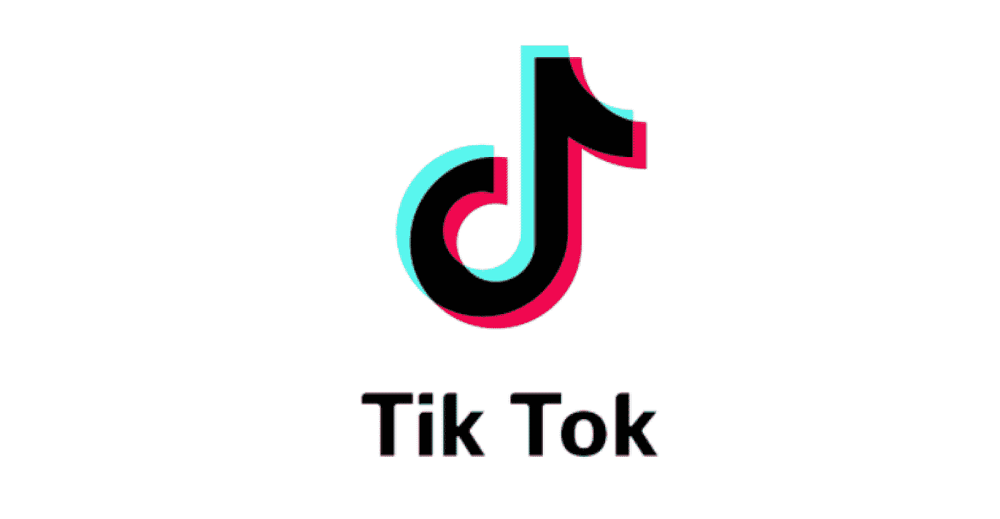
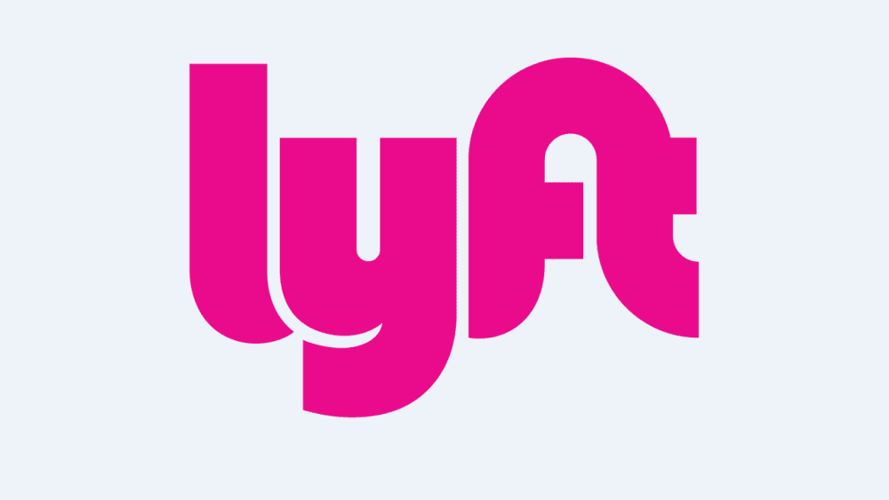
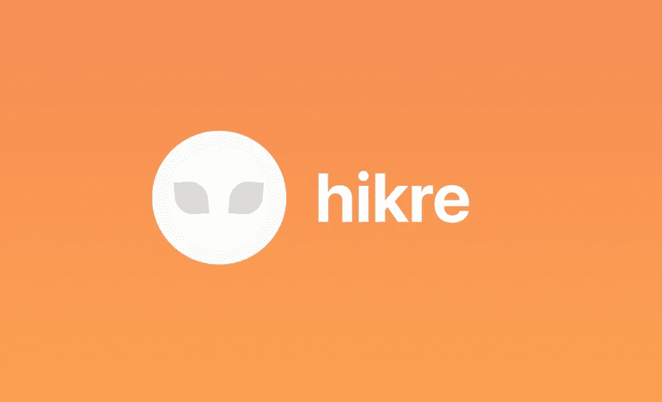

# 将主宰 2020 年代的 4 家创业公司

> 原文：<https://medium.datadriveninvestor.com/4-startups-that-will-dominate-in-the-2020s-fc35562cf473?source=collection_archive---------7----------------------->

欢迎来到即将成为独角兽的新时代。

Photo courtesy of Unsplash

毫无疑问，我是这个星球上最痴迷于创业的人之一，大约 5 年前，当我第一次在我的电脑上看电影《社交网络》时，就在那之后，我立即对创业产生了兴趣。我开始在技术和创业的世界里用各种不同的方式教育自己。事实上，我可以肯定地说，我已经在内心深处积累了关于这个领域的基本智慧。我对它的热情极大地改变了我看待世界的方式，事实上，我现在正在建立自己的科技创业公司，我是宇宙中最快乐的人之一。我决定根据我从那些在 2000 年和 2010 年取得成功的公司身上研究和学习的品质和方面来为我的创业公司建模。有了这些品质，我可以肯定地说 99.9%，以下公司将获得同样巨大的成功。

以下是保证在未来十年蓬勃发展的 4 家创业公司:

## [Snapchat——社交网络](http://snap.com)

Photo courtesy of Entrepreneur.com

从斯坦福大学的大学设计项目开始，创始人兼首席执行官埃文·斯皮格尔已经成功地将 Snapchat 转变为轰动性的成功，尤其是对年轻一代而言。它的平台以消失的照片和信息以及革命故事功能而闻名，这使得脸书和 Instagram 复制了它。

 [## 2020 年最佳短期投资选择精选资源|数据驱动型投资者

### 投资是增加你净财富的一个好方法。如果你通过遵循一个严格的…

www.datadriveninvestor.com](https://www.datadriveninvestor.com/2020/03/28/handpicked-resources-for-the-best-short-term-investment-options-of-2020/) 

Snapchat 对未来的辉煌计划围绕着定向广告、眼镜和时尚零售。我们不会对 Snap 的时尚举措感到惊讶，因为埃文·斯皮格尔有着众所周知的时尚感，并且因为时尚和艺术文化而成为他最喜欢的目的地。该公司的用户数量在过去一年中增加了 30%,并正在利用其发现功能，品牌和出版商在其中发挥作用。

## [抖音](http://tiktok.com) —娱乐

Photo courtesy of License Global

此前名为 Musical.ly，现由一家中国企业巨头所有，自冠状病毒爆发以来，这个臭名昭著的短视频分享平台出现了指数级增长。它的新用户增加了 40%，想象一下这个数字吧！这与脸书 2003 年的增长相当。就在几个月前，几乎每个人都对它表现出憎恨，取笑它，并把它描述为炫耀自己的怪异幼稚的方式。现在，抖音已经成为社交媒体和现实世界的热门词汇，在不久的将来，它可以跟随谷歌的脚步进入英语词典。

尽管知名人士警告说抖音正被中国政府用来监视美国公民。这丝毫没有影响公众对该平台的看法。似乎占抖音用户很大比例的年轻一代并不真正关心他们在网上的隐私和安全。你为什么要？只有偏执狂和天真的人才会表现得好像他们一周 7 天，一天 24 小时都在被监视。我很确定他们很在乎你一天都在做什么，他们可能只需要你的数据。

抖音尚未展示其真正的潜力。目前，我们可以肯定的是，它会变得更大。你可以让 20，000 人快速浏览你的视频，而不用付出太多努力。只有在抖音才有可能！人们迫不及待地想看到它在未来几年将如何发展。名人开始出版，商业也开始做广告。人在哪里，你就应该在哪里采取行动。

## [Lyft](http://lyft.com) —运输

Photo courtesy of LibGuides

我们都知道 Lyft 对优步来说是更便宜的选择，但除此之外，我认为在几年左右的时间里，让 Lyft 比优步更成功的是品牌。与优步相比，Lyft 的形象是做好事、尊重司机。我想我不需要解释为什么和什么，这是常识。尽管服务完全相同，但人们对 Lyft 的看法却大相径庭。Lyft 享有大众选择的美誉，因为它们的收费比优步低一点。

不管该公司在冠状病毒爆发期间是否看到乘客和司机减少，真正的价值将在所有这些都说了和做了之后出现。比起公共汽车和火车，公众更倾向于选择拼车，尤其是在像纽约、芝加哥、洛杉矶和旧金山这样的大都市。这对公共汽车和火车公司来说是不利的，顾客会减少，为了生存他们可能不得不转向别处。世界在变化，真的，这不是你典型的电影演讲，它真的发生了，它影响了人们的行为和对我们世界的看法。

由于冠状病毒，Lyft 最近解雇了 17%的员工，优步解雇了 20%，但预计这是拯救的小代价。一旦市场回到正常周期，Lyft 预计将在未来两年内占据更多市场份额，因为优步也有传言称将在食品配送方面投入更多资源，这是有道理的，因为这是他们获得更多利润的地方。Lyft 还进入了自行车共享市场，这使其相对于竞争对手具有竞争优势，并计划在未来几年内扩展到欧洲。

## [罗宾汉—金融](http://robinhood.com) e

Photo courtesy of Investopedia

罗宾汉使股票、期权、密码和交易所交易基金的投资民主化。我很自豪能成为他们的投资者之一，我喜欢这样。它完全消除了对投资看法的复杂性，并将其转化为一个平台，就像喜欢脸书上的一个帖子或 Instagram 上的一张图片一样简单。该公司认为投资不一定要复杂，所以他们让整个体验变得简单。

自冠状病毒开始以来，该公司的新用户增加了 20%，增长仍处于边缘。这种增长可能是因为投资已经成为隔离期间的日常话题，而大多数人现在挣扎的主要原因是因为他们没有存款也没有任何投资。人们肯定对此感到警醒。

Robinhood 将不断成为明星，并将被称为金融科技领域的佼佼者之一。他们称之为“投资脸书”,设想它将改变我们思考和进行投资的方式。如果你还不是游戏的一部分，现在可能是最佳时机。你绝对不需要 5000 美元的资本！Robinhood 的名声在外，他们的新投资者甚至可以从 100 美元起步。越早进入游戏越好！

**荣誉奖**

## [Hikre](http://www.hikre.com) —交通

Photo Courtesy of Hikre.com

另一个在交通领域，这家新兴公司对**社会、可持续和共享**的未来有着辉煌的愿景。该公司由三名学生企业家于 2019 年在爱荷华州成立，现在总部位于亚利桑那州和爱荷华州，它将自己定义为“长途旅行的优步”。一种比公共汽车和火车更安全、更便宜、更方便的替代方式。与其花 50 美元买一张去芝加哥的票，为什么不花 25 美元和你的同学一起搭车，一边放松一边听你最喜欢的音乐或做作业。美丽，舒适，平静，对吗？这是 Hikre 能够提供的。

最初，它将在亚利桑那州和爱荷华州(创始人居住的地方)推出，预计会引起很大反响，并在年轻的共享经济中成名。该平台(iOS 应用程序)预计在推出时注册 500 名用户，并在 4 个月后完成 1000 次骑行。该公司有机会做优步和 Lyft 过去几年未能做的事情。此外，该产品已显示出主要来自大学生的需求，因为每个大学校园都有 2.5 万至 4.5 万人口，其中 40%拥有汽车，其余没有。

冠状病毒的爆发无疑改变了人们对公共交通的看法。出于健康考虑，Hikre 将自己标榜为一种健康的旅行方式，因此人们不会冒险乘坐飞机、公共汽车和火车。汽车就在那里，所以肯定有一个市场机会，正如首席执行官所说，*“我们只需要找到一种简单、无痛、有效的方式来连接双方，同时建立信任和信誉”。*统计数据显示，无论是短途还是长途出行，越来越多的人倾向于选择拼车和拼车作为交通方式。导致对这些共享公司的需求激增。

虽然这些公司尚未盈利，但真正的净值估值在于未来。只要看看亚马逊是如何在近 10 年前才开始盈利的。投资者不希望在 10 年内每天都有一点点投资回报，而是希望在未来的某一天，有一个巨大的投资回报会一下子直接进入他们的口袋。投资者如何选择投资，在很大程度上取决于公司长期创造价值的能力，而这些公司被保证会这样做。

*感谢您的阅读！如果你对这个故事的内容有任何意见或反馈，请随时告诉我你的想法，并与我联系。所有的观点都是我自己的，并不反映任何上帝(耶稣基督)的观点。*

# 如果你喜欢这个故事，请随意点击下面的按钮👏帮助其他人找到它。谢谢大家！