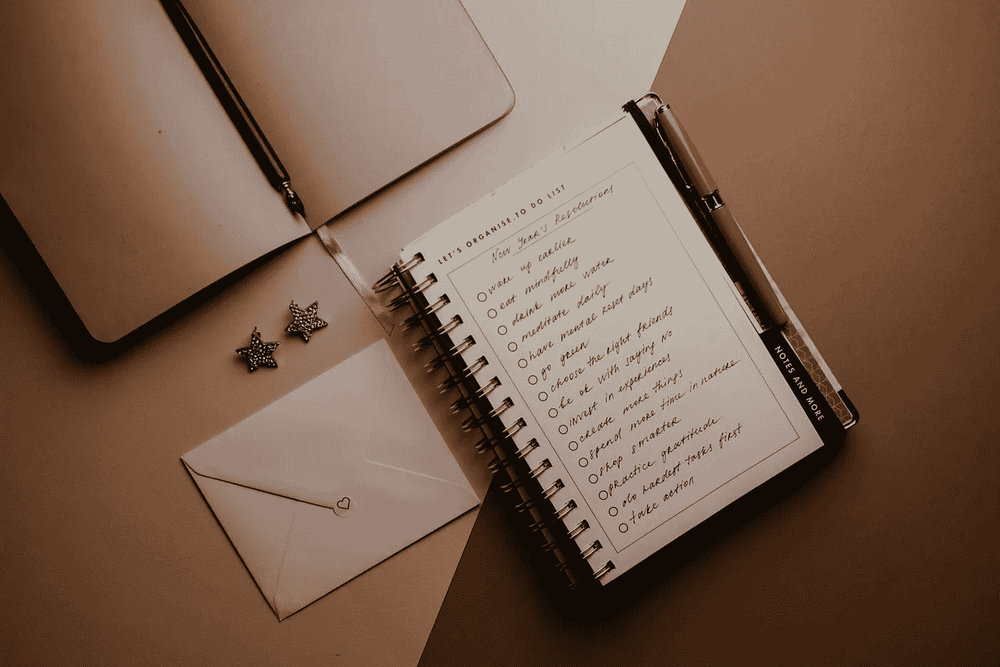

# 坚持你的目标的 4 个策略

> 原文：<https://medium.datadriveninvestor.com/4-strategies-to-make-your-goals-stick-2e74bd9d1391?source=collection_archive---------22----------------------->

通过了解你如何运作来培养变化。

Photo by [Polina Kovaleva](https://www.pexels.com/@polina-kovaleva?utm_content=attributionCopyText&utm_medium=referral&utm_source=pexels) from [Pexels](https://www.pexels.com/photo/white-notebook-on-brown-table-5717406/?utm_content=attributionCopyText&utm_medium=referral&utm_source=pexels)

是时候了！我希望你已经享受了一个令人惊叹的假期，并准备好在 2021 年创造一些积极的势头。

那么，你今年打算实现什么目标呢？

每年设定目标是获得成功和拓展视野的一种有趣且必要的方式。然而，你不能随意抛出一个随机的愿望，并期望得到回报。你必须设定现实的目标来获得收益。

如果我在新的一年里对你只有一个愿望，那就是你能实现你生活中渴望的转变，并最终成为一个真正的人。

因为毫无疑问，这个世界现在需要你。

它需要你全力以赴，无论你需要什么样的改变，都是释放这种力量的关键。

2021 年将是重要的一年，我迫不及待地想让你接手。在今年建立和掌握新习惯时，这里有四个策略可以考虑。

# 从微观而非宏观的角度思考。

越大≠越好。远大的抱负仍然很有吸引力，但也会让人感到力不从心。

然而，这并不意味着你应该忽视大目标。相反，把它们分解成更小、更可行的部分。可管理的目标很容易实现，并有助于建立一个简单明了的游戏计划。

成功者常常试图吞下他们消化不了的东西。当你盯着你的盘子想:*它太大了时，你的进步就停滞了。我不可能完成这个*。

我形象地说了盘子，但是让我们把我们的目标想象成食物。

每当有太多的摄入，就表现得好像你在餐馆点了一顿大餐。把它切碎。把它分成小份。一次吃一口。如果需要的话，可以把剩菜带走，稍后再完成——不要试图一口气狼吞虎咽地吃完一顿饭。把它分成你能处理的小块。

就像那顿饭一样，把令人生畏的目标分成小块。如果这些部分看起来令人望而生畏，那就再切一次。坚持下去，直到你吃到一口就能吃完的食物。然后一次吃一大块。一直走，直到你完成。

当你有一个看起来太大的项目，并且你很想拖延的时候，把它分解。然后一口一口的攻击它。品尝每一块食物，欣赏大餐中令人满意的部分(目标)。咽下去，继续下一大块。

Photo by [Ketut Subiyanto](https://www.pexels.com/@ketut-subiyanto?utm_content=attributionCopyText&utm_medium=referral&utm_source=pexels) from [Pexels](https://www.pexels.com/photo/cheerful-black-entrepreneur-in-wireless-earphones-drinking-coffee-on-terrace-of-business-center-4559714/?utm_content=attributionCopyText&utm_medium=referral&utm_source=pexels)

# **保持真实的自我。**

虽然任何人都可以改变，但你仍然需要现实地认识自己。身份在个人发展中起着巨大的作用。

例如，如果你决心多读书，但你容易拖延，不要设定每日目标。相反，确保你每周阅读三次，作为对你目前阅读水平的简单提升。

你不需要一夜之间就转型成功。一次一个渐进的调整可以产生显著的效果。只是一定要真实地面对自己的技能和缺点。

# 设定可衡量的具体目标。

如果你的抱负不明确，那么实现它所需的时间也会不明确。换句话说，模糊的目标产生模糊的结果。

不要只说“我想做得更好。”尽管初衷是好的，但这个目标是模糊的，并且很难评估。

相反，调整目标，使之更加具体。“我将每周学习两种新食谱”，或者更确切地说，“2021 年，我将在每周一和周五尝试一种新食谱。”

如果你坚持下去，像这样的雄心会让你更加引人注目，促使你不断进步。这也是保持动力的好方法，因为你可以监控你的进步。

# **降低过高的期望。**

无论你多么渴望达到完美，它都不会发生。

这听起来很残酷，但这是现实。你是人，所有人都会周期性地犯错。

但这并不意味着你应该在失败的第一个迹象出现时就退出。错误不可避免的事实不应该阻止你去尝试。

当设定目标时，预计你会故态复萌。确保你已经准备好了可以让你重回正轨的策略。

**阿德里安·s·波特**是一名作家、工程师、顾问和演说家。他写[诗歌](https://baltimorereview.org/index.php/fall_2020/contributor/adrian-s-potter)、[短篇小说](https://aquietcourage.wordpress.com/tag/adrian-s-potter/)，以及各种主题的文章，包括创造力和个人成长。他是诗集《一切不对的感觉都是对的》和散文集《至交手册》的作者。在[http://adrianspotter.com/](http://adrianspotter.com/)在线拜访他。

# 附加文字

[选择乐观(即使没人乐观)](https://medium.com/datadriveninvestor/choose-optimism-even-when-nobody-else-is-6e41c467c7b9?sk=e5d927fb83b6298c8f82f2fe28840729)

[你真了不起](https://medium.com/datadriveninvestor/you-are-amazing-274651127432?sk=34312c5fa72f2109d6031c2a4b7c2e4c)

[五句让我不爽的话](https://medium.com/datadriveninvestor/five-quotes-that-kicked-me-in-the-butt-be5b48d520b0?sk=30a5ec09ae8ab8e26dc7d27815d969e4)

获取专家视图— [**订阅 DDI 英特尔**](https://datadriveninvestor.com/ddi-intel)