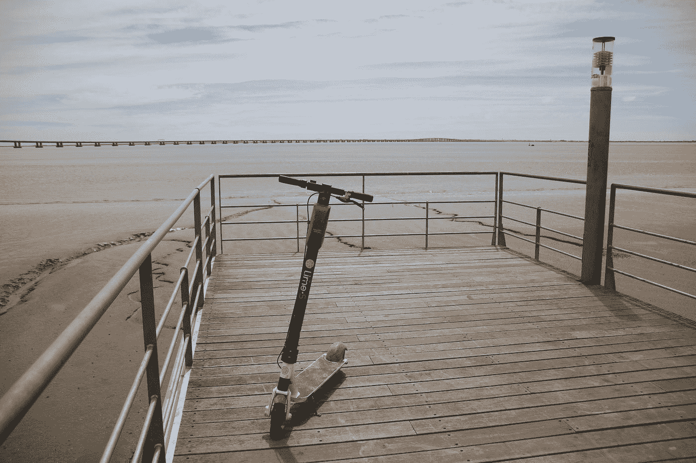
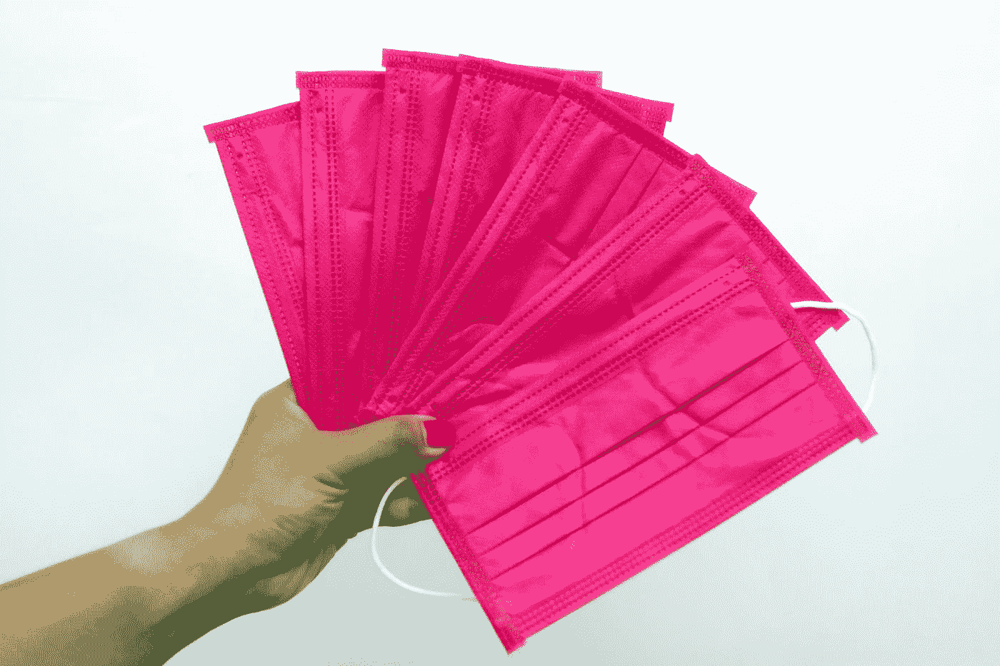

# 新冠肺炎之后的 5 大科技趋势

> 原文：<https://medium.datadriveninvestor.com/4-tech-trends-after-covid-19-b1f87b66fa6d?source=collection_archive---------5----------------------->

## 这可能感觉很遥远，可能需要很多时间，但总有一天封锁会结束。

这可能感觉很遥远，可能需要很多时间，但有一天封锁会结束，人们需要走出去，继续他们的生活。我们世界的消费者会想去餐馆，他们会想买新衣服，他们会需要去工作。在技术和创业社区，我们必须期待那一天，并试图预测会发生什么。我认为这“回归正常”时期有五个趋势。

值得注意的是:**这些只是我的想法。**其中一些可能会被证明是准确的，一些可能不会。

Social distancing will stay with us. Photo by [Mark Claus](https://unsplash.com/@markcnunes?utm_source=medium&utm_medium=referral) on [Unsplash](https://unsplash.com?utm_source=medium&utm_medium=referral).

# **在线娱乐**

越来越清楚的是，即使劳动力能够恢复正常，现代人为了娱乐而做的许多事情也将需要更多的时间才能恢复。这不可能的主要原因是社会距离被证明对病毒的传播有重大影响，即使没有必要，人们也需要时间恢复正常。

根据 [Vox](https://www.vox.com/science-and-health/2020/3/26/21192211/coronavirus-covid-19-social-distancing-end) ， **92%的美国人口不会去音乐会和体育赛事，72%的人会避开餐馆。**也许在餐厅里，在有间隔桌子和消毒餐具的开放空间里服务是可能的，但在其他地方不会这样。例如，大型音乐会和公共博物馆将需要大量的调整，以适应社会距离的规则。因此，我相信可以帮助人们与在线观众分享他们创作的直播平台将在这些条件下繁荣发展，甚至主要艺术家也将有义务使用它们。在作品的原创性很重要的情况下，就像在一些博物馆里一样，这就更难了。数字艺术形式将会蓬勃发展，而实体艺术将需要适应新的现实。谁知道呢？也许 sport gamed 将最终成为 VR 的催化剂。

Famous artists adapting to the new situation. Full video at [FOX](http://fox.tv/iHeartLivingRoomConcertforAmericaYT).

# 共享经济

还记得全世界有 [1000 个自行车共享系统](https://en.wikipedia.org/wiki/List_of_bicycle-sharing_systems)吗？[鸟和石灰](https://en.wikipedia.org/wiki/Scooter-sharing_system)？[吸尘器](https://www.lowes.com/l/carpetcleanerrental.html)出租？

据我目前所知，尚不确定导致新冠肺炎病毒在表面存活多长时间，但这种可能性仍然是病毒社会认知的一大部分。也正因为如此，每一种形式的[协作消费](https://en.wikipedia.org/wiki/Collaborative_consumption)在这个时期之后都会遭受很大的打击。人们不会想去碰那些从手中经过的东西，而所有那些东西都有。在人们共享同一空间的地方，打击将是最大的，比如 UberPool ( [顺便说一下，它目前已被暂停](https://www.theverge.com/2020/3/17/21183276/uber-uberpool-suspension-coronavirus-us-canada-carpool-pandemic))。

 [## 认知计算——一套被广泛认为是……

### 作为它的用户，我们已经习惯了科技。这些天几乎没有什么是司空见惯的…

www.datadriveninvestor.com](https://www.datadriveninvestor.com/2020/02/19/cognitive-computing-a-skill-set-widely-considered-to-be-the-most-vital-manifestation-of-artificial-intelligence/) 

我倾向于认为，共享对象由客户之间的中间人处理的公司，比如吸尘器共享，会少受点苦。如果这些地方使用极端的卫生方法并做相应的广告，它们也许能够生存下来。相信政府会加强卫生法规也不是牵强附会，我们已经可以看到这样的法规开始涌现。

Abandoned scooter. Photo by [Paulo Almeida](https://unsplash.com/@pralmeida?utm_source=medium&utm_medium=referral) on [Unsplash](https://unsplash.com?utm_source=medium&utm_medium=referral).

# 最后一英里问题

当从国外交货时，总有一个步骤是通过大众运输系统，如飞机或轮船，然后通过卡车在陆地上转运货物。将货物从主仓库运送到你家门口的问题，通常被称为“最后一英里问题”。供应链的最后一个环节通常效率较低，占货物运输总成本的 41%。

在新冠肺炎之前，这已经是世界上的一个主要问题，但现在它甚至是一个更大的问题。将商品送到你家门口的网上杂货店激增，但所有这些服务都因为这个问题而失败:它们严重依赖送货人，并且它们很难将每件商品从货架上送到消费者手中。提高最后一英里的效率，将有助于公司增加利润，满足不断增长的需求。这可以通过[送货无人机](https://www.fastcompany.com/90483592/zipline-will-use-its-medical-delivery-drones-to-the-u-s-to-help-fight-the-coronavirus)或[自动化仓库](https://www.theverge.com/2018/5/8/17331250/automated-warehouses-jobs-ocado-andover-amazon)来实现，或者用我确信会出现的更疯狂的创业想法来实现。

很容易认为当封锁结束时，这种需求将会减少，但现在大约有 20%的世界人口处于封锁状态，这些数字可能需要一段时间才能下降。即使发生这种情况，老年人也更有可能呆在安全的地方更长时间，因此仍然需要企业送货上门。

# MOOC 的复兴

十几岁时，我可以用 Duolingo 学习西班牙语，甚至在麻省理工学院学习供应链管理。今天，你甚至可以只通过在线出勤获得世界顶尖大学的[理学士](https://www.coursera.org/degrees/bachelor-of-science-computer-science-london)或[理学硕士](https://www.coursera.org/degrees/omie)。这就是 mooc(*大规模开放在线课程* s)的世界，它在 7 年前开始在 Coursera 上流行，现在仍在兴起。但是这个世界有一个主要问题:**完成率**。注册参加网上课程很容易，但是完成一门课程就难多了。不同的研究对为什么会发生这种情况提供了不同的观点，但许多人指出，我们缺乏以这种方式有效学习所需的技能。

即便如此，现在，对于所有被封锁的高中生来说，在线学习是教育系统继续教他们的唯一方式。对老师来说更难了，而且绝不是面授课的替代品，这也是我认为危机过后教育系统会恢复正常的主要原因。但是会有一个更大更主要的变化:**一代学生会看到他们可以在网上学习。当这种情况发生时，对这类课程的需求将会增长，那些能够抓住年轻受众并为他们提供定制内容的公司可能会创造出一个“在线学生”,他们甚至会一直学习到大学毕业。**

Photo by [Macau Photo Agency](https://unsplash.com/@macauphotoagency?utm_source=medium&utm_medium=referral) on [Unsplash](https://unsplash.com?utm_source=medium&utm_medium=referral)

# 时尚的医疗设备

这一次可能看起来不太相关，但我认为这可能是最大的机会。还记得手机壳刚开始的时候吗？你可以在网上找到成百上千的手机壳卖家，也可以在网上找到开办自己手机壳商店的指南。这些商店变得如此受欢迎，因为突然间我们都需要手机壳，而且**制造和进口它们很容易**。《华尔街日报》突然说，这可能是[的新时尚配饰](https://www.wsj.com/articles/phone-cases-the-new-it-fashion-accessory-1440706448)。

如果在公共场合戴口罩和一次性手套成为新的社会规范，我相信人们也会想让它们变得时尚。今天，我们开始看到不同颜色的口罩，但它总是这样开始的。首批批量生产定制安全口罩的公司将能够抓住这个新兴市场。

总的来说，考虑未来会让我更好地处理当前的情况。如果你对即将到来的趋势有更多的想法，请随意张贴在这里，我会非常乐意阅读它们！

此外，如果你喜欢我写的东西，欢迎在[媒体](https://medium.com/@yoavramon)或我的[推特](https://twitter.com/YoavR7)上关注我。这样，你可以阅读我即将发表的关于触摸屏的第二部分。