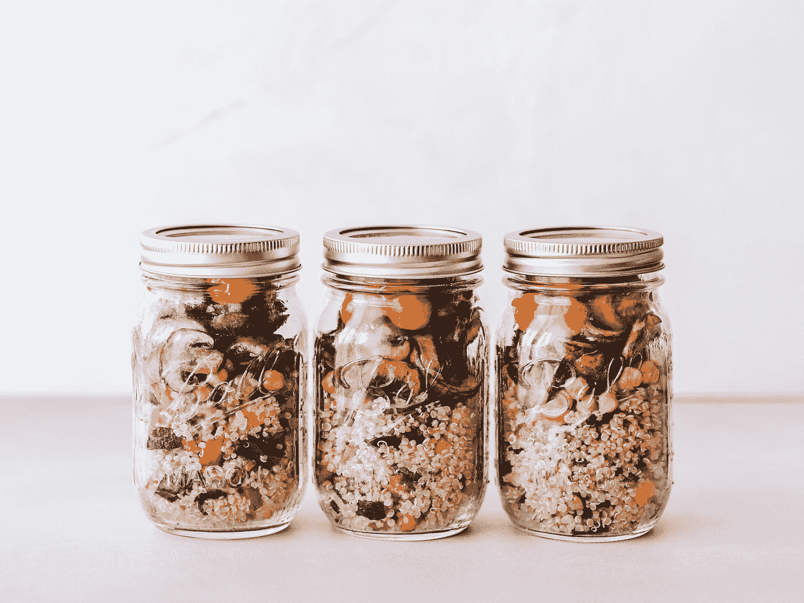

# 高产者本能做的 4 件事

> 原文：<https://medium.datadriveninvestor.com/4-things-highly-productive-people-do-instinctively-65454468c5dd?source=collection_archive---------5----------------------->

Photo by [Sasha • Stories](https://unsplash.com/@sanfrancisco?utm_source=medium&utm_medium=referral) on [Unsplash](https://unsplash.com?utm_source=medium&utm_medium=referral)

## 采纳这些行为，你的进步就会开始

你在一个工作日结束时，几乎没有触及表面。未读邮件。多个未完成任务的标签。跑着站着不动。

又迟到了。没有锻炼。垃圾食品晚餐。你的生活感觉失控了。

然而，你看到人们似乎在生活中随波逐流。他们在这里出版一本书，在那里获得晋升，轻松地建立一个副业。此外，他们保持身材，有很好的社交生活和良好的人际关系。

他们是如何做到的？

在不知道的情况下——或者更有可能是通过*大量的刻意努力*——他们已经将这四种行为融入了他们的生活方式和个人方式中。

不要嫉妒。变聪明。理解有生产力的人做什么。接下来，开始吧。开始以相似的方式行动。

**关注你的生活变化。**

# 他们吃青蛙

好吧，他们不吃青蛙。这并不是号召去突袭你当地的池塘，然后吃掉一只毫无防备的两栖动物。

吃青蛙意味着首先面对最可怕、最重要、最无趣的任务，并尽可能快地完成它们。这个概念来自马克·吐温的一句名言:

> “如果吃青蛙是你的工作，最好在早上第一件事就做。如果你的工作是吃两只青蛙，最好先吃最大的那只。”——马克·吐温

Photo by [Jack Hamilton](https://unsplash.com/@jacc?utm_source=medium&utm_medium=referral) on [Unsplash](https://unsplash.com?utm_source=medium&utm_medium=referral)

那些折磨你的任务。你一直拖延的报告。打电话给可怕的客户。藏在你待办事项清单底部的任何东西。

**耐克 it** 。*就这么做。*

你会感觉到这种释放是如此的高，它给了你积极的动力去完成剩下的任务，现在你会做得更好。

不要求完美主义。对于这种青蛙餐，没有刚洗过的桌布，银餐具，或蜡烛。它只需要被塞进你的嘴里，咀嚼，然后吞下。

你甚至可能会发现更快更好的方法。

当我刚开始制作广播纪录片时，我最不喜欢的工作是转录——回放磁带并打出文字。

这是必要的，以便当我开始构建程序时，我知道在哪里可以得到我需要的代码。

我的程序正在遭受痛苦，因为我要么跳过转录，要么做得太晚(当我需要在截止日期前编辑时)。

我决定，抄写将是我每天的第一项任务。在我打开任何电子邮件之前，在我喝咖啡之前(这让我集中了注意力)，我必须转录一个采访。

Photo by [Dollar Gill](https://unsplash.com/@dollargill?utm_source=medium&utm_medium=referral) on [Unsplash](https://unsplash.com?utm_source=medium&utm_medium=referral)

有趣的事情发生了。我是如此渴望完成它，以至于我尝试了一项新技术——我实时转录。

我没有把每个单词都打出来，而是不停地尽可能多地打出来。我很自然地记下了关键词或黄金时刻——当我一起编辑程序时，它们足以给我所需要的信息。

我至今仍在使用这种技术，它节省了我几个小时的时间。这是我的初创公司比大公司更有效率的一个微小方面。另外，我的程序更好。我是通过吃一只青蛙发现的。

> "迈出第一步的行为是赢家和输家的区别."――布莱恩·特雷西‘吃了那只青蛙！:21 种停止拖延并在更短时间内完成更多工作的好方法

对自己诚实。鉴别你的青蛙，然后吃掉它们。首先，快速完成。

# **他们不找借口**

我们都知道尤达的名言:

> “做还是不做。没有尝试。”——尤达，《星球大战第五集:帝国反击战》

抱歉，尤达，不。努力尝试，没有成就，学习，成长，积极地前进是可能的。这叫失败，我们都要面对它，需要处理它。

另一方面，借口是*是*一个非黑即白的情况。所以尤达应该这么说:

> “你可以或者不可以。没有任何借口。”—安迪，刚才

富有成效的人不会把时间和精力浪费在借口上。他们找出什么是值得做的，然后去做。

任何有帮助的事，他们都做得更多。任何无益的事情，他们都会停止。他们对自己和他人都很诚实。

在学校，如果你忘了你的作业，你会被责骂。作为一个成年人，你喝醉了，说了一些愚蠢的话，得罪了一个朋友。他们正确地用一些冷酷无情的事实让你明白。

这两种情况的背后都是错误(忘记任务，说一些愚蠢的话)和教训(变得更有条理，小心在几杯酒后发表意见)。

 [## 在家工作如何提高我的工作效率|数据驱动型投资者

### 在家工作确实激发了我最大的潜能，让我更有效率。因为在家工作给了我…

www.datadriveninvestor.com](https://www.datadriveninvestor.com/2020/07/29/how-working-from-home-increased-my-productivity/) 

没有理由再犯同样的错误。

Photo by [Michael Discenza](https://unsplash.com/@mdisc?utm_source=medium&utm_medium=referral) on [Unsplash](https://unsplash.com?utm_source=medium&utm_medium=referral)

当我们开始反复犯错，并经常使用借口时，希望有人会告诉我们这两个词:

**承担责任。**

在他的传奇著作《高效人士的 7 个习惯》中，斯蒂芬·R·科维用一种我一直铭记在心的方式解释了 R 字:

> 看看责任这个词——“反应能力”——选择你的反应的能力。高度积极主动的人认识到这种责任。他们不会因为自己的行为而责怪环境、条件或局限。”――斯蒂芬·R·科维，“高效人士的 7 个习惯”

我过去常常抱怨自己超重。

*“我看一包饼干就能长胖。”*

*“其他人可以吃他们想吃的东西，而且不会变胖。”*

我会脱口说出这些话。一直以来，落在我嘴里的都是饼干和啤酒。

许多年以后，我现在才知道，是的，我的新陈代谢比别人要不活跃。这是事实。我花了很多时间和精力来研究我能吃什么，做什么运动来保持健康的体重。

我仍然需要努力。我不时地重置和重新聚焦。

但是我不再找借口了。我分析并采取行动。

Photo by [Ella Olsson](https://unsplash.com/@ellaolsson?utm_source=medium&utm_medium=referral) on [Unsplash](https://unsplash.com?utm_source=medium&utm_medium=referral)

你可以找到几个原因来解释为什么你的工作效率没有你想的那么高。也许你很容易分心。也许你太容易接受额外的任务，所以你成了公司的垃圾场。

也许，你害怕逼迫自己，在内心深处，当别人进步时，你更容易懒惰和抱怨。

你是如何选择答案的？

你正在一个平台上阅读这篇文章，这个平台上充斥着关于所有这些问题以及更多问题的建议。

几秒钟之内，你就能找到解释如何避免分心、如何变得更加自信、如何面对恐惧以及不嫉妒他人成功的文章。

找到建议，学习并采取行动——就这么简单。

**别再找借口了。承担责任。**

# **他们利用常规的力量**

我曾经和一个家伙在广播电台工作，他总是准时下班。我们在那个电视台遇到了一点儿主持人的问题，所以当他走出来的时候，人们交换了一下眼神。

我被他迷住了。他做的节目很好。他总是为会议做好充分准备。他每天都午休。他的工作量和我们其他人一样，但他似乎完成得更快。

我们的办公室搬到了办公桌轮用制，我故意和他搬到了同一个办公桌旁，看看能不能破解他的秘密。

*然后我就看到了。*

一张明信片大小的小纸条贴在他的电脑显示器上，上面列有他每天的任务清单，以便让他的节目每天播出。他偶尔会瞥一眼，然后戴上耳机开始工作。

一份清单。事情就是这么简单。

他意识到作为一个每日广播节目的制作人，他的许多任务都是例行公事。他把它们精简到最基本的部分，完善了顺序。

他有一份演出前和演出后的清单。在节目中，因为他是最新的，他在场并且能够做一个好的电台制作人所做的事情——倾听、反应、创造。

我们其余的人感觉像是在杂耍或者被同样的任务淹没。有可能更快地完成这些工作，把更多的时间留给重要的事情。*励志。*

Photo by [Blake Guidry](https://unsplash.com/@blakeguidry?utm_source=medium&utm_medium=referral) on [Unsplash](https://unsplash.com?utm_source=medium&utm_medium=referral)

在他的书《清单宣言》中，Atul Gawande 谈到了清单在某些情况下是必不可少的(飞行员不完成清单是不允许起飞的)，但奇怪的是在其他情况下却没有得到充分利用。

基于 Gawande 的工作，一个简单的手术安全清单被引入到世界各地的医院。它包括检查一些基本问题，比如“我们是在给正确的人做手术吗？”

我不骗你。

手术室死亡人数的减少是巨大的。

> “根据对 680 万名手术患者的研究，自 2008 年苏格兰实施该清单以来，手术死亡率下降了 37%。”——英国外科杂志，2019 年

为了更有效率，你需要利用常规的力量。养成习惯，让你能够自动完成正确的事情。

> “这就是习惯的真正力量:洞察到你的习惯是你选择的。”――查尔斯·杜希格，“习惯的力量:为什么我们在生活和商业中这样做”

分析成功的人。借用，改编，试用。考虑使用一个清单来回收你花在纠正错误或加倍做你忘记做的事情上的时间。

但是**是故意的**。选择你的习惯。选择那些让你离目标更近的，而不是让你离目标更远的。

# **他们不多做。他们做得更少。**

你有过那种无法抗拒的忙碌感吗？看来你没有一分钟空闲时间。我的一个朋友曾称之为“疯狂忙碌的生活”

这是一个我们很多人都经历过的陷阱。你做得太多了。

是时候来点冷酷的逻辑了。

**停止做太多的唯一方法是少做。**

但是我读过的每一位自助大师都说我应该做得更多？凌晨 5 点起床？早饭前敲出 1000 个单词。多重任务，鞭策自己，期待更多。啊啊啊。

**停止**。够了。

Photo by [DDP](https://unsplash.com/@moino007?utm_source=medium&utm_medium=referral) on [Unsplash](https://unsplash.com?utm_source=medium&utm_medium=referral)

我曾经工作过的最喜欢的老板把整个公司召集在一起，说了这样一句话:

> “我希望你们今天停止做一件事。”

我们面面相觑，好像他疯了一样。如果我们不那么努力工作，我们将如何实现目标？

他完全正确。我从未忘记那次会议。

> “生产力不是做更多的事情，而是做正确的事情。”――克里斯·贝利，“生产力项目:通过管理你的时间、注意力和精力完成更多”

我不需要告诉你这些。我觉得写它很傻。我感到更愚蠢的是，我仍然日复一日、周复一周、月复一月地在这一天犯错。

**不是更努力的问题。这是关于更聪明地工作。**

富有成效的人会想出最好的方式来度过他们的时间。推动他们前进的东西，他们不断重复。把他们拉回来的东西，他们抛弃了他们。快点。

接受挑战。哪一件事是你今天可以停止做并且永远不会再做的？

有一项工作或流程已经过时，不再适用。将有一个人人都出席的会议，这是不必要的。

*称之为。扔掉它。*

恭喜你。你刚刚腾出时间去做三件事之一:

*   把你剩下的工作做得更好
*   做一些让你更接近目标的新事情
*   休息一下，恢复一些精力

Photo by [Kalen Emsley](https://unsplash.com/@kalenemsley?utm_source=medium&utm_medium=referral) on [Unsplash](https://unsplash.com?utm_source=medium&utm_medium=referral)

# 结束语

为什么有些人能本能地做事？他们是天生就有吗？不，他们已经学会了。直接或间接。

高效率的人会有不同的表现。

但是你可以通过做以下四件事情中的一部分或者全部来提高你的*生产力:*

**吃青蛙**——先解决可怕的任务，要快。

**停止找借口**——分析、学习、成长、行动。

选择你的习惯，让它们为你工作。

**少做**——去掉无用的和不必要的。

*折磨你的告别任务。回头见，拖延症。再见了，你疯狂忙碌的生活。你好，进步，动力，成功。*

## 访问专家视图— [订阅 DDI 英特尔](https://datadriveninvestor.com/ddi-intel)