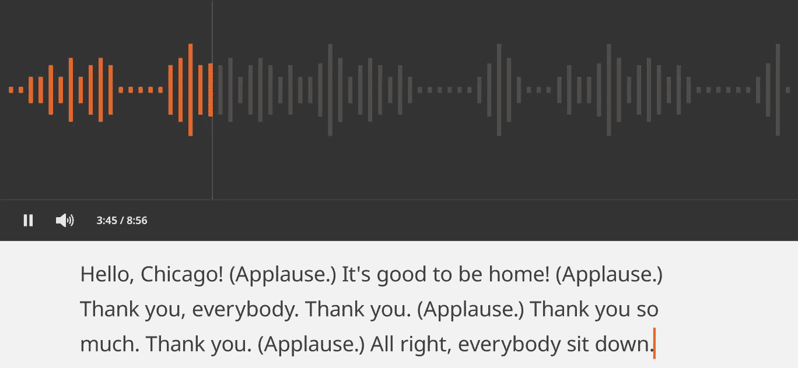
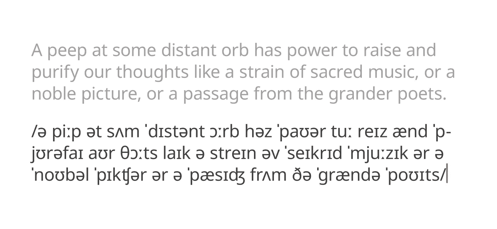
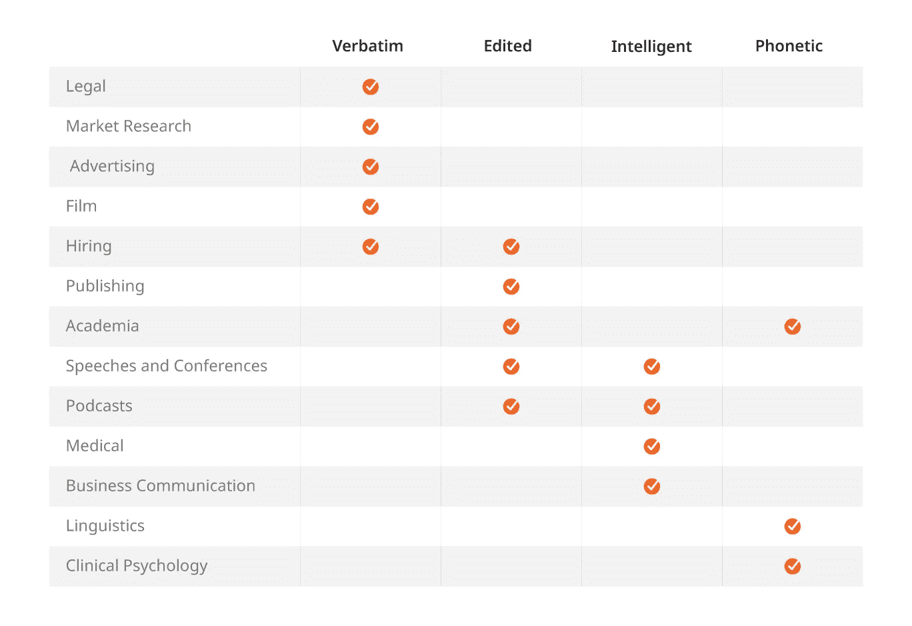

# 4 种音频转录类型以及何时使用它们

> 原文：<https://medium.datadriveninvestor.com/4-types-of-audio-transcription-and-when-to-use-them-13a9e03a5400?source=collection_archive---------7----------------------->

由于机器学习，音频转录的潜在用途正在迅速扩大。然而，为了最大限度地利用这项日益重要的服务，清楚地了解它所涉及的内容是至关重要的。有各种各样的[音频转录服务](/services/audio-transcription/)，每种服务都有不同的优势和局限性。不言而喻，您选择的音频转录类型会对您的项目产生巨大影响。

在这篇文章中，我们将帮助您找出哪种类型的音频转录是最适合您的。通过详细了解这四种主要服务，你将能够朝着完全适合你的音频文件的转录迈出第一步。

 [## 认知计算——一套被广泛认为是……

### 作为它的用户，我们已经习惯了科技。这些天几乎没有什么是司空见惯的…

www.datadriveninvestor.com](https://www.datadriveninvestor.com/2020/02/19/cognitive-computing-a-skill-set-widely-considered-to-be-the-most-vital-manifestation-of-artificial-intelligence/) 

# 逐字记录

也被称为真正的逐字或严格逐字转录，这是最详细的转录类型之一。它旨在捕捉录音中包含的所有填充词、停顿和非语言交流，以及说话者说出的所有单词。因此，逐字记录通常很长而且极其详细。如果音频包含多个说话者，逐字记录员也可以记录中断、诸如“对”或“嗯嗯”之类的会话肯定以及重叠的会话。

例如:

**包括:**所有的语言和非语言交流，如笑声、停顿和咳嗽。也可以包括周围的背景噪声，例如谈话或来自观众的噪声。

**不包括:**与文字稿无关的噪音或可能不必要地干扰阅读的噪音，如警笛声、雷声或建筑施工。

# 编辑转录

编辑转录，也称为干净逐字转录，通常是转录提供者的默认设置。就像逐字记录一样，它致力于保留文本的含义。一份好的编辑过的抄本不会意译原文或以任何方式改变它的意思。然而，它并不旨在捕捉说话者的交流方式。口吃，填充词如“喜欢”或“你知道”，以及不必要的非语言交流通常会被忽略。这是因为它们对文本的意义没有增加多少。相反，编辑转录的目的是在完整性和可读性之间取得平衡。

例如:

**包含:**说话人说出的所有必要文本。

**不包括:**环境噪音、声音、非语言交流。不影响意思的填充词或短语也被省略。对于具有多个扬声器的音频，也可以排除中断和肯定。

# 智能转录

有时也称为智能逐字转录，这项服务主要是将音频转录成简洁、可读的文本。在这里，转录者有更多的余地来编辑和删除语音的一部分，比上述各种转录。智能转录的目的是尽可能以最自然的方式传达演讲的意思，而不是仅仅依赖于演讲本身。这可以包括删除重复的句子和短语，甚至是对所说内容进行语法重组。

例如:

**包括:**优先清晰传达所言之意的录音版本。标点和语法错误将在适当的地方被改正。

**不包括:**除了去除噪音和非语言交流，最终产品将省略所有填充词、重复和离题内容。文字记录可能无法准确匹配音频中的话语，但应该包含所说内容的含义。

# 标音

音标是一种特殊的标音形式，与上面提到的其他类型的音频标音明显不同。它旨在捕捉说话者发出声音的方式，特别关注单词的发音。这也可以扩展到对说话者音调升降方式的注释，以及不同的声音在音频中如何重叠。注音需要特殊的符号系统才能正确执行，如下例所示:

**包括:**音频中扬声器发出的所有声音的完整目录，用音标书写。还可以包括详述说话者语调的进一步注释。有必要确认一下你的语音中是否会包含更传统的文字。

**不包括:**可能干扰抄本的噪音。

# 我应该使用哪种类型的转录？

这些不同的转录服务有如此多样的输出，很明显每个服务都适合不同的项目类型。你应该仔细考虑哪一种会给你带来最好的投资回报，因为你的抄本的内容在不同的抄本类型中会有很大的不同。作为一般规则:

*   **逐字记录**适合需要分析完整记录的非常详细的项目，例如法律工作。
*   编辑转录创建干净、专业的文本，既正式又全面。需要出版的文本通常受益于这种类型的抄本。
*   **智能转录**提供清晰易懂的转录。因此，它适合各种各样的一般业务用途，在这些用途中，需要快速阅读、消化和共享文档。
*   **音标**极其详细地解释了某事是如何说的。它通常用于学术界或语言学的专业项目。

某些行业也倾向于特定类型的转录。查看下图，了解你所在行业的其他企业通常如何处理他们的录音:

# Lionbridge 的音频转录服务

上面的信息应该有助于你启动转录计划。然而，选择正确的服务只是这个过程的开始。为了最大化你的转录投资回报率，你需要有经验的转录为你开展工作。

这正是 Lionbridge 可以提供帮助的地方。我们的专业转录人群都通过了我们严格的选择系统，并在所有上述转录类型多年的经验。他们在 5000 个城市和 300 种语言中工作，随时准备按照最高质量标准执行您的转录任务。联系我们的团队，您可以了解更多关于我们交付的各种音频项目的信息[。](https://lionbridge.ai/contact-sales/)

[原创文章](https://lionbridge.ai/articles/4-types-of-audio-transcription-and-when-to-use-them/)经许可转贴。

**访问专家视图—** [**订阅 DDI 英特尔**](https://datadriveninvestor.com/ddi-intel)