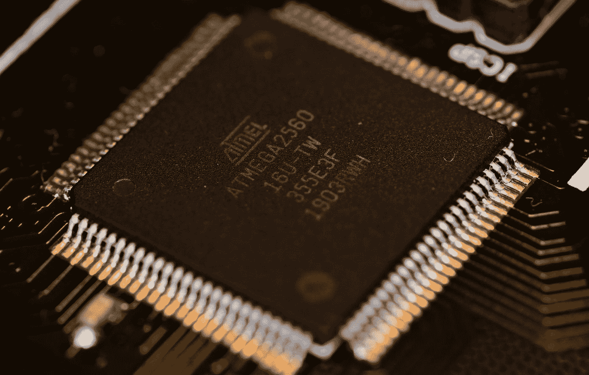

# 区块链正在以 4 种意想不到的方式改变我们的世界

> 原文：<https://medium.datadriveninvestor.com/4-unexpected-ways-blockchain-is-transforming-our-world-4567c691dba?source=collection_archive---------17----------------------->

## 区块链已经存在

Photo by [Hitesh Choudhary](https://unsplash.com/@hiteshchoudhary?utm_source=medium&utm_medium=referral) on [Unsplash](https://unsplash.com?utm_source=medium&utm_medium=referral)

[投机仍然是区块链最广泛的使用案例](https://www.forbes.com/sites/laurashin/2017/12/20/blockchains-are-for-speculation-and-thats-a-good-thing/#6d5b823a7b7a)，加密货币的波动性让投机者在相对较短的时间内获得巨额利润并创造财富。

加密货币的投机和投资是一把双刃剑。

投机维持了投资者对区块链的兴趣，为企业家和研究人员创造有用的产品提供资金。矛盾的是，技术创造了几种庞氏骗局、骗局和加密货币，其唯一目的就是赚钱。

但不全是钱和骗局。区块链以不同寻常的方式改变了我们的世界，我们以前从未想过这是可能的。

# 1.区块链正在拯救南非的野生动物

Created with [Canva Design](https://www.canva.com/design/DAEI03M02VU/2mKkm2nugYIsskk3hPEOeQ/edit)

[南非拥有世界上最多的犀牛数量](https://www.savetherhino.org/rhino-info/poaching-stats/)。这意味着它是猎人或偷猎者利用犀牛角和其他部分赚钱的天堂。

[在南非，每 12 个小时就有一头犀牛被偷猎](https://www.savetherhino.org/rhino-info/poaching-stats/)，每天还有其他动物被偷猎，比如非洲狮、大象、黑斑羚等等。

南非总统的儿子 Tumelo Ramaphosa 决定做些什么。他的公司 [**Studex**](https://www.studex-e.io/about-us) 追踪动物的位置、心跳和医疗状况，以确保它们健康安全。

不是这个。

听起来很超前！现在，你可以在南非虚拟地拥有一只动物，而不必在现实生活中见到它。所有的动物都由该地区的农民照料，保护它们免受偷猎者和疾病的侵害。这一切都是通过区块链实现的。**为什么是区块链？**

区块链提供了额外的安全层，能够从世界任何地方购买动物。区块链让动物交易，甚至零头购买动物成为可能！(他们这样做是因为有些动物的价格高达 1100 万美元)

是啊！现在你可以拥有 1/1000 的犀牛。怎么会？[使用 ERC-20 令牌](https://www.investopedia.com/news/what-erc20-and-what-does-it-mean-ethereum/)。你也可以通过一个 [ERC-721 不可替代令牌](https://www.youtube.com/watch?v=HTm-1JtI0fA)拥有一整只动物。

我就不细说这两个了，但这是最基本的-

[**【ERC-20】**](https://www.youtube.com/watch?v=-cknquI5LGA)**代币允许你对以太坊区块链上的可替代商品进行代币化，比如货币，这意味着所有代币将价值相同。你的一张 20 美元钞票和我的 20 美元钞票价值相同。**

**[**ERC-721**](https://www.youtube.com/watch?v=-cknquI5LGA) token 让你将以太坊区块链上不可替代的商品进行令牌化。比如动物。一头奶牛的价值取决于很多因素，如产奶量、年龄或生育能力。**

# **2.区块链是银行的救星**

****

**Photo by [Etienne Martin](https://unsplash.com/@etiennemartin?utm_source=medium&utm_medium=referral) on [Unsplash](https://unsplash.com?utm_source=medium&utm_medium=referral)**

****DEFI(分散式金融)**仍然是区块链最受欢迎的使用案例之一，为什么它不允许您-**

1.  **在没有抵押、银行账户、申请或会见任何人的情况下接受贷款。现在一切皆有可能！叫[**闪贷**](https://news.bitcoin.com/defi-flash-loans/)；它允许你贷款并在一次交易中使用。**
2.  **以最低的费用和低延迟从世界任何地方转移资金，同时保持您的匿名性、隐私和安全性。**

**有人可能认为这将是央行和政府的噩梦，但世界上某些地方的银行正在接受这项技术。**

> **[85%的意大利银行正在 Corda 上交换银行间转账数据](https://www.coindesk.com/85-of-italian-banks-are-exchanging-interbank-transfer-data-on-corda)**

**[**Corda** 是一个私人的区块链平台](https://www.r3.com/corda-platform/)，它只允许你与那些需要知道的人*安全地共享数据。***

**在传统系统中，意大利银行平均需要大约 30-50 天进行对账。现在用 Corda 一天就能搞定。**

** [## 区块链投票和美国选举|数据驱动的投资者

### 在不到 70 天的时间里，这个世界上最古老的民主国家将以前所未有的方式面临最大的摊牌…

www.datadriveninvestor.com](https://www.datadriveninvestor.com/2020/08/26/blockchain-voting-and-the-american-elections/) 

Visa、MasterCard 和 PayPal 现在正试图开发与区块链相关的产品来参与市场竞争。万事达卡授予了一个加密支付平台 **Wirex** ，一个[主会员许可 T5。这将允许客户持有并从该平台购买加密货币，并能够将其转换为法定货币，并在任何接受万事达卡的地方使用。](https://blockchain.news/news/credit-giant-mastercard-grants-wirex-first-principal-membership-license)

Chainlink 是另一种加密货币，它弥合了集中式和分散式系统之间的差距。这里有一篇关于 Chainlink 的详细文章-

 [## 集中式和分散式系统最终被“连锁”

### 什么是 Chainlink，它与其他加密货币有何不同

levelup.gitconnected.com](https://levelup.gitconnected.com/centralized-and-decentralized-systems-finally-get-chained-ba702dea972) 

# 3.区块链加速了半导体技术

Photo by [Akshat Sharma](https://unsplash.com/@asphotographypics?utm_source=medium&utm_medium=referral) on [Unsplash](https://unsplash.com?utm_source=medium&utm_medium=referral)

让区块链成为可能的一个核心因素是采矿。

> 矿工是区块链网络上的节点/计算机，他们共同维护和控制网络。他们解决密码难题，以保持区块链的安全性、匿名性和分散性。

矿工们通过解决无意义的密码难题来创造一个区块。而且挖掘需要很大的计算能力，**很多**。

> 2018 年比特币开采使用了 40-62 太瓦时的能源。这相当于匈牙利或瑞士等国家的能源消耗，相当于 1900 万至 3000 万公吨二氧化碳排放量。
> 
> [-亚历克斯·德·弗里斯](https://cen.acs.org/environment/sustainability/Bitcoin-poses-major-electronic-waste/97/i11)

但是还有一线希望。采矿加速了半导体技术的发展。

由于对节能和更强大的采矿钻机的高需求，各公司正在进行 ASIC 军备竞赛。区块链带动了 **7nm 芯片**的发展。更小的芯片尺寸消耗更少的能量，同时提供相同的性能。

中国领先的采矿肋骨制造商 Cannan 和 Bitman 报道称，他们将展示[**TSMC 5 纳米芯片**](https://news.bitcoin.com/chipmaking-giant-samsung-reveals-3nm-semiconductor-prototype/) **。**

这真的变得很有趣，因为现在领先的芯片制造商英特尔和三星正在介入这场游戏。

> 三星披露，该芯片制造商制造了第一个 3 纳米(GAAFET)原型。英特尔透露，该公司预计到 2029 年设计 2 纳米和 1.4 纳米半导体。杰米·莱德曼

这种芯片的开发不仅会使区块链技术变得更容易获得和可行，还会改变我们每天使用的设备。计算机芯片无处不在，任何一种改进都有可能改变我们的生活。

# 4.加密是通货膨胀的新避风港

Photo by [Imelda](https://unsplash.com/@unleashed_?utm_source=medium&utm_medium=referral) on [Unsplash](https://unsplash.com?utm_source=medium&utm_medium=referral)

因为疫情，许多国家都遭受了通货膨胀和失业。在世界范围内，人们的钱和储蓄都在通货膨胀中流失。

这是蒂姆·丹宁关于这个问题的一篇好文章

 [## 如果你有钱，它就要贬值(很多)

### 美联储预计将通胀率从 2%上调至 4%。通货膨胀率可能会更高，这取决于你如何…

medium.com](https://medium.com/the-ascent/if-you-have-any-money-its-about-to-lose-a-lot-of-value-b78c6d2843f7) 

在拉丁美洲，由于政治不稳定、油价暴跌和商业萧条，一些国家正面临通货膨胀。巴西和委内瑞拉等国的人们正在采用比特币等替代品来拯救他们的财富。

在香港，政府通过立法，允许警察搜查私人财产，冻结或没收资产，并在没有搜查令的情况下控制互联网。这样做是为了压制言论自由。

香港市民正转向更安全的替代方式，如稳定的硬币和加密通信，以抵制政府审查。

我最近写了一篇关于黄金支持的稳定硬币的文章。它是大多数加密货币的可信替代品。

 [## 你应该投资黄金支持的密码吗

### 这个令牌给你两全其美的东西，可以让你免受通货膨胀的影响

medium.com](https://medium.com/datadriveninvestor/should-you-invest-in-a-cryptocurrency-backed-by-gold-a75495128a64) 

还有许多其他领域区块链有着深远的影响，但我不能在这里涵盖它:区块链使捐赠更加透明；它让企业的供应链更加安全可靠；发展中国家的人们可以用它来收获和销售太阳能。

区块链正在真正改变我们的世界，但我们还有很长的路要走。区块链仍处于起步阶段，就像 90 年代的互联网一样。有很多摩擦，学习曲线，波动性，加密骗局，以及社会中知识的缺乏，这使得加密很危险，并不适合每个人。

# 参考资料和资源

[视频被冷聚变](https://youtu.be/_3gbo_NinT0)

 [## 区块链——非洲崛起

### 世界正以前所未有的爆炸性速度经历着技术发展。被认为是“第四…

www.forbes.com](https://www.forbes.com/sites/tatianakoffman/2019/04/04/blockchain-africa-rising/#58b6cc4e7711)  [## 比特币和加密货币影响半导体制造业

### 比特币和加密货币挖掘继续为半导体制造商带来不断增长的机会，并且…

chiefexecutive.net](https://chiefexecutive.net/bitcoin-and-cryptocurrency-influence-semiconductor-manufacturing/)  [## 芯片制造巨头三星披露 3 纳米半导体原型|挖掘比特币新闻

### 12 月中旬，英特尔透露，该公司预计到 2029 年设计出 2 纳米和 1.4 纳米半导体。在…期间

news.bitcoin.com](https://news.bitcoin.com/chipmaking-giant-samsung-reveals-3nm-semiconductor-prototype/)  [## 香港市民求助街头抗议国家安全法

### 在香港，一些当地居民正转向加密资产和加密通信来抵御金融…

www.coindesk.com](https://www.coindesk.com/hong-kong-citizens-turn-to-stablecoins-to-resist-national-security-law) 

## 访问专家视图— [订阅 DDI 英特尔](https://datadriveninvestor.com/ddi-intel)**