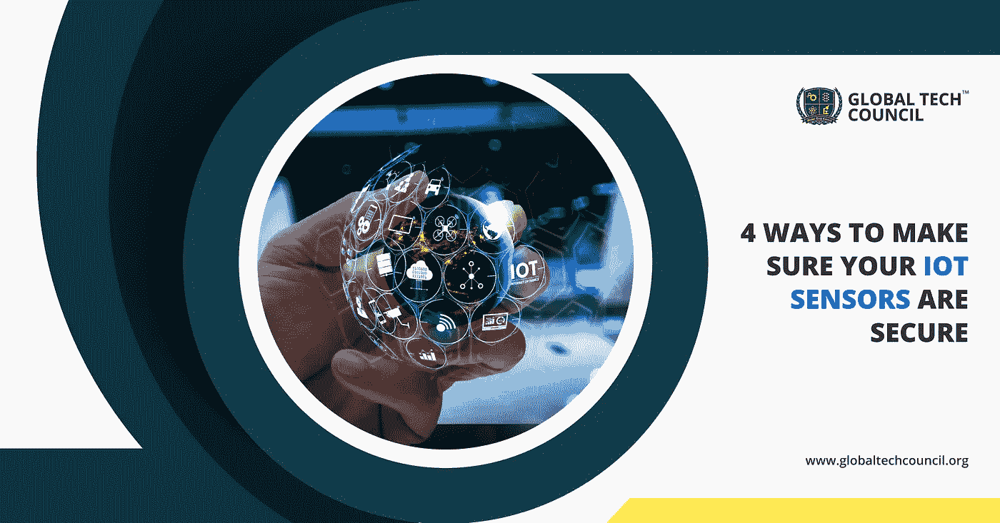

# 确保物联网传感器安全的 4 种方法

> 原文：<https://medium.datadriveninvestor.com/4-ways-to-make-sure-your-iot-sensors-are-secure-adcf23f19316?source=collection_archive---------9----------------------->

智能电视、游戏机、安全摄像头、智能锁和智能恒温器——几乎所有联网的智能设备都在让你的家庭变得更加智能和高效。它们确实给你的生活增加了一定程度的便利，但现在你需要保护你的设备，防止它受到网络攻击。

安全不一定是一个毁灭性的挑战。物联网开发商**将一些基本的安全功能包含在内，可以创建具有必要安全标准的设备，同时为随着时间的推移添加额外的安全功能奠定坚实的基础。**

****

****学习博客****

*   **易受攻击的原因**
*   **开发人员的安全考虑**
*   **用户确保传感器安全的四种方式**
*   **更改默认设置**
*   **保护您的连接**
*   **不要堆积更新**
*   **使用防火墙**
*   **一锤定音**

**在本文中，我们讨论了保护智能设备的防御机制以及对它的需求。**

## ****漏洞原因****

**随着新产品和新技术进入市场，物联网(IoT)领域正在全球范围内发展壮大。一个**物联网专家**需要接受新兴的物联网标准，在这个竞争激烈的领域中区分产品，应对市场挑战，并利用物联网协议。由于这些挑战，安全性可能不是最重要的。这使得家用路由器和安全摄像头等物联网设备更容易受到恶意软件的攻击。**

** [## 物联网和采矿业的未来|数据驱动的投资者

### 物联网可以做出重大贡献的领域之一是采矿！2 月 3 日，在开普…

www.datadriveninvestor.com](https://www.datadriveninvestor.com/2020/03/02/internet-of-things-and-the-future-of-the-mining-industry/) 

这些设备易受攻击的原因可分为三类:

1.  实现—由于缓冲区溢出和随机数生成器的不正确播种等编码错误而出现的弱点可在网络攻击中加以利用。
2.  设计——在设备开发过程中未能包括必要的措施会导致设计漏洞。使用硬编码密码和没有安全引导的设备就是例子。
3.  部署—这些通常是用户在安装时引入的问题，例如使用弱密码或默认密码。

安装智能传感器的主要挑战是，它们的设计和实施方式必须确保传感器本身不会提供容易受到攻击的新攻击面。

**开发人员的安全考虑**

有充分的证据表明，物联网设备带来了新的安全风险，这使得风险管理成为物联网公司战略的一个关键要素。确保物联网数据完整性至关重要。有关隐私政策和启用更新的信息必须公开，以保护物联网传感器。利用加密代码的安全引导确保不涉及第三方，并且安全固件更新在填充设备的情况下做同样的事情。

除了在传感器设备中构建安全功能，还需要解决整个网络的安全问题。传感器认证及其数据需要易于验证，并且应该在预期的时间内有效地收集，并与分析系统进行可靠的通信。

即将到来的 [**物联网培训**](http://keywords) 将存储在设备上的敏感数据加密视为模块的一部分。

# **用户确保传感器安全的四种方式**

以下是用户可以用来保护其物联网设备和数据的一些战术步骤:

**1** 。**更改默认设置**

定制一些标准标识符非常重要，例如路由器名称、用户名和密码。此外，建议您的密码中包含一个大写字母、一个唯一字符和一个数字。您也可以禁用不需要的功能。

**2** 。**保护您的连接**

作为一个用户，你应该知道所有设备都可以被攻击什么。这些通常是安全摄像机、游戏控制台、智能电视、笔记本电脑等。不用的时候，把它们关掉，这样它就不在网络上了。此外，对所有设备使用两步认证并避免使用公共 Wi-fi 网络也很有帮助。

**3** 。**不要堆积更新**

最好让你的系统处于自动更新模式，这样黑客就没有漏洞了。在办公室环境中，这些漏洞可以被修补，而且物联网专家必须彻底检查这些修补程序。如果可能，审核现有设备。

**4。** **使用防火墙**

防火墙充当抵御潜在威胁的额外安全层。物联网设备可能会提供防火墙；如果没有，您可以根据您的互联网使用情况获得一个额外的。拥有一个强大的加密方法也是有益的，比如 Wi-fi 的 WPA2，并建立一个访客网络——这将保持你的设备系统的私密性。

## **最后一句话**

安全性，无论听起来多么微不足道，都是所有物联网设备的要求。如果你是这个领域的新手，或者希望以工程师的身份优先开发安全功能，可以查看 [**物联网认证**](https://www.globaltechcouncil.org/internet-of-things-certification/) 。只有通过安全包容，我们才能确保物联网连接的传感器和系统免受网络攻击。**