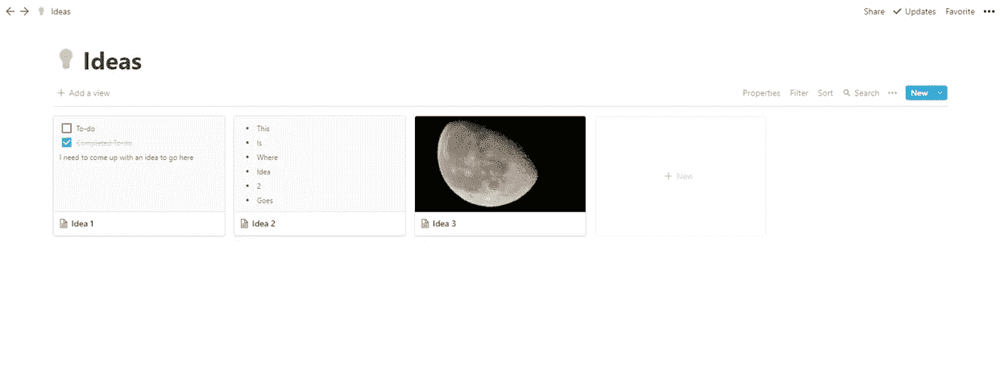
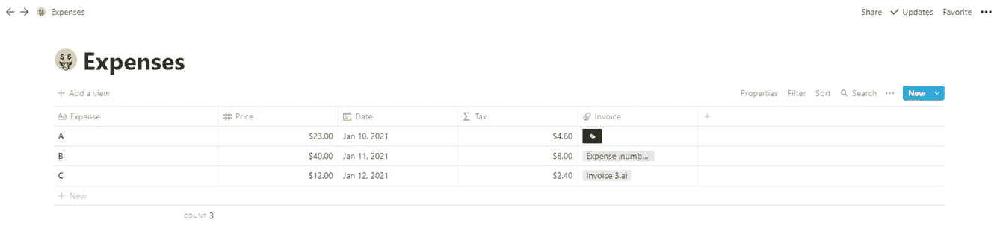
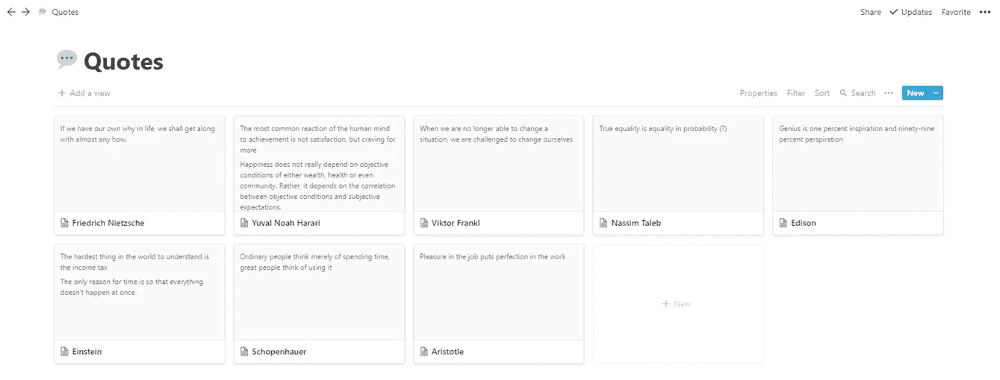

# 4 种运用理念改善组织的方法

> 原文：<https://medium.datadriveninvestor.com/4-ways-to-use-notion-for-better-organisation-9399719d4bef?source=collection_archive---------17----------------------->

## 使用免费应用程序简化生活的简单方法

Photo by [Luke Peters](https://unsplash.com/@lukepeters?utm_source=unsplash&utm_medium=referral&utm_content=creditCopyText) on [Unsplash](https://unsplash.com/s/photos/organization?utm_source=unsplash&utm_medium=referral&utm_content=creditCopyText)

自从高中毕业后，生产力、时间管理和最大限度地利用我的精力的能力一直是我奋斗的目标。以前也很纠结，但是除了作业和电子游戏，我没什么好担心的。大学是一个不同的领域，不得不兼职意味着我必须快速解决问题。

事实是，我仍然不擅长管理我的时间。我仍然在拖延，但肯定比 6 个月前少了。这没有什么可感谢的，当然也不是一个用来帮助你安排生活的应用程序。

但观念绝对是这个系统中的一个齿轮，它让我从 2020 年初开始至少重新控制了我的一些时间，所以我想我会分享我使用它的一些方式，不仅仅是为了组织我的生活，而是为我可能不会费心的事情找到地方。

## 1.文章策划人

让我们从一个与你阅读本文的平台相关的问题开始。我主要用观念来组织，而观念主要是我正在组织的东西。我指的是潜在文章的标题、要包含在这些文章中的注释，甚至是我可能在文章中使用的图片。

我有一整节专门讨论中型文章，这允许我将文章分成几个不同的类别:

文章观点

需要研究

书面

编辑中

完成

出版

Screenshot of an Article Ideas board

您可以将这种设置视为一个板，它本质上允许您在准备好的时候轻松地在列之间拖放东西。这是一个超级简单的方法来跟踪我所有的中型文章，这种结构也适用于其他类似的计划者，比如你自己博客的文章，或者你正在写的一本书的章节。

## 2.各种想法

下一个功能并不特别针对写作，事实上它只是任何想法的一个总规划器。concept 中的 Gallery 视图允许您创建不同的信息框、图像、列表和任何其他内容，可以在下图的结构中查看。

Screenshot of a potential Ideas board

在观念中创造任何东西都是非常容易的，但是我发现观念的画廊视图是非常简单和有效的。这是因为你可以在任何一个盒子里放上任何你想要的东西，所以有很大的创意空间。

我通常只是在便利贴上草草记下一些东西，或者在手机上添加一个快速提醒，但这个 ideas 系统非常适合那些有更多想法的人。

这样，你可以给这个盒子一个主要思想的标题，但是在盒子里面你可以包括次要思想或者细节，否则如果你只是简单地写下大概的思想，你可能会忘记。

这个系统的自由形式的本质是辉煌的，只要记下你想到的，或整理照片，或保持多个列表在一起。你真的可以把它变成你自己的，如果你愿意，你也可以使用不同的视图，但是 Gallery 视图把所有的东西都放在一个地方，我发现这非常有用。

## 3.费用追踪器

现在，概念不是一个数字会计软件，用来为你的企业记录事情。然而，我发现它是一个有用的地方，可以用来保存我一年的开支的一种粗略的草案。

如果你是个体户，在某些时候你需要交税。这意味着你需要记录你的收入和支出。有一百万种方法可以做到这一点，通常你需要保持相当正式的记录，以防你的税务机关的人需要检查事情。但是在你把它正式化并把它放进一个可能更复杂的电子表格之前，概念是一个很好的地方。

An example of an Invoices table

使用表格视图，您可以创建一个相当基本的电子表格，如上图所示。你可以随心所欲地给这些列加标题，并让它为你运行计算，找到诸如物品的税金或各种货币的价格等信息。

但是我发现的一个有用的东西是，您还可以将文件附加到单个单元格，我使用这种方法将费用及其成本与其对应的发票联系起来。您可以在这里添加 pdf、图像或任何其他形式的发票，如下图所示。

发票保存在我电脑的其他地方，但将它们添加到这个概念电子表格中意味着我总是知道它们在哪里，它们代表哪些费用，而不必实际打开它们。这有助于简化流程，让我更有条理。

你可以为任何你想要的东西添加列和行，你可以根据你的具体需要来定制它。也许您希望包含一个列，列出您购买该商品或服务的商店或组织，然后您可以有这些特定地点的运行总数。它确实是非常可定制的，而且相当直观(比 Excel 更容易让人沮丧)。

## 4.最喜欢的引语列表

最后一个更像是个人的事情，你可能想做同样的事情，或者用它来启发一些完全不同的东西。我喜欢再次使用画廊视图，并创建标题为名人的区块。然后，在盒子里，我贴上我最喜欢的名言。

现在，我不会提前创建这些框，而是当我遇到引用的时候。我不会主动去寻找它们，因为大多数都出现在，例如，我阅读的媒体故事或我观看的视频中。当我看到或听到我喜欢并想记住的东西时，我会为那个人创建一个盒子，然后添加引用。简单。

A Quotes gallery

如果我已经为那个人创建了一个盒子，那太好了！然后，我开始建立一套我认为对我的生活有某种价值或相关性，或者听起来很机智的语录。我总是听到我想记住的事情，这是确保我不会忘记这句话或者是谁说的好方法！