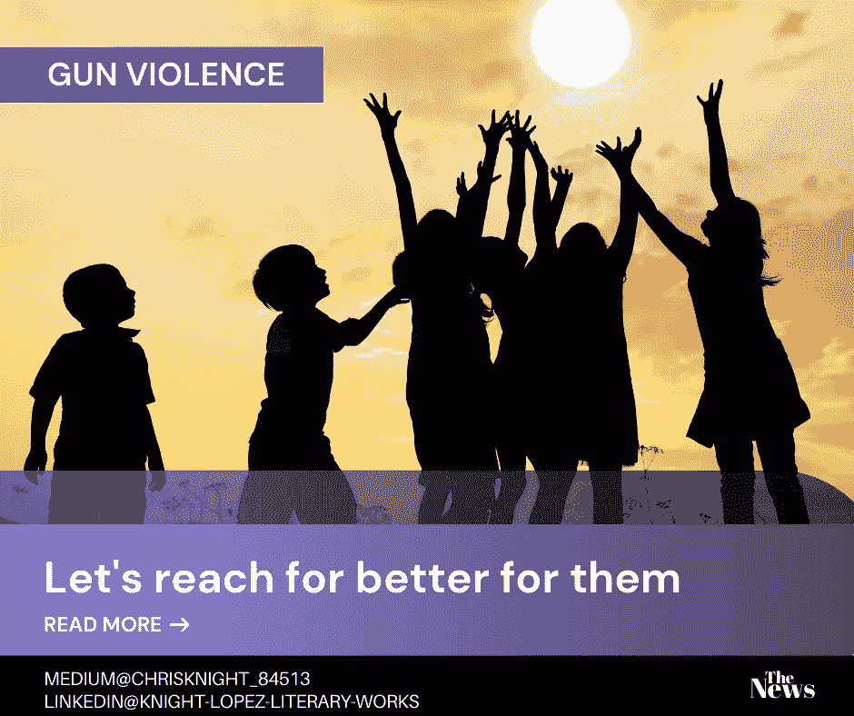

# 41，000 个灵魂被铭记，没有被遗忘

> 原文：<https://medium.datadriveninvestor.com/41-000-souls-remembered-not-forgotten-660424936876?source=collection_archive---------14----------------------->

## 我们的经济影响没有消失。我们本可以过的生活不会被遗忘。在生者中死亡不仅仅是他们生命中的另一页。

Source: Self Created Image with [Canva](http://www.canva.com).

**砰！**

夜静了。热量从混凝土人孔散发出来，这些人孔标志着街道框架的出口。建筑物矗立在空旷的街道上。每栋建筑都有自己的故事。每扇窗户都是见证事件发展的眼睛。

下面的人过着他们的生活。人们在白天自主地忙碌于他们的现实。在夜里，人们怀着各种不同的目的爬行。

月亮升起后能感觉到恐惧。

饥饿常常很早就能感觉到。

幸福总是短暂的。

街道寂静结构上的一个裂口撕裂了覆盖现实的外衣。

**爆裂声！！**

子弹从一个光点射出。光照亮了它的发送者的火。还不是男人的男孩们为自己的身份而奋斗。

他们一生都被教导要暴力。暴力和性是男性认同的主要内容。这种谬论的结果是，[194377 个婴儿是由 15-19 岁的女性所生](https://www.cdc.gov/nchs/data/nvsr/nvsr67/nvsr67_08-508.pdf)。几乎所有这些孩子的父亲都是尚未成年的男孩。

没有一个男孩在 15 岁时被告知做父亲的经济后果。很少有人理解没有罐子的种子所带来的艰辛。

许多人没有看到统计数据，只有大约 50%的青少年母亲在 22 岁时获得高中文凭。这些男孩没有看到与不生育的青春期女性的对比。

大约 90%的青春期女孩从高中毕业，在这个年龄组没有孩子(资料来源:Perper K，Peterson K，Manlove J。《儿童趋势》，概况介绍出版物# 2010–01:DC 华盛顿州:儿童趋势；2010).

**流行！！！**

男孩和男人的肉体是一样的。我的旅程也是如此。我进出。有时我会进去住下。

有人称我为战争伤疤。

别人叫我战伤。

我称自己为生命的传递者和窃取者。

我可以一口气拯救和毁灭。我既是怪物又是救世主。

[我曾经收留过 42000 多名美国居民。他们说他们自杀了，但我是去取他们性命的。另有 16000 人被杀害。他们说我是暴力死亡危机的一部分，这是一个严重的公共健康问题。](https://www.apha.org/-/media/files/pdf/topics/gun/nvdrs.ashx?la=en&hash=240150124707D8559EFF583543CB9519CFA35047)

当男孩们倒下时，人们来移走他们的尸体。我留下来的一些尸体。我深入他们的身体，留下来倾听。我去旅行，听对话。

我每把一个灵魂送入地下，我就从这个地球上取走 270 万美元的终生收入。

这些是我从单身母亲那里得到的收入。[有人说我是 41%贫困单身母亲的原因](https://www.childtrends.org/indicators/children-in-poverty#:~:text=In%202017%2C%2041%20percent%20of,living%20in%20married%2Dcouple%20families.)。

我为我就是而争辩。如果我没有被解雇，我怎么能杀人呢？我的存在是祸是福？我被创造是为了什么？

你怎么评价我？不管你说什么，我都是死神。我结束生命。没有其他功能。即使是在保护中，我也会结束生命。

现在我看到这次旅行结束了。

 [## 对有商业头脑的投资者有用的行为经济学概念|数据驱动的投资者

### 在美国企业界，高斯统计，对我们周围世界的确定性解释，以及理性…

www.datadriveninvestor.com](https://www.datadriveninvestor.com/2020/07/09/helpful-behavioral-economics-concepts-for-the-business-minded/) 

**大意了！！！！**

枪支暴力会带来终身影响。通常关注的焦点是社交。很少有人理解社会含义对我们社区的经济产生的影响。虽然情感创伤、家庭损失和社会问题是关注的焦点，但对社区的影响不能被削弱。

没有双职工的孩子更有可能成为罪犯，对社会没有贡献，并且容易吸毒。

经济安全是稳定的基础。钱永远不是问题的答案；但是，没有钱，一个问题会一直存在。我们必须学会在年轻人进入影响我们所有人的生活方式之前对他们进行再教育。

积极的教育会影响我们国家债务的偿还率，有助于为我们使用的基础设施提供资金，并有助于扩大我们的 COVID 19 刺激计划的基础。

让我们一起努力来帮助我们的家庭和我们的经济。

祝你知识成功！

***

关于 Christopher:Christopher Knight Lopez 是一名职业骗子，在他的职业生涯中，他与职业企业家进行了广泛的合作。在他 14 年的职业生涯中，Christopher 已经开了超过 7 家公司。克里斯托弗的目的是利用各种市场驱动的机会。Christopher 是注册项目经理(MPM)和认证财务分析师(AFA)。Christopher 之前通过了 65 系列证券执照考试。克里斯托弗也有他的总路线——人寿、意外、健康和健康维护组织。Christopher 已经管理了总计 2 . 86 亿美元的报告管理资产和建议资产。Christopher 在 29 个国家有工作经验，为各种业务筹集了超过 5000 万美元，在他的个人职业生涯中总收入超过 1300 万美元。Christopher 曾在高科技行业工作:生物技术、金融、证券、制造、房地产和住房抵押贷款。克里斯托弗是一名美国空军老兵。克里斯托弗热爱家庭、竞技体育、钓鱼、武术，并倡导企业家精神。克里斯托弗为崭露头角的企业家提供自助课程。克里斯托弗对导师的热情来自于企业家和骗子需要指导的信念。这个世界充满了关于企业家身份的相互矛盾的信息。在[www.christopherklopez.com 看更多。](http://www.christopherklopez.com.)

免责声明:这些信息并不意味着是一种投资建议或财务建议。不要把这种情况应用到你自己的个人环境中。各种风险包括:商业风险、投资风险、政治风险和其他风险。此信息仅用于信息和教育目的。请不要向作者寻求任何投资策略或哲学。针对自己的情况，请咨询自己的理财顾问或法律顾问。不是任何形式的推荐或认可。

## 获得专家视图— [订阅 DDI 英特尔](https://datadriveninvestor.com/ddi-intel)