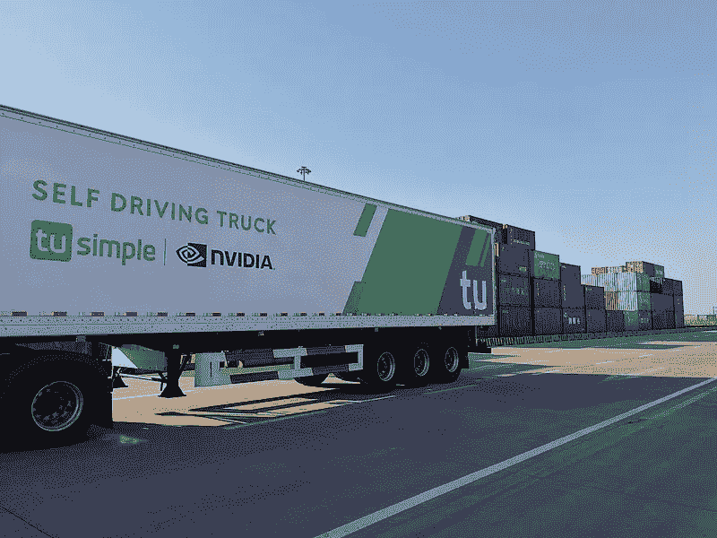

# 2021 年，中国将有 5000 辆自动驾驶卡车上路

> 原文：<https://medium.datadriveninvestor.com/5-000-autonomous-trucks-will-hit-the-roads-in-china-in-2021-4e13ab17b54e?source=collection_archive---------5----------------------->

Photo: Xuejc1988 at Chinese Wikipedia, CC BY-SA 4.0, via Wikimedia Commons

## 由 TuSimple 驱动的卡车在 18 个月的测试中行驶了 45，000 公里，没有发生事故。

被认为是中国致力于开发自动驾驶卡车的最大公司之一的图森未来，今年初给自动驾驶卡车行业带来了一个好消息，该公司批准了其建立一支 5000 辆自动驾驶卡车车队的许可，可以在中国的道路上行驶。

在过去的 18 个月里，图森未来汽车的里程达到了令人印象深刻的 45，000 公里。

测试阶段在上海进行，往返于工厂、仓库和当地港口，没有任何重大事故报告。

该公司的卡车现在将被允许在没有人类司机的情况下完全自动地在中国境内行驶。

这一声明对安全性具有重要意义，因为它表明了这项技术的成熟。毕竟，货车事故被社会认为非常严重。

# 一个巨大的商机

这些新成就将使图森未来自 4 年前成立以来首次实现盈利。该公司预计仅从需要他们服务的运营商那里每年就能获得 3 亿美元的净利润。

此外，图森未来计划在 2021 年向股市开放资本。分析师预测图森未来首次公开募股的价格将为[70 亿美元](https://technode.com/2020/08/17/robotruck-firm-tusimple-seeks-ipo-valuation-of-up-to-7-billion/)。

# 自动驾驶卡车的优势

自动驾驶的卡车，除了严格遵守交通法规，还能不间断地进行长途旅行。中国有一项法律规定，司机必须每隔 **8 小时**休息一次，因此该方法被认为是优化交通运输行业的一个机会。

在欧洲，TuSimple 通过与德国慕尼黑的大众集团子公司 [Traton Group](https://venturebeat.com/2020/09/23/tusimple-expands-self-driving-trucks-to-europe-with-traton-partnership/) 签署战略协议而存在，根据当前的**欧洲**法律，驾驶 12 吨或以上车辆的**司机**受到每天 9 **小时**的**限制，一周 56 小时，两周 90 小时。**

# 结论

卡车运输行业将自主技术视为一项重大投资，原始设备制造商在研发方面投入了数百万美元。

自动卡车运输是一个巨大的商机，它将很快成为现实。今天就在这里。

法律是唯一阻止其全球采用的东西。法律会变的。届时，我们将看到全球货物运输方式的巨大转变。

# 来源和参考

*   欧洲卡车司机遵守严格的 HOS 规则-[https://www . fleet towner . com/fleet-management/article/21674375/European-truckers-deal-with-strict-HOS-regs #:~:text = Under % 20 current % 20 European % 20 law % 2C % 20 any，be % 20 extended % 20 to % 2010% 20 hours。](https://www.fleetowner.com/fleet-management/article/21674375/european-truckers-deal-with-strict-hos-regs#:~:text=Under%20current%20European%20law%2C%20any,be%20extended%20to%2010%20hours.)
*   Felipe Zmoginski 无重大事故，中国发布 5000 辆自动驾驶卡车上路—[https://www . rue TIR . com/2021/02/03/feli PE-Zmoginski-无重大事故-中国发布-5000 辆自动驾驶卡车上路/](https://www.ruetir.com/2021/02/03/felipe-zmoginski-without-major-accidents-china-releases-5000-autonomous-trucks-on-the-roads/)
*   TuSimple 与 Traton partnership 将自动驾驶卡车扩展到欧洲—[https://venturebeat . com/2020/09/23/tu simple-expands-self-driving-trucks-to-Europe-with Traton-partnership/](https://venturebeat.com/2020/09/23/tusimple-expands-self-driving-trucks-to-europe-with-traton-partnership/)