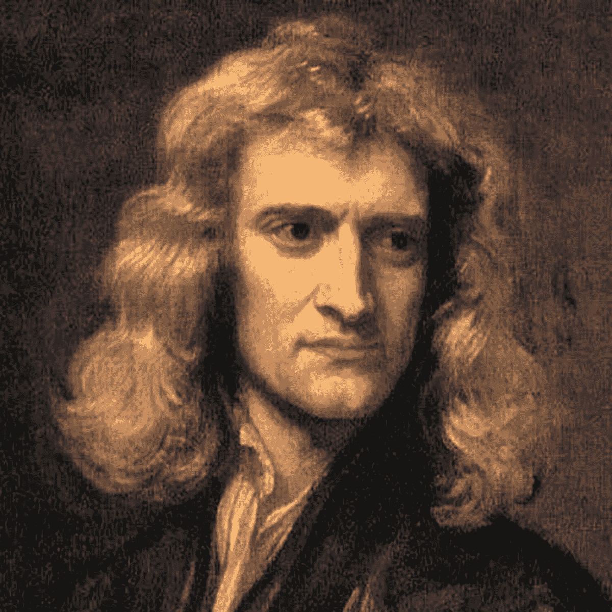
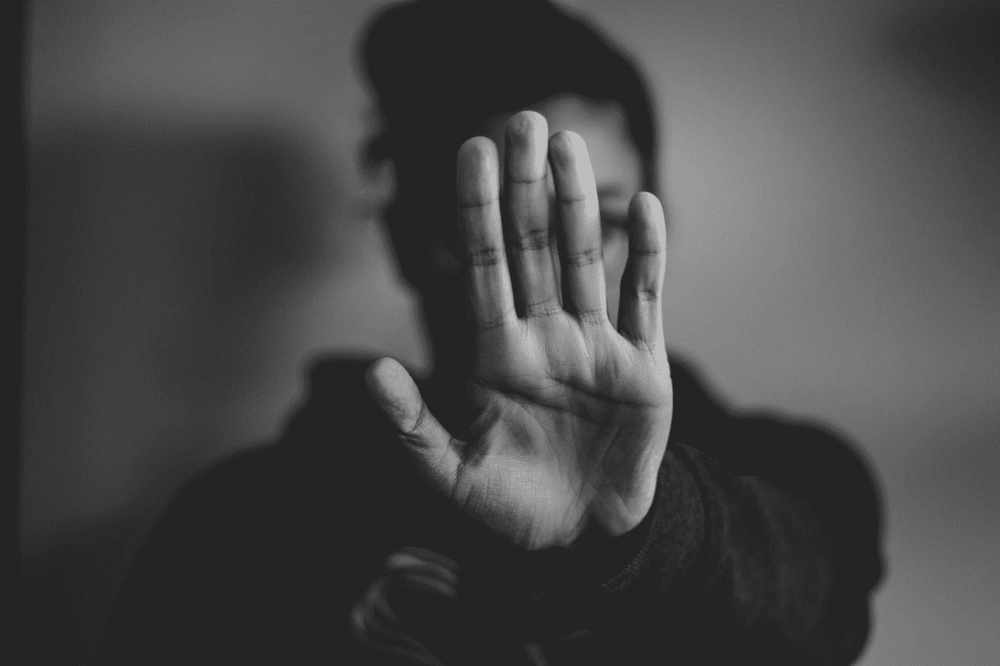
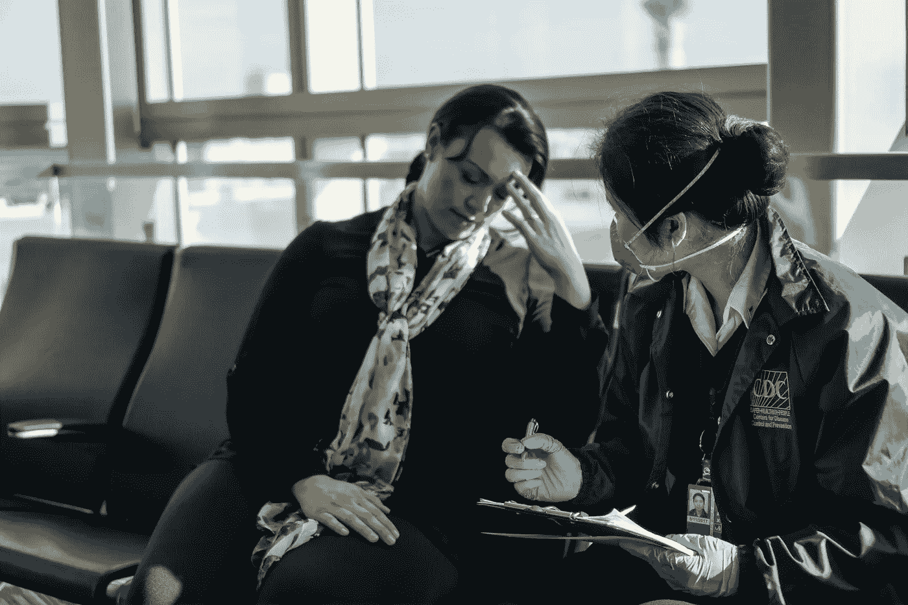
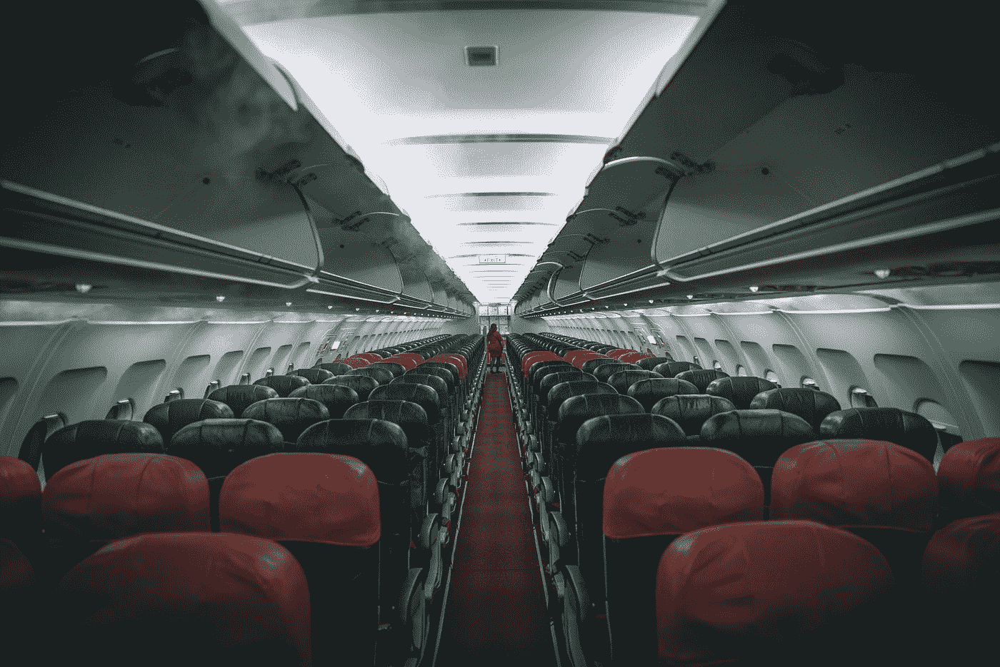

# 阻止航空公司从危机中恢复的 5 个行动

> 原文：<https://medium.datadriveninvestor.com/5-actions-that-will-prevent-airlines-crisis-recovery-327387b7bdc4?source=collection_archive---------20----------------------->

Photo by [Gary Lopater](https://unsplash.com/@glopater?utm_source=medium&utm_medium=referral) on [Unsplash](https://unsplash.com?utm_source=medium&utm_medium=referral)

3 月 13 日星期五，也就是总统就新冠肺炎问题首次向全国发表讲话的两天后，我搭乘了最后一班飞机

这是一架从北卡罗来纳州夏洛特飞回波士顿的捷蓝航空公司的飞机。太棒了！

抛开我戴着一次性手套，用 Clorox 湿巾擦拭每一个表面的事实，我觉得我像是在私人飞行。

我是我这一排唯一的人，没有人在我的前面或后面。小吃和饮料非常丰富。乘务员友好而殷勤。甚至登机过程也是迅速有序的。

但当呆在家里的命令在接下来的周一生效，我与客户分享我的旅行故事时，他们惊呆了。我怎么能冒这样的风险呢？我觉得安全吗？我戴面具了吗？

他们的反应让我吃惊。毕竟，这些高管是经常出差的人，甚至是经常出差的人。然而，他们声音中的恐惧透露出对旅行的看法正在改变。曾经是工作中不可或缺的邪恶和度假的高效解决方案，在短短 3 天内，变成了毫无意义的风险。

在那次飞行后的两个月里，航空业受到了冲击。考虑:

*   [美国商业航空公司乘客量下降 94%](https://www.airlines.org/dataset/impact-of-covid19-data-updates/)
*   [美国私人飞机航班减少 80%](https://www.quandl.com/)
*   [每天全球商业航班数量减少 75%](https://www.airlines.org/dataset/impact-of-covid19-data-updates/)
*   [全球每日航班搜索次数下降 80%](https://www.quandl.com/)
*   [预订和旅行之间的时间增加了 61%](https://www.quandl.com/)

 [## 艾预测:“颠覆，然后是生产力”|数据驱动的投资者

### 人们越来越担心，随着机器学习和互联网的普及，所有白领工作都将消失

www.datadriveninvestor.com](https://www.datadriveninvestor.com/2018/08/06/ai-forecast-disruption-then-productivity/) 

最后一个数据——预订和旅行之间的时间增加了 61%——表明人们不希望很快乘坐飞机。但是，这种预期是对为使曲线变平而采取的严厉措施的反应，还是改变旅行习惯的迹象？

许多专家和行业协会都在关注航空业在 911 事件和 2008 年全球金融危机后的复苏数据。根据美国[航空公司](https://www.airlines.org/dataset/impact-of-covid19-data-updates/)的数据，客运量和收入用了 3 年时间才恢复到 9/11 前的水平，大约用了 7 年时间才恢复到 2008 年金融危机前的水平。

**残酷的事实是——我们不可能知道接下来会发生什么。9/11 和 2008 年金融危机与我们现在所经历的是完全不同的事件。**

因此，虽然我理解为什么人们会关注这些过去的事件——数据提供了一种对未来的舒适和控制感——但使用这些数据是毫无意义的。它给人一种温暖舒适的错觉，认为事情不会改变太多，回到过去是不可避免的。

## 我们需要从物理学中寻找答案，而不是从过去寻找答案。

准确地说，是牛顿第三定律。它指出，对于每一个行动，有一个平等和相反的反应。

通过观察航空公司、监管和立法机构目前正在考虑的行动，有可能预测客户的相同和相反的反应，从而预测新常态*可能会是什么样子。*

Photo by [Nadine Shaabana](https://unsplash.com/@nadineshaabana?utm_source=medium&utm_medium=referral) on [Unsplash](https://unsplash.com?utm_source=medium&utm_medium=referral)

**措施:**跨越州或国家边境的旅行者必须隔离 14 天，除非他们能证明自己是新冠肺炎阴性

反应:人们将把旅行限制在自己的州或国家内

美国大多数州和许多国家对进入其管辖区的人实行 14 天的强制隔离。鉴于大多数旅行持续时间不到两周，这些限制基本上使大多数旅行不切实际。

一些地方，如香港和维也纳，正试图通过在机场对到达的乘客进行检测来减少这一障碍，如果他们的新冠肺炎病毒检测呈阴性，就可以免除他们的检疫。

但是，根据福布斯杂志的高级撰稿人塞西莉亚·罗德里格斯的说法，在疫苗广泛可用之前，“旅行可能会首先以‘居家旅行’的形式回到国内市场，然后在跨地区扩张之前回到一个国家的最近邻国，最后跨洲欢迎长途国际目的地旅行的回归”。

Photo by [Dino Reichmuth](https://unsplash.com/@dinoreichmuth?utm_source=medium&utm_medium=referral) on [Unsplash](https://unsplash.com?utm_source=medium&utm_medium=referral)

**行动**:航班减少、运力下降导致价格上涨

**反应**:随着假期变成公路旅行，商务旅行者继续使用虚拟会议技术，需求减少

根据关注旅游业的研究公司 [Longwoods International](https://www.cnbc.com/2020/05/10/heres-how-travel-will-change-after-the-covid-19-pandemic-recedes.html) 的研究，82%的人在未来 6 个月内改变了他们的旅行计划。这些人中有 22%的人从飞行变成了驾驶。

“我们的客户现在有点犹豫要不要坐飞机，”弗吉尼亚州麦克林市麦凯布世界旅行社的营销总监杰西卡·格里斯卡瓦奇告诉美国消费者新闻与商业频道记者。“我们已经在为今年剩余时间的驱动器市场做准备，很可能会持续到 2021 年。”

在我与商业客户的交谈中，这种转变不是从航空旅行到公路旅行，而是更剧烈的转变——从旅行到不旅行。对于大多数大公司来说，业务并没有停止，甚至没有放缓。相反，它转向了像 Zoom 和微软团队这样的技术。随着人们越来越适应“虚拟”工作，这些解决方案将变得更有吸引力，就像坐飞机一样有效。

**行动:**飞行前 4 小时的处理，以确保所有的行李都经过消毒，所有的乘客都是健康的

**反应**:商务旅行者会选择私人航班或部分喷气式飞机所有权，而不是商业航空旅行

根据屡获殊荣的商务旅行领导者公司的调查，平均商务旅行时间约为 3 天。由于大部分时间都在开会，高管们既没有时间也没有耐心花半天时间办理登机手续、安检和健康检查，以及登机。

相反，他们会选择私人或类似私人的服务，如 NetJets，提供快速的登机、安检和登机流程。

Photo by [JC Gellidon](https://unsplash.com/@jcgellidon?utm_source=medium&utm_medium=referral) on [Unsplash](https://unsplash.com?utm_source=medium&utm_medium=referral)

**行动**:由于飞机需要消毒，需要更长的飞行周转时间

**反应**:直航的需求(和价格)会增加，而去没有直航的地方的需求会减少

顾问们经常开玩笑说“痛苦税”，这是在偏远地区的客户为了让公司“值得”为他们服务而必须支付的额外费用。尽管这看起来很愚蠢，但毫无疑问，直飞比需要转机的航班要容易得多，痛苦也少得多。

然而，由于清洁和卫生标准的提高，航空公司一直追求的 30 分钟周转时间变得几乎不可能，转机的痛苦可能会飙升。旅行者担心转机的日子一去不复返了。相反，他们会担心如何填满航班之间的时间。

事实上，给定旅程的痛苦可能会从转嫁给客户的“税”转变为商务和休闲旅行者在决定去哪里旅行时使用的过滤器。

Photo by [Sharon McCutcheon](https://unsplash.com/@sharonmccutcheon?utm_source=medium&utm_medium=referral) on [Unsplash](https://unsplash.com?utm_source=medium&utm_medium=referral)

**行动**:航空公司将利用更多筛选和消毒的需要来证明更多费用的合理性

**反应**:人们只在需要的时候才会坐飞机，而不是选择其他更便宜、更方便的选择。

随着[从附加费用中获得 820 亿美元的额外收入](https://www.travelandleisure.com/airlines-airports/airlines-profit-from-extra-fees)，航空公司不会停止收取“额外费用”相反，对更多乘客筛选、社交距离和控制机舱内允许物品的需求，将激发更多附加费用。

例如，航空业咨询公司[简化](https://simpliflying.com/)预测，航空公司将不再允许乘客选择座位，而是分配座位，以确保适当的社交距离，并为乘客提供支付高级座位和/或让他们旁边的座位空着的机会。

正在考虑的其他选择包括禁止随身行李(这方便地增加了托运行李的数量，从而增加了托运行李费的收入)以及出售包含口罩、一次性手套和清洁抹布的安全包。

已经厌倦了斤斤计较的旅行者不太可能愿意为所需的服务支付额外的费用，因此，他们更有可能接受其他选择，如汽车旅行或虚拟面对面会议。

Photo by [JESHOOTS.COM](https://unsplash.com/@jeshoots?utm_source=medium&utm_medium=referral) on [Unsplash](https://unsplash.com?utm_source=medium&utm_medium=referral)

## 对航空旅行的需求永远存在。

## **但需求可能需要几代人的时间才能恢复到 COVID 之前的水平。**

与 2001 年和 2008 年不同，航空旅客除了商业航空公司之外还有其他选择。富人和商务旅行者可以选择私人飞机或提供部分所有权的服务。已经急于削减成本的企业将对虚拟面对面会议更加开放。家庭可以重新发现公路旅行的冒险和居家度假的创意。

正是这些可比较选项的可用性加上无形的疾病威胁，将导致人们重新考虑他们的习惯和默认选项，并减缓航空业的复苏。如果它能完全康复的话。

你怎么想呢?我做对了什么？我做错了什么？请在评论中留言，让我知道。

如果您喜欢这篇文章，请与朋友分享，单击👏很多次，跟着我在媒体上。

如果你想看更多我正在阅读和喜欢的关于创新的内容，请前往 [MileZero](http://www.milezero.io) ！