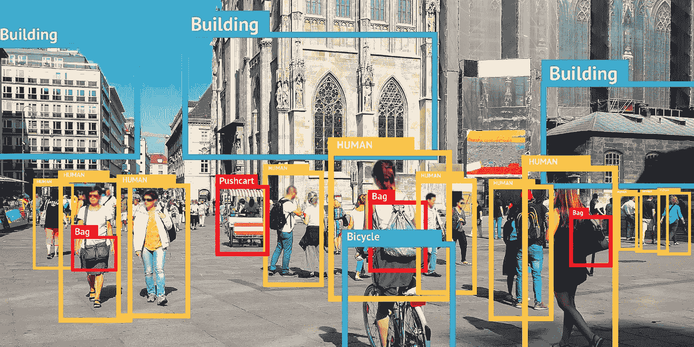

# 5 篇关于物体探测的 AI/ML 研究论文，必读

> 原文：<https://medium.datadriveninvestor.com/5-ai-ml-research-papers-on-object-detection-you-must-read-1ad636b66697?source=collection_archive---------4----------------------->

## 伟大的论文…

Pic credits: Pinterest

# 检测器:使用递归特征金字塔和可切换阿特鲁卷积检测对象

作者:乔思远、陈良杰、艾伦·尤尔

# 抽象—

许多现代物体检测器通过使用两次观察和思考的机制而表现出优异的性能。在本文中，我们探讨了这一机制的骨干设计对象检测。在宏观层面，我们提出了一个递归的特征金字塔，它将来自特征金字塔网络的额外反馈连接合并到自底向上的主干层中。在微观层面，我们提出了可切换的阿特鲁卷积，它以不同的速率对特征进行卷积，并使用切换函数收集结果。将它们组合在一起产生检测器，这显著提高了对象检测的性能。在 COCO test-dev 上，DetectoRS 实现了最先进的 54.7%的对象检测盒 AP、47.1%的实例分割掩模 AP 和 49.6%的全景分割 PQ。

***论文可以在这里找到:***

【https://arxiv.org/pdf/2006.02334v1.pdf 

***代码可以在这里找到:***

 [## 乔-思远-乔/探测仪

### 06/30/2020]检测器现在由 MMDetection 正式支持。非常感谢@xvjiarui、@ZwwWayne 和@ hellock

github.com](https://github.com/joe-siyuan-qiao/DetectoRS) 

# IterDet:拥挤环境中目标检测的迭代方案

作者:Danila Rukhovich，Konstantin Sofiiuk，Danil Galeev，Olga Barinova，Anton Konushin

# 抽象—

基于深度学习的检测器通常产生一组冗余的对象边界框，包括同一对象的许多重复检测。然后使用非最大抑制(NMS)来过滤这些框，以便为每个感兴趣的对象选择一个边界框。这种贪婪方案是简单的，并且为孤立的对象提供了足够的精度，但是在拥挤的环境中经常失败，因为需要为不同的对象保留盒子并且抑制重复检测。在这项工作中，我们开发了一个替代的迭代方案，其中在每次迭代中检测一个新的对象子集。在前一次迭代中检测到的盒子在下一次迭代中被传递给网络，以确保同一物体不会被检测两次。这种迭代方案可以应用于一级和两级对象检测器，只需对训练和推理过程进行较小的修改。我们在四个数据集上使用两种不同的基线检测器进行了大量的实验，并显示出相对于基线的显著改善，从而在 CrowdHuman 和 WiderPerson 数据集上实现了最先进的性能。

***论文可以在这里找到:***

[https://arxiv.org/pdf/2005.05708v1.pdf](https://arxiv.org/pdf/2005.05708v1.pdf)

***代码可以在这里找到:***

 [## saic-vul/iterdet

### 这个项目包含了实现 IterDet 对象检测方案的代码，正如我们在论文…

github.com](https://github.com/saic-vul/iterdet) 

# 用于目标检测的单发细化神经网络

作者:、、文、、、李

# 抽象—

对于对象检测，两阶段方法(例如，更快的 R-CNN)已经实现了最高的精度，而一阶段方法(例如，SSD)具有高效率的优势。为了继承两者的优点，同时克服它们的缺点，本文提出了一种新的基于单次触发的检测器，称为 RefineDet，它比两阶段方法获得了更好的精度，并且保持了与一阶段方法相当的效率。RefineDet 由两个相互连接的模块组成，即锚点细化模块和对象检测模块。具体来说，前者旨在 1。过滤掉负面锚以减少分类器的搜索空间，以及 2 .粗略调整锚点的位置和大小，以便为后续回归变量提供更好的初始化。后一个模块将细化的锚作为来自前一个模块的输入，以进一步改进回归并预测多类标签。同时，我们设计了一个传输连接块来传输锚点细化模块中的特征，以预测对象检测模块中对象的位置、大小和类别标签。多任务丢失功能使我们能够以端到端的方式训练整个网络。在 PASCAL VOC 2007、PASCAL VOC 2012 和 MS COCO 上进行的大量实验表明，RefineDet 实现了一流的检测精度和高效率。

***论文可以在这里找到:***

[https://arxiv.org/pdf/1711.06897v3.pdf](https://arxiv.org/pdf/1711.06897v3.pdf)

***代码可以在这里找到:***

 [## sfzhang15/RefineDet

### 我们提出了一种新的基于单次触发的检测器，称为 RefineDet，它比两阶段方法获得了更好的精度

github.com](https://github.com/sfzhang15/RefineDet) 

# 体素网:基于点云的三维物体检测的端到端学习

作者:尹舟，Oncel Tuzel

# 抽象—

三维点云中物体的精确检测是许多应用中的核心问题，例如自主导航、家务机器人和增强/虚拟现实。为了将高度稀疏的激光雷达点云与区域建议网络(RPN)连接起来，大多数现有工作都集中在手工制作的要素表示上，例如，鸟瞰图投影。在这项工作中，我们消除了对 3D 点云的手动特征工程的需要，并提出了体素网，这是一种通用的 3D 检测网络，它将特征提取和包围盒预测统一到单个阶段、端到端可训练的深度网络中。具体而言，体素网将点云划分为等距的 3D 体素，并通过新引入的体素特征编码(VFE)层将每个体素内的一组点转换为统一的特征表示。这样，点云被编码为描述性的体积表示，然后连接到 RPN 以生成检测。在 KITTI 汽车检测基准上的实验表明，VoxelNet 的性能远远优于最先进的基于激光雷达的 3D 检测方法。此外，我们的网络学习了具有各种几何形状的物体的有效区分表示，从而基于唯一的激光雷达在行人和骑自行车者的 3D 检测中产生了令人鼓舞的结果。

***论文可以在这里找到:***

【https://arxiv.org/pdf/1711.06396v1.pdf 

***代码可以在这里找到:***

 [## charlesq34/pointnet

### 由来自斯坦福大学的 Charles R. Qi，，Kaichun Mo，Leonidas J. Guibas 创建。这项工作是基于我们的…

github.com](https://github.com/charlesq34/pointnet)  [## qianguih/voxelnet

### 这是一个非官方的体素网实现:端到端学习的点云为基础的三维物体检测在…

github.com](https://github.com/qianguih/voxelnet) 

# 用 CNN 检测艺术品中的人物

尼古拉斯·韦斯特莱克，彼得·霍尔蔡洪平

# 抽象—

CNN 极大地提高了照片中物体检测的性能。然而，对艺术品中物体检测的研究仍然有限。我们在具有挑战性的数据集 People-Art 上展示了最先进的性能，该数据集包含来自照片、漫画和 41 种不同艺术运动的人物。我们通过为这项任务微调 CNN 来实现这种高性能，因此也证明了在照片上训练 CNN 会导致照片的过度适应:只有前三层或四层从照片转移到艺术作品。虽然 CNN 的性能是最高的，但它仍然低于 60%的 AP，这表明需要进一步的工作来解决交叉描绘问题。

***论文可以在这里找到:***

[https://arxiv.org/pdf/1610.08871v1.pdf](https://arxiv.org/pdf/1610.08871v1.pdf)

***代码可以在这里找到:***

 [## BathVisArtData/PeopleArt

### 人物-艺术数据集人物-艺术数据集是一个来自照片和艺术作品的图像数据集，具有地面真实边界…

github.com](https://github.com/BathVisArtData/PeopleArt) 

参考文献和致谢—

 [## arXiv.org

### arXiv 是一个免费的分发服务和开放存取的档案库，包含 1，721，837 篇学术文章，涉及领域包括…

arxiv.org](https://arxiv.org/)