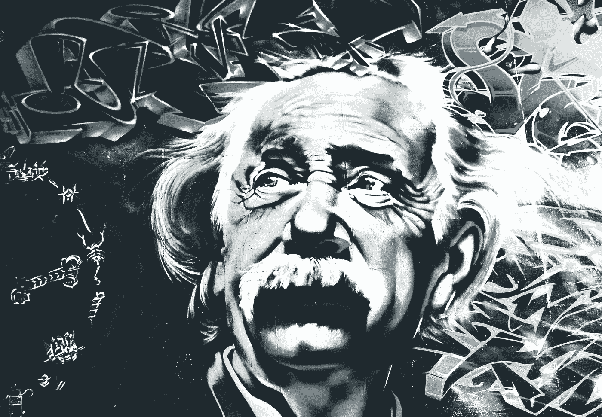

# 阿尔伯特·爱因斯坦的名言会改变你的思维方式

> 原文：<https://medium.datadriveninvestor.com/5-albert-einstein-quotes-that-will-change-the-way-you-think-49d8c6f4d4f9?source=collection_archive---------5----------------------->

## 他们会帮助你从不同的角度看世界

[Barbara A Lane](https://pixabay.com/de/users/BarbaraALane-756613/?utm_source=link-attribution&utm_medium=referral&utm_campaign=image&utm_content=2197302) on [Pixabay](https://pixabay.com/de/?utm_source=link-attribution&utm_medium=referral&utm_campaign=image&utm_content=2197302)

阿尔伯特·爱因斯坦是一位理论物理学家，他发展了相对论。

他杰出的创造力和以不同方式看待世界的能力使他成为有史以来最伟大的思想家之一。他的名言让你质疑自己的假设，用不同的眼光看待世界。

让我与你分享我最喜欢的爱因斯坦的五句名言:

> 想象力比知识更重要。知识有限。想象力环绕着整个世界。

要想成功，你需要有知识。

但是有许多大学教授拥有所有的商业知识，然而他们从来没有用所有的专业知识去做一些事情。也许他们是合理的，也许他们害怕，或者也许他们缺乏想象力。

首先，你必须知道去哪里。只有这样，你才能弄清楚应该学习哪些技能。这有点鸡和蛋的情况。

 [## 成功人生的 25 种自我提升方式|数据驱动的投资者

### “我活得越久，学到的就越多。学的越多，体会的越多，知道的越少。”―米切尔·莱格兰德时间到…

www.datadriveninvestor.com](https://www.datadriveninvestor.com/2019/03/12/25-self-improvement-ways-for-a-successful-life/) 

如果你的知识有限，你的想象力就被你不知道的东西所定义。但是如果你没有远见，你将永远不知道你应该学习更多的东西，也不知道这会把你引向何方。

**如何使用这句话:**

运用你的想象力来选择下一步要解决的问题。看到未来的自己，问自己:这个未来的我具备什么技能？

然后开始积极开发这些基石。

让你的想象力指引你的道路。

> 不要试图成为一个成功的人，而要努力成为一个有价值的人。

钱是什么？货币是交换价值的媒介。

你创造的价值越多，你赚的钱就越多。

如果你专注于培养稀有而有价值的技能，人们会为你的服务付给你很多钱。如果你用金钱来定义成功，你就会成功。

对我来说，成功与我银行账户上有多少钱无关。成功是一种感觉。
我晚上睡觉时的感觉是我衡量成功的标准。如果你采用这种心态，你的注意力就会从金钱转移到积极的反馈上。

如果你为一个人创造了价值，她会用积极的反馈和感激让你知道。

当你晚上睡觉的时候，回顾你的一天，那些互动会让你感到成功。

**如何使用这句话:**

将你的注意力从金钱转移到反馈上。积极和消极的反馈将帮助你学习并成长为你想成为的人，从而让你感到成功。

> 从不犯错的人也从不尝试新的事物。

我的一个朋友有一个即将开始走路的小儿子。有一天，我看到他爬起来，站了几秒钟，然后摔倒。他不仅摔倒了，还把头重重地撞在了水流上。

你猜怎么着。

眼泪干了之后，他从中断的地方继续。

他会跌倒更多次，但总有一天他会走，会跑，会跳。

他不怕犯错误。

**如何使用这句话:**

如果你总是稳扎稳打，你永远不会发挥出你的全部潜力。有时候犯错是正常的。唯一重要的是从这些错误中吸取教训。

> 每个人都是天才。但是如果你根据一条鱼爬树的能力来判断它，它会一辈子相信自己是愚蠢的。

我喜欢这本书，因为它描述了我生活的许多方面。

人们经常向我寻求建议，因为我的知识面很广，而且对生活普遍感兴趣。但是在学校的时候，我一直相信我是愚蠢的。

甚至当我学化学的时候，我觉得我必须比其他人付出更多的努力。

我也是这样的感觉，直到我爱上了健美。突然之间，我像看报纸一样看起了生物化学的书。我尽我所能了解了关于身体、训练和营养的一切。

后来我开始学习自我发展、高绩效和学习。我一周读不止一本书，记住我所学的东西从来没有问题。

我从不愚蠢——我只是不在行。

**如何使用这句话:**

永远不要停止尝试新事物。如果你觉得自己还没有找到别人觉得很难但对你来说很容易的东西，那就继续寻找。

你应该得到你想要的。

> 精神错乱:一遍又一遍地做同一件事，却期待不同的结果。

我的一个好朋友总是抱怨他的生活和工作。他对自己的生活有很好的规划，但是每次我问他自从我们上次谈话后他有什么改变，他都说*没什么。*

不要成为他。

改变从内部开始。

如果你想改变你的外部生活，你首先要从你的心态开始。开始学习如何学习，养成新习惯，学习新技能，停止重复那些不起作用的东西。

**如何使用这句话:**

永远做你自己，如果你做的事情仍然有意义。如果你发现自己陷入困境，不要害怕改变方向。

如果你尝试新事物，也许你会时不时搞砸，但这是你学习和成长的唯一途径。

**准备好变得无限吗？**

如果你想变得无限并大大加快你的学习速度，看看我的小抄:

[点击此处立即获取备忘单！](https://roadtolimitless.com/cheatsheet/)