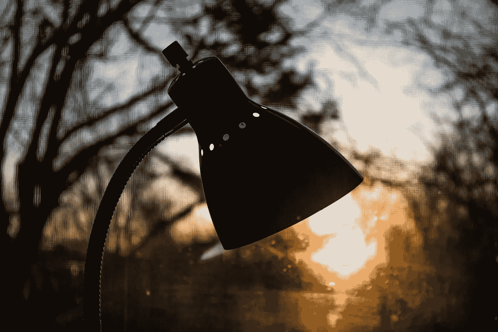

# 上午 5 点意外提高创意生产力

> 原文：<https://medium.datadriveninvestor.com/5-am-surprise-boost-for-creative-productivity-f6496b170274?source=collection_archive---------7----------------------->

记住这一点，不要害怕你写在纸上的东西

Photo by [Steve Johnson](https://unsplash.com/@steve_j?utm_source=unsplash&utm_medium=referral&utm_content=creditCopyText) on [Unsplash](https://unsplash.com/s/photos/early-morning-light?utm_source=unsplash&utm_medium=referral&utm_content=creditCopyText)

今年早些时候，早上 5 点醒来不再是一件坏事。一夜之间，在我还没有开始之前，我就不再觉得累了。当我把自己从与滴答作响的时钟的倒计时的斗争中解放出来时，我的清晨生产率提高了。一场你永远不会赢的战斗。

我的工作生活发生了变化，环境给了我一份让我感激的工作，但更重要的是，我能够认可这份工作。以前这样的机会出现了；然而，当它敲门时，我选择只抓住它的一部分。我拒绝双脚跳进水里，担心我会沉下去而不会游泳。我知道为什么写起来简单说起来难了。我很害怕。

在这种情况下，害怕代表着超越担心。害怕成为拖我后腿的无形瘫痪。害怕不自信，害怕，害怕，恐惧，紧张，忧虑。这是一个黑暗的单词和想法的列表，它们都在我面前失败。

 [## 战胜恐惧的十种方法

### 无论是什么让你害怕，这里有 10 种方法可以帮助你应对日常的恐惧和焦虑。这些提示…

www . NHS info . scot](https://www.nhsinform.scot/healthy-living/mental-wellbeing/fears-and-phobias/ten-ways-to-fight-your-fears) 

## 真是个白痴！因为失败没关系，这是我们学习的方式。

提供的是时间，最有价值的礼物。经常浪费，但这次我会把我的屎做好，双脚跳进去。我可能会沉下去，但幸运的是，我们被设计成可以浮起来，当人们说有没有一个合适的时间？我在这里从起跑线向你们汇报，是的，最肯定的是，就是现在，不要被阻止。有时我们都会感到害怕。我们只是选择不提里面发生了什么。

房子在沉睡，外面山上偶尔传来的汽车声打破了这一小时的寂静。我已经决定不在餐桌上写作了，木椅发出太多的吱吱声，我不想吵醒任何人。他们听不到。我怀疑这更多的是厨房沙发的吸引力，看到小猫奥兹和齐格依偎在一个角落里。我把自己停在他们旁边；他们似乎很高兴有我的公司，因为他们解决回到他们的打瞌睡。

关于我写什么，我没有预定的计划，因为这个早开始是额外的时间。正如游戏中的一些多产作家建议的那样，我将努力调整我的写作习惯，把单词写出来，写在纸上。

也许下一次你从闹钟上看到凌晨 5 点，你就再也睡不着了。不要烦躁；相反，站起来，张开双臂拥抱这段宁静的时光，用你的思想陪伴它。谁知道他们会带你去哪里。

对我来说，这是我最喜欢的写作时间。这是一份礼物，也可能是开始一天的最好方式。但是如果明天早上 7 点我还在睡觉，我不会抱怨的！