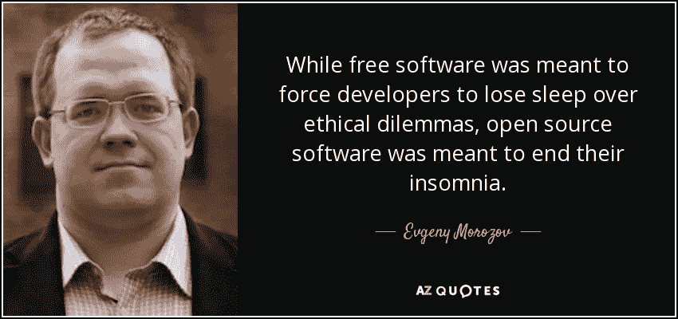
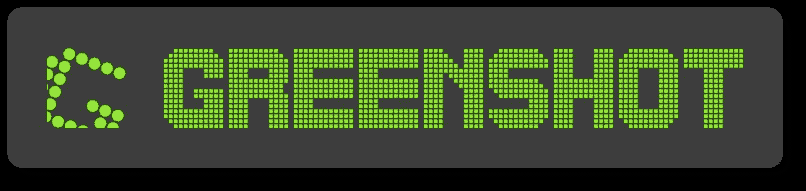
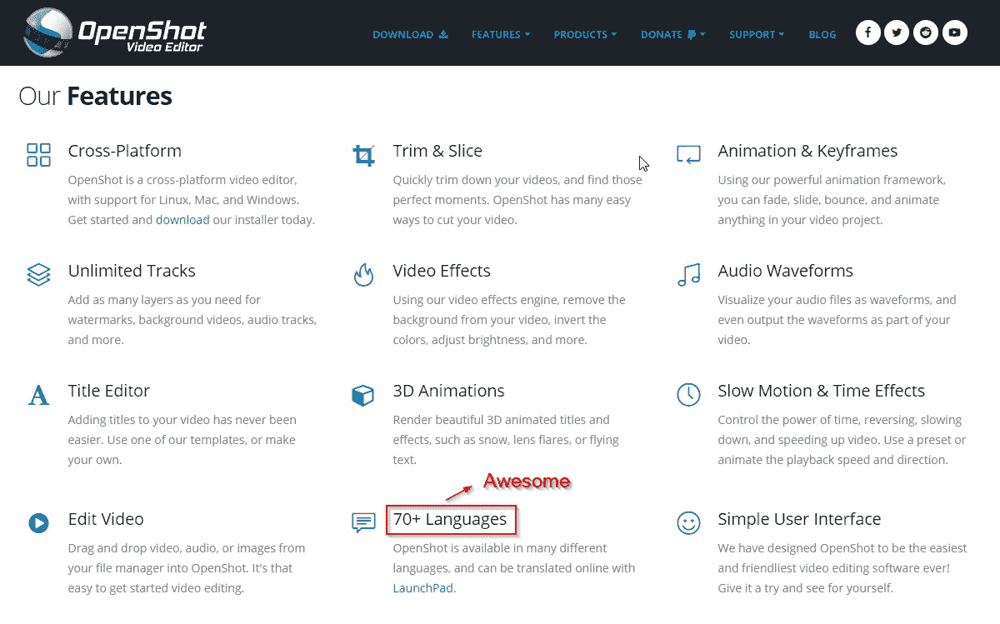

# 2020 年的 5 款超棒的开源软件

> 原文：<https://medium.datadriveninvestor.com/5-awesome-open-source-software-in-2020-d81cd50d7970?source=collection_archive---------16----------------------->

## 以最终用户为中心的社区驱动项目，我们视为理所当然的非营利英雄

有没有人想过为什么 Chrome(或新的 Edge)是如此酷的浏览器？对于那些非技术人员来说，Chrome 是一款基于 Chrome 的浏览软件，Chrome 是由谷歌维护的开源浏览器。致力于这项工程的人数可能会达到数千人。一个开源项目通常会有成千上万的参与者。因此来自开源项目的软件是免费使用的。

Photo by [Austin Distel](https://unsplash.com/@austindistel?utm_source=medium&utm_medium=referral) on [Unsplash](https://unsplash.com?utm_source=medium&utm_medium=referral)

# 关于开源

开源软件是免费的。对开源项目的贡献有多种形式。如果你是一个对项目感兴趣的高技能开发人员，你可以贡献你的时间来帮助开发这个项目。否则，你通常可以通过直接向项目维护人员捐款来支持他们。尽管捐赠的实践并没有被所有的项目维护者广泛采用，因为一些开发人员把它作为一个宠物项目或爱好来做。

 [## 软件开发过程:如何选择正确的过程？数据驱动的投资者

### 软件是任何企业组织成功的生命线。没有软件的帮助，一个…

www.datadriveninvestor.com](https://www.datadriveninvestor.com/2020/01/16/software-development-process-how-to-pick-the-right-process/) 

开源项目有助于定义现代生活。一个著名的例子是操作系统 Linux。今天许多公司在他们的服务器上使用 Linux。许多开发人员也在 Linux 上构建发行版，为 Linux 环境增添新的味道。

## 开源与自由软件

Quote by Evgeny Morozov, source: [AZQuotes](https://www.azquotes.com/quotes/topics/open-source-software.html)

现在，我想[解决](https://www.datadriveninvestor.com/glossary/address/)围绕开源软件和自由软件的一个重要区别。自由软件不需要向公众共享代码库。这是第一个主要的区别，自由软件并不总是等于开源。在为这篇文章做了一些研究之后，我发现了一个有趣的引语，可以帮助我理解其中的区别。

你看，开源的整个概念都围绕着团队合作。最终目标是进一步开发项目，为所有人带来更好的软件。

# 2020 年的 5 款超棒的开源软件

现在到了你期待的部分。我想分享 2020 年我一直在用的 5 个开源工具。

## 1.图书馆办公室

LibreOffice 是一个类似微软 Office 的办公套件。它最初的稳定版本是在 2011 年。就我个人而言，我在我的 Linux PC 上使用这个应用程序，因为当我想编辑一个. docx 文件时，我不想重启我的双引导 PC 来打开窗口。尽管有其他免费使用的软件，如[谷歌文档](https://www.google.com/docs/about/)，但我有时还是更喜欢使用 LibreOffice，因为它不需要互联网连接。

还有其他开源竞争对手，如最近于 2019 年 9 月首次亮相的 [Apache OpenOffice](https://www.openoffice.org/) ，我还没有机会比较这两者，我仍然坚持使用 Libre。否则我一定会通知你的。

总而言之，我认为 Libre 是微软 Office 的一个很好的替代品，它可以在 Windows、Linux 和 macOS 上运行。如果你有兴趣试用 LibreOffice，你可以从他们的[网站](https://www.libreoffice.org/download/download/)下载安装程序，如果你想投稿，可以在 [GitHub](https://github.com/LibreOffice) 上找到原始源代码。

## 2.绿色快照

Greenshot 是一款开源的截图软件。它有一个内置的照片编辑器，所以截图后你可以直接编辑它。老实说，Greenshot 是我最喜欢的开源软件。我是一名软件开发人员，因为我需要记录我制作的应用程序，所以在使用截图工具截图后，我通常会使用 Greenshot 突出显示 MSPaint 上的每个按钮。这个应用程序对我帮助很大。

我推荐这个软件，作为编辑的选择。Windows 用户可以免费使用 Greenshot，但 macOS 上的收费墙覆盖了它。但是 Linux 不被 Greenshot 支持。Greenshot 安装程序可以在他们的[站点](https://getgreenshot.org/downloads/)上获得，源代码可以在 [GitHub](https://github.com/greenshot) 上获得。

## 3.开放式广播软件(OBS)工作室

开放广播软件(OBS)是其中一个有趣的软件。该应用程序通常用于屏幕录制和流式传输。软件很棒，而且是免费的。许多人使用 OBS，在他们的网站上，OBS 项目已经有了一些坚定的支持者，如 Twitch、脸书、NVIDIA 和 Logitech。

就我个人而言，我真的很喜欢这个应用程序，因为虽然它有许多功能，但它是迄今为止我用过的最快的屏幕记录器。录音是无缝的，音频录音的选择是极好的。该软件完全是用 C++编写的，所以如果你感兴趣，你应该在 GitHub 上查看原始回购。哦，如果你想亲自体验一下这个坏男孩，它可以在 Windows、Linux 和 macOS 上运行。只需从他们的[网站](https://obsproject.com/download)下载安装程序。

## 4.开放式镜头

OpenShot 是一个开源的视频编辑器。在查看了它的功能和用户界面后，我可以诚实地说它是最合法的免费视频编辑软件之一。最好的是，没有水印！我害怕我的视频上有软件水印。如果你是一个铁杆视频编辑，也许你不会像 FinalCutPro 或 Adobe Premiere 或 Adobe After Effects 那样喜欢这个软件，但只要看看这个免费应用程序的功能就知道了。

Took this using Greenshot 😊

投入的工作量令人印象深刻。值得推荐一下，看看他们的[站点](https://www.openshot.org/)。源代码可以在 [Github](https://github.com/OpenShot/) 上获得。

## 5.电报(X)

这可能是整个列表中最著名的项目。Telegram 是一款消息应用，[客户端](https://www.datadriveninvestor.com/glossary/client/)的应用都是开源的。原始源代码可以在两个独立的账户上的 GitHub 上获得，Android 在这里是 T8，iOS 在这里是 T11。Telegram 是一个安全的信息平台。它从捐赠者那里获得收入。即使该应用程序并不完全开源，因为后端服务源代码并不与公众共享。可能是出于安全考虑。

我推荐你试试 X 版本的电报 X，因为它看起来比原版的好。Telegram X 的体验是无缝的，非常高效。你可以在谷歌 Play 商店或者苹果应用商店下载。

## 乳齿象(奖金)

这个是额外的奖励。因为我认为乳齿象是一个有趣的主题，所以我想在这里提一下。乳齿象是一个开源的社交媒体网站。它是一个类似 Twitter 的微博网站。乳齿象被创建的原因是希望创建一个独立的社交媒体，而不是遵守可以由一个单独的实体改变的规则。

整个项目的座右铭是*“把社交网络还给你”*。独立组织可以托管自己的实例。但是来自不同服务器的用户仍然可以相互连接。详情可以在他们的[网站](https://joinmastodon.org/)上看到。原始源代码可以在 [GitHub](https://github.com/tootsuite/mastodon) 上找到。

*原载于 2020 年 4 月 21 日*[*【https://www.datadriveninvestor.com】*](https://www.datadriveninvestor.com/2020/04/21/5-awesome-open-source-software-in-2020/)*。*