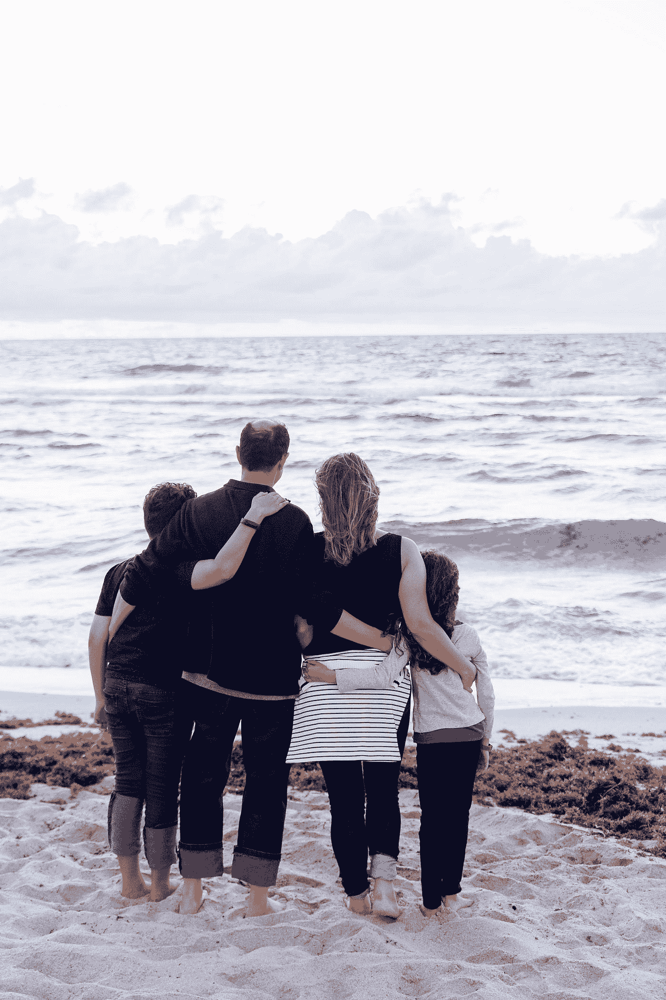

# 每个人都必须知道的 5 个基本个人理财课程

> 原文：<https://medium.datadriveninvestor.com/5-basic-personal-finance-lessons-that-everyone-must-know-77c6afb0facf?source=collection_archive---------29----------------------->

## 也可以作为 2021 年的决议。

Photo by [Alexander Mils](https://www.pexels.com/@alexandermils?utm_content=attributionCopyText&utm_medium=referral&utm_source=pexels) from [Pexels](https://www.pexels.com/photo/person-holding-100-us-dollar-banknotes-2068975/?utm_content=attributionCopyText&utm_medium=referral&utm_source=pexels)

我们都想在生活中尽早致富，但我们大多数人都不想在投资的旅途中拥有必须具备的基本金融知识。

在这篇文章中，我们将学习一些基本的个人理财课程，这些课程可以帮助我们长期发展，也就是说，在创造巨大财富的旅程中。

## 总是努力学习金融方面的新概念

Photo by [Scott Graham](https://unsplash.com/@sctgrhm?utm_source=medium&utm_medium=referral) on [Unsplash](https://unsplash.com?utm_source=medium&utm_medium=referral)

你不需要成为 CA 或者 MBA，只要每周至少学习一个概念，就够了。你可以阅读投资方面的书籍，阅读正版博客，或者观看正版 Youtube 视频。最终，你可以获得足够的知识，你也可以理解一家公司的资产负债表。

**不学无术想赚，跟不带鱼竿去钓鱼**差不多。如果你足够幸运，你会得到一些，否则你会失去时间和金钱。

**在学习上花点钱总比在股市或房地产上赔钱好。**

## 了解你的冒险能力

Photo by [Yeshi Kangrang](https://unsplash.com/@omgitsyeshi?utm_source=medium&utm_medium=referral) on [Unsplash](https://unsplash.com?utm_source=medium&utm_medium=referral)

去年就是最好的例子。

沃伦·巴菲特自己说**如果你不能承受 50%的账面损失，请远离市场。【2020 年 3 月，市场下跌了约 40%，许多人无情地认识到了股票投资的残酷事实。**

很多人在巨亏的情况下把投入股市的钱都拿出来了，可是接下来呢？仅仅在 8 个月的时间里，市场就回到了最初的位置(让我们不要深究美国美联储是如何印制大量现金的)。这就是公平的魔力。

你必须能够处理这种调整，因为它们是股票市场的一部分，如果你把投机性账面损失变成永久性损失，你将永远处于亏损状态。

因此，总是建议创建一个多元化的投资组合，并进行适当的风险管理。**你必须拥有不同风险的不同投资部分。**例如，对退休本金的投资可以放在低风险部分，而对旅行的投资可以放在高风险部分。

去年是理解股市中冲动决定有多糟糕的最佳年份。所以**在采取行动之前计划好你的行动。**

> 如果你没有计划，你就是在计划失败。
> —西楚斯

## 应急和机会基金

Photo by [Josh Appel](https://unsplash.com/@joshappel?utm_source=medium&utm_medium=referral) on [Unsplash](https://unsplash.com?utm_source=medium&utm_medium=referral)

去年是理解这两只基金重要性的最佳例子。

由于工作不稳定，甚至裁员，这些资金成为一个人的最优先事项。

对于一个工薪阶层来说，**人们总是建议至少存下他们在接下来的 6 个月里将要支付的费用**，无论是房租、EMIs、费用等等。而对于个体户来说，至少要 12 个月。这就是我们所说的应急基金。

**应急基金停在最安全的投资领域，如 FDs、流动性基金、债务基金、政府债券。债券，甚至储蓄账户。**

同样，也应该保留一个机会基金，这样当市场发生重大调整时，你就可以用这笔钱进行投资。

## 人寿保险

Photo by [Patricia Prudente](https://unsplash.com/@apsprudente?utm_source=medium&utm_medium=referral) on [Unsplash](https://unsplash.com?utm_source=medium&utm_medium=referral)

许多人认为人寿保险有什么意义。是啊，如果没有人依靠你的收入，那就没用了。

但是**如果你有一个依赖你收入的家庭，你一定要有人寿保险。**

你一定不会想“我会怎么样？我不会很快死去。”想想自行车或汽车保险，**你会出去把车撞到墙上，只为了获得保险费的回报吗？**没有吧？但是，你仍然有它，以便万一你需要它，保险公司可以支付它。

人寿保险也是一样，你不需要为不久于人世而支付保费，你支付保费是为了万一你去世了，你的家属不会在经济上没有保障。

## 医疗保险

Photo by [National Cancer Institute](https://unsplash.com/@nci?utm_source=medium&utm_medium=referral) on [Unsplash](https://unsplash.com?utm_source=medium&utm_medium=referral)

你可**永远不要低估医保的力量。医院对重大伤害收费很高。**

在印度，有时私立医院的手术、药物和整体治疗费用会高达 10 万卢比。

在美国、英国和其他生活水平远高于印度的国家(说起来很难过，但这是一个残酷的事实)，医疗费用可能会高得多。

同样，**这不是关于你将从保费中获得的回报，**也就是说，你不会为了获得回报而伤害自己。如果你生活健康，没有任何与健康有关的问题，这很好，但是万一你遭遇意外或受伤，医疗保险将是你最有用的朋友。

所以总结一下，

1.  总是努力学习金融方面的新概念。
2.  了解自己的冒险能力。
3.  始终保持一个紧急和机会基金。
4.  如果你有家属，你必须有人寿保险。
5.  一直有医保。

所以，这是我认为每个人都应该知道的 5 条个人理财经验。我希望你喜欢这篇文章，并学到了一些新东西。

感谢阅读！！

**访问专家视图—** [**订阅 DDI 英特尔**](https://datadriveninvestor.com/ddi-intel)