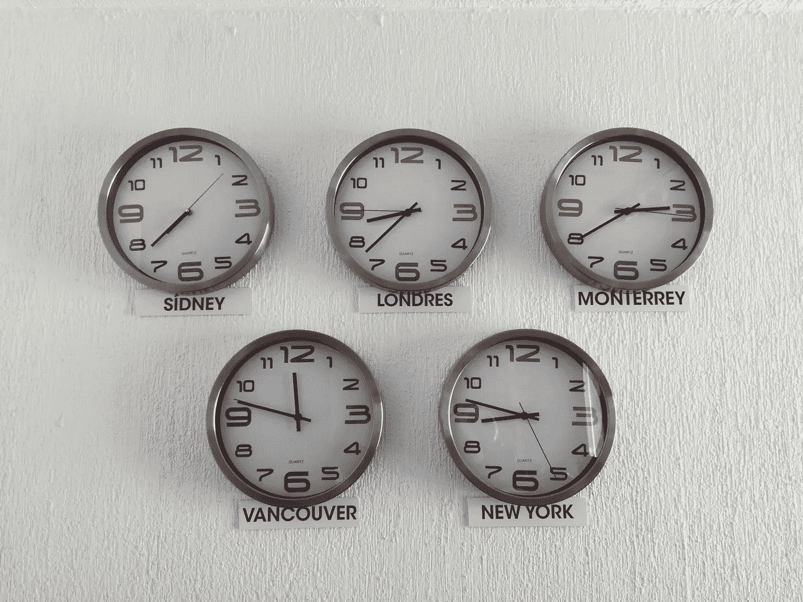

# 远程工作的 5 大好处

> 原文：<https://medium.datadriveninvestor.com/5-benefits-of-remote-working-c0a3a4c409c7?source=collection_archive---------19----------------------->

这并不是在你的办公桌上摆放令人惊叹的配件，打造完美的家庭办公室。这是关于在为你所爱的和关心的人工作的同时。

我已经远程工作多年，我想分享我的观点。有些事情对于以这种方式工作的人来说可能是显而易见的。然而，有时听听我们的经历是件好事，这样我们就可以继续前进👌

# #1:支持性的工作生活平衡🤹🏻

近年来，远程工作的趋势一直在上升。我们能做的最好的事情就是接受这种远程工作的生活方式，并享受与之相关的所有好处。

Photo by [Jeremy Thomas](https://unsplash.com/@jeremythomasphoto?utm_source=unsplash&utm_medium=referral&utm_content=creditCopyText) on [Unsplash](https://unsplash.com/s/photos/balance?utm_source=unsplash&utm_medium=referral&utm_content=creditCopyText)

找到平衡并坚持下去。这应该相对容易——至少在理论上是这样。我不认为有一个完美的待办事项清单，因为事情对我们每个人来说都是不同的。每个人都需要思考是什么让他们在远程环境中高效和快乐。

 [## 艾预测:“颠覆，然后是生产力”|数据驱动的投资者

### 人们越来越担心，随着机器学习和互联网的普及，所有白领工作都将消失

www.datadriveninvestor.com](https://www.datadriveninvestor.com/2018/08/06/ai-forecast-disruption-then-productivity/) 

事情在变化，我们总是在奔跑，不断适应新的情况。因此，我们应该珍惜找到平衡的时间——即使只是有限的一段时间。那段经历将帮助我们更好地了解什么适合我们。

# #2:远程工作对地球有益🌳⛰️🌴

我的工作与生活的平衡与我现在居住的地方息息相关。不仅仅是地点，它也是彼此顺利合作的相关事物的集合。

我的设置让我在工作中非常有效率，并花大量时间与家人和朋友在一起。这让我可以为接下来的工作时间充电。

Photo by [Michal Pechardo](https://unsplash.com/@michalp24?utm_source=unsplash&utm_medium=referral&utm_content=creditCopyText) on [Unsplash](https://unsplash.com/s/photos/balance?utm_source=unsplash&utm_medium=referral&utm_content=creditCopyText)

这是一个人们总是能找到时间享受生活、与他人见面、放松和善待他人的地方。能找到一个地方，让人们知道生命短暂，我们不应该对自己那么苛刻，这很好。

> 住得离人们更近，能够每天与他们联系，这有助于我们——远程工作者——处理这种生活方式带来的几个陷阱。

我只能说，住在大城市之外，住在一个更支持你、更接近大自然的小社区，对找到工作和生活的平衡很有帮助——尤其是当你有孩子的时候。我们还通过减少温室气体排放对环境产生了积极的影响，在这方面我们还可以做得更多。

# #3:不要浪费时间。生产力开启🔥

说到孩子，他们会确保你知道如何完美地安排你的时间。当我的生产力最高时，我会努力工作。这样我就可以完全专注于我正在做的事情，并尽快完成。

Photo by [Bethany Legg](https://unsplash.com/@bkotynski?utm_source=unsplash&utm_medium=referral&utm_content=creditCopyText) on [Unsplash](https://unsplash.com/s/photos/work?utm_source=unsplash&utm_medium=referral&utm_content=creditCopyText)

无论你是夜猫子还是早起的人，当你觉得自己最有效率的时候，你就可以开始工作了。这是远程工作的巨大优势。当注意力水平下降时，可以关掉它，结束一天的工作，或者和你的孩子去散步。

> 有时候，最好慢下来，别累垮了。我们中有多少人知道这个事实？说起来容易，做起来难，尤其是当你着火的时候🔥

孩子们可能会打断。他们肯定会打断。另一方面，他们成长得如此之快，我们需要陪伴他们。工作日期间的打扰和小互动没有帮助。

> 爸爸，你想看吗？爸爸，你在做什么？
> 爸爸，看我的口袋妖怪卡片。
> 爸爸……

但是，我很确定当你回头看的时候，那将是你记得的一切，所以一定要珍惜这些小时刻。工作可以等。

# #4:人才和时区🤸

处于 GMT+0 时区让我可以在同一天与来自美国、欧洲和澳大利亚的人联系。与来自世界各地的这么多有才华的人一起工作，通过谈话和视频会议了解他们的文化，会让你头脑一亮。

Photo by [Luis Cortes](https://unsplash.com/@luiscortestamez?utm_source=unsplash&utm_medium=referral&utm_content=creditCopyText) on [Unsplash](https://unsplash.com/s/photos/world-clock?utm_source=unsplash&utm_medium=referral&utm_content=creditCopyText)

> 无需通勤上班，就能在如此有趣和富有挑战性的项目上如此轻松地进行大规模协作，这是一种独特的体验。

# #5:陷阱和自我提升🤔

我们还应该考虑与远程工作相关的压力，并在享受好处的同时实施管理方法。孤独、孤立和缺乏社会支持的感觉。这些问题应该在我们的社区中提出，这样我们就可以改进并找到处理它们的方法。

# 享受✌️的所有好处

我认为所有这些小事情都是巨大的好处，可能会让你更快乐、更健康、更有效率，成为一个更好的人。

我很想听听你对这个问题的想法和意见。我们应该分享我们的经验，这样我们才能一起前进。

 [## 托马什·布伊诺维奇

### 我喜欢和世界各地的人一起远程工作。

www.tomaszbujnowicz.com](https://www.tomaszbujnowicz.com/)