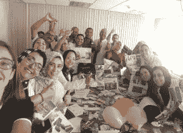
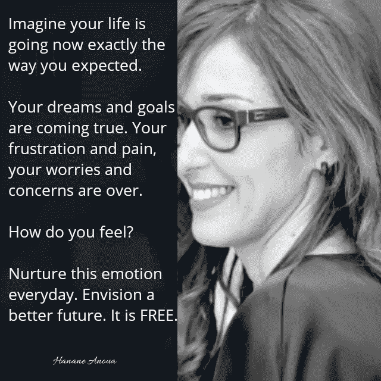

# 可视化的 5 个好处

> 原文：<https://medium.datadriveninvestor.com/5-benefits-of-visualization-c320bb708986?source=collection_archive---------22----------------------->

*注:本文由*[*Hanane Anoua*](https://flevy.com/blog/author/hanane-anoua/)*撰写，原载于* [*Flevy 博客*](https://flevy.com/blog) *。你可以在这里阅读 Hanane 的所有文章。*

想象不是躺在草地上想象你的梦想成真。它既不是关于做梦，也不是创造模糊的思想来逃避现实。视觉化是一种清晰而有目的的有意识行为。它是关于创造你想要达到的结果的视觉图像。这是一个反映你想要的生活的愿景。当被强烈的情绪推动时，它变得有效，可以帮助你把想法变成现实。

我总是练习想象，甚至在理解它的功能之前。我忽略了所有这些方面，因为我本能地用它来缓解疼痛，转移我的想法。我不得不经历一次又一次的手术，重复着痛苦的故事。最具决定性的一次发生在很多年前的我身上，因为它是后来五次以上其他手术和持续五年多的疼痛的来源。我仍然记得那些极端的细节，但它们不再伤人了。

我不得不在我的右眼上做了一个又深又复杂的手术。手术结束后，我不得不处理大量出血，缝了许多针和持续的头痛。为了避免任何并发症，我不得不闭上双眼两个多星期。我周围的一切都是黑暗的；我唯一能做的就是睡觉，等待更好的一天。除了拥抱痛苦和挫折，我别无选择；有时，当我感到不知所措时，甚至哭都是不允许的，因为这会使事情变得更糟。

我用视觉化来创造美好的图像和想象健康的状态。它让我生活在我梦想的世界里，创作美好的故事。疼痛剧烈。这是不公平的，因为我还很年轻，处理这样的创伤。我分不清白天和黑夜，也分不清光明和黑暗。我本该去玩或者购物，尤其是当我们有机会去巴黎的时候。我不得不应付这种情况，因为除了坚强，我别无选择。我曾经想象自己和观众交谈，分享我的痛苦。我一直相信，我的故事不会留在我心里，因为分享它可能有助于那些仍在努力处理自己的故事的人。

今天，我对可视化的了解为我从过去的经历中获得的知识增加了更多的价值。这是心理学家、教练、治疗师和运动员极力推荐的一种技术。米歇尔·乔丹在事情发生前就在脑子里排练了这些镜头。史蒂夫·乔布斯如果不把它形象化，就不可能创造出 iphone。可视化是强大的，因为它给你的想法或梦想一个物理形状，并把它们变成现实，因为大脑不知道想象和现实之间的区别。当你看一部恐怖电影时，即使你知道这只是一部电影，你仍然会感到害怕。

正是因为这个原因，可视化是一个容易接受的工具，因为它有助于将你的目标转化为真正的项目，并培养更多的注意力。当你观想时，你在你的大脑中创造了新的回路，这将使你容易实现你的目标。它也是免费的，每个人都负担得起。

在练习观想之前，你需要意识到**先决条件或条件**，这样你才能获得极好的结果和益处。一个人应该首先定义**他想要实现什么，以明确设想什么**。你需要明确自己未来的目标和梦想。许多书都谈到了思想的力量和想象的力量。拿破仑·希尔斯在他的书《思考致富》中说得很简单。按照他的说法，“只要头脑能想到，它就能实现”。“如果你能想象，你就能实现。如果你能梦想它，你就能成为它。威廉·阿瑟·沃德

这意味着在观想之前，你需要设定精确的目标。这显然意味着你也需要在他们身上下功夫。在他的书中，他谈到了成功的 17 个原则，我认为自我意识是进入他人的核心和最关键的一步，因为如果你不知道你现在在哪里，你怎么知道你想去哪里？。

**加速获得巨大利益的第二个条件是感受到得到你想要的东西的喜悦**。想象你自己痊愈了，这是我擅长的事情，因为我经常在痊愈之前想象一个健康的状态。我并不假装它总是很容易，但它值得一试，尤其是当你别无选择的时候。试着去感受你所寻求的状态的积极情绪；为自己实现目标而自豪。

感受在你想去的地方的快乐，并每天培养它。其他关于吸引力法则的书在这方面谈了很多，因为你在这个过程中的情绪会让你实现目标。你可以查阅更多的吸引力法则的原理。

为了使它更有意义，你可以基于一个简单的技术创建你的个人或专业项目，你可以在家里和你的孩子或你的团队一起做，作为一项有趣的活动。你唯一需要的是一套精美的杂志、一把剪刀、胶水和一张普通的 A4 纸。根据你的灵感和目标选择图片；触发你深层感官并与你未来观点产生共鸣的图像。一旦你的表格完成，一定要把它放在你每天都能看到的地方，这有助于你的形象化。

# 你可以从可视化中获得的五个好处

**疼痛缓解和愈合**

当你想象积极的画面时，会产生深度放松，释放多巴胺、血清素和其他与健康相关的激素。视觉化是一种可以减少焦虑和压力的冥想形式。这对缓解疼痛甚至治愈都很有帮助。永远想象你想要达到的状态，而不是你现在所处的状态。

**它增加焦点**

当你花更多的时间在想象上时，你就让自己专注于生活中重要的事情，因为这可以帮助你重组你的想法。它甚至会提高你的注意力。当你专注于痛苦时，你会得到更多的痛苦。当你把你的想法转变成积极的形象时，你会感觉更好。

**增强信心**

研究证明，许多优秀的教练和沟通者会在上台前使用可视化来组织他们的想法和陈述。它为获得预期的结果创造了更多的信心。

**提高性能**

当你进行创造性想象时，你会发展更多的创造力，更专注，就像之前讨论的那样，然后你会看到你的表现也在提高。

**可以成为灵感的来源**

当你一直想着写一本书时，你就有更多的机会实现它。你专注于想象的这些时刻可以激发你的灵感，帮助你采取更多的行动。

*有哪些你迫不及待想要实现的事情，想要达到的状态？把它们写下来或者变成图像。*

想象你的生活正如你所愿。你的梦想和目标正在实现。你的沮丧和痛苦，你的担心和担忧都结束了。你感觉如何？

每天培养这种情绪，想象一个更好的未来，因为担忧不会改变任何事情。让灯一直亮着，这不是魔法而是现实。

# 读者也对这些资源感兴趣

[**启动前的自我改造策略**](https://flevy.com/browse/business-document/self-transformation-before-strategy-of-startup-3427)**(**81-幻灯片演示文稿)

[**个人品牌声明模板**](https://flevy.com/browse/business-document/personal-brand-statement-template-844) (Excel 工作簿)

[**个人目标设定指南**](https://flevy.com/browse/business-document/personal-goal-setting-guide-4383) (61 页 PDF 文档)

**(64 张幻灯片的 PowerPoint 演示文稿)**

**[**个人发展行动计划**](https://flevy.com/browse/flevypro/personal-development-action-plan-2220) (2 页 Word 文档)**

**[**改善人际互动的解决方案**](https://flevy.com/browse/business-document/solutions-for-improving-interpersonal-interactions-3569) (12 页 PDF 文档)**

**在 [**安排一次关于领导力、教练和个人成长的对话**](https://app.ddichat.com/category/leadership-coaching-and-personal-growth) **:****

** [## 专家-领导力、教练和个人成长- DDIChat

### DDIChat 允许个人和企业直接与主题专家交流。它使咨询变得快速…

app.ddichat.com](https://app.ddichat.com/category/leadership-coaching-and-personal-growth) 

在这里申请成为 DDIChat 专家。
与 DDI 合作:[https://datadriveninvestor.com/collaborate](https://datadriveninvestor.com/collaborate)
点击此处订阅 DDIntel [。](https://ddintel.datadriveninvestor.com/)**