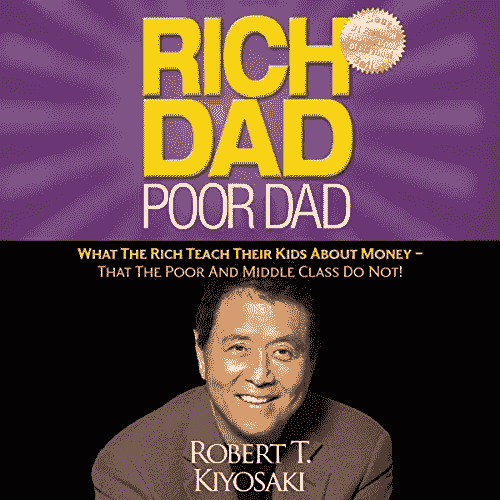
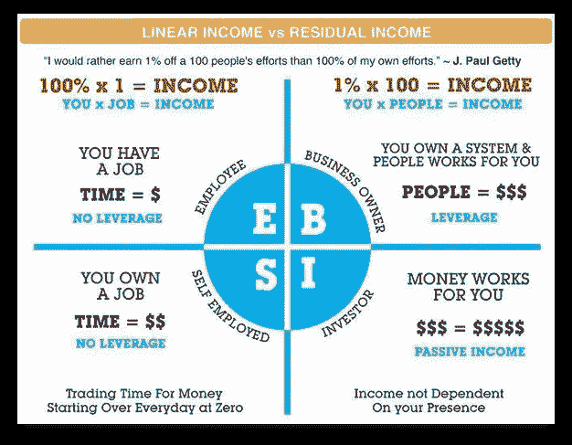
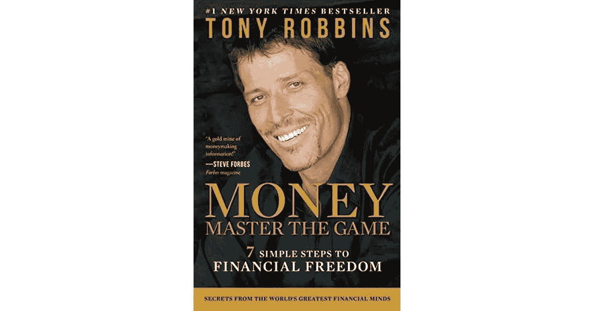
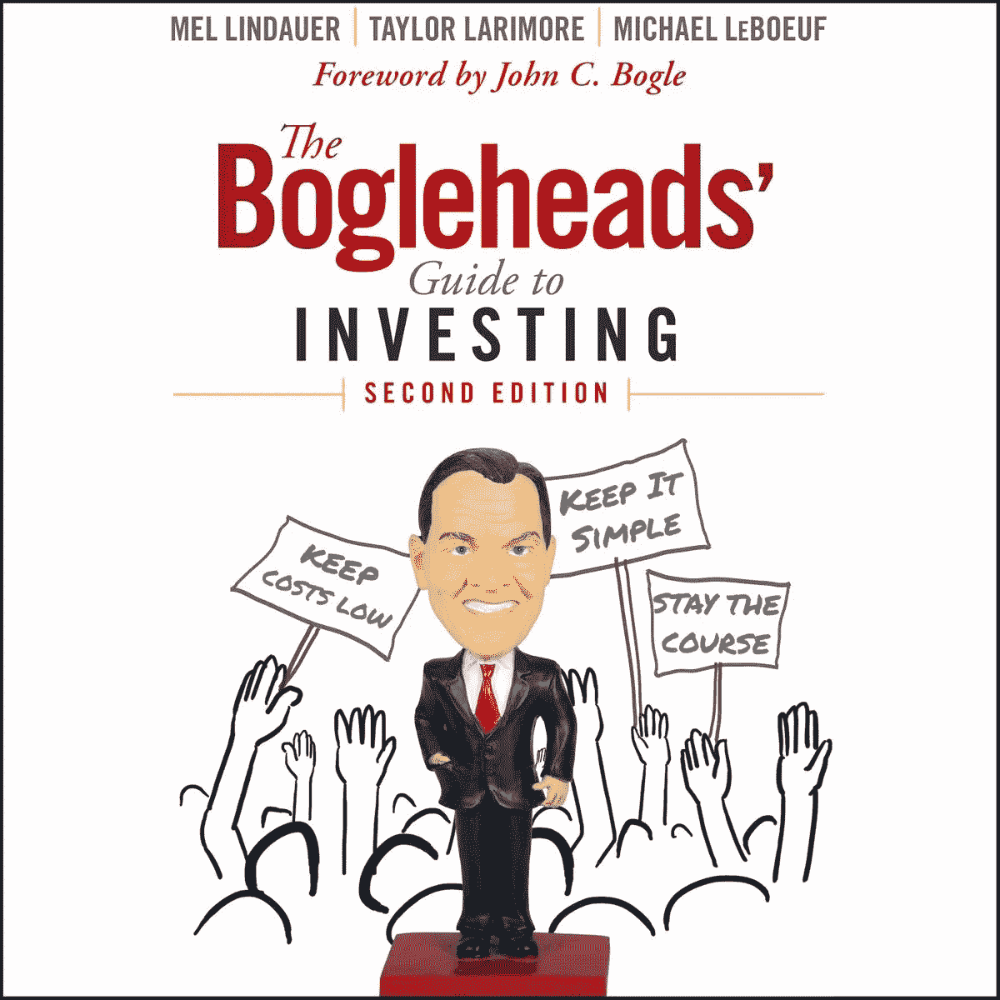
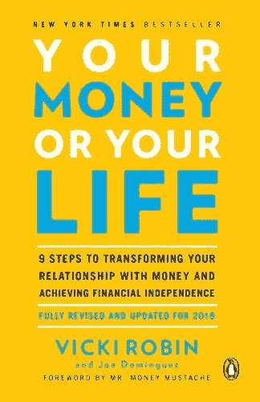

# 5 本最佳书籍帮助我理解投资并建立投资组合

> 原文：<https://medium.datadriveninvestor.com/5-best-books-helped-me-understand-investing-and-build-an-investment-portfolio-fceea7d14a3e?source=collection_archive---------5----------------------->

## 在我人生的前 30 多年里，我还没有开始投资，尤其是股市投资。在书籍和其他学习资源的帮助下，我建立了自己的投资组合和策略，实现了净值增长。在这里，我与你分享 5 本书，如果你想开始投资，你应该阅读。

Photo by [Priscilla Du Preez](https://unsplash.com/@priscilladupreez?utm_source=unsplash&utm_medium=referral&utm_content=creditCopyText) on [Unsplash](https://unsplash.com/s/photos/reading?utm_source=unsplash&utm_medium=referral&utm_content=creditCopyText)

促使我学习如何投资自己的原因是与一位财务顾问的一次事件，我与他有过一次糟糕的经历。你可以阅读这篇文章 [<我和理财顾问的“致富”之旅——你应该避免的错误>](https://www.fasttrack.life/blog/my-rich-journey-with-a-financial-advisor-mistakes-you-should-avoid) ，也许它会帮助你避免我犯的一些错误。

简而言之，我学到了一课，不管有没有理财顾问，我都需要了解我的钱去了哪里，我应该预期的后果是什么，最坏的，一般的，还是最好的。那么当我需要用钱的时候，对我来说就不会是什么大的‘惊喜’了。

如果你是初学者，这是一步一步的阅读。

## [1。富爸爸穷爸爸](https://amzn.to/2XsU1I1)

[https://amzn.to/2XsU1I1](https://amzn.to/2XsU1I1)

我能说什么呢，这是最基本的。这本书用如此简单的语言写成，连小学生都能读懂。然而，我确实建议任何小学生开始阅读这本书，并接受一些金融教育。书中的关键信息是:

*   为什么有钱人不为钱工作
*   学习个人理财的重要性
*   专注于你的事业
*   税收优化和公司的力量
*   投资
*   学会用你的钱去赚钱

许多人可能对投资有一些误解，甚至因为自己的经历或他人的影响而抵制这种想法。抱着开放的心态去读这本书，如果你理解了其中的原理，它自然会对你有意义。一个重要的概念是现金流象限。理解起来很容易，但是从理解到信仰，要走一大步。

cashflow quadrant

你看，很明显，当你处于 I 象限时，你最有收入潜力，你不需要出卖你的时间。当你在 E 象限时，你为了钱出卖你的时间。当你有一家公司时，你在 B 象限，你的员工是你的杠杆。有多少人看到了这个图表，然后采取行动？不是所有人。也许你是为数不多的。因为从理解到信念到行动，不是一条直线。

但是读这本书，你从理解开始，总比什么都不做好。所以等你看完这本书，我再给你介绍一本比较厚的。

## [2**。金钱——掌握游戏:实现财务自由的 7 个简单步骤**](https://amzn.to/3hSrF3s)

[https://amzn.to/3hSrF3s](https://amzn.to/3hSrF3s)

托尼·罗宾斯写这本书，他几乎没有其他关于钱的书，但我个人想推荐这本。为什么？因为很全面。这就是为什么它不是一本小书。它谈到了你的财务目标，如何一步一步地改善你的财务状况，税务优化，与财务顾问合作，不同的投资产品，退休…你应该避免的错误，其他人的成功故事，著名投资者推荐的投资组合。许多例子都有事实和图表支持，这样你就能很快理解事情为什么会这样。

即使这本书非常面向美国读者，你仍然可以从中学到很多东西。基本原理是一样的。其他国家也有很多投资产品，但有一些不同。请不要复制一切，自己思考，自己决定要如何规划自己的财务未来。

在你读完这本书之后，你会很好地理解许多其他关于投资和财务规划的详细概念。

然后可以看下一本书开始投资。

[**3。投资指南**](https://amzn.to/2XmklUh)

[https://amzn.to/2XmklUh](https://amzn.to/2XmklUh)

在你投资股票市场之前，请阅读这本书！关于投资的主要误解是，许多人认为这是低买高卖的交易。它不是。如果你不是一个有经验的交易者或专业人士，如果你尝试“低买高卖”策略，你很可能会赔钱而不是赚钱。

这本书向你解释了什么是你的金融生活方式，什么是投资的基础，什么是债券，股票，共同基金，交易所交易基金。你应该如何投资。如何使用节税账户？资产配置。如何降低你的费用？追逐市场的危险，并尝试把握市场时机。这本书里有很多更有价值的信息。同样，它是为我们读者准备的，但有些也适用于其他国家。例如，节税退休账户、以你的货币计价的指数 ETF 等。

这本书教导普通投资者(非专业人士)正确的投资心态。读完这本书后，你已经打下了坚实的基础。

还是那句话，开始投资前请先看完这本书！

[**4。隔壁的百万富翁**](https://amzn.to/35ogb2D)

[https://amzn.to/35ogb2D](https://amzn.to/35ogb2D)

这本书不纯粹是关于投资的，但我把它放在这里是因为你如何对待你的钱，决定了你如何积累财富，而不仅仅是通过投资。托马斯·j·斯坦利和威廉·d·丹科对美国的百万富翁进行了广泛的研究。书中的发现会让很多人震惊。如果你用谷歌搜索百万富翁图片，你会发现:

你明白我的意思。人们把它与奢侈的生活方式、昂贵的汽车、大联排别墅和豪华的聚会联系在一起。这些都是典型的图像，即使价值 100 万美元的钱比 90 年代少，这项研究仍然证明了一个优点。

大多数美国百万富翁住在中产阶级社区，开着二手中档汽车，戴着不超过几百美元的手表。

最受百万富翁欢迎的手表？精工

最受百万富翁欢迎的汽车？福特 F-150 皮卡

史上最贵的西装。其中 50%的人回答不到 399 美元。

一双鞋？$140

手表？$235

这本书告诉你，财富不是你展示出来的，而是你保留下来的。真的很值得一读。因为投资是为了赚更多的钱，这本书教你如何让你的生活方式符合你的价值观，并存更多的钱。那你可以多投资。

你准备好迎接一次完全敞开心扉的经历了吗？我推荐的最后一本书来了:

[**5。你的钱还是你的命**](https://amzn.to/39cTdwz)

[https://amzn.to/39cTdwz](https://amzn.to/39cTdwz)

你投资的目标是什么？我想是用这些钱给你提供一个你喜欢的生活，对吗？最终，金钱只是一种工具，它是达到目的的手段，而不是目的本身。这是我们大多数人都在纠结的三角关系问题:

当你年轻的时候，你有健康，但你没有钱，你努力工作赚钱，所以你没有时间给自己。

当你到了中年，你可能会有更多的钱，但你的健康状况会更差，也没有足够的时间留给自己。

当你老了，你有时间，你可能没有身体去享受生活，希望你有足够的钱储蓄和投资。

在任何一种情况下，我们都可以拥有这三样东西？是这样吗？也许是我们看待自己的方式限制了拥有一切的可能性。

我们把我们的时薪看做收入，但实际收入只有一半。你可以阅读我的另一篇文章 [<为什么你的真实时薪只有你工资的 50%不到>](https://www.fasttrack.life/blog/why-your-real-hourly-rate-is-only-less-than-50-of-what-you-arepaid) 。然后你必须考虑，那些降低你时薪的费用值得吗？也许有些不值得。相反，你可以为你的未来储蓄和投资。当你计算并采取行动时，你甚至可以提前 10 年甚至更久退休。这本书改变了你与金钱的关系，并真正帮助你理解如何将金钱作为实现财务独立的有效工具。方法之一是通过投资。但是投资不是一个独立的行为，它是为了追求你想要的生活方式。这就是我把这本书列入投资书籍推荐的原因。

如果你读完了这 5 本书，我 100%肯定它会改变你与金钱的关系，你会知道如何投资，你会有什么样的财务前景。然后你就可以平静下来，一步步实现你的目标。

看完之后给我留言，你觉得怎么样？

有其他书推荐吗？请写在下面的评论里。

相关文章 [<你为什么害怕投资而永远不能富有>](https://www.fasttrack.life/blog/why-you-are-afraid-of-investing-and-can-never-be-rich) 。

如果你想了解更多关于如何提高个人财富的信息。关注我的账户，了解更多关于个人理财的内容，帮助你[将你的生活推上快车道](https://www.fasttrack.life/)。

**访问专家视图—** [**订阅 DDI 英特尔**](https://datadriveninvestor.com/ddi-intel)