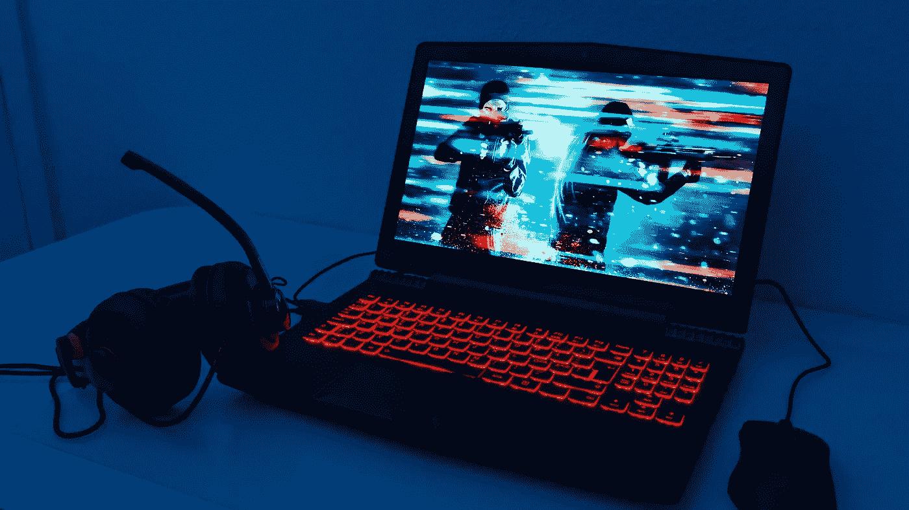
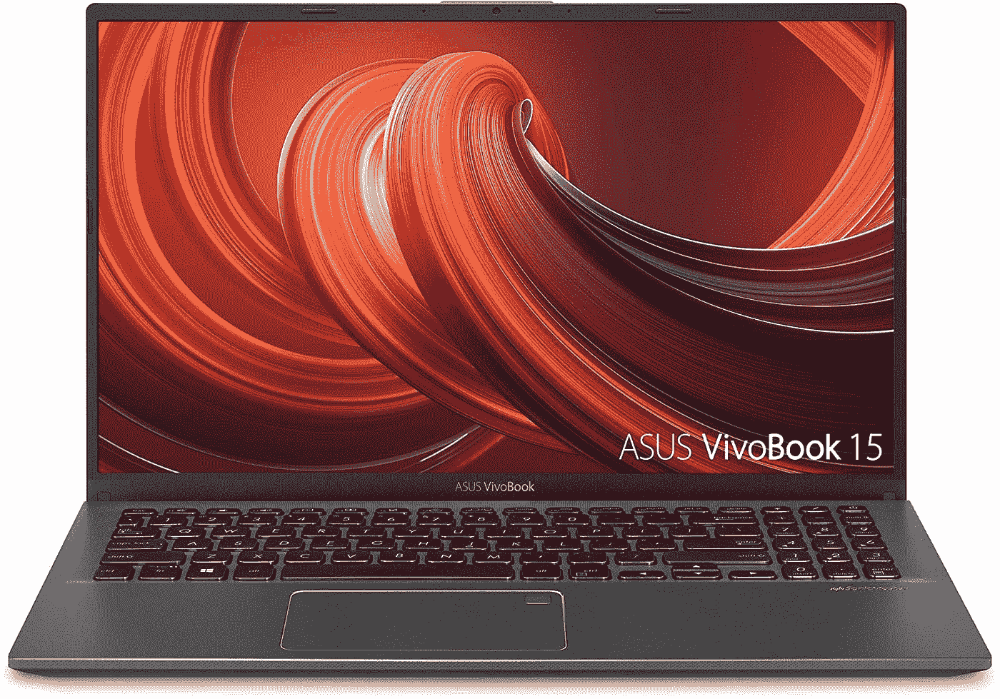
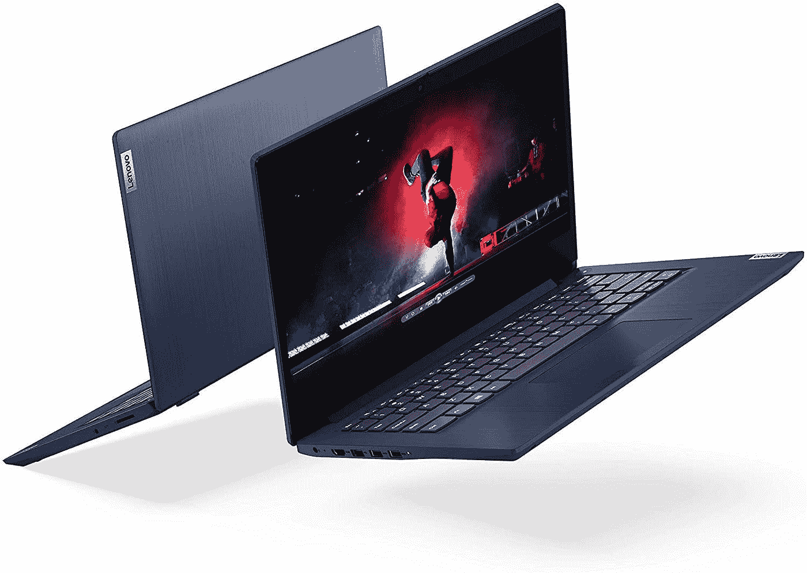
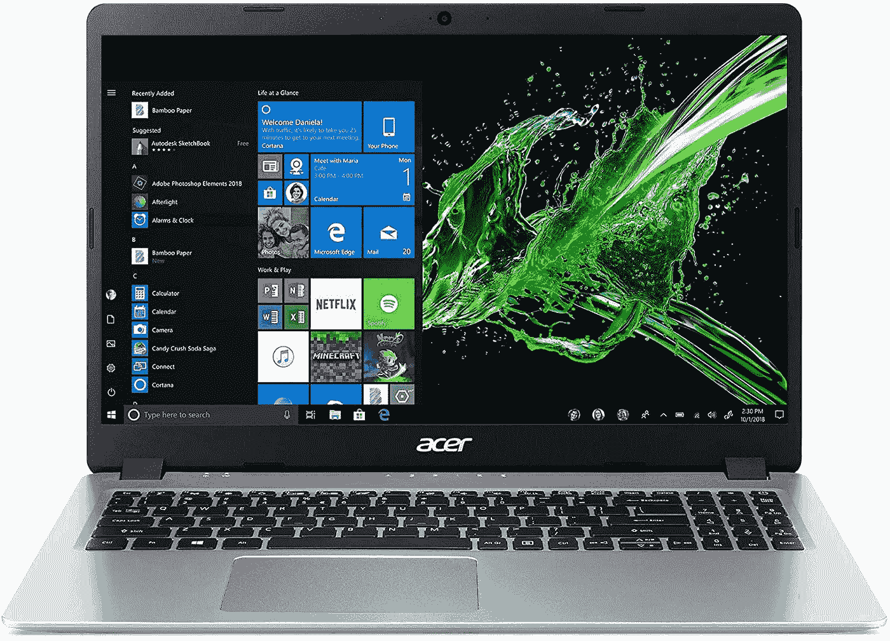
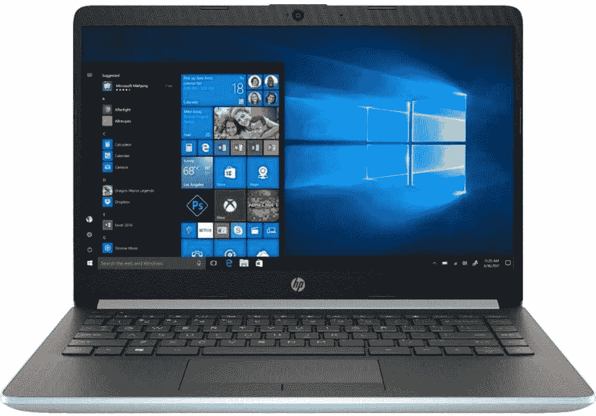
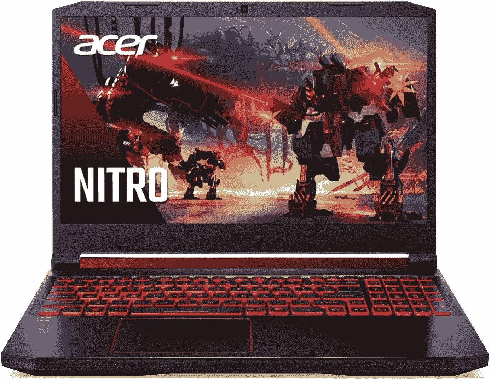
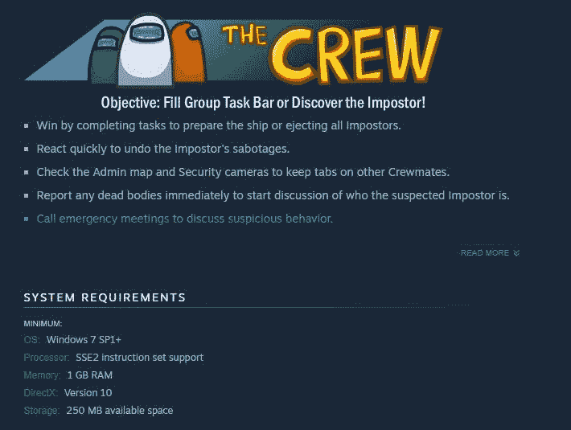
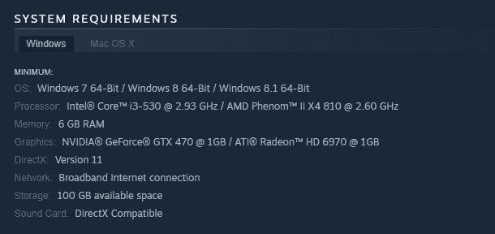

# 5 款 500 美元以下的最佳预算游戏笔记本电脑

> 原文：<https://medium.datadriveninvestor.com/5-best-budget-gaming-laptops-under-500-c277dba92c9e?source=collection_archive---------18----------------------->

## 联想、华硕和宏碁生产一些价格在 500 美元以下的游戏笔记本电脑。

在当今的游戏世界中，丰富的功能和多种用途使得游戏笔记本电脑比游戏机更受欢迎。但随着对游戏笔记本电脑需求的上升，它们的价格也在上涨。

为了帮助解决这个问题，我们在网上寻找价格合理、规格合适、可以运行市场上最好的游戏的笔记本电脑。

# 500 美元以下的最佳游戏笔记本电脑列表

不是所有人都能够证明或负担得起增强游戏功能的额外价格，但我们也不想牺牲最佳游戏体验。幸运的是，有了这份清单上的笔记本电脑，你不必倾家荡产。

我们挑选的笔记本电脑是:

1.  [华硕 VivoBook 15](https://amzn.to/3eNTpoo)
2.  [联想 V14](https://www.google.com/search?q=lenovo+v14&rlz=1C1SQJL_enJP925JP925&oq=lenovo&aqs=chrome.0.69i59j46i199i291j69i59j0j69i60l4.1823j0j4&sourceid=chrome&ie=UTF-8)
3.  [联想 IdeaPad 3](https://amzn.to/3pgzxix)
4.  [宏碁 Aspire 5](https://amzn.to/2IqhLc5)
5.  [2020 惠普 14 英寸高清触摸屏高级笔记本电脑](https://amzn.to/3pmzKk9)

# 1.[华硕 VivoBook 15](https://amzn.to/3eNTpoo)

华硕 Vivobook 15 采用了现代简约的设计和出色的端口选择，包括 USB type-A 和 type-C、microSD 读卡器、耳机插孔和 HDMI 输出。

它还配有指纹识别器，允许您使用 Windows Hello 在一秒钟内登录。

但最棒的是它的 15.6 英寸 NanoEdge 边框显示屏，为您提供令人惊叹的 88%屏幕与机身比率。再加上镭龙 Vega 8 GPU，您将获得 500 英镑以下游戏笔记本电脑的最佳屏幕和 GPU 之一！

8GB DDR4 RAM、256GB SSD 和四核锐龙 5 CPU 正是您所需要的，除了要求苛刻的 3a 游戏之外，几乎所有游戏都能为您带来无缝的游戏体验！

# 2.[联想 V14](https://www.google.com/search?q=lenovo+v14&rlz=1C1SQJL_enJP925JP925&oq=lenovo&aqs=chrome.0.69i59j46i199i291j69i59j0j69i60l4.1823j0j4&sourceid=chrome&ie=UTF-8)

凭借圆滑时尚的设计，V14 将游戏性和专业性集于一身。它自豪地说:

*   14 英寸的屏幕
*   8GB DDR4 内存
*   256GB 固态硬盘存储
*   6 核锐龙 5 处理器，主频 2.3 GHz
*   镭龙图形

不仅相当大的 RAM 大小和更高的内核数使您的游戏性能更好，而且固态硬盘还大大减少了您的加载时间，给你一个出色的体验。

镭龙图形是顶部的樱桃，它可以在中低设置中给你那些平滑的边缘和出色的 FPS，给你那种竞争优势！

# 3.[联想 IdeaPad 3](https://amzn.to/3pgzxix)

这款闪亮的型号有独特的钢蓝色，配有灰色按键，一定会引人注目，同时仍保留适合学校和/或工作的专业外观。它有一个可以弯曲 180 度的铰链，并配有杜比音频，为您提供纯净的音质和更大的灵活性。

它的规格类似于 VivoBook，因为它具有:

*   14 英寸的屏幕
*   8GB DDR4 内存
*   256GB 固态硬盘
*   锐龙 5 3500U 处理器

[联想 IdeaPad 3](https://amzn.to/3pgzxix) 几乎比 VivoBook 轻半公斤。请注意，它的 CPU 基础是 2.1 GHz 的基础时钟，这可能会使 FPS 在 CPU 密集型游戏(如使命召唤)中稍有下降。然而，AMD 网站列出了锐龙 5 3500U 的最大提升时钟高达 3.7GHz

# 4.[宏碁 Aspire 5](https://amzn.to/2IqhLc5)

这款笔记本电脑目前稍微超出了我们的预算，在亚马逊上的售价为 [$519.99 美元](https://amzn.to/2IqhLc5)。然而，对于这台笔记本电脑，额外的 20 美元可能是值得的。

Aspire 5 的独特之处在于其 IPS 显示屏，可在全高清质量下提供更宽的视角和出色的色彩准确度。

这款笔记本电脑还配有背光键盘和长达 7.5 小时的电池续航时间，这使得它成为 500 美元以下最耐用的游戏笔记本电脑之一。

凭借锐龙 5 3500U 四核 CPU 和 Vega 8 显卡，它可以满足大多数游戏的需求，但其银色塑料外观可能对一些游戏玩家没有吸引力。

# 5. [2020 惠普 14 英寸高清触摸屏高级笔记本电脑](https://amzn.to/3pmzKk9)

凭借其简洁现代的外观，HP 14 给低价游戏笔记本电脑带来了一种高级感。

HP 14 的分辨率为 1366 x 768 像素，是该列表中的第一款触摸屏，具有高度精确的 BrightView 14 英寸触摸屏面板。

它还搭载了双核 AMD 锐龙 3 处理器，虽然相对受限，但可以让大多数要求较低的游戏在中低设置下以出色的 FPS 工作。

与 Aspire 5 类似，HP 14 在正常使用情况下的电池续航时间约为 8 小时，使您可以在没有充电器的情况下工作/上学一整天，然后回家玩您渴望玩的游戏！惠普的快充技术是玫瑰中的另一片花瓣。

也许这款设备的唯一限制是它的 8 DDR3 RAM，而大多数其他类似价位的笔记本电脑都提供 DDR4。

然而，它凭借超快的 256GB 固态硬盘和出色的 78%屏幕与机身比率弥补了这一点，使它成为一款快速而有吸引力的设备，你一定会喜欢它！

# 奖金:600 美元的 Acer Nitro 5

凭借令人惊叹的“游戏怪兽”设计，[宏碁 Nitro 5](https://amzn.to/3eMX5qx) 是目前预算最好的游戏笔记本电脑之一，仅比我们 500 美元的预算高出 100 美元。然而，额外的 100 美元很可能是值得的。

红色的背光和一个尖锐，笨重的设计，它肯定会给你一个游戏玩家的感觉。

此外，与 500 英镑以下的游戏笔记本电脑不同，这款电脑配备了:

*   英特尔酷睿 i5–9300h 处理器(最高 4.1 GHz)
*   256 GB NVMe 固态硬盘
*   英伟达 GeForce GTX 1650
*   15.6 英寸全高清显示屏
*   内置的 Alexa 使它成为一个强大的游戏机

为了让这台机器保持凉爽，它采用了 Acer CoolBoost 技术，包括两个风扇和两个排气口。

它的输入端口包括 3 个 USB Type-A，一个 USB Type-C，以太网，耳机插孔和 HDMI！

# 重要提示:

这份清单上的物品是我们能在市场上找到的最好的笔记本电脑，可以用于 500 美元以下的游戏。也就是说，这些项目可能无法运行您想要玩的游戏。

**在购买之前**，一定要将笔记本电脑的规格与你想要的游戏对电脑的最低要求进行比较。例如，这是最近在我们中间流行的*的 Steam 页面*:

> *美国 Steam PC 要求*

请放心，上面所有的笔记本电脑都应该能够运行像《我们中间》这样的游戏，甚至是像《使命召唤:黑色行动 3》这样稍微老一点的游戏(见下面的要求)。

然而，如果你想运行更强大的游戏，比如《使命召唤:战争地带》，或者正在寻找[支持虚拟现实的系统](https://hackernoon.com/how-to-tell-if-a-gpu-is-vr-ready-for-oculus-link-and-steam-vr-8wbb3zuh?source=rss)，你必须攒钱买一台更贵的电脑。

# 最后的想法

这就是 500 美元以下最好的游戏笔记本电脑。所有这些都具有出色的规格和合理的性能价格比。

虽然它们并不都是杀手级游戏装备(除了 Nitro 5)，但它们仍然有望实现出色的 FPS，并可以在中低设置下运行许多游戏，具有出色的执行能力。

如果你喜欢我们的帖子或者对我们的列表有补充，请在[社区](/community.hackernoon.com)中告诉我们。

**披露**:请注意，上面的一些项目包括其产品页面的附属链接。

*最初发布于:*[https://hacker noon . com/5-best-budget-gaming-laptops-under-dollar 500-Pb 233 zqr](https://hackernoon.com/5-best-budget-gaming-laptops-under-dollar500-pb233zqr)