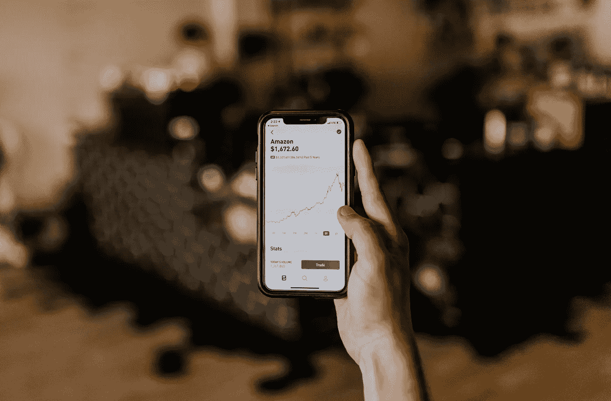

# 2021 年千禧一代的 5 款最佳投资应用

> 原文：<https://medium.datadriveninvestor.com/5-best-investment-apps-for-millennials-in-2021-1cb8c6c6f4a4?source=collection_archive---------4----------------------->

## 一个尝试过所有方法的千禧一代的建议。

Photo by [Austin Distel](https://unsplash.com/@austindistel) via Unsplash

在当今的数字社会，我们用手机做任何事情，包括投资股市。

有这么多的经纪选择，困难的是找出哪一个适合你。各有利弊。取决于你想做什么样的投资，其中一种可能比其他的更适合你。

我选定了五个我最喜欢的。无独有偶，这五个似乎也是我认识的大多数人的最爱。

# 1)罗宾汉——粉丝的最爱

罗宾汉引领千禧一代开始投资。它提供了各种不同的股票投资，包括投资不同加密货币的选项。

**这家经纪公司成功的原因有三:**

*   免费股票交易。
*   完全可以通过智能手机上的应用程序访问。
*   各种不同的投资选择。

在罗宾汉出现之前，免费交易几乎是闻所未闻的。你无需支付任何额外费用就可以购买和交易股票的想法是美丽而诱人的，尤其是对千禧一代而言。

此外，你根本不用电脑来买卖股票也是一个诱人的因素。作为千禧一代，我们整天都在使用智能手机。我们想在 Twitter 上滚动的同时买卖股票，这才有意义。

最后，投资蓝筹股、细价股、加密股和几乎任何其他股票的能力是锦上添花。Robinhood 使成为日内交易者、期权交易者、股息投资者或长期投资者成为可能。

这家经纪公司经历了起起落落，但它仍然是粉丝的最爱，因为它在开始时是多么的创新。变革仍在进行，比如最近引入的零股。

如果你正在寻找任何一种交易的开始，你想涉猎所有的东西，Robinhood 可能适合你。

# 2) M1 金融——针对被动投资者

M1 金融一直是我的首选网上经纪公司，因为我很懒，喜欢被动投资。这就是 M1 的巨大吸引力:你不必每天查看你的股票。

M1 通过设置“交易窗口”几乎完全杜绝了日间交易每天早上开市时，投资者只能进入一个交易窗口。如果你购买了 M1 会员资格，你就可以在上午和下午各有一个交易窗口。

话虽如此，M1 金融是如何上榜的呢？

一个词:馅饼。

不是你吃的馅饼，而是你投资组合中的馅饼。投资者必须将他们的投资组合变成投资馅饼。你可以把一个馅饼放在另一个馅饼里，基本上按百分比分解你的股票。M1 是最早引入零股的平台之一，因此馅饼可以无缝地工作。

这很方便，因为自动投资和银行取款功能可以直接用于您的馅饼。每周，M1 都会从我的银行里取出同样数量的钱，然后按照适当的比例自动投资到我的馅饼里。

我很喜欢这样，因为我不喜欢日内交易或做任何太花哨的事情。此外，股息再投资计划通过自动将我的股息投资到我的贡献中，对我有利。

如果你是一个被动的投资者，不想被每天监控投资组合所困扰，M1 正适合你。我有没有提到 M1 也是免费交易？

# 3)Webull——优步的赞助商

如果你在 YouTube 上看任何财经视频，你会发现它们都是由 Webull 赞助的。只要报名就可以免费获得两只股票。不幸的是，我没有得到 Webull 的赞助。

然而，我仍然有一些关于平台的伟大的事情要说。对我来说，Webull 是介于 TD Ameritrade 这样的大公司和 Robinhood 这样的千年宠儿之间的唯一经纪公司。

它模仿 TD 和其他大型经纪公司的设计特点，更加基于图表。另一方面，它通过提供免手续费交易等功能，瞄准了更年轻的人群。

如果你想成为日内交易者，Webull 比 Robinhood 更适合你，因为它有股票提示和交易热键。这是 Robinhood 没有提供的两个功能。

此外，它的图表指标和功能让罗宾汉刮目相看。如果你决定回到投资的石器时代，它甚至提供纸交易的选择。

如果你真的想进入大公司的日内交易或期权交易(并获得两只免费股票)，那么 Webull 可能是你的经纪人。

# 4)TD Ameritrade——老兵

道明在这场游戏中的时间比这个名单中的前三家券商要长得多。它成立于 1975 年，而不是过去十年。

这家经纪公司在千禧一代想要的小功能上坚持了很长时间，但最终因为竞争而屈服。TD 现在提供免费交易等功能，赢回了一些投资者。券商仍然不允许直接购买零股(目前只能通过滴滴再投资)，但这没关系。

像我们这样的投资者使用道明这样的经纪公司主要不是为了获得免手续费交易等功能。我们使用它是因为它的可靠性和舒适性。

没有什么比知道你的钱安全地存放在像 TD Ameritrade 这样的老牌经纪公司更好的了。他们经历过几次，他们面对过竞争，他们幸存下来并讲述了相关的故事。

TDs 移动应用是我最喜欢的应用之一，与前三家经纪公司相比，他们的客户服务无可挑剔。

如果你想要出色的客户服务和一家已经成立多年的经纪公司，那就选择 TD。

# 5)嘉信手机——黄金标准

查尔斯·施瓦布成立于 1971 年，比榜单上的任何一家经纪公司都历史悠久。这是我们父母年轻时用来交易股票的经纪公司。

也就是说，在嘉信理财手机上交易给你既有老牌经纪公司的舒适，又有新时代经纪公司的特色。

嘉信移动提供免费交易，以跟上竞争对手的步伐。它还提供了比 Robinhood 等应用更多的投资选择。你可以投资成千上万种不同的共同基金、债券、国际股票，甚至粉红色的床单。你在嘉信移动唯一不能投资的是加密……目前。

他们也有大量不同的交易平台和订单类型。基本上，我在这里说的是嘉信移动是为有经验的投资者。是给那些知道自己在做什么的人的。

如果你刚刚开始投资，那么你可能要避免嘉信理财。使用不同的经纪公司，先搞清楚交易的来龙去脉。

然而，如果你知道你在做什么，并且你正在寻找交易平台上的大多数功能，那么就不要再找了。嘉信移动是你需要的经纪公司。

# 荣誉奖

这里还有两个你可能已经听说过，但还没被选上的例子:

*   橡子
*   e *贸易