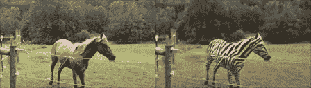
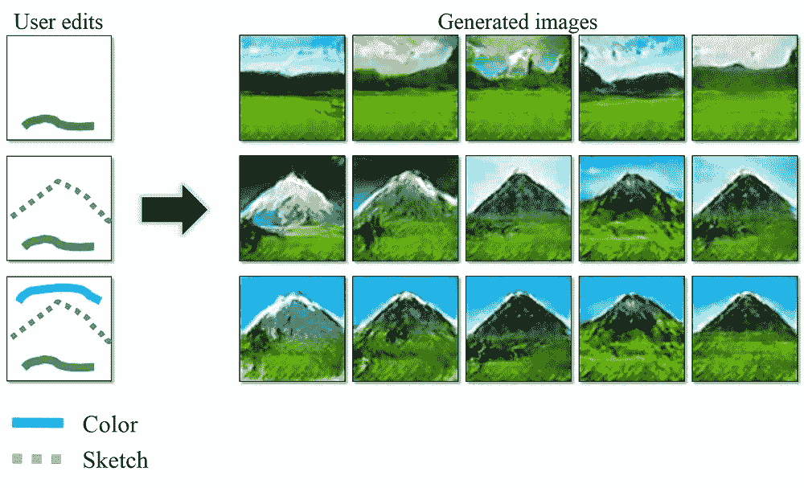
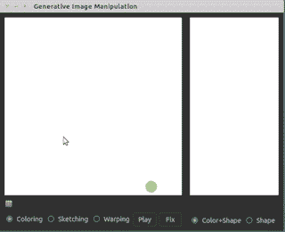
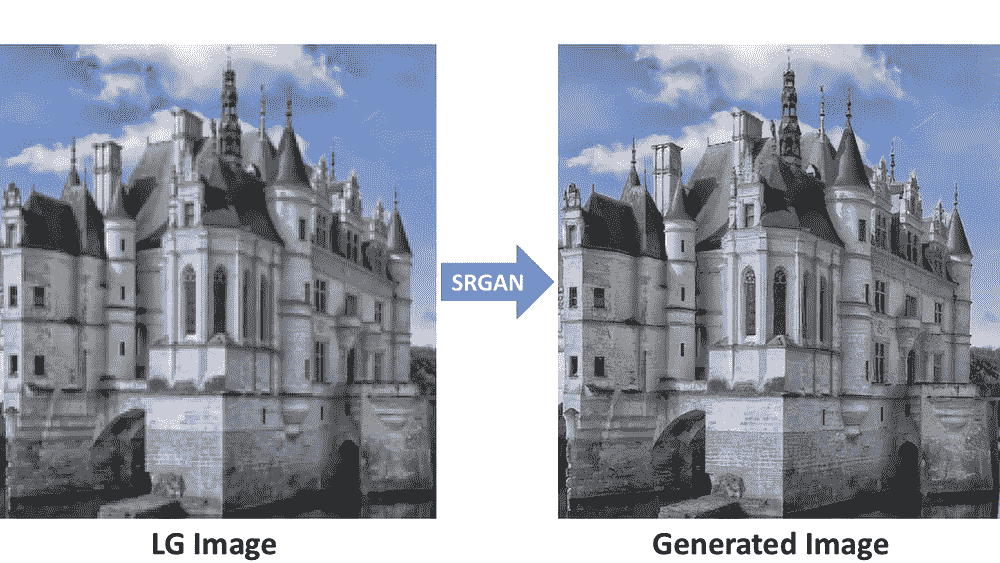
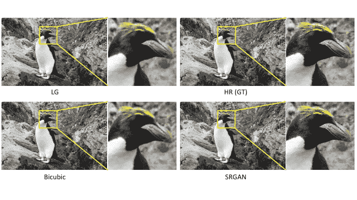
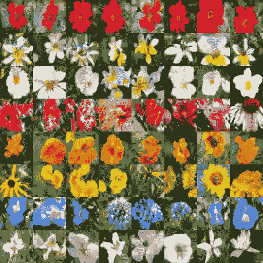

# 5 个最好的开源项目，它们将教会你所有你需要知道的关于最佳生成性对抗网络(GANs)的知识

> 原文：<https://medium.datadriveninvestor.com/5-best-open-source-projects-that-will-teach-you-all-you-need-to-know-about-best-generative-a1084f47256d?source=collection_archive---------2----------------------->

> [***生成式对抗网络(GAN)是一类机器学习框架，当给定一个训练集时，该技术学习生成与训练集具有相同统计数据的新数据。例如，经过照片训练的 GAN 可以生成新的照片，这些照片在人类观察者看来至少在表面上是真实的，具有许多逼真的特征。虽然最初是作为无监督学习的生成模型的一种形式提出的，但是 GANs 也被证明对于半监督学习、完全监督学习和强化学习是有用的。***](https://en.wikipedia.org/wiki/Generative_adversarial_network)

> **在今天的文章中，我们将讨论五个开源 GAN 项目，您可以将它们包含在您的下一个项目中。**
> 
> **注意:在本文中，我们将讨论一些不太出名但非常好的开源 API，您可以在您的项目中使用它们。要阅读更多关于它们的内容，我推荐你点击项目中给出的链接。**

**Source: Unsplash**

> *学习不仅仅是为了更好地胜任工作，而且远不止于此。*[***data camp***](https://datacamp.pxf.io/x9nmvv)*让我可以无限制的学习。*
> 
> [***data camp***](https://datacamp.pxf.io/x9nmvv)*为您提供所需的灵活性，让您可以利用自己的时间参加课程，学习向成功职业过渡所需的基本技能。*
> 
> [***data camp***](https://datacamp.pxf.io/x9nmvv)*教会了我快速获取新想法，并将其应用于现实世界的问题。当我还在学习阶段的时候，*[***data camp***](https://datacamp.pxf.io/x9nmvv)*让我对课程中发生的一切都着了迷，从课程内容和 TA 反馈到 meetups 活动和教授的 Twitter feeds。*
> 
> 这里有一些我最喜欢的课程，我强烈推荐你学习，只要它符合你的时间表和心情。你可以将从这些课程中学到的概念和技能直接应用到工作或大学中令人兴奋的新项目中。

1.  [数据科学家与 python](https://datacamp.pxf.io/LPDqQZ)
2.  [数据-科学家-与-r](https://datacamp.pxf.io/MXQxrJ)
3.  [机器学习科学家与机器人](https://datacamp.pxf.io/DVLg4j)
4.  [用 python 研究机器学习的科学家](https://datacamp.pxf.io/9WePXW)
5.  面向所有人的机器学习
6.  [面向所有人的数据科学](https://datacamp.pxf.io/15bLmd)
7.  [使用 python 的数据工程师](https://datacamp.pxf.io/jW13ve)
8.  [使用 python 的数据分析师](https://datacamp.pxf.io/kjR3mz)
9.  [基于 pyspark 的大数据基础](https://datacamp.pxf.io/e4RM6r)

***回到正题-***

 [## 用 Python |数据驱动投资者进行股票价格时间序列预测简介

### 在这个简单的教程中，我们将研究如何将时间序列模型应用于股票价格。更具体地说，一个…

www.datadriveninvestor.com](https://www.datadriveninvestor.com/2020/07/07/introduction-to-time-series-forecasting-of-stock-prices-with-python/) 

# 1.CycleGAN 和 Pix2Pix

C[***ycle gan 和 Pix2Pix***](https://github.com/junyanz/pytorch-CycleGAN-and-pix2pix) 是一个免费开源的 [**生成式对抗网络**](https://en.wikipedia.org/wiki/Generative_adversarial_network) *图像到图像翻译项目*使用 **Pytorch** 在 **Python** 中实现。

你可以克隆他们的[***GitHub***](https://github.com/junyanz/pytorch-CycleGAN-and-pix2pix)库，让项目工作起来。这个库允许*用户使用几个功能，例如:*

*   *下载****cycle gan*******pix 2 pix 数据集，*** *创建自己的图像数据集，* ***从头开始训练/测试*** *模型。**
*   **或者您可以下载一个用于 CycleGAN/Pix2Pix* *的* ***预训练模型，并轻松将其应用于输入图像集合。****
*   **一个* ***预建的*******Docker*******image****和****Docker file service****也可以运行这个代码库。****

****

****Source:** [**https://github.com/junyanz/pytorch-CycleGAN-and-pix2pix**](https://github.com/junyanz/pytorch-CycleGAN-and-pix2pix)**

# **2.照片 2 卡顿**

**P[***photo 2 carton***](https://github.com/minivision-ai/photo2cartoon)是一个开源的 ***人像卡通风格化项目*** 用于将 ***真实照片转换成带有识别*信息和纹理细节的卡通图像**** 。**

*   **它采用* ***的甘法*** *对一张照片进行* ***的卡通翻译，将人脸*** *。**
*   **它是基于* ***软自适应层实例规格化*** *的方法，融合了* ***统计编码*******解码特征*** *中的* ***去规格化。*****
*   ***本项目在****Python****中实现，使用****py torch****。***

**你既可以从他们的[**Google****Drive****link**](https://drive.google.com/file/d/1lsQS8hOCquMFKJFhK_z-n03ixWGkjT2P/view)下载代码，也可以克隆 [**GitHub**](https://github.com/minivision-ai/photo2cartoon) 仓库来访问代码。**

*****图像数据集*** 和 ***预训练*** **模型** **文件、**连同*可以下载，您可以按照它们的**[**Github**](https://github.com/minivision-ai/photo2cartoon)页面上的说明进行操作*****

********

******Source:** [**https://github.com/minivision-ai/photo2cartoon**](https://github.com/minivision-ai/photo2cartoon)****

# ****3.伊甘****

****I ***交互图像生成***via***GAN****是一个免费的开源项目。给定 ***几个用户笔划，系统将实时产生最能满足用户**编辑的照片级真实样本***** 。该项目基于*深度生成对抗网络，系统服务于以下两个目的:******

*   ******提供了一个* ***智能绘图接口*** *用于* ***自动生成图像*** *灵感来源于笔触的颜色和形状。******
*   *****我还提供了一个* ***交互式可视化调试工具*** *用于理解和* ***可视化深度生成模型*** *。*****

*****你可以克隆*[***Github***](https://github.com/junyanz/iGAN)*资源库的****Igan****并按照他们页面上的说明运行项目。该项目使用****OpenCV****和****theano*******框架*** *在 python 中实现。******

************

**Source:** [**https://github.com/junyanz/iGAN**](https://github.com/junyanz/iGAN)**** 

# ****4.斯尔甘****

****S[***rgan***](https://github.com/tensorlayer/srgan)是一款开源的 ***GAN 真实感单幅图像超分辨率网络实现用 GAN*** 。这个项目是用 **Python** 和 **TensorFlow** 实现的。****

****您可以克隆[***GitHub***](https://github.com/tensorlayer/srgan)存储库，并按照说明运行项目:****

*   *****您可以按照*[***Github***](https://github.com/tensorlayer/srgan)*页面上的说明下载* ***数据集*** *和* ***预训练的 VGG19 模型*** *。*****
*   *****和开始* ***训练*******模型*** *和对* ***进行评估*******模型*** *的指令也是为了方便用户使用本项目而提供的。*******

****************

******Source:** [**https://github.com/tensorlayer/srgan**](https://github.com/tensorlayer/srgan)****

# ****5.文本到图像****

****T[***ext-to-Image***](https://github.com/zsdonghao/text-to-image)是一款**生成式广告文本** **图像合成器。**这些图像是使用*GAN-CLS 算法**合成的**，这个项目是在 TensorFlow 中的 ***DCGAN 之上构建的。********

****目前，**模型**仅在 ***flowers 数据集*** 上**训练**，您可以从其[***Github***](https://github.com/zsdonghao/text-to-image)***页面*访问 ***训练*** 和 ***模型文件*** 你也可以按照 ***的指示为你的数据集训练。***********

***文字转图像 GAN 项目的成果是这样的:***

*   *****图中的花有黄色的花药红色的雌蕊和鲜红的花瓣。*****
*   *****这种花有黄色、白色和紫色的花瓣，还有深色的线条*****
*   **这朵花的花瓣是白色的，中间是黄色的**
*   *****这种花有很多小而圆的粉红色花瓣。*****
*   *****这种花的颜色是橙色的，花瓣呈荷叶边圆形。*****
*   *****这朵花有黄色的花瓣，花的中心是棕色的*****
*   **这种花有蓝色和白色的花瓣。**
*   *****这些白花的花瓣从白色开始，到末端都是白色。*****

****

****Source:** [**https://github.com/zsdonghao/text-to-image**](https://github.com/zsdonghao/text-to-image)**

> **如果您喜欢阅读这篇文章，我相信我们有着相似的兴趣，并且现在/将来会从事相似的行业。那么我们就通过[*LinkedIn*](https://www.linkedin.com/in/mrinal-walia-b0981b158/)*和*[*Github*](https://github.com/abhiwalia15)*来连线吧。请不要犹豫发送联系请求！***
> 
> **参考**
> 
> **[**https://github.com/minivision-ai/photo2cartoon**](https://github.com/minivision-ai/photo2cartoon)**
> 
> **[**https://drive . Google . com/file/d/1 lsq 8 hocquemfkjfhk _ z-n 03 ixwgkjt 2 p/view**](https://drive.google.com/file/d/1lsQS8hOCquMFKJFhK_z-n03ixWGkjT2P/view)**
> 
> **[**https://github.com/junyanz/pytorch-CycleGAN-and-pix2pix**](https://github.com/junyanz/pytorch-CycleGAN-and-pix2pix)**
> 
> **[***https://github.com/junyanz/iGAN***](https://github.com/junyanz/iGAN)**
> 
> **[**【https://github.com/tensorlayer/srgan】T42**](https://github.com/tensorlayer/srgan)**
> 
> ****

*****访问专家视图—** [**订阅 DDI 英特尔**](https://datadriveninvestor.com/ddi-intel)***