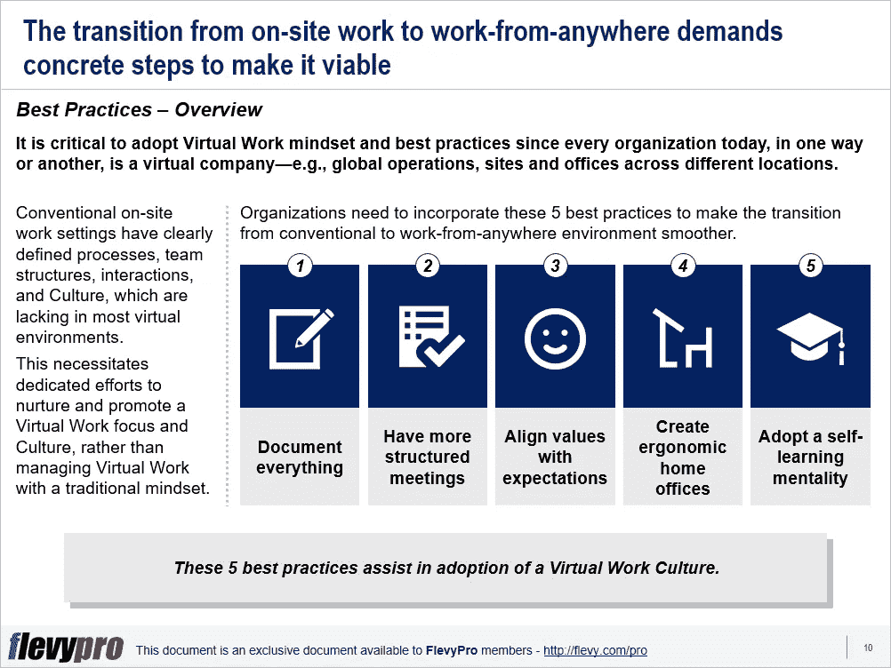

# 从办公室环境向远程工作环境过渡的 5 个关键最佳实践

> 原文：<https://medium.datadriveninvestor.com/5-best-pes-critical-to-transition-from-an-in-office-to-remote-work-setting-d6903a7a35dd?source=collection_archive---------20----------------------->

[新冠肺炎](https://flevy.com/business-toolkit/covid-19)迫使组织适应[远程工作](https://flevy.com/business-toolkit/remote-work)的新规范。许多人认为远程办公是工作的未来。允许远程工作的雇主已经看到了员工士气、产量和效率的提高。

然而，远程工作环境远非一切如常。管理层需要理解和管理内部团队和远程团队之间错综复杂的差异。要使远程工作成功并管理远程团队，领导层需要遵循 5 条指导原则:

*   召集一组精通远程工作环境的人员，监督和支持其他员工远程工作，评估任何挑战，并实时创建可行的解决方案。
*   开发并(在整个组织内)共享一个全面的参考指南—例如存储库、手册或网页—记录有关流程变更的详尽信息。这将使所有利益相关者了解情况，并防止任何不确定性。
*   与员工进行透明和频繁的沟通，促进非正式沟通，并提供易于使用的视频会议设施，以便人们适应和融入变化。
*   将处理文档和交流的工具数量保持在最低水平。
*   通过建立坦诚、持续的沟通渠道、信任和共同目标来管理远程员工。从办公室设置过渡到远程环境需要时间。

同样，远程员工需要遵循特定的指导原则，以有效地履行职责并高效地完成任务。

*   建立一个专门的工作空间。
*   让他们的家人理解他们在虚拟办公室工作的重要性，并尊重他们的工作时间。
*   设置闹钟，提醒何时休息或结束工作，以便在健康的日常工作中工作。利用休息时间给你的大脑充电或者做些杂事。
*   与你的团队进行非正式的交流。
*   尝试最适合你的非常规工作日和惯例。
*   接受这种转变

传统的现场工作环境有明确定义的流程、团队结构、互动和[组织文化](https://flevy.com/browse/stream/culture)，这是大多数虚拟环境所缺乏的。从现场工作到随处工作的转变需要具体的步骤来实现。采用[虚拟工作](https://flevy.com/business-toolkit/virtual-work)思维模式和最佳实践至关重要，因为当今的每个组织都以这样或那样的方式成为一家虚拟公司——例如，全球运营、不同地点的站点和办公室。

这就需要专门努力来培养和促进虚拟工作的重点和文化，而不是用传统的思维模式来管理远程工作。组织需要整合这 5 个最佳实践，以使从传统环境到随处工作环境的过渡更加平稳。

1.  **记录一切**
2.  **召开更多结构化会议**
3.  **使价值观与期望值一致**
4.  **创建符合人体工程学的家庭办公室**
5.  **采取自学的心态**

让我们更深入地研究这些最佳实践。

# 记录一切

在办公室环境中，人们可以很容易地碰到其他同事，询问问题或只是与他们交流。这有时令人不安，而且适得其反。随处工作的环境要求记录每一条重要信息，制定指导方针和手册，并实施记录最佳实践。这有助于:

*   创建一个可靠的、主要的信息来源，让每个人都能找到自己问题的答案。
*   构建成功的虚拟工作环境。
*   明确概述组织目标。
*   团队集体目标和绩效结果的可视化和清晰化。
*   通过回答新员工脑海中出现的所有问题来引导他们。
*   提供更多的包容性，因为信息不仅限于物理水冷却器处的信息，而是可用于整个组织。
*   排除那些不属于实体办公室的人的排斥感。
*   收集更多不同的想法。

手册文化甚至比“水冷却器”更好——因为它省去了打扰其他队友和向他们提问的需要，从而节省了时间。它使学习、寻找答案或信息变得更加容易，并减少了因反复收集和更新信息而产生的重复劳动。在虚拟团队中，记录每一件事会灌输一种主人翁意识、礼貌和对他人的关心。

有兴趣了解更多关于从办公室环境过渡到随处工作环境的其他最佳实践吗？你可以在[Flevy documents market place](https://flevy.com/browse)下载[一个可编辑的 PowerPoint 演示文稿，介绍如何从**办公室环境过渡到虚拟工作环境**这里](https://flevy.com/browse/flevypro/virtual-work-primer-5419)。

# 你在这个框架中找到价值了吗？

您可以从 [FlevyPro 库](https://flevy.com/pro/library)下载关于这个和数百个类似业务框架的深入介绍。FlevyPro 得到了数千名管理顾问和企业高管的信任和使用。有些人不得不说:

> *“我的 FlevyPro 订阅为我提供了当今市场上最受欢迎的框架和平台。它们不仅增加了我现有的咨询和辅导产品和服务，还让我跟上了最新的趋势，为我的实践激发了新产品和服务，并以其他解决方案的一小部分时间和金钱教育了我。我强烈推荐 FlevyPro 给任何认真对待成功的顾问。”*

–战略商业建筑师事务所创始人比尔·布兰森

> *“作为一家利基战略咨询公司，Flevy 和 FlevyPro 框架和文档是一份持续的参考资料，可帮助我们为客户构建调查结果和建议，并提高其清晰度、力度和视觉效果。对我们来说，这是增加我们影响力和价值的宝贵资源。”*

–Cynertia Consulting 的咨询区域经理 David Coloma

> *“作为一个小企业主，FlevyPro 提供的资源材料已被证明是非常宝贵的。根据我们的项目事件和客户要求按需搜索材料的能力对我来说很棒，并证明对我的客户非常有益。重要的是，能够针对特定目的轻松编辑和定制材料有助于我们进行演示、知识共享和工具包开发，这是整个计划宣传材料的一部分。虽然 FlevyPro 包含任何咨询、项目或交付公司都必须拥有的资源材料，但它是小公司或独立顾问工具箱中必不可少的一部分。”*

–变革战略(英国)董事总经理迈克尔·达夫

> 作为一名独立的成长顾问，FlevyPro 对我来说是一个很好的资源，可以访问大量的演示知识库来支持我与客户的合作。就投资回报而言，我从下载的第一个演示文稿中获得的价值是我订阅费用的好几倍！这些资料的质量让我能够打出超出自己体重的水平，这就像是用很小一部分开销就能获得四大咨询公司的资源一样。”

–Roderick Cameron，SGFE 有限公司的创始合伙人

> *“我每个月都会浏览几次 FlevyPro，寻找与我面临的工作挑战相关的演示文稿(我是一名顾问)。当主题需要时，我会进一步探索，并从 Flevy 市场购买。在所有场合，我都阅读它们，分析它们。我采纳与我的工作最相关和最适用的想法；当然，所有这些都转化为我和我的客户的利益。”*

量子 SFE 公司首席执行官奥马尔·埃尔南·蒙特斯·帕拉

在 [**领导力、辅导和个人成长**](https://app.ddichat.com/category/leadership-coaching-and-personal-growth) **:** 中安排一次对话

 [## 专家-领导力、教练和个人成长- DDIChat

### DDIChat 允许个人和企业直接与主题专家交流。它使咨询变得快速…

app.ddichat.com](https://app.ddichat.com/category/leadership-coaching-and-personal-growth) 

在这里申请成为 DDIChat 专家。
与 DDI 合作:[https://datadriveninvestor.com/collaborate](https://datadriveninvestor.com/collaborate)
点击此处订阅 DDIntel [。](https://ddintel.datadriveninvestor.com/)