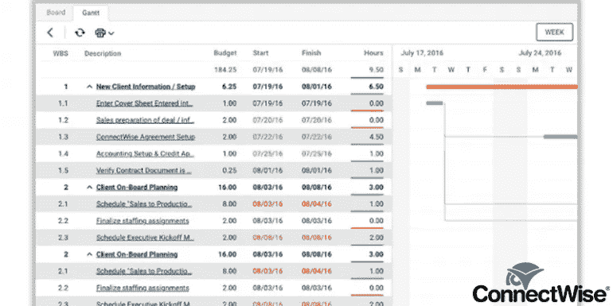

# Corona 中远程团队的 5 个最佳项目管理工具

> 原文：<https://medium.datadriveninvestor.com/5-best-project-management-tools-for-remote-team-amid-corona-3bb7da90b6f3?source=collection_archive---------14----------------------->

在过去几年中，虚拟和远程工作团队一直在持续增长。由于先进的工具和软件解决方案，项目交付不再局限于任何特定的工作地点。远程团队沟通和项目管理的进步使得企业与远程团队合作变得更加容易。

冠状病毒的爆发使得全球数十家公司转向远程运营。而且，在项目管理工具的帮助下，他们有效地管理他们的工作并按时完成。

在这篇文章中，我们为虚拟团队收集了 8 个最好的项目管理工具来缩小你的研究范围:

[**特雷罗**](https://trello.com/)

Trello 是一个为虚拟工作组工作的在线协作和可视化规划工具。它使用看板风格来组织和管理你的板，你可以以任何方式使用它，无论是任务，项目还是时间表。

**这里适合远程办公:**

1.  Trello 告诉我们目前正在做什么工作，谁在做什么项目，有什么事情正在进行中。
2.  所有信息都实时更新，并全天候保留在工具中。因此，不需要面对面的澄清会议。
3.  您可以通过创建一个专门的论坛来组织每周或每天的会议，该论坛以结构化的方式包含您团队的议程。
4.  您可以为重要项目(如项目和团队活动)创建卡片，以提供概述。为任何想了解更多信息的人链接文档、相关公告板和聊天频道。
5.  您还可以设置可配置的预警，以通知 Trello 中活动的松弛渠道。

**定价**

Trello 的免费版本是可用的。 **Pro 版 9.99 美元/月/用户起。**

[**Zoho 项目:**](https://www.zoho.com/projects/)

Zoho Projects 是一个项目管理工具，通过与远程工作团队的有效规划、协作和跟踪，帮助您完成工作。通过任务列表和里程碑简化项目规划，以便轻松监控进度。

**以下是 Zoho 项目的一些特别之处:**

1.  Zoho Projects 允许你把你的大项目分成容易管理的任务。向您的团队分配任务，并指定开始和结束日期。
2.  基于云的软件有助于远程工作的员工、供应商和顾问之间的高效协作。
3.  该应用程序的甘特图功能有助于您了解报告，深入了解团队的进展。
4.  Zoho Projects 附带了用于识别、跟踪、管理文档和解决问题的工具，这对于虚拟团队的有组织管理是必不可少的。
5.  Zoho 项目中的任务报告按状态、里程碑、所有者、完成百分比和优先级分组。

**定价**

它有管理单个项目的自由。**它有一个付费计划，对企业来说从每月 25 美元到每月 100 美元不等。**

[**连接方式管理:**](https://www.connectwise.com/)

ConnectWise Manage 是客户服务、销售、管理、计费功能和项目管理的独特组合。ConnectWise Manage 收集和存储您的所有数据，并提供项目进度的完整可见性。

**以下是 ConnectWise Manage 的一些独特功能:**

1.  你将跟踪供应和采购订单，分配和管理项目，制定营销策略，控制销售和服务客户。
2.  ConnectWise Manage 的强大报告功能提供了大量功能强大的报告，有助于做出基于数据的明智决策。
3.  ConnectWise 的系统漏斗管理您的所有交易，处理您的账单和发票活动，并跟踪时间。

**定价** **这款应用有三个版本，即基础版、标准版和高级版。**

[**缩放**](https://zoom.us/) **:**

Zoom 是一种广泛使用的视频通信工具，越来越多地被远程工作团队采用。Zoom 配备了一个简单可靠的云平台，用于跨桌面、移动设备、电话和房间系统的音频和视频会议、聊天、协作和网络研讨会。

**为什么对远程团队工作有好处:**

1.  该工具允许团队的不同成员通过网络摄像头、视频会议或电话参加面对面的会议。
2.  它允许移动屏幕共享，这样即使在远程工作时，您也可以与同事保持联系。
3.  您可以将会议录制到您的设备或 Zoom cloud，以便以后查看。
4.  Zoom 可以很容易地同步到 Slack。

**定价:**该应用的基础版免费提供。 **Pro 版 1.67 美元/月/用户起。**

[吉拉:](http://www.atlassian.com/ ‎)

对于远程工作的敏捷软件开发团队来说，吉拉是一个简单明了的工具。其解决方案旨在集中团队每个成员执行的流程。这从规划冲刺、分发曲目和跟踪开始，包括使用完整内容可见性对重要任务进行优先级排序。

**为什么适合远程团队工作:**

1.  对于开发和技术支持团队来说，它是更快完成工作的完美之选。
2.  吉拉通过给你的团队一个地方来跟踪每天的进度，对估计进行调整，并检查其他团队成员正在进行的任务，从而提供了透明度。这样就不需要去问你的同事他们在做什么。
3.  吉拉使沟通更容易，因为它允许项目经理向吉拉的团队成员分配任务，并通过电子邮件通知他们。当他们处理任务时，他们可以添加注释并标记他们团队的进度。
4.  像特雷罗一样，吉拉也使用灵活的看板，让你的团队充分了解未来的任务。
5.  它为您提供了对大量现成报告的访问，这些报告提供了关于 sprint 进度的实时和可操作的见解。因此，消除了面对面报告的需要。
6.  您可以将您最喜欢的版本控制、部署或功能标记工具中的信息带入吉拉。这为您提供了对开发管道的即时可见性。

**定价:**该工具的基础版是免费的。**该工具的专业版起价 7 美元/月/用户。**

*原载于 2020 年 4 月 5 日 https://graffersid.com**[*。*](https://graffersid.com/blogs/5-best-project-management-tools-remote-team-amid-corona/)*