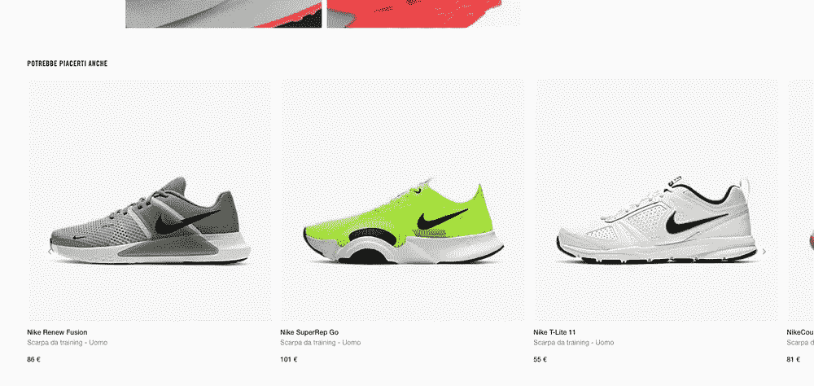
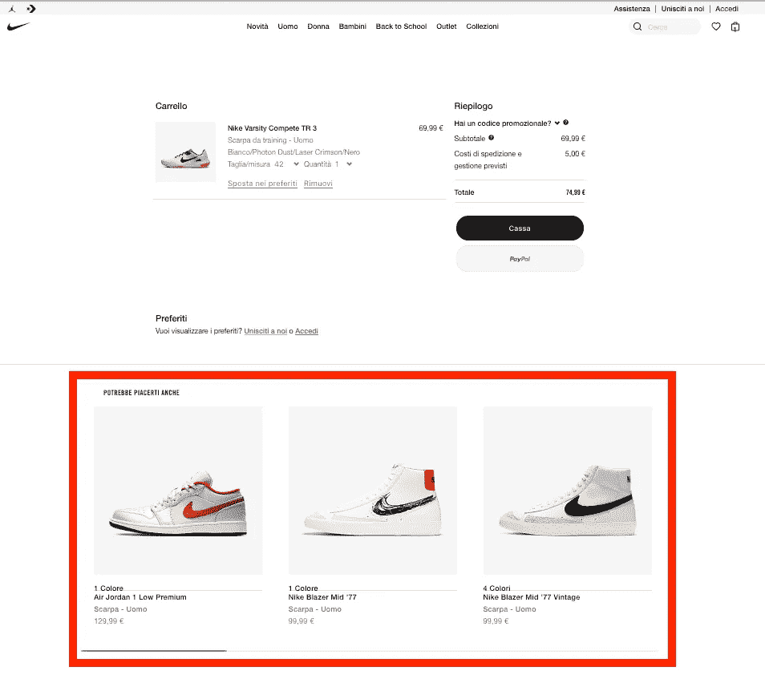
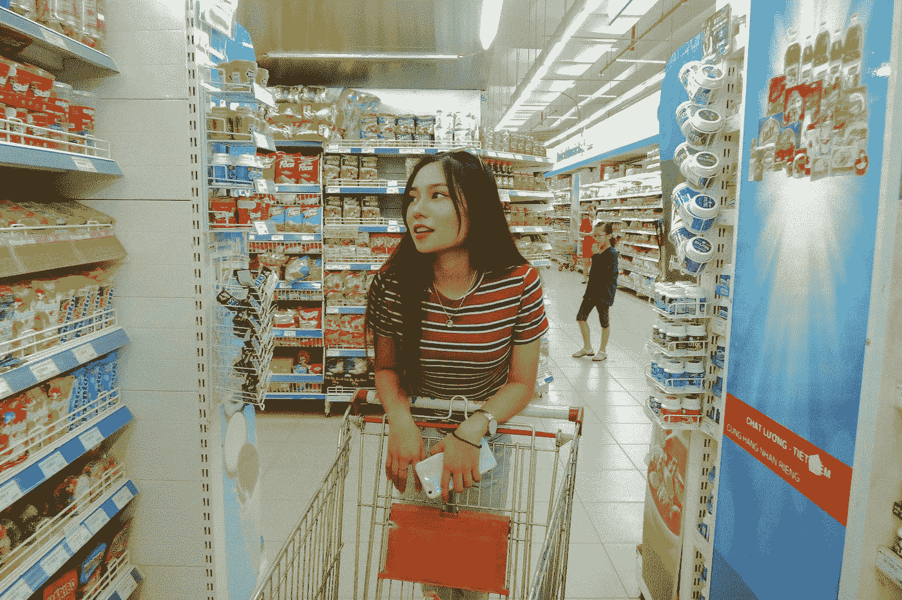
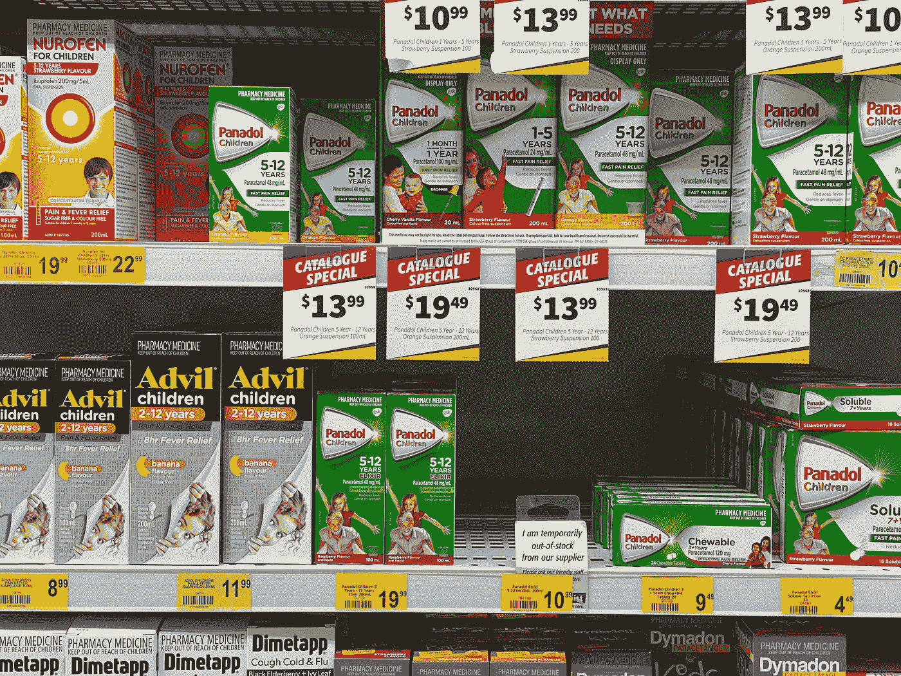

# 在电子商务中引入建议以开创新收入流的 5 个最佳部分

> 原文：<https://medium.datadriveninvestor.com/5-best-sections-to-place-recommendations-in-e-commerce-to-start-a-new-revenue-stream-8fb538b79fd3?source=collection_archive---------25----------------------->

对于盈利的在线业务来说，用户体验比以往任何时候都更加重要。客户体验决定了客户对你公司的评价。怎样做才能确保它是积极的？你如何创造可重复和个性化的体验？

本指南重点关注改善和自动化用户体验的主要方面，尤其是在用户导航期间如何以及在哪里显示推荐。

# 现状

以我个人的经验，我注意到在大多数时候，甚至在企业级的电子商务中，有一种几乎超现实的方式来管理产品放置，就好像它是一个物理销售点。

每周更新主页中的产品位置，用作虚拟“展示”，传达给他们的电子商务经理，并将促销和赞助作为唯一的销售驱动因素。

> 40%的网上商品销售变得过时或不值得存在，因为它没有任何销售。

由于工具越来越简单，内部人员解决*商品饱和*和实现*个性化*变得非常简单。市场在不断发展，允许更少的侵入和更容易的实施，避免繁重的同化成本。

# 有哪些机器学习推荐？

这是一种算法，它建议(或推荐)根据特定客户偏好、他的导航历史和购买行为定制的产品。使用统计预测，它建议最有可能被购买的产品。

一种算法和另一种算法之间的实质性差异是由特征的数量和收集的数据给出的，以允许尽可能与客户相关的“更相关的”预测。

Nike Website

# 如何帮助改善购物体验？

基本上，它预测(使用不同的准确度水平)最常购买的产品，根据特定参数，为每个用户(也为那些尚未购买的用户)提供适合的指示*，并且与那些已经购买的用户更相关。*

想象一下，当你在你喜欢的电子商务网站上返回导航时，相关产品或搜索查询后显示的产品与你的兴趣相关，这与许多其他用户的兴趣相似。

例如:如果你尝试浏览耐克电子商务，在他们的商店上只看了 3 件产品后，他们能够提出一个比其他更相关的推荐。尝试在购物车中添加一个并转到购物车页面，您会注意到页面下方有一个“建议”部分。这些建议是[向更有可能购买的客户群](https://alexgenovese.it/blog/applying-rfm-customer-segmentation-to-your-business-right-now/) ( [，你目前所在的](https://alexgenovese.it/blog/applying-rfm-customer-segmentation-to-your-business-right-now/))或我之前见过的客户群(这取决于应用的机器学习算法)提出的。

Nike Cart Page

就我而言，如果他们以折扣价给我提供与我所买的相关颜色的袜子或短裤，那会更有用😂).

# 你应该在哪里嵌入推荐

嵌入推荐的位置通常是那些热图是中等热点的位置。

一些最常见的职位是:

> *另一个最常见的有用部分是搜索栏中的自动完成功能。* [*我写了一个作品，你可以在里面找到实现后的所有结果*](https://alexgenovese.it/work/boost-conversion-rate-through-data-analysis-and-search-bar-improvements-using-recommendations-lotto-sport-italia/) *，我想你应该会觉得有用。*

 [## 简化电子商务网站|数据驱动的投资者

### 对于数据科学领域的新手来说，一个显而易见的问题是什么数据…

www.datadriveninvestor.com](https://www.datadriveninvestor.com/2020/04/15/scraping-an-e-commerce-website-made-simple/) 

# 主页

这对于产品推荐至关重要，根据[bay mard Institute research](https://baymard.com/blog/inferring-product-catalog-from-homepage)的报告，25%的测试访问者上下滚动主页来快速评估网站的产品。

> *卓越的商务体验依赖于基于行为、人口统计和兴趣的有效客户细分。*

Photo by [Phuong Tran](https://unsplash.com/@annetran?utm_source=medium&utm_medium=referral) on [Unsplash](https://unsplash.com?utm_source=medium&utm_medium=referral)

# 搜索结果

理想的搜索页面包含显示其他客户在浏览期间查看和购买的内容的推荐，从这一点开始到购买感谢页面。

顺便说一下，在这个页面中，过滤器也非常重要:显示在左侧栏中，并且只显示那些坚持搜索结果的用户。

Photo by [Edho Pratama](https://unsplash.com/@edhoradic?utm_source=medium&utm_medium=referral) on [Unsplash](https://unsplash.com?utm_source=medium&utm_medium=referral)

# 产品

设置推荐的追加销售，显示价格相似或更高(或两者都有)的产品，以增加 AOV。这激发了客户继续搜索的兴趣，同时也让你可以推广几种不同的相关产品。

几年前，亚马逊透露其产品页面 35%的收入来自交叉销售和追加销售部分。

Photo by [Christian Wiediger](https://unsplash.com/@christianw?utm_source=medium&utm_medium=referral) on [Unsplash](https://unsplash.com?utm_source=medium&utm_medium=referral)

# 手推车

此页面是追加销售补充产品来完成客户订单的最佳时机。提醒您的客户所浏览的最相关的产品。

多达 25%点击这些推荐的客户会订购它。

Photo by [David Veksler](https://unsplash.com/@davidveksler?utm_source=medium&utm_medium=referral) on [Unsplash](https://unsplash.com?utm_source=medium&utm_medium=referral)

# 错误页面

当你愉快地浏览你最喜欢的电子商务时，发现一个你喜欢的产品却被 404 信息击中，这是一种耻辱！

记下你的购买意愿。

与其重定向到网站上的其他页面或简单地显示一条错误消息，为什么不把不便变成机会呢？使用错误页面显示:

*   畅销书:让你的顾客关注最热门的产品；
*   基于浏览历史:根据客户的产品面包屑显示项目；
*   相关/相似产品:向客户推荐与他们正在搜索的产品相似的其他产品。

这些是一些实际的例子，由于大多数推荐工具都是通过模块、跟踪脚本和/或 html 标记来实现的，其中推荐的产品是实时“注入”的，所以今天无需技术努力就可以应用。

Photo by [Franki Chamaki](https://unsplash.com/@franki?utm_source=medium&utm_medium=referral) on [Unsplash](https://unsplash.com?utm_source=medium&utm_medium=referral)

# 注意—用于高级用途

根据特定的浏览行为，这些内容应该根据价格或销售需求使用特定的规则进行过滤。

对于每个推荐的内容，**您还可以应用额外的细分策略**，使用之前收集的关于他们的 AOV(平均订单价值)或他们最近购买的可用产品的信息:

*   在交叉销售部分，向确定的客户群(例如，冠军或常客)推荐并向他们提供所有价格更高的产品，因为这更符合他们的消费历史；
*   在搜索结果页面(也利用了误拼的优势)，向使用通用关键字搜索某个事物的特定集群推荐更相关的产品，例如:白鞋、红包等。；
*   在购物车页面中，建议补充产品，与他们正在购买的产品相比，这些产品通常由 VIP 客户群购买。

# 关于销售增长

我会在整体电商销量有较大增长的地方写一些精选作品，有 x2，x3 甚至 x5。

在工作页面上，你会发现我从最具挑战性的文章中挑选了一些，从最老的文章开始，我会继续更新，至少每周一次。

## [**订阅简讯待通知！**](https://alexgenovese.it/signup/)

Photo by [Franki Chamaki](https://unsplash.com/@franki?utm_source=medium&utm_medium=referral) on [Unsplash](https://unsplash.com?utm_source=medium&utm_medium=referral)

# 执行建议的结果

在这里，我将搜索到的所有渠道的销售额提高了 300%。这意味着业务收入流经历了增长，不是 300%，而是与使用搜索栏开始的会话中发生的转换成比例的增长。

**举例:**如果 10%的用户使用搜索栏来查找将要购买的产品，并且初始转化率为 3%，那么将转化率提高 x2，这意味着销售额将翻倍。

Photo by [John Baker](https://unsplash.com/@jlondonbaker?utm_source=medium&utm_medium=referral) on [Unsplash](https://unsplash.com?utm_source=medium&utm_medium=referral)

**如果这些建议也适用于其他平台上的渠道，就有可能获得指数级的销售增长曲线。**

**如果营销自动化应用于推荐，收入流会大幅增加。**

## 访问专家视图— [订阅 DDI 英特尔](https://datadriveninvestor.com/ddi-intel)