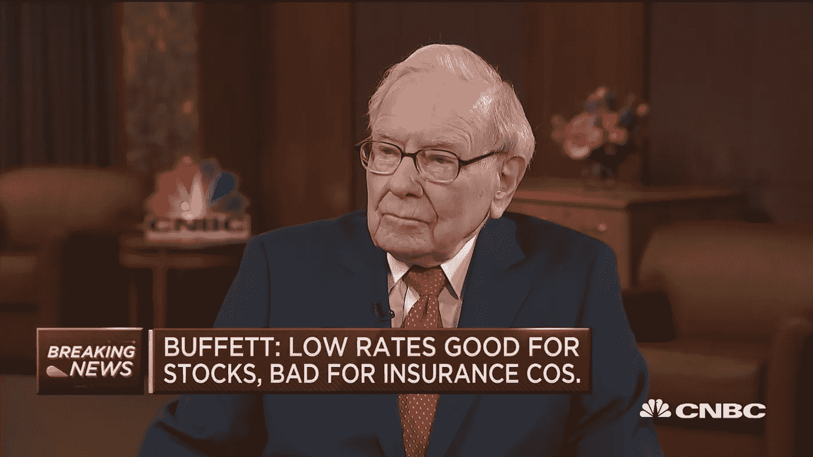
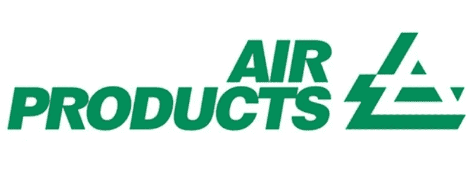
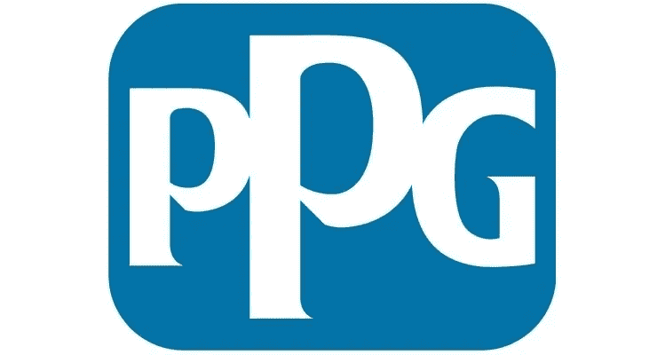
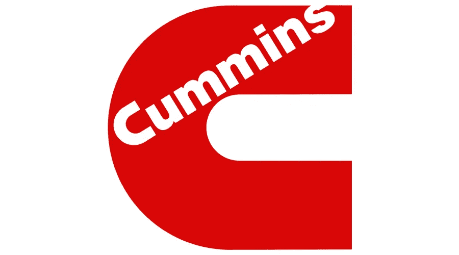
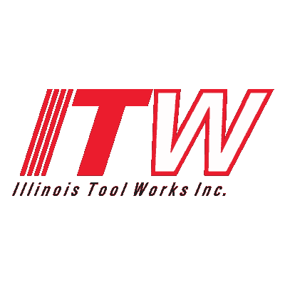

# 沃伦·巴菲特可以直接收购的 5 家公司

> 原文：<https://medium.datadriveninvestor.com/5-companies-warren-buffet-could-buy-outright-78e74e072c08?source=collection_archive---------24----------------------->

Warren Buffet’s 2020 Interview on CNBC — [Image Copyright of CNBC.](https://www.cnbc.com/video/2020/02/24/watch-cnbcs-full-interview-with-berkshire-hathaway-ceo-warren-buffett.html)

沃伦·巴菲特目前坐拥巨额现金。

确切地说是 1370 亿美元。

沃伦表达了他想在退休前做最后一笔交易的想法。他现在已经 90 岁了，所以他可能不会再有机会[利用像疫情冠状病毒带给他的机会。](https://www.bloomberg.com/opinion/articles/2020-03-03/warren-buffett-is-waiting-for-one-last-big-score)

沃伦在年度股东信中反复强调，他更喜欢直接收购公司，而不是在其中持有少量股份。

虽然对于他喜欢的所有公司来说，这是不可能的，但对于一些公司来说，用这种类型的现金可能做到这一点。投资网飞甚至亚马逊这样的公司不是他的风格。在他的投资生涯中，他多次回避科技股，认为它们风险太大，股息不够，不适合他通常喜欢的股票。

 [## 利用股市相关性的最佳方式|数据驱动的投资者

### 当阿尔弗雷德·温斯洛·琼斯开创了世界上第一个“对冲”基金(后来“d”被去掉了)时，他让其他投资者大吃一惊…

www.datadriveninvestor.com](https://www.datadriveninvestor.com/2020/02/02/the-best-way-to-use-stock-market-correlations/) 

他通常根据以下指标投资公司:

**盈利能力**——公司是否有强大的资产负债表和安全的股息。

**估值—** 沃伦喜欢划算的交易。他在这么长时间里持有这么多现金的原因是，在冠状病毒疫情爆发之前，市场处于历史高点。现在他有机会了。

**债务——沃伦通常投资于那些能够迅速偿还债务、且资产负债表上没有太多债务的公司。**

通常，当沃伦打算投资一家公司时，这三个因素就会发挥作用。

**美国人**——不用说，沃伦对美国下了大赌注。他在伯克希尔的投资组合就像是美国商业统治地位的快照。

**全球业务** —巴菲特通常投资的公司通常是在全球范围内拥有业务并在世界各国销售的公司。可口可乐就是一个著名的例子，他们的产品在全世界都能立即被认出来。

**竞争优势** —这是否意味着通过拥有最广泛的业务、最简化的销售流程成为市场领导者，或者创造行业内最好的产品。他的投资[通常有一个优势或“经济护城河”来保护他们的利润。](https://medium.com/datadriveninvestor/what-an-economic-moat-is-and-why-it-matters-db3f6ac9933f)

## 他一直在等待的机会

随着冠状病毒疫情粉碎公司的估值，沃伦可能会抓住一些机会。

根据这些指标，这里有五家公司符合自助餐的标准。

这里有五家公司，它们基于巴菲特在评估他完全可以直接购买的企业时使用的历史接管指标。

## 1.空气产品

Copyright of [Air Products.](http://www.airproducts.co.uk/)

市值:**550 亿美元。**股息率: **2.15%。**

空气产品公司是一家工业气体和化学公司，总部设在宾夕法尼亚州。该公司的足迹遍布全球，制造能力令人印象深刻。

空气产品公司与美国国家航空航天局有着悠久的历史关系，并为水星和阿波罗任务提供氢、氦和氧。

Air Products 今年实现净利润 19.4 亿美元，股息高达 2.15%。该公司的股息支付率为 56%,也不错。

该公司看起来财务状况良好，将成为伯克希尔投资组合中的又一优秀成员。

## 2.PPG 工业公司

Copyright of [PPG Industries](https://www.ppg.com/)

市值:**270 亿美元。**股息率: **1.80%**

PPG 工业是世界领先的油漆和涂料供应商。按销售额计算，它是世界上最大的涂料公司。该公司每年有 150 亿美元的健康收入，并从中获得约 14 亿美元的丰厚利润。

PPG 符合巴菲特的标准，而且该公司由于是世界上同类型中最大的公司，拥有稳定而稳健的管理，因此与同行相比具有巨大的竞争优势。

PPG 的股息支付率约为 40%，[这很好](https://medium.com/datadriveninvestor/5-things-to-consider-when-building-a-dividend-portfolio-3c000025bf58)，随着过去几年每股收益的增加，该公司的财务状况是可靠的。

巴菲特的伯克希尔哈撒韦公司每年可以获得 5.6 亿美元的股息，基本面有利于未来的增长。

由于冠状病毒，PPG Industries 的估值略有下降，这意味着它将适合伯克希尔的投资组合。

## 3.雷神技术公司

Copyright [Raytheon Technologies.](https://www.rtx.com/en)

市值:**1120 亿美元。**股息率: **2.56%**

雷神技术公司是一家新成立的大型航空航天和国防公司。雷声公司和联合技术公司于 2020 年 4 月完成合并，现在是该行业收入和市值最大的公司之一。

这一合并被宣传为两家业务互补的稳定公司之间的“平等合并”。

合并前的雷神公司市值为 320 亿美元，对巴菲特来说是一笔好买卖。虽然这家新公司符合巴菲特的标准，但鉴于最近围绕合并的一系列活动，这家公司的机会不大。但我还是不排除这种可能性。

## 4.康明斯

Copyright of [Cummins.](https://www.cummins.com/)

市值:**:270 亿美元。**股息率: **2.85%。**

康明斯是一家发动机和过滤产品制造商。该公司生产工业和商业用的发电系统。该公司业务遍及全球，几乎在世界每个国家都有销售。

在最近一个财年，康明斯的收入为 230 亿美元，利润为 21 亿美元。该公司的股息支付率为 37%，非常出色。2.85%的股息是可观且健康的，将为伯克希尔的投资组合增添一笔可观的财富。

## 5.伊利诺伊工具厂公司。

Copyright of [Illinois Tool Works Inc.](https://www.itw.com/)

市值:**570 亿美元。**股息率: **2.37%。**

伊利诺伊工具公司是一家为全球市场制造和供应工程部件和专用设备的公司。

该公司的净收入为 24.9 亿美元，股息支付率为 55%，健康的股息收益率为 2.37%。

根据这位传奇投资者在决策时使用的指标，伊利诺伊工具公司(Illinois Tool Works Inc .)将为伯克希尔的投资组合做出巨大贡献。

## 他会买什么？

市场略有回升，抹去了 S&P500 今年的所有损失。随着乐观情绪的恢复，投资的时机可能已经过去了。

沃伦的观察名单上有什么只是猜测，但你可以根据他之前投资的公司想象这些公司在名单上。

沃伦是否决定投资一家公司将取决于几个因素。我不会指望他做出任何草率的决定，可能还会等待另一个机会出现。只有时间能证明一切。