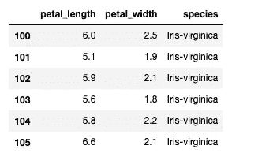
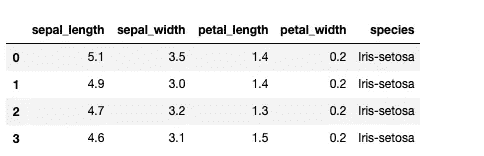
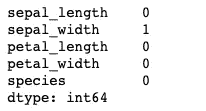
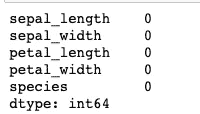
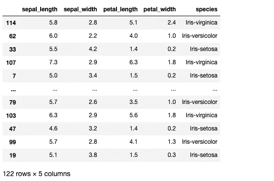
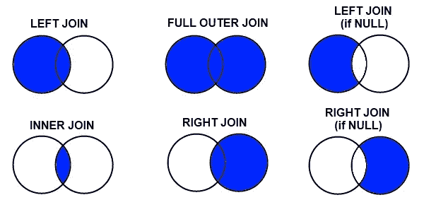
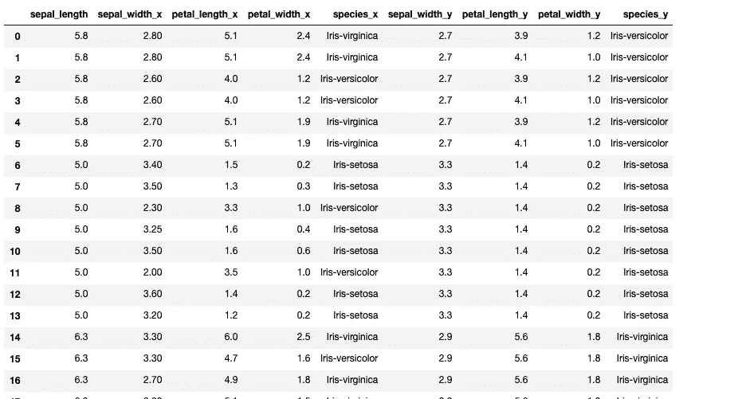
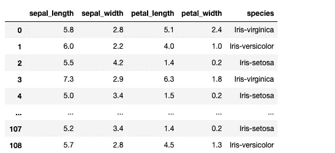
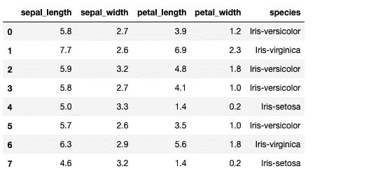

# 面向数据科学家的 5 项酷炫先进熊猫技术

> 原文：<https://medium.datadriveninvestor.com/5-cool-advanced-pandas-techniques-for-data-scientists-c5a59ae0625d?source=collection_archive---------0----------------------->

## 使用这些技巧…


Pic from Unsplash.com

在开始实现这些技术之前，将您选择的数据加载到您的工作环境中。在这篇文章中，我使用的是虹膜数据。

[](https://medium.com/datadriveninvestor/stack-overflow-analyzed-data-from-60-000-software-developers-hours-they-work-languages-they-476ac6ca0197) [## Stack Overflow 分析了来自 60，000 多名软件开发人员的数据，包括他们的工作时间、语言…

### 以下是他们的发现…

medium.com](https://medium.com/datadriveninvestor/stack-overflow-analyzed-data-from-60-000-software-developers-hours-they-work-languages-they-476ac6ca0197) [](https://medium.com/datadriveninvestor/hacker-earth-surveyed-16000-developers-from-76-countries-heres-what-i-found-dbd5d7c422b0) [## 黑客地球调查了来自 76 个国家的 16000 名开发者——以下是我的发现

### 惊人的洞察力…

medium.com](https://medium.com/datadriveninvestor/hacker-earth-surveyed-16000-developers-from-76-countries-heres-what-i-found-dbd5d7c422b0) [](https://medium.com/datadriveninvestor/hacker-rank-analyzed-data-from-100k-developers-and-hiring-managers-here-is-what-i-found-a374b98e937e) [## Hacker Rank 分析了来自 10 万多名开发人员和招聘经理的数据——以下是我的发现

### 来自 100，000 多名开发人员和招聘经理的出色分析结果

medium.com](https://medium.com/datadriveninvestor/hacker-rank-analyzed-data-from-100k-developers-and-hiring-managers-here-is-what-i-found-a374b98e937e) 

首先导入必要的库，比如 Pandas 和 Numpy，并加载数据集。一旦完成，投入到下面的技术中—

# 1.使用熊猫分割数据

在下面的代码中，我们将数据拆分成随机的行样本，并在删除索引值后将它们从原始数据中删除。

```
iris_data_new= df.copy()
df1=iris_data_new.sample(frac=0.75,random_state=0)
iris_data_new=iris_data_new.drop(df1.index)df2=iris_data_new.sample(frac=0.25,random_state=0)
iris_data_new=iris_data_new.drop(df2.index)print(df1.shape)
```

输出—

```
(112, 5)
```

# 其他一些最好的系列—

> [**三十天的机器学习 Ops**](https://medium.com/coders-mojo/day-1-of-30-days-of-machine-learning-ops-7c299e4b09be?sk=4ab48350a5c359fc157109e48b1d738f)
> 
> [**完整系统设计案例分析系列**](https://medium.com/coders-mojo/day-1-of-system-design-case-studies-series-b3c3fecae079?sk=ee7333918f135e06eb3a9b9434d35696)
> 
> [**30 天自然语言处理(NLP)系列**](https://medium.com/coders-mojo/quick-recap-30-days-of-natural-language-processing-nlp-with-projects-series-ceb674e3c09b?sk=ca09b27b3d5867f23ab4dc367b6c0c32)
> 
> [**30 天数据工程与项目系列**](https://medium.com/coders-mojo/day-1-of-30-days-of-data-engineering-894822fcb128?sk=76ba558bfe2d9f85cbe741e505295531)
> 
> [**数据科学与机器学习研究(论文)简体**](https://medium.com/coders-mojo/day-1-data-science-and-ml-research-papers-simplified-a68b00a3b1c4?sk=56136229ff738bd734f19d2b6953f78c) ******
> 
> [**60 天数据科学与 ML 系列带项目**](https://medium.com/coders-mojo/day-1-day-60-quick-recap-of-60-days-of-data-science-and-ml-6fc021643d1?sk=4e75e043b7630a9f963562ebac94e129)
> 
> [**100 天:你的数据科学与机器学习学位系列与项目**](https://medium.com/coders-mojo/100-days-your-data-science-and-ml-degree-part-3-c621ecfdf711?sk=1a8c7b0c204d73432d56b7d1a3a26474)
> 
> [**你应该知道的 23 个数据科学技巧**](https://ai.plainenglish.io/23-data-science-techniques-you-should-know-61bc2c9d1b3a?sk=1680c36193eb22198974c9008d62a33c)
> 
> [**科技面试系列—编码问题精选清单**](https://medium.com/coders-mojo/mega-post-tech-interview-the-only-list-of-questions-you-need-to-practice-ee349ea197bb?sk=fac3614684daff4b50a70c0a71e4d528)
> 
> [**完成系统设计与最热门问题系列**](https://medium.com/coders-mojo/system-design-made-easy-quick-recap-of-complete-system-design-34af7e3aedfb?sk=bdd6a19edc1f3ce4a5064923f5b68721)
> 
> [**完成数据可视化及预处理系列与项目**](https://medium.com/coders-mojo/complete-data-preprocessing-and-data-visualization-with-projects-mega-compilation-part-2-41584ef0920e?sk=842390da51689b8d43148c3980570db0)
> 
> [**完整的 Python 系列与项目**](https://medium.com/coders-mojo/complete-python-and-projects-mega-compilation-7ec8f7adfe71?sk=ee0ecf43f23c6dd44dd35d984b3e5df4)
> 
> [**完成高级 Python 系列与项目**](https://medium.com/coders-mojo/complete-advanced-python-with-projects-mega-compilation-part-6-729c1826032b?sk=7faffe20f8039fa57099f7a372b6d665)
> 
> [**Kaggle 最会教你的笔记本**](https://medium.com/coders-mojo/my-list-of-kaggle-best-notebooks-topic-wise-data-science-and-machine-learning-part-2-84772863e9ae?sk=5ed02e419854a6c11add3ddc1e52947f)
> 
> [**Git**](/the-complete-developers-guide-to-git-6a23125996e1?sk=e30479bbe713930ea93018e1a46d9185)完全开发者指南
> 
> [**打赏 Github Repos**](https://medium.com/coders-mojo/6-exceptional-github-repos-for-all-developers-part-1-21e8fa04e150?sk=9140b249af6fe73d45717185fad48962) **—第一部**
> 
> [**打赏 Github Repos**](https://medium.com/coders-mojo/6-exceptional-github-repos-for-all-developers-part-2-3eec9a68c31c?sk=8e31d0eb7eb1d2d0bbbcecaa66bd4e7e) **—第二部**
> 
> [**所有数据科学和机器学习资源**](/best-resources-for-data-science-and-machine-learning-full-list-5ceb9a2791bf?sk=cf85b2cef95560c58509877a794577ff)
> 
> [**210 机器学习项目**](/210-machine-learning-projects-with-source-code-that-you-can-build-today-721b035649e0?sk=da5f593572a0261a6314afad99a0356c)

## 科技时事通讯—

> 如果你感兴趣，你可以加入我的时事通讯，通过它我向超过 30，000 名读者发送技术面试技巧，技术，模式，黑客——软件开发，ML，数据科学，创业公司和技术项目。可以订阅**科技 Brew :**

[](https://naina0405.substack.com/) [## 点火器

### 数据科学，人工智能，人工智能和更多…点击阅读由 Naina Chaturvedi 撰写的 Ignito，子堆栈出版物。推出 7 个月…

naina0405.substack.com](https://naina0405.substack.com/) 

## Github —

[](https://github.com/Coder-World04) [## 编码器-world 04-概述

### 此时您不能执行该操作。您已使用另一个标签页或窗口登录。您已在另一个选项卡中注销，或者…

github.com](https://github.com/Coder-World04) 

# 2.宁滨数据

宁滨是一种将数据分组/归入多个桶的技术，如果您处理连续的数字数据，这将非常有用。在 pandas 中，您可以使用剪切和剪切功能来绑定数据。首先检查数据的形状，即行数和列数。

```
print(iris_data.shape)
```

输出—

```
(150, 5)
```

然后使用 qcut 绑定您的数据，如下所示

```
pd.qcut(df['sepal_width'],q=5).value_counts()
```

输出—

```
(2.7, 3.0]      50
(1.999, 2.7]    33
(3.1, 3.4]      31
(3.4, 4.4]      24
(3.0, 3.1]      12
Name: sepal_width, dtype: int64
```

[](https://medium.com/datadriveninvestor/the-most-hilarious-code-comments-ever-bae3cb1030b5) [## 史上最搞笑的代码注释

### 程序员幽默:是的，实际上是程序员写的！

medium.com](https://medium.com/datadriveninvestor/the-most-hilarious-code-comments-ever-bae3cb1030b5) [](https://medium.com/datadriveninvestor/coding-sins-hilarious-developer-confessions-f55eb342454e) [## 编码原罪:令人捧腹的开发者自白

### “白板”是如何被嘲笑的

medium.com](https://medium.com/datadriveninvestor/coding-sins-hilarious-developer-confessions-f55eb342454e) [](https://medium.com/python-in-plain-english/python-iterators-generators-and-decorators-made-easy-659cae26054f) [## Python 迭代器、生成器和装饰器变得简单

### 快速实施指南

medium.com](https://medium.com/python-in-plain-english/python-iterators-generators-and-decorators-made-easy-659cae26054f) [](https://medium.com/ai-in-plain-english/23-data-science-techniques-you-should-know-61bc2c9d1b3a) [## 你应该知道的 23 种数据科学技术！

### 使用这些技巧来节省你的宝贵时间

medium.com](https://medium.com/ai-in-plain-english/23-data-science-techniques-you-should-know-61bc2c9d1b3a) 

# 3.使用 loc 和 iloc 函数进行切片

您可以分别使用 iloc 和 loc 函数进行基于位置和基于标签的切片。

```
iris_data.loc[100:105, 'petal_length':'species']
```

输出—



```
iris_data.iloc[:4]
```

输出—

[](https://naina0412.medium.com/10-silicon-valley-liners-puns-that-are-so-funny-apt-relatable-to-the-tech-world-a2ee797f7949) [## 10 个“硅谷”的俏皮话/双关语是如此有趣、贴切且与技术世界相关

### 虽然听起来很搞笑…

naina0412.medium.com](https://naina0412.medium.com/10-silicon-valley-liners-puns-that-are-so-funny-apt-relatable-to-the-tech-world-a2ee797f7949) 

# 4.平均插补和内插法

均值插补是一种用所选列中可用数据的均值替换缺失值的技术。

首先看看你的数据是否有缺失值。

```
iris_data.isnull().sum()
```

输出—



然后计算平均值并替换缺失值—

```
iris_data['sepal_width'].mean()
```

输出—

```
3.0516778523489942
```

替换丢失的值

```
iris_data['sepal_width'].fillna(iris_data['sepal_width'].mean(), inplace=True)
iris_data.isnull().sum()
```



内插法—

```
iris_data['sepal_width'].fillna(iris_data['sepal_width'].interpolate(), inplace=True)
```


# 5.使用 Concat 和 Join 合并数据

就像在 numpy 中一样，pd.concat()函数用于 pandas 中 Series 或 DataFrame 对象的串联。

```
df4=pd.concat([df1,df2],axis=0)print(df4)
```

输出—



## 加入—

合并和连接数据是数据科学中最重要的技能之一。正确理解和实现它对于很好地分析数据至关重要。

[](https://www.datadriveninvestor.com/2020/07/23/learn-data-science-in-a-flash/) [## 一瞬间学会数据科学！？数据驱动的投资者

### 在我之前的职业生涯中，我是一名训练有素的古典钢琴家。还记得那些声称你可以…

www.datadriveninvestor.com](https://www.datadriveninvestor.com/2020/07/23/learn-data-science-in-a-flash/) 

在这方面，我们将实施—

*   内部连接:根据指定的合并条件保留表/数据框中的行。
*   完全连接:尽可能将左表和右表中的所有行与匹配行保留在一起，而将 NaN 的行保留在其他地方。
*   左连接:保留左表中的所有行，如果右表中有丢失的值，根据指定的合并条件将其作为 NaN。
*   右连接:保留右表中的所有行，如果左表中缺少值，根据指定的合并条件，将其作为 NaN。



Source and credits: Stack Overflow

```
#Inner Join
df5=pd.merge(df1,df2,on='sepal_length')
print(df5)
```



```
#Full outer join
df6=pd.merge(df1,df2,how='outer')
print(df6)
```


```
#Left Join
df7=pd.merge(df1,df2,how='left')
print(df7)
```



```
#Right Join
df8=pd.merge(df1,df2,how='right')
print(df8)
```



# 所有完整的系统设计系列零件—

> [***1。系统设计基础***](https://medium.com/coders-mojo/complete-system-design-series-part-1-45bf9c8654bc)
> 
> [***2。水平和垂直缩放***](https://medium.com/coders-mojo/complete-system-design-series-part-2-922f45f2faaf)
> 
> [***3。负载平衡和消息队列***](https://medium.com/coders-mojo/part-3-complete-system-design-series-e1362baa8a4c)
> 
> [***4。高层设计和低层设计，一致散列，单片和微服务架构***](https://medium.com/coders-mojo/part-4-complete-system-design-series-138bc9fbcfc0)
> 
> [***5。缓存、索引、代理***](https://medium.com/coders-mojo/part-5-complete-system-design-series-4b9b04f23608)
> 
> [***6。联网、浏览器如何工作、内容网络交付(CDN)***](https://medium.com/coders-mojo/part-6-complete-system-design-series-59a2d8bbf1ed)
> 
> [***7。数据库分片、CAP 定理、数据库模式设计***](https://medium.com/coders-mojo/part-7-complete-system-design-series-1bef528923d6)
> 
> [***8。并发、API、组件+ OOP +抽象***](https://medium.com/coders-mojo/part-8-complete-system-design-series-57bc88433c8e)
> 
> [***9。***](https://medium.com/coders-mojo/part-9-complete-system-design-series-df975c85ec51) 估算与规划、绩效
> 
> **10*。*** [***地图缩小，图案和微服务***](https://medium.com/coders-mojo/part-10-complete-system-design-series-523b4dd978bf?sk=741f92929c8639a2e4cf218521e8cc4a)
> 
> ***11。***[***SQL vs NoSQL 和云***](https://naina0412.medium.com/part-11-complete-system-design-series-9c8efbc0237a?sk=5bddf2adc78ea4947ae88ab21c94af1c)
> 
> [***12。最受欢迎的系统设计问题***](https://medium.com/coders-mojo/most-popular-system-design-questions-mega-compilation-45218129fe26)

# Github —

 [## Complete-System-Design/readme . MD at main Coder-world 04/Complete-System-Design

### 这个存储库包含了精通系统设计主题所需的一切，您应该了解系统…

github.com](https://github.com/Coder-World04/Complete-System-Design/blob/main/README.md) 

# 感谢阅读。继续学习:)

# 想看程序员幽默？

[](https://medium.com/datadriveninvestor/programming-humor-part-2-f92cf5a26f2b) [## 编程幽默第 2 部分

### 继续笑，因为太搞笑了…

medium.com](https://medium.com/datadriveninvestor/programming-humor-part-2-f92cf5a26f2b) [](https://medium.com/datadriveninvestor/the-most-hilarious-code-comments-ever-bae3cb1030b5) [## 史上最搞笑的代码注释

### 程序员幽默:是的，实际上是程序员写的！

medium.com](https://medium.com/datadriveninvestor/the-most-hilarious-code-comments-ever-bae3cb1030b5) [](https://medium.com/datadriveninvestor/coding-sins-hilarious-developer-confessions-f55eb342454e) [## 编码原罪:令人捧腹的开发者自白

### “白板”是如何被嘲笑的

medium.com](https://medium.com/datadriveninvestor/coding-sins-hilarious-developer-confessions-f55eb342454e) [](https://medium.com/datadriveninvestor/10-witty-programming-jokes-that-will-make-you-go-rofl-a53fbfb91943) [## 10 个让你着迷的诙谐编程笑话

### 这些太搞笑了…

medium.com](https://medium.com/datadriveninvestor/10-witty-programming-jokes-that-will-make-you-go-rofl-a53fbfb91943) 

# 推荐文章-

[](https://medium.com/python-in-plain-english/python-iterators-generators-and-decorators-made-easy-659cae26054f) [## Python 迭代器、生成器和装饰器变得简单

### 快速实施指南

medium.com](https://medium.com/python-in-plain-english/python-iterators-generators-and-decorators-made-easy-659cae26054f) [](https://medium.com/ai-in-plain-english/23-data-science-techniques-you-should-know-61bc2c9d1b3a) [## 你应该知道的 23 种数据科学技术！

### 使用这些技巧来节省你的宝贵时间

medium.com](https://medium.com/ai-in-plain-english/23-data-science-techniques-you-should-know-61bc2c9d1b3a) [](https://medium.com/datadriveninvestor/coding-sins-hilarious-developer-confessions-f55eb342454e) [## 编码原罪:令人捧腹的开发者自白

### “白板”是如何被嘲笑的

medium.com](https://medium.com/datadriveninvestor/coding-sins-hilarious-developer-confessions-f55eb342454e) [](https://medium.com/datadriveninvestor/5-cool-advanced-pandas-techniques-for-data-scientists-c5a59ae0625d) [## 面向数据科学家的 5 项酷炫先进熊猫技术

### 使用这些技巧…

medium.com](https://medium.com/datadriveninvestor/5-cool-advanced-pandas-techniques-for-data-scientists-c5a59ae0625d) [](https://medium.com/datadriveninvestor/stack-overflow-analyzed-data-from-60-000-software-developers-hours-they-work-languages-they-476ac6ca0197) [## Stack Overflow 分析了来自 60，000 多名软件开发人员的数据，包括他们的工作时间、语言…

### 以下是他们的发现…

medium.com](https://medium.com/datadriveninvestor/stack-overflow-analyzed-data-from-60-000-software-developers-hours-they-work-languages-they-476ac6ca0197) [](https://medium.com/datadriveninvestor/advanced-python-made-easy-part-4-a4996ba9fe19) [## 高级 Python 变得简单—第 4 部分

### 使用这些技巧和技术…

medium.com](https://medium.com/datadriveninvestor/advanced-python-made-easy-part-4-a4996ba9fe19) [](https://medium.com/datadriveninvestor/advanced-python-made-easy-part-1-ce1e2f17431e) [## 高级 Python 变得简单—第 1 部分

### 使用这些技巧和技术…

medium.com](https://medium.com/datadriveninvestor/advanced-python-made-easy-part-1-ce1e2f17431e)