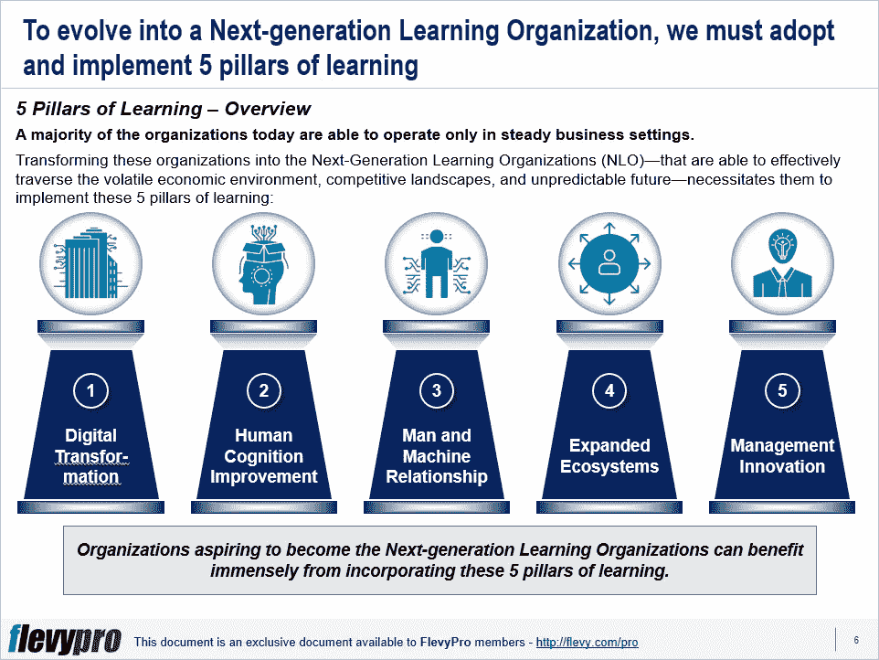

# 成为下一代学习型组织的 5 大核心支柱

> 原文：<https://medium.datadriveninvestor.com/5-core-pillars-essential-to-evolve-into-the-next-generation-learning-organization-70e08e66fca9?source=collection_archive---------14----------------------->

将一个组织转变为下一代学习型组织(NLO)是一项具有挑战性的工作。主要的障碍包括错综复杂的层级结构、官僚主义的繁文缛节、延迟的决策以及复杂的组织系统和流程。

要发展一个学习型组织，领导层需要减少官僚作风和复杂性。他们应该充分利用技术来收集全面的实时数据，大规模部署[人工智能](https://flevy.com/business-toolkit/artificial-intelligence)，并开发数据驱动的决策系统。

[学习的五大核心支柱](https://flevy.com/browse/flevypro/next-gen-learning-organization-core-pillars-5133)对于创建[下一代学习型组织](https://flevy.com/browse/flevypro/next-gen-learning-organization-core-pillars-5133)至关重要，包括:

1.  **数字转换**
2.  **人类认知改善**
3.  **人机关系**
4.  **扩展的生态系统**
5.  **管理创新**

让我们深入探讨一下前三个核心支柱。

# 1.数字化转型

第一个支柱是[数字化转型](https://flevy.com/browse/stream/digital-transformation)。下一代学习型组织(NLOs)的特点是学习速度快，善于根据新的见解采取行动。他们使用新兴技术实现业务的自动化和“自治化”,而不太依赖人工干预和决策。

通过自主化，NLOs 使机器能够学习，采取行动，并基于持续的反馈自行进化。他们创造了集成的学习循环，信息从数字平台自动流入人工智能算法，在运行时进行挖掘，以收集新的见解。这些见解被传递给行动系统，以采取必要的行动来创造更多的数据，这些数据再次被人工智能挖掘，循环继续，促进快速学习。

# 2.人类认知改善

下一代学习型组织(NLOs)为他们的员工安排时间对他们的工作进行非结构化的反思。虽然大多数组织担心人工智能和机器会在未来扰乱人类的工作，但 NLO 会根据人类的认知能力为他们的员工分配独特的角色，例如，理解关系，做出因果判断，反事实思维和创造力。这些组织知道人工智能的优势——在迅速分析复杂数据的相关性方面——以及它在推理能力和解释社会/经济趋势方面的缺点。NLOs 将设计作为他们关注的中心，并利用人类的创造力和想象力来产生新的想法和生产新颖的产品。他们相应地分配角色，通过让人们接触不熟悉的信息来激发他们的想象力，并灌输动态协作。

# 3.人机关系

NLOs 培养创新的方法来促进人和机器之间的合作。他们认识到这有助于他们更好地利用资源，最大限度地发挥协同作用，并进行动态学习。

为了在人和机器之间创建有效的协作，NLOs 开发了健壮的人机界面。现有的人工智能系统缺乏破译一切的能力，这是人类擅长的领域。NLOs 通过建立人机界面来补充这些缺点，在人机界面中，人类通过证实人工智能的行为并提出合理的建议来帮助人工智能。这些学习型组织根据所涉及的风险来划分职责，针对每项工作适当地分配人和机器，并在人和机器之间选择适当的概括和复杂程度。

有兴趣了解更多关于学习的核心支柱吗？你可以在[Flevy documents market place](https://flevy.com/browse)下载[一个关于**下一代学习型组织:核心支柱**的可编辑幻灯片](https://flevy.com/browse/flevypro/next-gen-learning-organization-core-pillars-5133)。

## 你在这个框架中找到价值了吗？

您可以从 [FlevyPro 库](https://flevy.com/pro/library)下载关于这个和数百个类似业务框架的深入介绍。FlevyPro 得到了数千名管理顾问和企业高管的信任和使用。有些人不得不说:

> “我的 FlevyPro 订阅为我提供了当今市场上最受欢迎的框架和平台。它们不仅增加了我现有的咨询和辅导产品和服务，还让我跟上了最新的趋势，为我的实践激发了新产品和服务，并以其他解决方案的一小部分时间和金钱教育了我。我强烈推荐 FlevyPro 给任何认真对待成功的顾问。”

–战略商业建筑师事务所创始人比尔·布兰森

> “作为一家利基战略咨询公司，Flevy 和 FlevyPro 框架和文件是一个持续的参考，有助于我们为客户构建我们的调查结果和建议，并提高他们的清晰度、力度和视觉效果。对我们来说，这是增加我们影响力和价值的宝贵资源。”

–Cynertia Consulting 的咨询区域经理 David Coloma

> “作为一个小企业主，FlevyPro 提供的资源材料已被证明是非常宝贵的。根据我们的项目事件和客户要求按需搜索材料的能力对我来说很棒，并证明对我的客户非常有益。重要的是，能够针对特定目的轻松编辑和定制材料有助于我们进行演示、知识共享和工具包开发，这是整个计划宣传材料的一部分。虽然 FlevyPro 包含任何咨询、项目或交付公司都必须拥有的资源材料，但它是小公司或独立顾问工具箱中必不可少的一部分。”

–变革战略(英国)董事总经理迈克尔·达夫

> “作为一名独立的成长顾问，FlevyPro 对我来说是一个很好的资源，可以访问大量的演示知识库来支持我与客户的合作。就投资回报而言，我从下载的第一个演示文稿中获得的价值是我订阅费用的好几倍！这些资料的质量让我能够打出超出自己体重的水平，这就像是用很小一部分开销就能获得四大咨询公司的资源一样。”

–Roderick Cameron，SGFE 有限公司的创始合伙人

> “我每个月都会浏览几次 FlevyPro，寻找与我面临的工作挑战相关的演示文稿(我是一名顾问)。当主题需要时，我会进一步探索，并从 Flevy 市场购买。在所有场合，我都阅读它们，分析它们。我采纳与我的工作最相关和最适用的想法；当然，所有这些都转化为我和我的客户的利益。"

量子 SFE 公司首席执行官奥马尔·埃尔南·蒙特斯·帕拉

在 [**管理和企业咨询**](https://app.ddichat.com/category/management-and-corporate-consulting) **:** 中安排一个 DDIChat 会话

 [## 专家-管理和企业咨询- DDIChat

### DDIChat 允许个人和企业直接与主题专家交流。它使咨询变得快速…

app.ddichat.com](https://app.ddichat.com/category/management-and-corporate-consulting) 

在此申请成为 DDIChat 专家[。
与 DDI 合作:](https://app.ddichat.com/expertsignup)[https://datadriveninvestor.com/collaborate](https://datadriveninvestor.com/collaborate)在此订阅 DDIntel [。](https://ddintel.datadriveninvestor.com/)