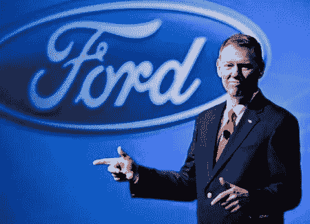
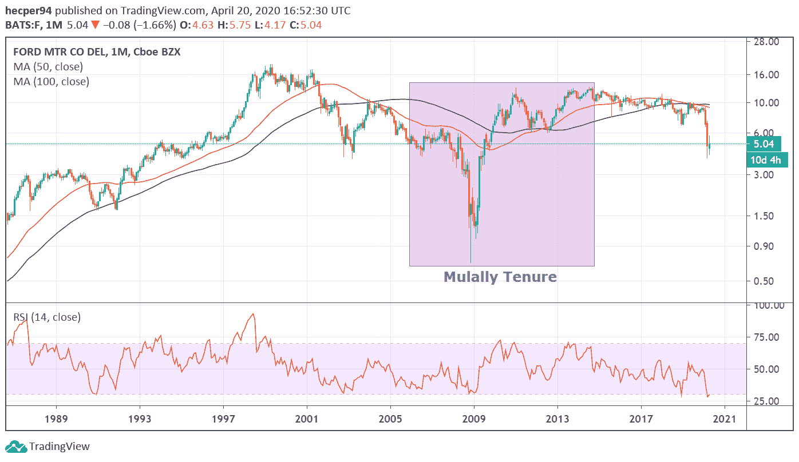

# 5 危机领导力课程如何在危机中领导？

> 原文：<https://medium.datadriveninvestor.com/5-crisis-leadership-lessons-how-to-lead-during-a-crisis-xkale-ee315c332c80?source=collection_archive---------13----------------------->

企业不时会面临危及其生存的挑战。当这种情况发生时，一个强有力的危机领导对于增加你的公司度过危机的机会是至关重要的。

通过研究那些在历史上最严重的危机中设法让自己的企业和组织存活下来的人的行为，可以学到成为一名伟大的战时领导人的艺术。

在接下来的文章中，我们将与你分享有史以来最优秀的领导者关于如何在艰难时期领导的 5 条危机领导经验。

# 仅仅通过削减成本和简化流程是无法实现增长或伟大的——即使你正处于破产的边缘

[这是艾伦·穆拉利在 2008 年世界金融危机期间通过扭转福特的未来给商界上的一课。](https://www.kornferry.com/insights/articles/alan-mulally-man-who-saved-ford)

当穆拉利于 2006 年 9 月加入这家传奇汽车制造商时，2006 年汽车行业的利润预测是亏损 170 亿美元。福特在这个行业并不例外；其股价从 2004 年的 17 美元跌至 2006 年的 8 美元左右，最终在 2008 年跌至 1.01 美元。

任何有这种景观的公司都需要钱，这可以通过债务和调整成本和精简流程来实现。穆拉利认为这很重要，但在等式中加入了一个特殊的因素，专注。

 [## 领导力。赢得|数据驱动型投资者需要更广阔的视角

### 不管他们愿不愿意，领导者都是快速运转的机器中的齿轮，这就要求他们夹住自己的爪子…

www.datadriveninvestor.com](https://www.datadriveninvestor.com/2020/02/07/leadership-it-takes-a-wider-perspective-to-win/) 

对穆拉利来说，“专注”也意味着有一个计划。他起草了一份计划，重点关注财务**，但也关注人。计划中人的部分包括改变人们在福特的工作方式，他认为这对实现长期盈利至关重要。在工人计划的主要目标中，Mulally 陈述了以下内容:**

*   “培养卓越的功能和技术”
*   “自己一起工作”
*   “福特价值观的榜样”

2014 年 6 月 30 日，穆拉利离开福特，加入谷歌董事会。他留下的遗产是将一家濒临破产的旧官僚公司转变为一家无缝全球整合的公司，连续 19 个季度盈利。穆拉利在全球经济和汽车历史上最严峻的时期之一策划了这一转变，当时正处于自大萧条以来最严重和最长的金融和经济危机之中。

# 如果你被人不加怀疑地看待，你可以让很多事情发生；建立信誉

跳到一个新的位置有它的挑战。现在想象一下，成为一家家族企业的首席执行官，这家企业从未有过一个外人来掌管公司的方向。这是麦肯锡前顾问 Jr gen Vig Knudstorp 面临的挑战，他于 2004 年成为这家玩具制造商的首席执行官。

当 Knudstorp 加入公司时，乐高的前景并不乐观。当时，该公司每天损失约 100 万美元，是的，事情就是这么糟糕！此外，它还将其业务范围扩大到服装等领域，并推出了预组装玩具，让孩子们远离建筑体验。

要把公司从灰色的财务命运中拯救出来，有很多事情要做。但除了努力将乐高转变为世界上最赚钱的玩具制造商，Knudstorp 有一个明确的目标:他必须围绕自己的名字建立信誉，以便能够做出公司需要的改变。

在接受《哈佛商业评论》采访时，Knudstorp 用自己的话描述了他所说的建立信誉的含义:

> “如果人们不怀疑你，你可以让很多事情发生，所以我确保自己平易近人。在丹麦语中，我们有一个表达，字面意思是“眼睛高度的管理”，但它意味着能够与工厂车间的人、工程师、营销人员交谈——与每个人都在家里。”

在他的领导下，公司在最初几年取得的进步可以用三个阶段来描述。

起初，一切都是为了现金流。Knudstorp 设法专注于减少债务，出售外围业务，并减少乐高制造的零件数量。此外，他提倡自上而下的管理和严格的财政控制。

当金融业开始变得更加环保时，乐高的战略是在 2008 年危机期间美国玩具市场停滞不前时，通过在亚洲开辟新市场和增加欧洲收入来寻求销量的增长。

除了运营战略，Knudstorp 知道领导层必须从战时愿景转变为和平时期的方法，以确保业务持续增长。他将不仅成为最大的玩具制造商，而且成为最好的玩具制造商的使命注入了乐高的 DNA。

*实施利基差异化和卓越战略需要一个更松散的结构，放松我们在转型期间实施的自上而下的管理风格，因为公司需要授权的经理。例如，我不再参与每周的销售管理和产能分配选择，而是尽可能地将决策推至层级之下。*

就在辞去首席执行官之前，Knudstorp 在他的战略的第三阶段拥有乐高，专注于有机增长。这最后一个阶段也需要更换领导，因为企业现在需要能够承担更大风险的经理；这是当时公司大多数领导缺乏的技能，因为他们在求生过程中必须遵守纪律。

Knudstorp 显然是一位伟大的战时领导人，他不仅改变了一家传奇公司的财务状况，还改变了它的文化和思维方式，从而生存下来，并成为世界上最大的玩具制造商。

在你的收件箱里收到更多像这样的文章！

# 承认错误，向用户道歉，开始工作，改变现状

在历史上最大的金融危机中，成千上万的顾客在网上说你的产品很烂。你做了几个焦点小组，得到同样的反馈，“你的比萨饼面包就像纸板。”

你是做什么的？帕特里克·杜尔说得很清楚。就在成为达美乐披萨的首席执行官后，Doyle 在国家电视台和 YouTube 上发布了一段视频，他承认对产品质量的评论很差，并展示了该品牌如何开始研究新的食谱。他们改变了一切，从面包皮到奶酪，甚至酱汁。

“2008 年初，我们在美国发起了一项名为 you got 30 的活动。这让我们回到了提供快速送货的根本，但消费者对此并不满意。就在那时，我们说我们知道问题出在我们披萨的质量上。”

消费者感受到的诚实和透明立即推动了销售。在新的活动和新的配方下，2009 年第四季度的利润翻了一番多，该季度的销售额增加了 2360 万美元。

道尔的战时领导风格并不仅限于改变比萨饼。他也明白为顾客提供更好服务的必要性。在一次会议上，道尔说了一句没人会想到会从一家披萨公司的首席执行官口中听到的话:

*“我们既是一家披萨公司，也是一家科技公司，”*

他是对的。在达美乐总部工作的 800 名员工中，有 400 名从事软件开发和分析工作。这样的员工队伍使该公司能够为客户提供强大的应用程序、精确的跟踪系统，甚至可以让他们直接通过 Twitter 订购。

所有这些技术投资和道尔推动公司前进的能力改变了餐饮业的历史。2008 年 11 月，达美乐的股票价值为 3.03 美元，如今到了 2020 年，它的价格已经远远超过了 300 美元。

# 强大的文化可以从危机中创造机会

当 2008 年全球大部分地区被一场剧烈的金融崩溃震惊时，有一家对冲基金准备提高其盈利能力；是雷伊·达里奥的布里奇沃特联合公司。

除了他众所周知的风格和研究市场的悠久历史，Dalio 的公司还有另一个更强大的秘密武器，可以用来在整个经济崩溃时将利润提高 8%；其文化。

> 在最高层次上，是我们的文化。Bridgewater 的运营方式与大多数公司非常不同，这导致了我们不同的结果。

根据达利奥自己的话，布里奇沃特将市场理解为“一台不断重复做同样事情的机器，其中一些最重要的事情一生只发生一次，所以大多数人都对它们感到惊讶。”

除了他们对市场的看法，布里奇沃特文化还有更多有趣的事实。他们以拥有“完全透明的文化”而闻名，在这种文化中，所有员工都会评估彼此的表现，如果你不能批评你的同事，甚至是你的经理，如果他们的表现有问题，你可能会被解雇。大约有 30%的员工在头 18 个月就离开了。

很明显，达利奥已经建立了强大的公司文化，这使得他和他的利益相关者即使在市场低迷时也能获利。

# 有计划

这听起来很傻，但如果你研究所有这些成功的故事，你会发现它们都有一个共同点，所有的 CEO 都有一个通往成功的清晰计划。拥有一个强有力的计划不仅有助于你设定目标和愿景，也是对你的团队的信任和信心的明确信号。

如果你想成功，在危机时刻提高你团队的士气是至关重要的。当危机来临时，拥有一个准备好执行你的计划的团队和一个强有力的领导者来支持它是让你的企业存活下去的唯一方法。

这就是我们的 5 堂危机领导力课。研究我们这个时代最优秀的战时领导人很重要，这样当危机来敲门时，我们才能表现得更好。

我们希望你喜欢这篇文章，如果你有问题或意见，请在下面的框中留下，或者联系我们[！](https://xkale.business/)

*原载于 2020 年 4 月 20 日*[*https://xkale . business*](https://xkale.business/index.php/crisis-leadership-lessons/)*。*