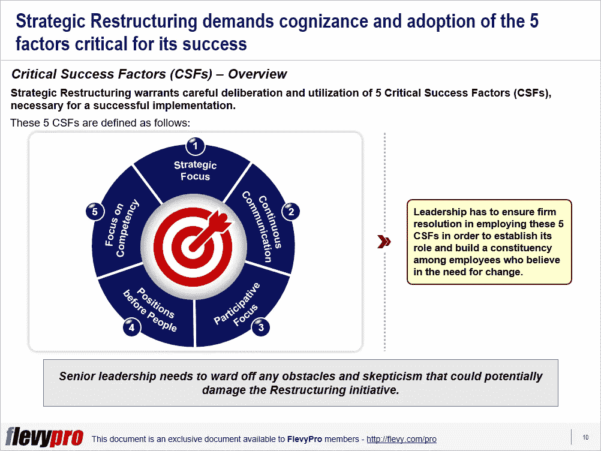

# 战略重组的 5 个关键成功因素

> 原文：<https://medium.datadriveninvestor.com/5-critical-success-factors-of-strategic-restructuring-4216a04c1d40?source=collection_archive---------8----------------------->

在任何组织生命周期的某个阶段，重组都是必不可少的。为了在这场混乱的挑战中脱颖而出，有必要将重点放在阻碍组织的挑战上，通过全面的[战略规划](https://flevy.com/strategic-planning)来应对这些挑战，并对战略计划进行优先排序，以实现有效的[业务转型](https://flevy.com/browse/stream/transformation)。战略重组有能力实现这些结果。

当“重组”这个词出现时，首先想到的是通过最大限度地降低工资成本来降低成本——主要是通过裁员。

许多组织都遭受了损失，因为在裁员的混战中，最能干的员工很快在别处找到了机会，留下了不合适的能干员工，导致组织瘫痪。

重组的目的是使组织盈利、高效和有效。裁员应该是重组计划的结果，而不是主要目标。

为了避免因重组而削弱组织的结果，在组织经历战略重组的 4 个阶段时，关注关键成功因素(CSF)是绝对必要的。[战略重组的 5 个关键成功因素](https://flevy.com/browse/flevypro/strategic-restructuring-critical-success-factors-5389)包括:

1.  **战略重点**
2.  **连续通信**
3.  **参与焦点**
4.  **人前位置**
5.  **关注能力**

专家建议为组织设想一个“未来状态”，通过包括[变革管理](https://flevy.com/browse/stream/change-management)在内的强大战略来实现，由重新部署的最有能力的员工来实施。其余的员工要么自愿断绝关系，要么被解雇——理想的情况是在公司的帮助下，获得一笔丰厚的遣散费或在其他地方找到一份工作。

领导层必须确保坚定地运用这些[关键成功因素](https://flevy.com/business-toolkit/critical-success-factors)，以确立其角色，并在相信变革需求的员工中建立支持者。让我们更深入地了解一下[战略重组](https://flevy.com/browse/flevypro/strategic-restructuring-critical-success-factors-5389)的 5 个关键成功因素。

# 1.持续沟通

*   沟通是战略重组的决定性因素。这个因素中的陷阱是“需要知道”的方法。高层领导应该经常与整个组织沟通。
*   即时和全面的信息披露建立了对管理层行动的信任。
*   重复是传达信息的关键。认为说一次就够了，这对于领导层来说是错误的。

# 2.参与焦点

*   结构的重新设计是一项自下而上的工作，因为信息和专业知识分散在整个组织中。
*   处于风口浪尖的员工最适合承担这项工作。
*   管理层制定组织框架，并不断告知员工总体战略，以保持方向正确。
*   参与式重组有助于提高员工士气和参与度。

有兴趣了解重组和转型阶段的其他关键成功因素吗？“你可以在 Flevy 文档市场[下载](https://flevy.com/browse)[一个关于战略重组的可编辑幻灯片:关键成功因素](https://flevy.com/browse/flevypro/strategic-restructuring-critical-success-factors-5389)。

# 你在这个框架中找到价值了吗？

您可以从 [FlevyPro 库](https://flevy.com/pro/library)下载关于这个和数百个类似业务框架的深入介绍。 [FlevyPro](https://flevy.com/pro) 受到 1000 名管理顾问和企业高管的信任和使用。有些人不得不说:

> *“我的 FlevyPro 订阅为我提供了当今市场上最受欢迎的框架和平台。它们不仅增加了我现有的咨询和辅导产品和服务，还让我跟上了最新的趋势，为我的实践激发了新产品和服务，并以其他解决方案的一小部分时间和金钱教育了我。我强烈推荐 FlevyPro 给任何认真对待成功的顾问。”*

*——比尔·布兰森，战略商业建筑师事务所创始人*

> *“作为一家利基战略咨询公司，Flevy 和 FlevyPro 框架和文件是一份持续的参考资料，帮助我们为客户构建我们的发现和建议，并提高他们的清晰度、力度和视觉效果。对我们来说，这是增加我们影响力和价值的宝贵资源。”*

*–大卫·科洛马，Cynertia 咨询公司的咨询区域经理*

> *“作为一名独立的成长顾问，FlevyPro 对我来说是一个很好的资源，可以访问大量的演示知识库来支持我与客户的合作。就投资回报而言，我从下载的第一个演示文稿中获得的价值是我订阅费用的好几倍！这些资料的质量让我能够打出超出自己体重的水平，这就像是用很小一部分开销就能获得四大咨询公司的资源一样。”*

*–罗德里克·卡梅伦，SGFE 有限公司创始合伙人*

在 [**管理和企业咨询**](https://app.ddichat.com/category/management-and-corporate-consulting) **:** 中安排一次 DDIChat 会议

 [## 专家-管理和企业咨询- DDIChat

### DDIChat 允许个人和企业直接与主题专家交流。它使咨询变得快速…

app.ddichat.com](https://app.ddichat.com/category/management-and-corporate-consulting) 

在此申请成为 DDIChat 专家[。
与 DDI 合作:](https://app.ddichat.com/expertsignup)[https://datadriveninvestor.com/collaborate](https://datadriveninvestor.com/collaborate)
点击订阅 DDIntel [。](https://ddintel.datadriveninvestor.com/)