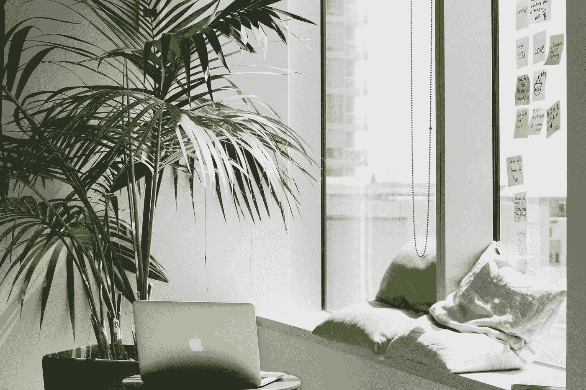

# 5 个让你爱上小空间的设计技巧

> 原文：<https://medium.datadriveninvestor.com/5-design-tricks-that-will-make-you-fall-in-love-with-small-spaces-e62ebe6e68a1?source=collection_archive---------3----------------------->

小空间也有自己的挑战。除了显而易见的“你能放进去的只有这么多”之外，它们并不总是与传统的设计选择一起工作，也没有给错误留下多少空间。当然，这并不意味着应该避免它们——它们只是需要被理解。对于那些想要创造一个梦想中的小空间的人来说，这里有五件事要记住。

# 充分利用您的空间

让我们搞清楚:你的空间有多小并不重要；重要的是感觉有多小。

众所周知，我们的大脑容易被欺骗，而室内设计正是这种特性派上用场的一个领域。这里有一个棘手的问题:哪种尺寸的家具最适合小公寓？看似合理的答案是“小”——但是，令人惊讶的是，这不是正确的答案。添加小件物品会[使整个空间看起来小而不相称](https://www.researchgate.net/publication/221098110_Perception_and_Illusion_in_Interior_Design)，所以用常规尺寸的物品来平衡它们很重要。

地板也是一样。一个无人居住的平面空间会增加宽敞感和体积感(更不用说你会希望它在房间中移动)，而一个中间有小地毯的杂乱空间只会产生幽闭恐惧症的效果。

 [## 后 COVID 世界中具有前瞻性思维的虚拟财富管理顾问|数据驱动…

### 随着世界范围内病例数量的持续上升，新冠肺炎绝不是一个过去，但是我…

www.datadriveninvestor.com](https://www.datadriveninvestor.com/2020/07/28/virtual-wealth-management-with-forward-thinking-advisors-in-a-post-covid-world/) 

# 提前计划

设计一个适合居住的小空间的主要挑战之一是缺乏留给糟糕选择的空间。事情是这样的:你从一个房间和一堆来自 Instagram 的鼓舞人心的图片开始，努力去做，把你记忆中最生动的片段拼凑起来，并加入你自己的大胆想法……直到你最终拥有一个[令人沮丧的杂乱的房子](https://www.nytimes.com/2019/01/03/well/mind/clutter-stress-procrastination-psychology.html)。棘手的是，你使用的大部分解决方案可能自己就能很好地工作——当一切开始分崩离析时，在你盲目地将它们混在一起之后。

因此，与其一头扎进这场激动人心的冒险，不如好好想想。从现代建筑博客中获得一些见解开始。一旦你掌握了基本知识，就把注意力集中在这四点上:

1.  空间将如何使用？
2.  哪些元素是绝对不可或缺的？
3.  有哪些事情是要不惜一切代价避免的？
4.  预算和时间框架是什么？

然后，仔细检查你打算添加的元素列表，问问你自己是否把它们去掉会更好。换句话说，创造一个适合你的空间愿景，并坚持下去。

# 邀请一些光进来

说到室内设计，光线的重要性怎么强调都不为过。以下是适当照明影响的一瞥:

*   增加了宽敞感
*   提高生产力
*   在所需的元素上添加重音符号
*   [改善心理健康和幸福感](https://thriveglobal.com/stories/design-for-health-and-wellbeing-how-spaces-can-make-you-happier/)
*   有助于减少照明和取暖费用

这些要点中有一些与小空间特别相关。一个光线不足的小窗户房间会感觉黑暗和压抑，所以尽可能多的邀请自然光是必须的。接下来，确保突出平坦的区域，这将增加空间感，或者添加一盏灯，将光线投射到天花板上。最后，考虑添加一些镜子——它们不仅会让你的房间看起来更大，还会反射其他来源的光线，让空间更明亮。

**巧妙使用家具**

除了美观之外，对于一个小空间来说，最重要的是你能把它变得多实用。毕竟，无论感觉多么通风宽敞，如果你在走动时不停地撞到东西，你都无法感到舒适，更别说衣服无处安放了。你也不能简单地叠放衣柜和抽屉——你会耗尽空间。

幸运的是，有大量的[智能模块化解决方案](https://medium.com/datadriveninvestor/how-ad-apt-brings-freedom-and-flexibility-to-design-50042fea9dbb)将紧凑的尺寸和功能结合在一起。有额外储物空间的家具可能是最常见的例子，所以确保你的床有额外的空间放毯子。另一个非常适合小空间的解决方案是落地搁板或类似的垂直储物件。它不仅可以最大限度地提高储物能力，还能增加高度感。最后，不要忽略多功能家具——对于那些试图保持整洁的人来说，这是一个显而易见的选择。

# 保持一致

当室内设计的每个方面都与周围环境相协调时，效果最好。调色板就是一个很好的例子:在墙壁和装饰上使用相同的色调会使设计更有凝聚力，而用更明亮的口音突出某些元素会增加独特的个性。而且，尽管你可能听说过,[白色并不是小空间的唯一颜色](https://www.archdaily.com/935067/how-colors-change-the-perception-of-interior-spaces)。

除了美观之外，色调的一致性还能帮助你保持室内整洁。检查突出的元素:如果它们增加了有趣的转折，那可能是一件好事；但如果它们只是不属于——也许它们不应该占据有价值的空间。

# 包扎

小空间确实有其局限性。然而，这并不意味着它们不是一个工作和生活的好地方。你所需要做的就是理解它们是如何工作的，并对它们进行一些思考和规划。的确，它们为错误提供了很小的空间，但是一旦得到恰当的对待，它们会在舒适和时尚中弥补错误。

**进入专家视角—** [**订阅 DDI 英特尔**](https://datadriveninvestor.com/ddi-intel)